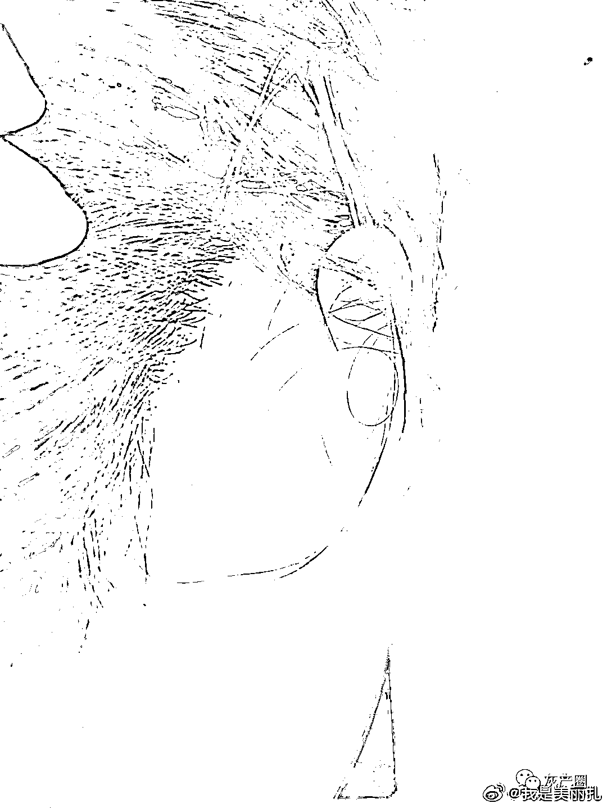

# 夺冠就飘了？泰山队成员被曝酒后打人，态度嚣张：我是绿能的！

> 原文：[`mp.weixin.qq.com/s?__biz=MzIyMDYwMTk0Mw==&mid=2247527994&idx=3&sn=5f995d4bec2156bdae0638cb0d3fa42a&chksm=97cba502a0bc2c142d0c728b6124020e05e38892f1732ea985be032ddfa3f5e45884ad7b40e9&scene=27#wechat_redirect`](http://mp.weixin.qq.com/s?__biz=MzIyMDYwMTk0Mw==&mid=2247527994&idx=3&sn=5f995d4bec2156bdae0638cb0d3fa42a&chksm=97cba502a0bc2c142d0c728b6124020e05e38892f1732ea985be032ddfa3f5e45884ad7b40e9&scene=27#wechat_redirect)

1 月 17 日凌晨 00：33 分，微博网友**@我是美丽扎**发微博称 1 月 16 日凌晨 12 点半左右，在济南市么哈酒吧厕所门口其被山东泰山球员成源辱骂并殴打。该网友还表示，当晚球员成源跟她说，“**小姑娘刚出社会吧？不知道社会的险恶是不是？你知道我是谁吗就敢这样跟我说话？**”爆料信息还显示，成源曾对在场的人说，“**知道我是谁吗？我是鲁能的。**”

据被打者说自己是一名刚来济南不久的来自新疆哈萨克族女生，万万没想到会在来济南没多久的时候，就遇到了这样的事情。

下面这个人，于 1 月 16 日凌晨 12 点半左右在济南市么哈酒吧的厕所门口，酒后撞到我差点摔到在地上并且用脏话骂我，我追过去要求对方給我道歉，对方指着我鼻子跟我说:“**小姑娘刚出社会吧？不知道社会的险恶是不是？你知道我是谁吗就敢这样跟我说话？**”我说“不管你是谁，你撞了人就得道歉，起码得尊重得有。”他回复了一句“**我道你妈了个逼**”就扇了我一巴掌，随即拽着我的头发就往水池子里撞，狠撞了几次后，把我扔到在地上，对我的头猛踹几脚，又暴揍了几拳。打完我之后，我已经爬不起来了，他还給周边的男生笑着说“**今天又他妈打了个女的 真踏马爽！**”我不懂他为什么要这样打我，我跟他压根儿就不认识，他撞到我还骂我，我要求道歉其实一点也不过分啊，可是他为什么还要这样暴揍我。

打完我之后，他走了，通过酒吧监控找到他的位置后，安保人员要将他带出来，他的同桌儿女生不愿意找到我说“不就挨了几下吗让他给你道个歉就行了至于报警吗？”我把我的脸漏出来给他同桌儿女生看“你说我被打成这样你还觉得我不需要报警嘛？你是经常被他打吗难道？”他同桌儿女生就不说话了。

我们进行了报警。报警后，警察来的时候，他还跑了，最后是酒吧的六个保安把他抓回来，他还对在场所有人说:“**知道我是谁吗？我是鲁能的**”到了警局，我说我要去验伤，他当着警察的面不耐烦的跟我说:“去去去，检查完说多少钱，该多少我赔你不就行了吗真是的”他的朋友也一直在私下没有警察的地方跟我说“姐姐，他把你打成什么样你把我打回来，你不要报警了”我说“不可能”他的朋友就一直纠缠我，最后被警察拉开了。报警后事后对我不管不顾，派出所也在做完笔录之后将施暴者放了出来。（第二天通过案件民警得知，正常来说，按程序走的话，施暴者在做完笔录的第二天才可以被放出来）

目前我现在面部头部创伤和肿胀，我的左半边脸已经做不了任何表情，僵硬状态，头部也已有两块肿起来，吃不进去东西，头晕脑胀，左眼已经看不清东西，左眼眉骨已经肿起来，右边耳朵后面的耳骨已经肿了，脖子挫伤，双手美甲掉了四只，右边膝盖上侧青紫了，我的右嘴唇里面的肉也有创伤，精神开始恍惚，已经有抑郁和自杀倾向了。

我现在不想要求任何的赔偿，只想通过曝光他的方式让他给我道歉并且得到相应的处罚。让广大女性朋友可以保护好自己，远离这种人！

据悉，当晚他打了不止我一个女生，希望当晚的被欺负的女生也可以一起站出来曝光这种不尊重女性，不尊重人，目无王法的人！！打完人并没有任何悔恨之意，还觉得很无所谓的样子。

目前已了解到此人是前鲁能球队的球员，（通过自己和朋友近距离目证比对，此人正是成源，绝无虚假，我为自己所有言论负责）就在不久前已转到青岛海牛足球俱乐部。希望引以为戒，保护好自己。

被打者“我是美丽扎”还称，当时成源还跟周边的男生笑着说“**今天又打了个女的。**”另外被殴打的一女性也出来发声，网友“不会起网名阿”称，“我当晚也被施暴者推搡和辱骂，只因我在他面前挡住了他的去路，我被推搡和辱骂后要求他道歉，他就用手掐我的脖子。”

网友“不会起网名阿”说，当天晚上她和该名球员并没有肢体冲突，“对方有四五个人，他喝醉了，想动手掐我，我没还手，直接报了警。这个女生跟我一起去的警察局，她被打的原因跟我一样但是却比我惨一万倍。施暴者的个人信息是他自己在酒吧门口大喊出来的。”

该网友称，到警局后，该球员的朋友跟她道了歉，还给了一点赔偿。“对方的朋友真诚地跟我道歉后，我选择了息事宁人。”

1 月 17 日，针对球员酒吧深夜殴打女性一事，山东鲁能泰山足球俱乐部相关负责人表示，“**现在还在进一步核实当中，还在了解过程中，正在处理。**”至于是否会对成员作出相应处罚，相关负责人表示，“**还需要根据具体的情况。**”

1 月 17 日上午，针对球员酒吧深夜殴打女性一事，山东鲁能泰山足球俱乐部相关负责人表示，已从网上获知球员成某打人的消息，具体情况正在核实，会积极配合调查。“如果情况属实，首先积极配合警方的工作，也肯定会督促球员给当事人赔礼道歉。”该工作人员还表示，目前他们暂未联系上成某。

17 日下午，民警告诉被打者确定是成某。但她至今未收到打人男子成某的道歉。“今天下午警察问我想如何处理这个事情，我说我并不想要求任何的赔偿，只要对方给我道歉并且得到相应的处罚。我希望派出所能好好处理这个事情，该拘留拘留。”

来源：吃瓜不吐葡萄皮

← 向右滑动与灰产圈互动交流 →

