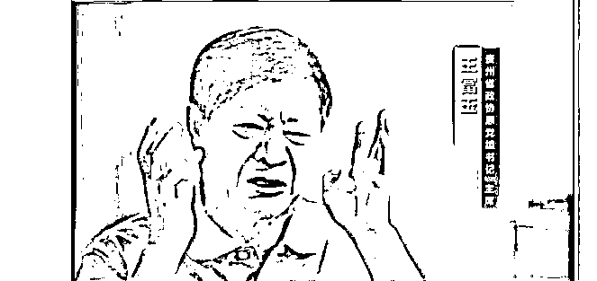

# “你要钱干什么，埋你啊”

> 原文：[`mp.weixin.qq.com/s?__biz=MzIyMDYwMTk0Mw==&mid=2247527994&idx=4&sn=45c1ab6f73709c3457df17cbdde233a5&chksm=97cba502a0bc2c1492e054b0e485562ea2523a074ce95d2fa5121061cde9f0e44382b23044b2&scene=27#wechat_redirect`](http://mp.weixin.qq.com/s?__biz=MzIyMDYwMTk0Mw==&mid=2247527994&idx=4&sn=45c1ab6f73709c3457df17cbdde233a5&chksm=97cba502a0bc2c1492e054b0e485562ea2523a074ce95d2fa5121061cde9f0e44382b23044b2&scene=27#wechat_redirect)

王富玉，任省部级领导干部长达 20 余年，先后在海南、贵州担任省委常委、省委副书记、省政协主席等重要职务，2018 年退休。2021 年 2 月，中央纪委国家监委宣布他因涉嫌严重违纪违法接受审查调查。

 **[`v.qq.com/iframe/preview.html?width=500&height=375&auto=0&vid=l33183riod7`](https://v.qq.com/iframe/preview.html?width=500&height=375&auto=0&vid=l33183riod7)** 

**▲贵州省政协原主席王富玉案披露：从上世纪 90 年代贪到被留置前几天。新京报我们视频出品（ID：wevideo）** 

**据中央纪委国家监委官网消息，1 月 16 日晚八点，电视专题片《零容忍》第二集在央视综合频道播出。**

**电视专题片《零容忍》第二集《打虎拍蝇》，通过贵州省政协原党组书记、主席王富玉案，甘肃省永登县民政局低保办原主任赵永琏侵害困难群众利益案，江苏仪征基层粮站贪腐案，反映各级纪检监察机关以零容忍态度惩治腐败，“老虎”“苍蝇”一起打，让人民群众感受到全面从严治党就在身边、正风肃纪反腐就在身边、纪检监察就在身边。**

****

****王富玉被控敛财超 4.5 亿****

****2021 年 11 月 30 日，天津市第一中级人民法院一审公开开庭审理了**贵州省政协原党组书记、主席王富玉受贿、利用影响力受贿一案。****** 

********

****天津市人民检察院第一分院起诉指控：**1995 年至 2021 年，王富玉利用担任中共海南省琼山市委书记、市长，中共海南省委常委、三亚市委书记，中共海南省委副书记、海口市委书记，中共贵州省委副书记，贵州省政协副主席、主席等职务上的便利**，以及职权、地位形成的便利条件，为有关单位和个人在企业经营、规划审批、职务调整等事项上谋取利益，直接或通过他人非法收受上述单位和个人给予的财物，**共计折合人民币 4.34 亿余元。2019 年至 2020 年，王富玉离职后还利用影响力收受他人给予的财物，共计折合人民币 1735 万余元。**检察机关提请以受贿罪、利用影响力受贿罪追究王富玉的刑事责任。****

****庭审中，检察机关出示了相关证据，被告人王富玉及其辩护人进行了质证，控辩双方在法庭的主持下充分发表了意见，**王富玉进行了最后陈述并当庭表示认罪悔罪**。庭审最后，法庭宣布休庭，择期宣判。****

****去年 8 月 16 日，中央纪委国家监委官网消息，王富玉被开除党籍。**** 

****经查，**王富玉丧失理想信念，背弃初心使命，目无道德法纪，对党不忠诚、不老实，阳奉阴违，搞两面派，做两面人，处心积虑对抗组织审查；无视中央八项规定精神，违规收受礼品礼金，多次接受私营企业主安排打高尔夫球、乘坐私人飞机；在组织人事方面违规为他人谋利，在组织谈话时不如实说明问题，不按规定报告个人有关事项；把党和人民赋予的权力作为攫取私利的工具，通过民间借贷获取大额回报；生活奢靡腐化，道德沦丧，家风败坏；利用职务便利和影响力在工程承揽、土地开发、企业经营等方面为他人谋利，并非法收受巨额财物，直至退休后仍大肆收钱敛财**。****

****王富玉严重违反党的政治纪律、组织纪律、廉洁纪律和生活纪律，构成严重职务违法并涉嫌犯罪，且在党的十八大后不收敛不收手，甚至党的十九大后仍不知止，性质严重，影响恶劣，应予严肃处理。依据《中国共产党纪律处分条例》《中华人民共和国监察法》《中华人民共和国公职人员政务处分法》等有关规定，经中央纪委常委会会议研究并报中共中央批准，**决定给予王富玉开除党籍处分；按规定取消其享受的待遇**；收缴其违纪违法所得；将其涉嫌犯罪问题移送检察机关依法审查起诉，所涉财物一并移送。****

****去年 2 月 21 日，据中央纪委国家监委网站消息，**王富玉被查。******

******据公开简历，王富玉生于 1952 年 8 月，曾在河北省工作，历任河北省委办公厅副处级秘书、河北省获鹿县县长、县委书记等职，1989 年任石家庄市副市长。******

******1991 年，王富玉调任海南省海口市副市长，后任海口市委常委、副市长，1994 年出任琼山市委书记、市长，**1998 年任海南省委常委，三亚市委书记，2002 年任海南省委副书记，海口市委书记。********

**********2004 年，王富玉调任贵州省委副书记，2012 年任贵州省政协副主席，2013 年出任贵州省政协主席，至 2018 年卸任，2021 年 2 月被查。**********

**********王富玉简历**********

******王富玉，男，1952 年 8 月出生，河南唐河人，1976 年 1 月参加工作，1974 年 6 月加入中国共产党，在职研究生学历，法学硕士，管理学博士。******

******1973 年 10 月至 1976 年 1 月，在长沙冶金工业学校学习；******

******1976 年 1 月至 1979 年 6 月，任冶金部华北冶金矿建公司组织部科员；******

******1979 年 6 月至 1982 年 9 月，任河北省委组织部科员；******

******1982 年 9 月至 1986 年 9 月，先后任河北省委办公厅秘书、副处级秘书；******

******1986 年 9 月至 1989 年 4 月，先后任河北省获鹿县委副书记、县长，县委书记；******

******1989 年 4 月至 1991 年 7 月，任河北省石家庄市副市长；******

******1991 年 7 月至 1993 年 6 月，任海南省海口市副市长；******

******1993 年 6 月至 1994 年 5 月，任海南省海口市委常委、副市长；******

******1994 年 5 月至 1995 年 1 月，任海南省琼山市委书记、市长；******

******1995 年 1 月至 1998 年 2 月，任海南省琼山市委书记、市长（正厅级）（1992 年 9 月至 1995 年 10 月，在华中理工大学经济管理学院社会学系应用社会学专业在职硕士研究生学习）；******

******1998 年 2 月至 2002 年 4 月，任海南省委常委，三亚市委书记，三亚警备区党委第一书记（1996 年 9 月至 1999 年 7 月，在华中理工大学工商管理学院管理科学与工程专业在职博士研究生学习）；******

******2002 年 4 月至 2002 年 5 月，任海南省委副书记，三亚市委书记，三亚警备区党委第一书记；******

******2002 年 5 月至 2004 年 12 月，任海南省委副书记，海口市委书记，海口警备区党委第一书记；******

******2004 年 12 月起，任贵州省委副书记；******

******2012 年 1 月，当选贵州省政协副主席；******

******2013.01——2018.01，任贵州省政协主席、党组书记；******

******2021 年 2 月被查。****** 

******来源：新京报******

************

******← 向右滑动与灰产圈互动交流 →******

************