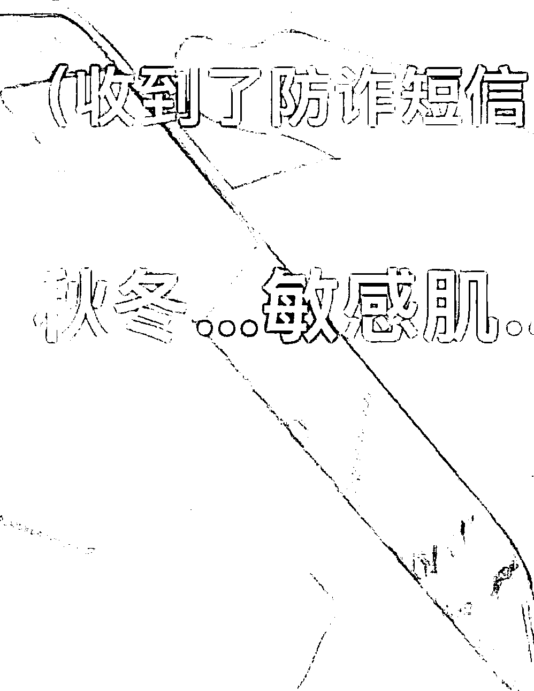
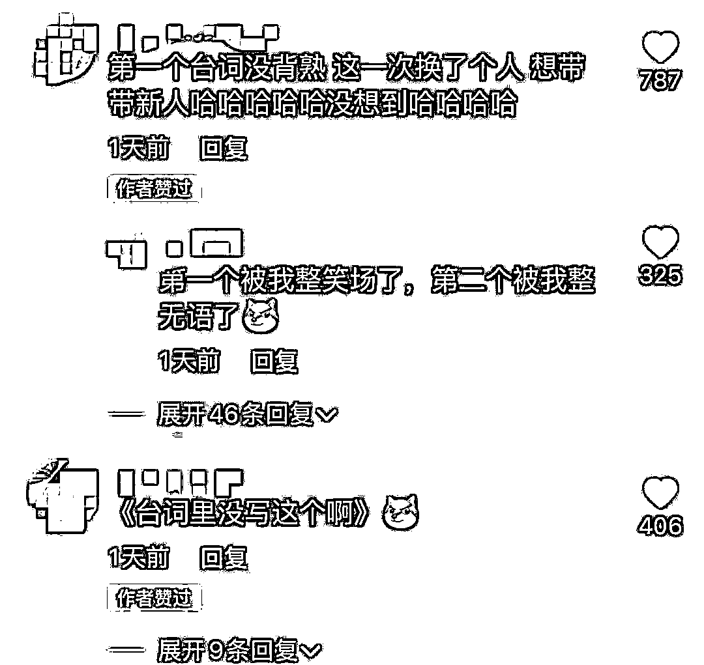
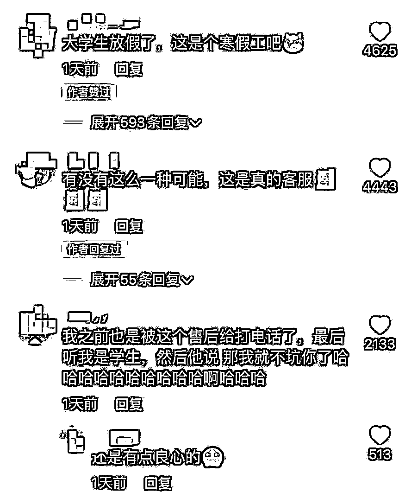
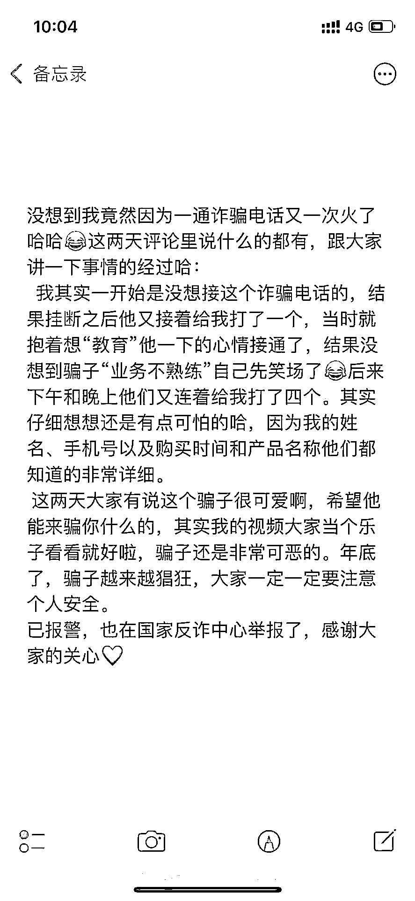

# 女子接到诈骗电话，结果双方都笑场了……

> 原文：[`mp.weixin.qq.com/s?__biz=MzIyMDYwMTk0Mw==&mid=2247527994&idx=5&sn=69e0b33f7b6e14a6e14f90c968ad9be7&chksm=97cba502a0bc2c14929b38eecabc9007ff76bf5e90f8697f47ecd34e60673145d9e4470dba97&scene=27#wechat_redirect`](http://mp.weixin.qq.com/s?__biz=MzIyMDYwMTk0Mw==&mid=2247527994&idx=5&sn=69e0b33f7b6e14a6e14f90c968ad9be7&chksm=97cba502a0bc2c14929b38eecabc9007ff76bf5e90f8697f47ecd34e60673145d9e4470dba97&scene=27#wechat_redirect)

[`mp.weixin.qq.com/mp/readtemplate?t=pages/video_player_tmpl&action=mpvideo&auto=0&vid=wxv_2228299923429687300`](https://mp.weixin.qq.com/mp/readtemplate?t=pages/video_player_tmpl&action=mpvideo&auto=0&vid=wxv_2228299923429687300)

2022 年 1 月 15 日上午，山东的韩女士接到了一通诈骗电话。电话那头的男性骗子的开场白是：“您好，我这边是淘宝商城售后客服中心的，跟您做一个售后回访，您 12 月 20 号有在我们某品牌官方旗舰店购买过一款什么神经……神经酰胺……秋冬敏感肌什么……”

就在骗子结结巴巴说这番话时，韩女士的手机收到了防诈短信。这时，韩女士终于忍不住笑了。令她没想到的是，电话那头的骗子也“哈哈哈哈哈”地笑了起来。这时，韩女士爆笑如雷，“哈哈哈哈哈哈”地笑个不停，还对骗子说：“你先把词捋顺了行吗？你这样我真的没法往下接。”

与此同时，骗子一直在电话中持续偷笑。为了配合对方的“演出”，韩女士又说：“我是买过，然后呢？”骗子竟然答道：“我是不是应该专业一点？”韩女士随后和同事笑出鹅叫，随后挂断了电话。

令韩女士更没想到的是，该通电话还有后续。当天下午，在对方不懈坚持下，韩女士又一次接通了骗子的电话。这时，骗子的开场白是：“因为我们这边，呃，最近呢，这段时间收到很多客户的投诉和反馈说，使用了我们这个产品之后，出现了皮肤过敏、起红点红斑和瘙痒的症状等等，您这边用了之后有没有出现这种情况啊女士？”韩女士说：“没有没有，我用完之后提了一辆玛莎拉蒂，我觉得你们这个产品非常好，给我带来了好运气。”

听到韩女士说出这番话，骗子沉默了一段时间。韩女士见对方许久没说话，又说：“要不我推荐你也自己用一下吧，这样你就可以不用当骗子了，也可以提一辆玛莎拉蒂，你觉得呢？”这时候，电话那头的骗子继续保持沉默，随即挂断了电话。而韩女士和同事，又笑出了鹅叫。

1 月 17 日，潇湘晨报记者联系上韩女士，她说，诈骗电话第一次打来时，她就知道是诈骗电话。“对方当时给我打了两个电话，第一个电话我挂断了，没想接，结果接着又给我打了第二个，我一想他既然这么不死心的话，那我就逗逗他吧。”对于骗子自己被自己笑到的情景，韩女士说她也没想到，“我本来还想跟他斗智斗勇一番的。”

1 月 17 日，韩女士又通过短视频平台将事情的前因后果作了说明。她说：“仔细想想还是有点可怕，因为我的姓名、手机号以及购买时间和产品名称他们都知道得非常详细。”但同时她也说“这个骗子很可爱，也很可恶，年底骗子越来越猖狂，大家一定要注意个人安全。”

目前，韩女士已经报警，也在国家反诈中心 App 上对此事进行了举报。

针对韩女士遇到的情况，网友的评论更是令人捧腹。有网友说：“大学生放假了，这是个寒假工吧！”“这个应该是兼职的吧！业务能力不行”“这个骗子有点可爱哈哈哈真的好憨”“第一个台词没有背熟，这次换了一个人，想带带新人”。

来源：潇湘晨报、晨视频 记者： 满延坤

← 向右滑动与灰产圈互动交流 →

