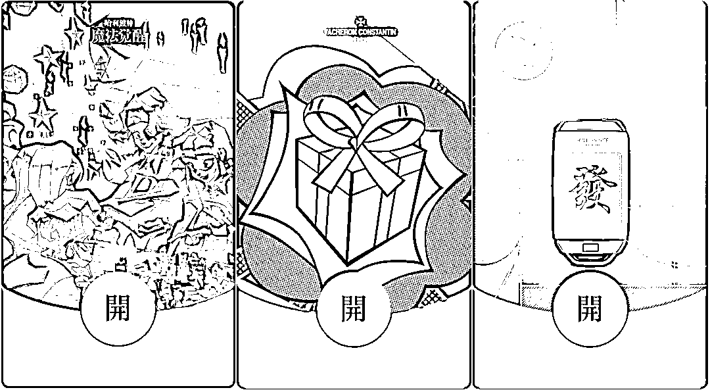
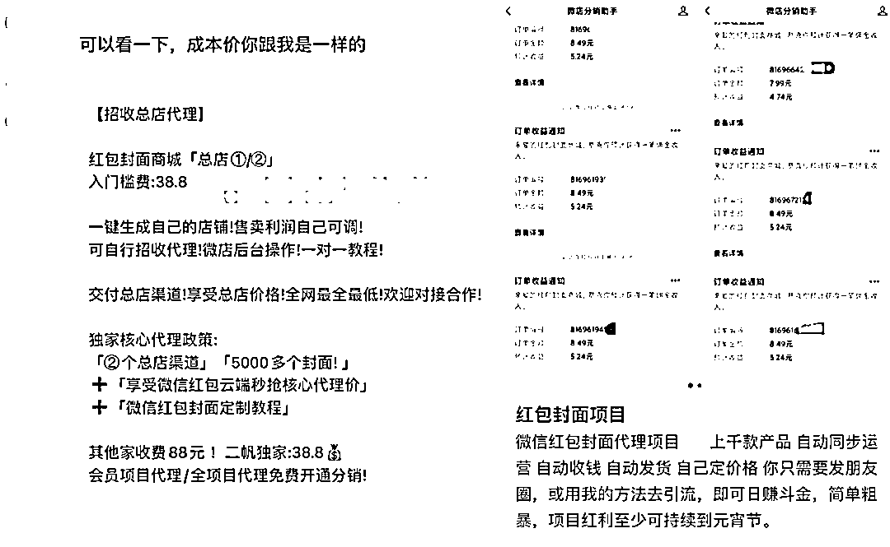
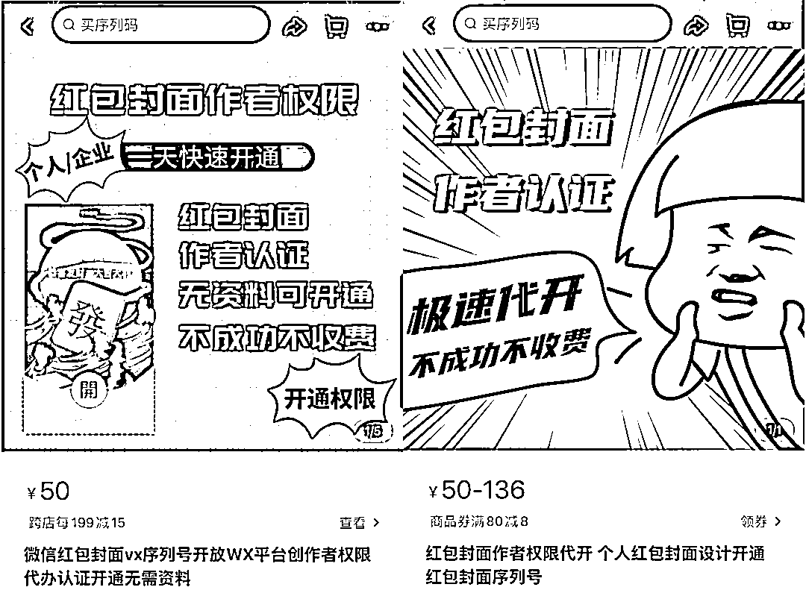
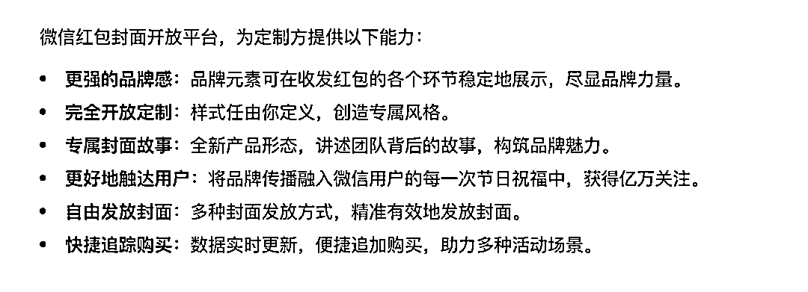
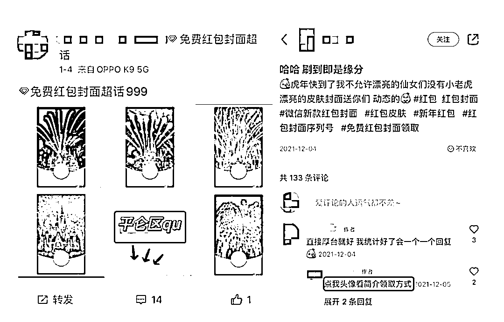
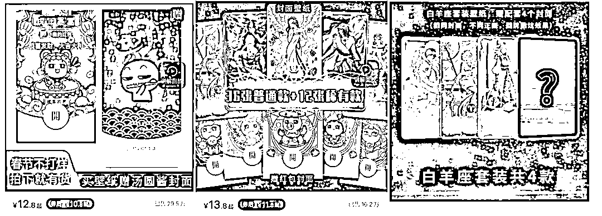
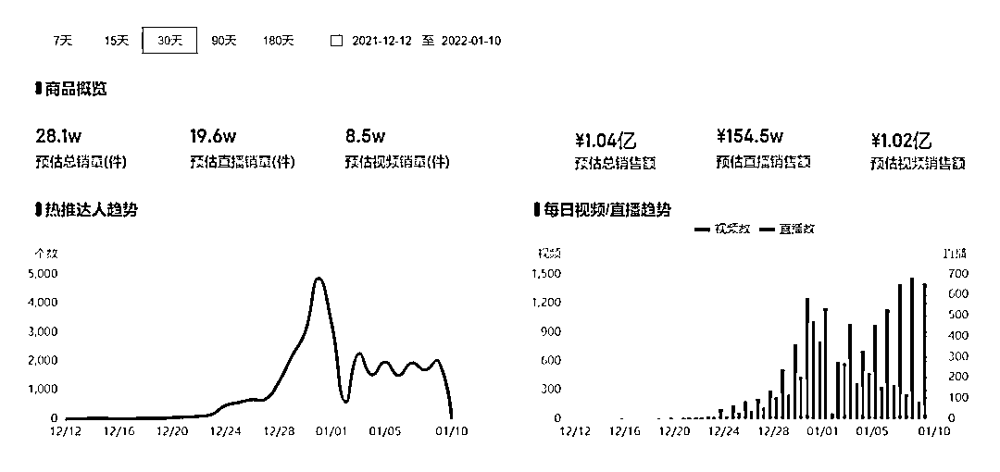

# 兼职月入 10 万：红包封面的暴利生意

> 原文：[`mp.weixin.qq.com/s?__biz=MzIyMDYwMTk0Mw==&mid=2247527994&idx=6&sn=7b681a3194c1c221b594599cf36969f3&chksm=97cba502a0bc2c14a5f47d42b45e90ff8aa4181ef9b525347c2fea6fc12da0e5a07e05839a37&scene=27#wechat_redirect`](http://mp.weixin.qq.com/s?__biz=MzIyMDYwMTk0Mw==&mid=2247527994&idx=6&sn=7b681a3194c1c221b594599cf36969f3&chksm=97cba502a0bc2c14a5f47d42b45e90ff8aa4181ef9b525347c2fea6fc12da0e5a07e05839a37&scene=27#wechat_redirect)

春节将至，小小的微信红包封面又成了“抢手货”。

在小红书，有人分享着自己列出的“蹲点”抢红包封面计划表；在抖音，一个十几秒的红包封面展示视频就能吸引不少人前来询问该怎么拿到；在闲鱼，搜索“红包封面”就能够看到各式各样的卖家……

先不论春节时会给亲朋好友发多少红包，不少人从红包封面就已经收获了满足感。

抢到一张奢侈品牌的红包封面，有人笑称“这是不花钱离奢侈品最近的一次”；蹲点抢到自己喜欢的明星封面，不仅在粉丝群中充满优越感，更是在每次发红包都带着一份粉丝“安利”偶像的自豪。而在今年个人定制红包封面的门槛被降低后，做情侣间自用的、为朋友生日定制的和为宠物定制的封面也流行开来，不只是为了节日准备，而成了一种生活、社交里的仪式感。

有需求就会有生意。各大品牌的红包封面向来是限量发布，热门款想抢到还真不容易；想要拥有专属定制款，自己又不会操作；在社交平台上看到更新颖的红包封面，只能是花钱来买。

尽管微信明确表示红包封面不可以售卖，但面对如此高的关注度和热度，仅仅几块钱的红包封面也开始变成了“新项目”、“大生意”。“野生”卖家们伺机而动，不少机敏的普通用户更是计划着如何从中获利。

## **月入 10 万的兼职**

“现在已经不算早了，我们从七夕就开始卖了……”

“行业内从不缺少赚钱的机会，你只是缺少把握机会的能力。”

“一个月就能赚到 10 万+……”

对于一个并不清楚其中玩法和流程的普通人来说，想要做这份兼职，最先遇到的大概率会是吹嘘生意有多么赚钱的“招代理”商家。

他们往往是销售和招代理两项同时进行，在你购买红包封面时会告诉你做代理既能自用又能赚钱，有上千款产品可以批发，产品可以自己随意定价售卖，只要发发朋友圈就能日进斗金。

这“似曾相识”的玩法，不就和常见的微商模式如出一辙？

不过相比要交上千块才能代理的微商护肤品、保健品，代理红包只需要几十块或一两百块就行，门槛要低得多。交纳的代理费不同，你能获得的东西自然也不同。代理费低的商家，相当于只是批发给你一定数量的红包封面，怎么引流、怎么卖等其他事项都由你自己操作。代理费更高的商家会提供的服务更多，包括教你怎么开微店、怎么引流，甚至是怎么去发展你自己的下线代理等等。

“你去收几个代理就回本了，收的多不用自己卖也能赚钱。”一位招代理的商家告诉「真探」，其实在这种微商模式里，什么都能卖，而拉人头总是最便捷的路子。

当然在入局者里，总有人不甘心只做个赚差价的“中间商”。如今围绕着红包封面的完整产业链已经生成，从其他环节入手的人也不在少数。

首先是最上游的设计环节。通常售卖封面的商家会找人来包揽设计工作，学生或者业余兼职的画师、设计师都可以参与其中，同时也会有人组织设计兼职的群组，对接商家在群里派单。

去年，红包封面还都是图片，只要会画画就能接单。今年，带自拍、个性签名、动态视频版本的封面更火，能够做此类设计的人也可以在各大社交平台上接到更多个性化定制的生意。一位在 B 站分享赚钱经验的 up 主就在视频中说道：“给情侣做一套封面定制，你收个 131.4 元一点都不过分。”

其次，从设计素材到制作出封面，这之间还有一个能够赚钱的环节。

微信对于红包制作者有资质认证要求：企业要先申请公众号，之后还要提供一些认证材料；个人则需要申请开通视频号，并且要获得 100 个有效粉丝。于是，商家们开始提供更“灰色”的服务：帮企业做红包认证通过审核，以及为个人视频号“刷粉”，或者是直接帮你代开权限。

从设计、制作到分销，这一整个产业链上可能有极其多方的参与。而与此同时，靠“信息差”赚钱的人也开始出手：为了那些完全不了解但仍想赚钱的人能更快了解，日常做兼职信息资料整合的人，开始推出“教你用红包封面赚钱”的付费教程。你可能还没有找到注册平台真正开启自己月入十万的赚钱大计，就先为“知识付费”花了一笔。

## **能引流，更能直接变现**

事实上，在红包封面还没有火爆成“普通人的赚钱项目”之前，其最基础的用途就是为了让品牌引流获客。目前在微信红包封面开放平台上，官方主要介绍的几点也都是“更强的品牌感”、“更好地触达用户”等营销能力。

微信红包封面开放平台介绍

去年，众多正规品牌已经给了正确使用方式的示范。最初是 GUCCI 的一张红包封面突然在网上蹿红，紧接着一众奢侈品牌纷纷加入推出限量红包封面，之后更多品牌又联合着自家的代言人推出明星红包封面，吸引不少粉丝们的关注。

不论是奢侈品还是大众快消，尽管用户获得限量红包封面的条件各不相同，例如关注公众号、留下个人资料、注册会员或者是签到攒积分等等，但不难看出品牌最终目的都是为了获取用户。

而今年，更多“非正规军”也学会了这一套玩法。

通过在各个社交平台上发布免费赠送红包封面的信息，卖货招代理的微商可以吸引用户添加好友和进群，在公众号内发布广告信息赚钱的人，可以吸引更多人关注公众号，一些新 APP 也可以借此引导更多新用户前来下载和注册。

引导用户留言和私信领取红包封面

当然除了用在营销上，一些具备“先天”内容优势的人早就做起了一本万利的暴利生意。

其中一类是在电商平台上做图片定制设计的商家。他们日常的业务包括设计 logo、头像、商业用图片、平面海报等等，设计和定制红包封面也算是同一类型的业务。

还有一类是有卡通 IP 形象在手的漫画自媒体。

例如汤圆酱原本是一个抖音上的动漫自媒体，日常更新的短视频都是围绕着“汤圆酱”这个 IP 形象做的动画内容，账号粉丝达到 746 万。

从去年年底开始，该账号上架了多款“壁纸类”产品（因红包封面不能公开售卖，只作为赠品），包括春节、十二星座两个系列，以及以动态表情包效果为主的其他主题。不同组合套装的封面价格有所不同，每张封面单价在 6 至 9 元左右。特别的是它还设计出了盲盒玩法——花 60 元购买三张的套装，就能抽中一张稀有款封面。

汤圆酱

仅凭借一条展示红包效果的短视频和当下正火热的盲盒玩法，汤圆酱的红包封面很快就在抖音成为了爆品。从汤圆酱的抖店主页来看，其中一款的销量已超过 29 万，星座系列销量达到 16.2 万，另一款销量为 2.2 万。

如果按照 6 元的最低单价粗略统计，仅是商家自己店铺内的总销售额就超过了 280 万。而据蝉妈妈数据显示，汤圆酱的红包封面近 30 天浏览量超过了百万，带货达人超过 3000+，预估总销售额已经高达 1.07 亿元人民币。

数据来源：蝉妈妈

和汤圆酱一样玩法的在短视频平台上其实还有不少。三尺童子、猪小屁等等都是较为知名的几个 IP 形象，不知名的卡通形象更是种类繁多、数不胜数。当你直接搜索红包封面时，也有不少商家的卡通 IP 看起来相当“雷同”，甚至就是同一个形象，只不过是有不同的名字和不同颜色的背景。

在节日氛围、用户需求的助推下，原本成本只要一块钱的营销工具就这样成为了牵涉多方的“热门生意”。事实上，在互联网“暗处”，不少商家眼中的红包封面和其他类型的“灰产”也没什么不同。

一位招代理的商家就在被多次询问后，向「真探」推荐了另一个更“划算”的套装：“你交 88 元，不仅有红包封面，我还可以给你视频网站 VIP 会员的代理。”从这位商家的朋友圈来看，红包封面是他最近的主要业务，其他业务种类相当之多，例如视频网站会员、潮牌服饰、莆田运动鞋的代理等等。

只要有需求，从灰产中赚快钱和热钱的人似乎并不需要考虑太多，卖什么也就不那么重要了。他们唯一考虑的可能只有“时机”，毕竟送红包的节日不是天天有，用户的兴趣也总是千变万化。

← 向右滑动与灰产圈互动交流 →

