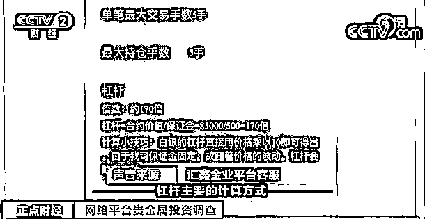

# 一杯奶茶价就能参与投资？杠杆超 100 倍！这类 App，可能让你血本无归！

> 原文：[`mp.weixin.qq.com/s?__biz=MzIyMDYwMTk0Mw==&mid=2247527994&idx=7&sn=11b4c25f1652be7f5ec1c130cd8791c2&chksm=97cba502a0bc2c14db1aefb7998273c7ebc2e60b0144b41bde3df8cbf86e6ec0e4140d3f5aa8&scene=27#wechat_redirect`](http://mp.weixin.qq.com/s?__biz=MzIyMDYwMTk0Mw==&mid=2247527994&idx=7&sn=11b4c25f1652be7f5ec1c130cd8791c2&chksm=97cba502a0bc2c14db1aefb7998273c7ebc2e60b0144b41bde3df8cbf86e6ec0e4140d3f5aa8&scene=27#wechat_redirect)

“首投不花一分钱，5 元玩投资，当天可提现”。这样的宣传广告在网上随处可见，其宣称的快速提现、轻松投资的概念触动不少投资者的神经，这究竟是什么样的投资呢。

** “火山有色”涉嫌非法组织期货交易 客服软件阴阳两张皮**

[`mp.weixin.qq.com/mp/readtemplate?t=pages/video_player_tmpl&action=mpvideo&auto=0&vid=wxv_2228411443480166401`](https://mp.weixin.qq.com/mp/readtemplate?t=pages/video_player_tmpl&action=mpvideo&auto=0&vid=wxv_2228411443480166401)

△央视财经《正点财经》栏目视频

“穷到欠了一屁股债？试试五元投资贵金属，2 小时改变你的账户余额。”这是网上常能看到的广告宣传。记者下载了广告中名为火山有色的 App 进行体验。在首页上可以看到有银商品、铜商品等有色金属和大豆、小麦等农产品的价格。在对应商品界面里，则是以 K 线显示价格波动情况。 

这样的形式类似于期货，而在我国现行的《期货管理条例》中，就明确禁止非法设立期货交易场所或者以其他形式组织期货交易活动。当记者咨询平台客服时，客服立即否认了平台的投资性质和广告所说的五元起投。

**火山有色平台客服：**不好意思先生是这样的，我们这边是实物定制销售商城，不是投机市场。您说的这 5 元，是购买商品的预订金，预订金付完会形成电子协议，商户会备产备货，您需要支付尾款提货。 

上海信昌律师事务所主任蒋振伟表示，消费者咨询的内容与和 App 上所展示的内容本质上不一样，这涉及到虚假宣传。

虽然客服百般否认平台和投资之间的关系。但记者在商品订购页面发现，订购分为两种模式，现货价订购和结算价订购。用现货价订购贵金属，贵金属涨价后可以退订获得收益，用结算价订购则可以在下跌后退订获得收益。

除此之外，平台上显示的客户订单最终都是退订状态，并没有像客服所说用户是需要购买实物的。记者发现，预订一份铜商品的价格为 5 元，这一份的重量为 10 千克，按照铜价来计算，订金仅为货值的 1%不到。投资的杠杆超过了 100 倍。然而像火山有色这样的平台并不少，有不少投资者在网上表示，自己使用类似平台就出现了巨额亏损。 

**上海国际金融与经济研究院研究员 教授 曹啸：**一定是高风险。曾经有一段时间做外汇的外盘，也是上百倍的杠杆，一旦价格波动，所有资金血本无归，这是沉痛的教训。像这种高杠杆的产品，投资者轻易不要碰。 

**网络贵金属投资风险大 专家建议勿接触**

[`mp.weixin.qq.com/mp/readtemplate?t=pages/video_player_tmpl&action=mpvideo&auto=0&vid=wxv_2228411607074799617`](https://mp.weixin.qq.com/mp/readtemplate?t=pages/video_player_tmpl&action=mpvideo&auto=0&vid=wxv_2228411607074799617)

△央视财经《正点财经》栏目视频

除了这种名为贵金属订购商城的投资渠道外，网络上也有着很多所谓的贵金属投资 App。这一类大都宣称自己是在香港、加拿大等地注册的，那么加入这些所谓的贵金属投资理财究竟有怎样的风险呢？

记者发现，除了火山有色外，在网上还有一款类似的软件，名为一点订购。这两款软件上，无论是铜商品还是银商品的价格都不一样，打开 K 线图，可以看到价格走势也并不一致。 

**火山有色平台客服：**我们 App 上面的银价格是根据上游原材料供应商的报价来的，只能参考。

**上海国际金融与经济研究院研究员 教授 曹啸：**这些类期货的产品没有受到监管，价格很大程度上不透明，是这些操作平台可以进行人为操控的。一旦产生风险，由于不是正规期货的合同，不是正规的期货交易所，合约交易产生的后果存在很大不确定。

除了这些名为商品订购平台的类期货平台外，网络上还有着大量的所谓贵金属投资的网站。“首单 0 成本，开户就送 6000 体验金”“一杯奶茶就能投资贵金属”这些夸张的广告语无处不在。 

记者下载软件后发现，这些平台大都宣称自己是香港正规持牌行员。但里面的黄金、白银、铜等投资品类的价格均与国内国外的期货市场价格不同。点开具体品种后，还能看到，杠杆比例高达上百倍。这就意味着，只要价格轻微波动，投资者就可能会血本无归。 

业内人士告诉记者，由于境外的期货公司缺乏监管，因此投资者的资金是直接存放在公司的账户上，并且境外期货公司可以从事现货交易，可以做自营盘。因此投资者参与的风险极大。此外，这些公司设立在境外，投资者难以核实公司的资质，因而可能会出现公司伪造投资者账户数据，进行诈骗的情况。

来源：央视财经（ID：cctvyscj）

← 向右滑动与灰产圈互动交流 →

