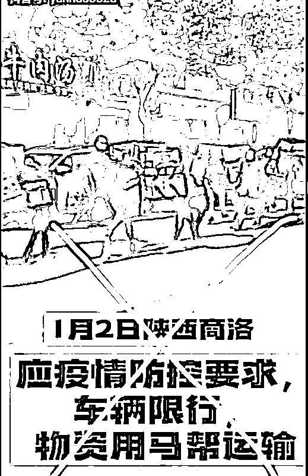
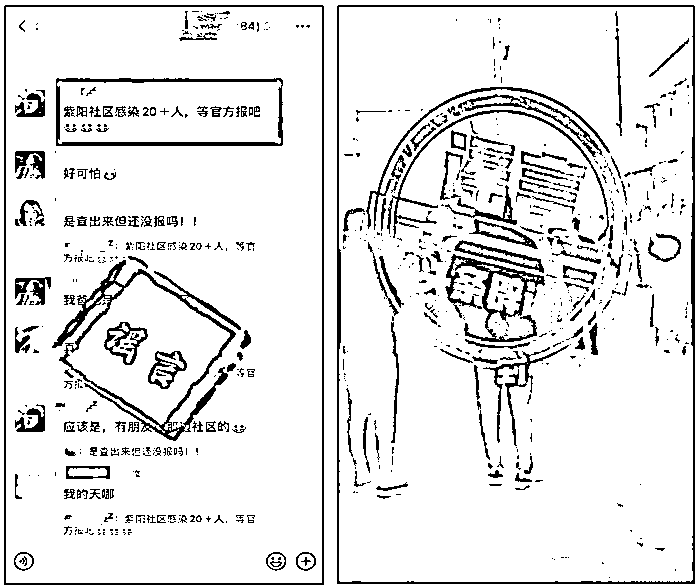

# 疫情谣言到底有多离谱？

> 原文：[`mp.weixin.qq.com/s?__biz=MzIyMDYwMTk0Mw==&mid=2247528062&idx=2&sn=9b87d8bc664f659dfac3a3742706df2f&chksm=97cba546a0bc2c503ea83945a0569f0f84b938bec3ea1c834312b8d0de65d794242a0ff950e4&scene=27#wechat_redirect`](http://mp.weixin.qq.com/s?__biz=MzIyMDYwMTk0Mw==&mid=2247528062&idx=2&sn=9b87d8bc664f659dfac3a3742706df2f&chksm=97cba546a0bc2c503ea83945a0569f0f84b938bec3ea1c834312b8d0de65d794242a0ff950e4&scene=27#wechat_redirect)

最近多地发生疫情，这时候不实言论趁机出现，让很多人惶惶不可终日。
在这些谣言里面，你能看得到世间最五彩的扯淡，也看得见米田共般的荒唐。  （也就是氪金——五彩）仿佛一个异世界在身边。**01.**当网友们把目光聚焦到陕西时，有人针对排队核酸检测等问题，在新闻里写下严重失实的文字：“西安市确诊人群**超一半**是在核酸检测过程中被感染”以及在微信群中传播谣言：“公寓 800 多人**被拉定边沙漠隔离**”有人则针对进出小区的情况，编造了一条通知：“警务人员在全市各大街道对外出流窜人员进行**严查、拘捕**”凤阳县的当地马帮在疫情发生后，自发筹集物资向社区捐赠，有人就将这件事改成了谣言： “商洛市丹凤县因疫情防控限行车辆，**用骡马队运输物资**。”这条谣言还被二次编撰，写成了西安故事。这几条都是标准的谎话，让人以为别人的生活很糟糕，并在往绝境走。其中的潜台词也明显，那就是暗示城市的不作为、乱作为。为了强化感同身受的效果，造谣者又把视角拉回到自己的身上，以此来现身说法。有人挑起对立，发布谣言：“第三次物资已收到”（故意将位置虚假标记为**省政府家属院**）有人故意抹黑，发布谣言：“我们被关在家里快 20 天了，只收到过一次蔬菜，2 个土豆，2 个洋葱，一个白菜，2 个白萝卜……请问我们吃什么……请问我们要**被饿死家中**吗？”其实她家一点也没有吃喝问题。这些极端控诉城市管理质量的行为，总能获得流量关注。它们试图让人以为城市遇到难处的同时，又被一部分人窃取了利益，所以城市在变得越来越糟。
试问，谁看了不会怒气冲冲呢？再深深地聚焦普通人生活，就更加有利于宣泄氛围了。一个名叫“户县馍店”微信里，双方产生了争执，这时候，有人辱骂顾客是猪，另一人则借机编了谣言：“（馍馍）后天**统一涨价**”西安市民在着急买电的时候，一则谣言开始散布：“西安售电系统停机检修**不能购电**”聚焦吃穿住行的谣言，越细越好，也越能让人以为危险离自己只有三公分。当然这时候怎么少得了长篇大论呢。一个公众号写下文章《西安百姓的悲哀：为什么有人不惜违法、冒死也要逃离西安？》，文章里传播了不实消息：“西安隔离费用**至少 5000 元**”“直接**粗暴关停**医疗体系”“普通社区居民**没菜吃**”据推测，文章的阅读量可能达到几百万，所以当谣言被揭穿的时候，作者本人还是抱有侥幸心理。他承认传谣，并留言致歉，但一定要等到发表 24 小时后删除，为的就是进一步提升曝光度。后来此文删除了，此公众号也搜不到了。 凡此种种都可以说明，西安疫情里出现的谣言，正是要借助大家的焦虑心态，来赚取不义之财。事件的大部分细节被忽略或简化了，只留下金句般的一句话。而被文字触及到的人们，也就离真相远了起来。**02.**除了陕西以外，其他地方也开始被造谣者盯上。“杭州紫阳社区**20 多人**感染新冠”“有新冠阳性西班牙运动员**进京并赴三里屯**游玩”“（保定）清苑区南候村因疫情**封村了**”。这些谣言往往借助“也有一例”的格式进行传播，并和封村封小区紧紧相伴。不信你看更普遍的行文“规范”：”黄村给封了，有一个逃回**躲山上**”“戈溪村发现一例阳性患者，现在全村在做核酸检测，说马上**封村了**” “（北仑）博地**也有一例**了”还有拿自己当那个吸引眼球的一例的。刚做完核酸检测的打工人，下载图库改动核酸报告，他发了朋友圈和亲友群，并用来吓唬房东。这则谣言是这样的： “我，核酸检测结果，**阳性**”总结下来，我们可以看到亲友群、小区业主群是谣言的集中地。同时可以看到，他们也不求数量的恐怖，有时候“已有一例”带来的威慑效果，就足以让人随手转发。因为危险的触手可及，危险的现身说法，危险的简约风格都足够打击人的信心。问题是这样的危险降临到谁的头上，显得更恐怖呢？善良、被好好保护、涉世未深、牵扯家中几代人的学生群体，就是很好的样本。一则谣言是：“天津市东丽区教育局核酸排查结果良好学生**返校通知**”另一则谣言是：“金华职业技术学院**出现一例**新冠肺炎确诊病例”此前包括关于西安学生的谣言也不少。曹某将一段外地学生放学的正常视频虚构为：“西安某学校学生向秦岭**转移隔离**”还有很多很多。细心的读者一定注意到了上面图片的“通知”两字。的确如此，有时候为了显得像那么回事，就得生造文件，毕竟有了“通知”“公告”到哪里都好忽悠。不过讲究的人还会盖上所谓真相的一大要素——红章。“温州展泰眼镜厂发现一例新冠确诊病例，大家请勿前往梧田工业区（蟠凤）范围内，为了**放假能顺利回家**，请大家务必遵守。”走文件风格的谣言，还有这样的。
一些微信群里就在传播所谓的深圳防疫最新要求：“明天（周六）开始**全市全员**进行核酸检测。”“全市进入疫情**防控战时**状态。”“所有外出居民持**48 小时**核酸检测证明。”**这就叫谣言的师出有名。**当然为了更好地蛊惑人心，在说得像那么回事的时候，得带上名人效应。我们的张文宏医生就常常被造谣者盯上。有人将上海这次疫情的事情添油加醋，最后改成了“怪谈”：“她逛了水果店，逛了恒隆 LV，于是今天都被关闭了。**还跟张文宏住一栋楼里**，于是今天张文宏也被居家隔离了”可谓想象力十足。 就差去当编剧，拍科幻片了。**03.** 可是，谣言市场那么大，必然是鱼龙混杂的。 你不能要求每个造谣者都是“高精尖”，有的人是没啥技术，不怎么上心的。比如，旧新闻被炒冷饭的。一则谣言：“成都**紧急预留**3 万个床位应对疫情”这样的老段子是反复炒作而来，时间最远的可以追溯到 2020 年 6 月 24 日。一则谣言：“**完全解除**小组||高陵区”也差不多，该信息内容系篡改自 2020 年 2 月发布的一个通知。还比如，东拼西凑的。深圳卫健委写了一篇文章，里面有介绍浙江上虞的一则通告的内容，这部分内容就被歪曲成了：“（深圳）发现‘黄码’‘红码’人员给**现金奖励**”实际原文是这样的。也就是说，造谣者把绍兴上虞的事安到了深圳上。还比如，无视官方澄清的。咸阳兴平市母子坠楼视频的发生地，被篡改成西安，而且被说成了丈夫行凶：“男的把老婆和娃，从 15 楼**扔下去了**”新闻报道再三引用兴平警方的说法：“坠楼母亲和儿子不是被她老公扔下楼的，该事件与男子无关。”信谣者自然不信这些，还是大肆传播谣言，似乎要多角度挑战调查结果。虽然这些造谣的技术含量不怎么高，但明显效果也不差。**可见原创在谣言界里不一定吃香啊。**所以，如果你会融梗，那么制造出了的谣言，或许也能快速有效影响正常人的生活。简单粗暴就行。很黄很暴力也行。**04.**这不，事关人类荷尔蒙的黄谣就一定能兴风作浪。并且，请勿搞虚，越乱越好。有人疯狂传播所谓确诊病例传播链分解图： “某门诊部女护士**分别与**某隔离酒店员工、某大学老师**存在亲密关系**，导致新冠疫情扩散。”华商报澄清，这张确诊病例传播链分解图并非原发，图上标注的“病例之间存在情人关系”系谣言。与女性的“风骚”相对的往往是男性的“嫖娼”。 翻翻半年内的其他黄谣，关于男性的往往是这样：“南京首次通报疫情源头：南京籍拜某会计骑电瓶车**嫖娼**受交叉感染”“（湖南长沙岳麓区）一男子**嫖娼**致多人感染新冠”。、“一确诊病例男子到重庆江北区红鼎国际**嫖娼**导致该大厦被封控”。谣言中所谓的当事人，往往是好玩的人，这样能显得当事人的荒唐，对比出普通人的无辜。“好玩”是一语多关。不少人看到这样的谣言，无论信不信，都会嘴角窃窃一笑。仿佛作为过来人的他们也不得不佩服当事人的强健体魄。**05.**这个时候，我们也不能怪真相走得慢，而让一些被网络暴力的当事人极度受伤。《科学》杂志上发表的一项研究或许能说明一个原因。他们收集了推特上 2006~2018 年间的数据，选出 126000 条的新闻推文，对此进行分析，结果显示：

> 即使是热度最高的真实新闻，也很少传递给 1000 个以上的推特用户，但虚假新闻经常能被传递给 1000 甚至 10000 人。而且，虚假内容传递给 1500 人的速度，比真实内容传递给 1500 人的速度快 6 倍。而且，首次看到虚假新闻就转发的可能性，比真实信息高 70%。

**谣言在传播上天然地比真来得快狠。**再往源头上说，一个原因是，**个体在大时代面前的无助与恐慌。**个体越发陷入到孤独中，并在现实的无序互动状态下，更加无助迷离。那么，人就会寻找各种解药。谁离他们最近，谁最能调动他们情绪，他们往往就听谁的。有的客观，有的主观，有的合法，有的不合法，很多很多。风水迷信能再掀起波澜，心灵鸡汤能多少年占据市场，都是这样的道理，谣言也是如此。比如，这个时候来个轻描淡写的幽默谣言，就一定能缓和所有情绪，中和所有立场，并让人笑掉大牙。 请看网络流传的一则标有西安市精神卫生中心的短信截图：“隔离期间，您如果和花草树木聊天这很正常无需致电咨询，只有在那些**花草树木开始回答您问题**的情况下才有必要寻求协助。”有点儿好笑，但它也是实实在在的不实信息。欢笑之余，可见谣言就是这样千奇百怪，层出不穷的。当然这时候我们并非束手无策。这样的行政拘留。 这样的。这样的。辟谣得很及时。蓝底白字，看得实在痛快。最后，还是希望这些辟谣的信息，能到需要的人手上。 毕竟真相才能让人过得更舒服。

← 向右滑动与灰产圈互动交流 →

