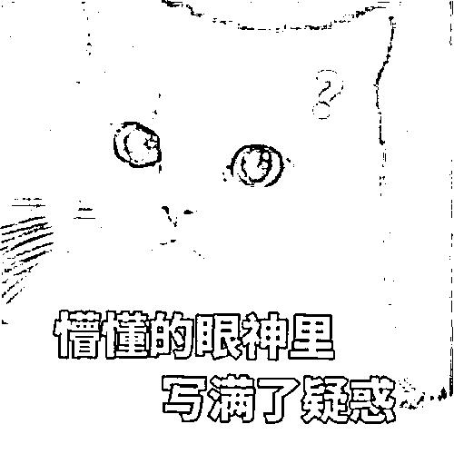
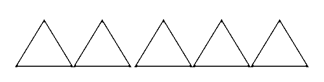

# 在二手平台卖东西，却赔了数万元？

> 原文：[`mp.weixin.qq.com/s?__biz=MzIyMDYwMTk0Mw==&mid=2247528062&idx=5&sn=cc99bde10ec307b9e7f126a555e73bad&chksm=97cba546a0bc2c50ac901ffe4bd5299869ec0209cf0eec510b13fd09bda6b858c31aa52fabd6&scene=27#wechat_redirect`](http://mp.weixin.qq.com/s?__biz=MzIyMDYwMTk0Mw==&mid=2247528062&idx=5&sn=cc99bde10ec307b9e7f126a555e73bad&chksm=97cba546a0bc2c50ac901ffe4bd5299869ec0209cf0eec510b13fd09bda6b858c31aa52fabd6&scene=27#wechat_redirect)

搬家时物品堆积如山

很多人都遇到过这种烦恼

有人选择把它们二手转卖出去

但二手交易也经常出现纠纷

原来主要是买家被坑

在卖家忽悠下买到货不对板的物品

但现如今

竟然还有买家把卖家坑了的情况！

[`mp.weixin.qq.com/mp/readtemplate?t=pages/video_player_tmpl&action=mpvideo&auto=0&vid=wxv_2219257408437141506`](https://mp.weixin.qq.com/mp/readtemplate?t=pages/video_player_tmpl&action=mpvideo&auto=0&vid=wxv_2219257408437141506)

观看《深圳警讯》节目完整视频↑

二手交易平台上许多卖家

交易经验十分匮乏

他们只是偶尔挂售闲置物品

并不是专门靠卖商品赚钱

所以对交易规则并不熟悉

当买家说付不了款

需要卖家交保证金、服务费等

很多人都并不会怀疑

×情景演绎骗子

你没有开通交易功能，我不能付款，我给你客服联系方式，你赶紧处理一下吧。

好的，我现在去联系客服。某先生

随后骗子又伪装成客服

继续实施诈骗行动

骗子

二手交易服务请缴纳 3000 元定金开通，开通成功即可返还哦。

好的。（转账 3000 元）某先生

为了让卖家信服

他们还会精心制作虚假的图片

**比如“支付成功”“开通服务”等截图**

以假乱真

卖家很有可能就认为

这是比较正规且实际存在的服务

最终放松警惕

在对方诱导下完成转账

在二手平台上交易时

无论是“买家”还是“卖家”

**要求先交钱完善交易流程的**

**脱离交易平台转账的**

**都是诈骗**

二手平台交易根本不存在

**“保障金”“服务费”**的说法

也不存在需要**脱离平台才能交易**的情况

如果发现被骗

请及时在平台举报

并拨打 96110 国家反诈热线求助

来源：深圳市反电信网络诈骗中心

← 向右滑动与灰产圈互动交流 →

