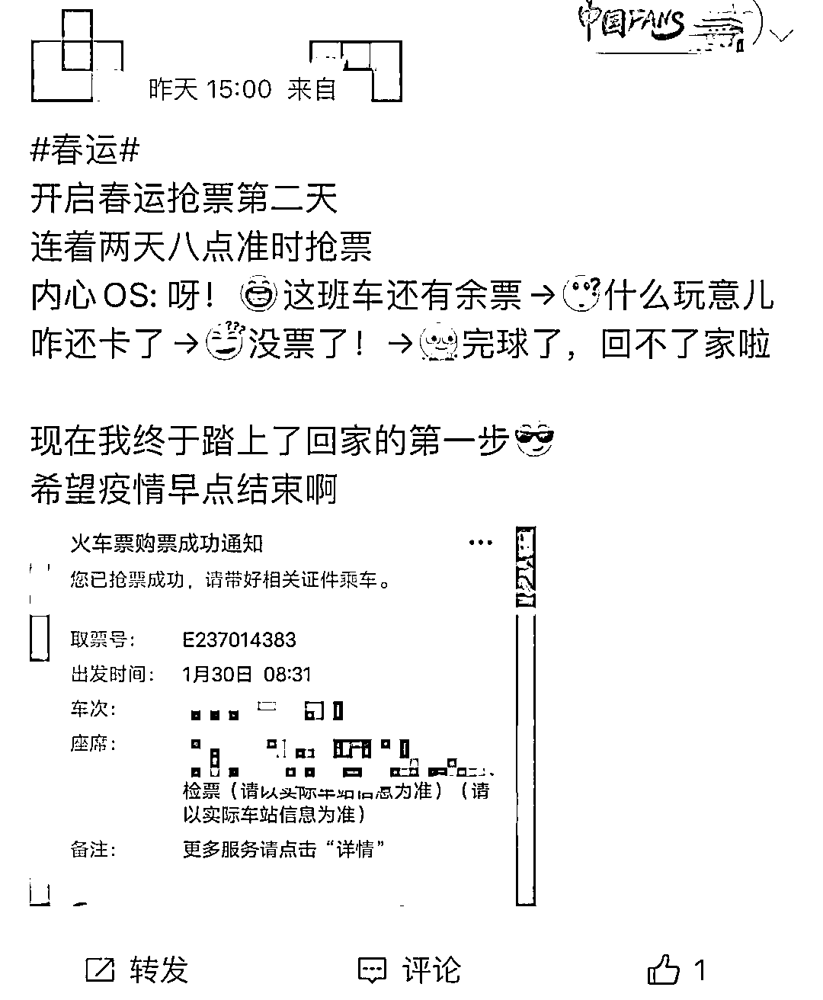
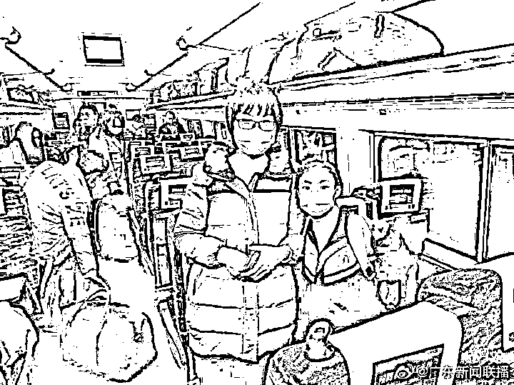

# 春运抢票的 N 种“打开方式”

> 原文：[`mp.weixin.qq.com/s?__biz=MzIyMDYwMTk0Mw==&mid=2247528062&idx=6&sn=282c5cc5e3e64cdac730a2bc8b1b1bb8&chksm=97cba546a0bc2c50307b5687ff9495ea58aba12c5b2565e974149b847ee6e3be316882f3d1c9&scene=27#wechat_redirect`](http://mp.weixin.qq.com/s?__biz=MzIyMDYwMTk0Mw==&mid=2247528062&idx=6&sn=282c5cc5e3e64cdac730a2bc8b1b1bb8&chksm=97cba546a0bc2c50307b5687ff9495ea58aba12c5b2565e974149b847ee6e3be316882f3d1c9&scene=27#wechat_redirect)

昨天的写字楼里、工厂里、商场里...... 

多少人提前定好的手机闹铃准时响起？ 

闹铃声震得脑袋有点懵：

“我定闹钟是要干啥来着？”

愣了愣神，突然想起：

**“是要抢除夕那天的火车票！”**

赶紧抓起手机， 

打开铁路购票软件，

紧紧盯着屏幕顶端的时间，

就等着整点一到，拼手速抢票。

**你抢到票了吗？**

“人类的悲欢并不相通”， 

抢票人的悲欢也不相通。 

买好春运车票的朋友们已经在

美美地等待回家了。 

没抢到票的朋友还在刷着购票软件， 

发出羡慕的声音：

“你们都是咋抢到票的啊！”

大多数朋友的票都“来之不易”。 

为了抢票， 

有勤快早起的：

有机智使用“迂回策略”的： 

有多花钱买了一等座的：

还有人缘好，

发动好朋友一起帮忙的： 

还有...... 

十分幸运的！

这位朋友真是让人流下羡慕的泪水。 

**买“加速包”就能抢到票？**

春运期间，

一些热门日期、热门方向的车票一票难求，

不少没买到票的朋友非常心急。 

与此同时， 

某些第三方平台也摩拳擦掌，

推出各种“加速包”，

号称能够优先出票。

然而，

“加速包”到底有没有用？

能不能抢到票？

铁路 12306 明确表示，

消费者使用的“加速包”

并不能拥有优先购票权，

无论是哪款购票软件，

都需要在铁路 12306 购票系统排队。

铁路部门专门发出提醒：

**不要使用抢票“加速包”，**

**建议用官方**

**免费的“候补购票”功能。**

此外，

第三方手机客户端和第三方代购网站

还存在抢票软件出票迟延、

退改签手续费过高、

个人信息泄露、退款慢等风险。

还有一些朋友“病急乱投医”，

想高价买“黄牛票”，

结果遇上了骗子。 

**以下几种常见骗局千万要防范!**

总之，一句话： 

正规渠道购票，

别给骗子留机会！

**春运开始啦！** 

**昨天（1 月 17 日），**

**2022 年春运拉开大幕！**

先嘱咐大家几句，

回家前，

别忘了提前查看防疫政策信息，

健康码、行程码绝对不能少，

核酸检测证明别忘带，

口罩也别忘戴。

第一批春运旅客可能已经到家啦，

今天，

不少朋友也踏上了回家的旅途。

这将是疫情后的第三个春节，

不少朋友两年没回家过年了， 

盼回家这天盼了好久。 

坐在车上，

心先飞回了老家。

爸妈可能已经发了微信问：

“今天到家想吃点啥？”

马上就能坐到家里的饭桌前了，

桌上一道道家乡菜， 

全都是半夜饿了就会想起的、

无数次勾起馋虫的。

更想念的，

是好久没见的家人，

看着车窗外越来越熟悉的景色，

关于家乡的记忆“哗啦”一下子涌进来。

爸妈胖了还是瘦了？ 

爷爷奶奶外公外婆的身体还好吗？

哥哥姐姐家的小孩该上几年级了？ 

是不是要约一起长大的发小聚聚了？ 

但是，

有一些朋友因为疫情原因， 

没法回家。

春节是团聚的节日， 

但团聚时刻不只有春节，

等疫情平息， 

咱春暖花开的时候再回去！

你今年春节回家吗？抢到票了吗？ 

有没有已经到家的朋友？

举个手看看。

来源：央视网综合长江日报、广东新闻联播、珠海网警巡查执法、中新经纬

← 向右滑动与灰产圈互动交流 →

