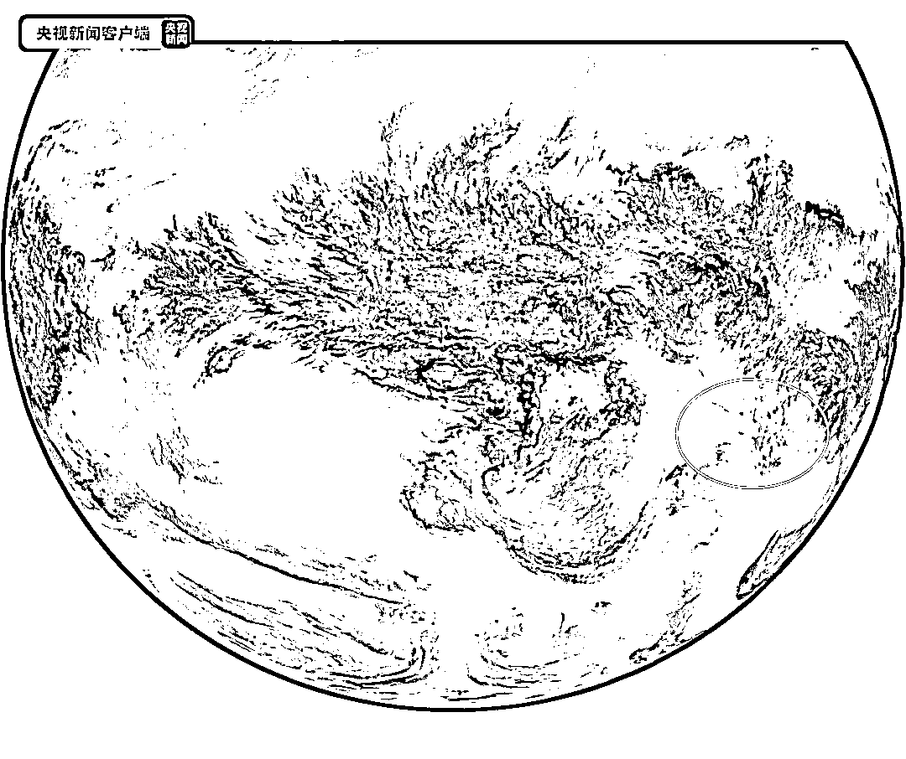

# 獐子岛，又火了！

> 原文：[`mp.weixin.qq.com/s?__biz=MzIyMDYwMTk0Mw==&mid=2247528135&idx=1&sn=382b3c5d6776f5c53490a948b99b98c8&chksm=97cba5ffa0bc2ce90e5037395c84ac16695adac5d54fc59851ab66871a3cb68de0a2a9cef6ee&scene=27#wechat_redirect`](http://mp.weixin.qq.com/s?__biz=MzIyMDYwMTk0Mw==&mid=2247528135&idx=1&sn=382b3c5d6776f5c53490a948b99b98c8&chksm=97cba5ffa0bc2ce90e5037395c84ac16695adac5d54fc59851ab66871a3cb68de0a2a9cef6ee&scene=27#wechat_redirect)

# 这两天，因“扇贝”出名的獐子岛又引发关注！

1 月 17 日，一则“汤加火山爆发导致大量太平洋扇贝涌入獐子岛，今年收益或将增长 100%+”的视频在网络上热传。

网传视频截图

1 月 17 日，有投资者在深交所互动易提问：“汤加海域火山喷发，造成附近海域海水温度升高，请问是否会导致大量太平洋扇贝涌入公司海域避险的可能性？如有此可能性，公司有无应急预案迎接这部分扇贝的到来，或者采取措施主动吸引一部分南太平洋优质扇贝资源到公司海域，以此提振公司规模效益呢？”

昨天下午 14 时许，獐子岛在互动易上回应：

> 公司关注最近有媒体报道“汤加火山喷发和海啸 导致太平洋扇贝涌入獐子岛 今年收益获将增长 100%+”及相关传闻，**上述报道及传闻严重失实**，**公司管理层未接受上述问题的任何相关采访、回复**，公司保留通过法律途径保护自身权益的权利。 
> 
> 公司郑重提醒广大投资者关注公司相关公告，并注意投资风险。

根据地图测距，獐子岛距离汤加直线距离 9300 公里左右，考虑到中间的陆地阻隔，实际的水域距离可能达到 1 万公里左右。

昨天上午 A 股开盘，**獐子岛短短 2 分钟内直线封板，**股价报 4.26 元，市值报 30.29 亿元。涨停板封单超过 20 万手。成交金额 3.5 亿元，换手率超过 12%。

# **汤加政府发布声明**

汤加政府当地时间 18 日发布声明称，**洪阿哈阿帕伊岛火山 15 日喷发并引发大范围海啸后，汤加境内一座岛屿上的房屋全部被损毁。**

 **这是自洪阿哈阿帕伊岛火山喷发以来，汤加政府发布的声明。

**酸性气体已影响澳大利亚**

[`mp.weixin.qq.com/mp/readtemplate?t=pages/video_player_tmpl&action=mpvideo&auto=0&vid=wxv_2229859402868670467`](https://mp.weixin.qq.com/mp/readtemplate?t=pages/video_player_tmpl&action=mpvideo&auto=0&vid=wxv_2229859402868670467)

视频说明：从最新的 FY-4B 火山灰云合成方案制作的云图动画上看，火山灰云中的大部分矿物颗粒物质在火山爆发点周围徘徊并逐渐沉降，同时火山云团中逐渐有浅绿色云团分离，并逐渐向西扩散，目前已经影响到澳大利亚本土。来源：国家卫星气象中心(00:24)

国家卫星气象中心专家分析，这部分浅绿色云团主要是由火山灰云中的酸性气体（如二氧化硫）等组成。

据央视新闻报道，2022 年 1 月 15 日 12 时 27 分（北京时间），汤加海域 Hunga Tonga 火山（20.5°S，175.4°W）发生喷发并引发大范围海啸。此次火山喷发可能是近 30 年来规模最大的一次。

卫星图像显示，喷发的大片火山灰以及气体像蘑菇云一样，从蓝色的太平洋海域升起。汤加首都努库阿洛法很快观测到海啸。汤加气象局说，汤加全境面临海啸、暴雨、洪水和强风的威胁。

自然资源部海啸预警中心根据监测结果分析，此次火山喷发引发了越洋海啸，影响整个太平洋沿岸地区。截至 2022 年 1 月 16 日 11 时 30 分（北京时间），太平洋沿岸智利、日本和新西兰等国家监测到明显海啸波，最大海啸波幅达 1.5 米。我国沿海海域于 16 日凌晨监测到海啸波，其中浙江石浦站最大海啸波幅约 20 厘米，其余潮位站海啸波幅均小于 15 厘米。此次过程未对我国沿岸造成灾害性影响。

火山爆发后，气象部门通过卫星密切监测火山灰移动情况。当火山灰云遇上气象云时，用可见光通道的仪器不容易把两者分开的。而红外通道仪器却可以把火山灰云从气象云中筛选出来。因为卫星传感器中特定的红外通道对火山灰云中的酸性矿物颗粒非常敏感，当用多个红外通道扫视大气时，能够一下子找出火山灰云。火山灰云在哪儿，有多大面积，移动趋势如何……通过卫星获取这些信息后，气象部门会对火山灰影响进行综合研判。

**可能造成全球气温下降**

 **[`mp.weixin.qq.com/mp/readtemplate?t=pages/video_player_tmpl&action=mpvideo&auto=0&vid=wxv_2229861032087339015`](https://mp.weixin.qq.com/mp/readtemplate?t=pages/video_player_tmpl&action=mpvideo&auto=0&vid=wxv_2229861032087339015)** 

**▲ 澎湃新闻**

**17 日，汤加前首席地质学家大卫·塔平接受澎湃新闻采访。他表示，此次汤加火山喷发带来的影响有待观察，但仍有可能造成全球气温下降。**

**来源：长沙晚报综合南方都市报、N 视频、每日经济新闻、澎湃新闻等**** ********

****← 向右滑动与灰产圈互动交流 →****

********