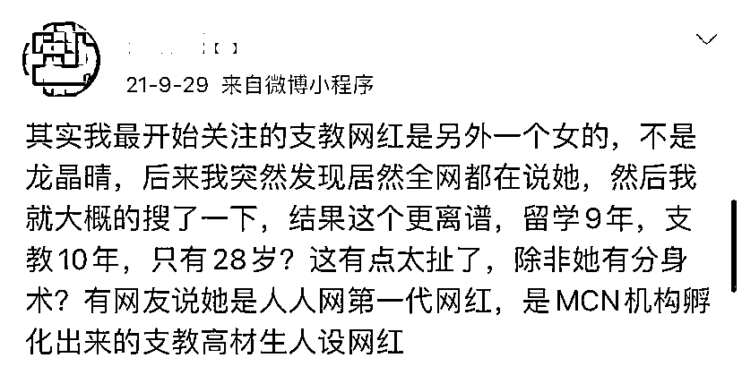

# “最美支教”翻车？

> 原文：[`mp.weixin.qq.com/s?__biz=MzIyMDYwMTk0Mw==&mid=2247528135&idx=2&sn=1444a1d577995c05ed9636048fc38b2b&chksm=97cba5ffa0bc2ce9ea3c3ebf6054687a05614e2665ee59614d615fbe49627d0ddda3aa0f9470&scene=27#wechat_redirect`](http://mp.weixin.qq.com/s?__biz=MzIyMDYwMTk0Mw==&mid=2247528135&idx=2&sn=1444a1d577995c05ed9636048fc38b2b&chksm=97cba5ffa0bc2ce9ea3c3ebf6054687a05614e2665ee59614d615fbe49627d0ddda3aa0f9470&scene=27#wechat_redirect)

还记得

“连续 10 年去湘西支教”而走红的

海归女硕士龙晶睛吗？

（此前报道：[举报龙晶睛善吟共益及计育韬名下三家公司涉嫌非法公开募捐、虚假募捐](http://mp.weixin.qq.com/s?__biz=MzIyMDYwMTk0Mw==&mid=2247521362&idx=1&sn=5b1313654df7040af2da626d0d96b44a&chksm=97cb5f6aa0bcd67c1fd4bd37fcf7b5f2d6a599edb2967dd8e6fd9d2efec14ed5c473ea5a6ffe&scene=21#wechat_redirect)）

[`mp.weixin.qq.com/mp/readtemplate?t=pages/video_player_tmpl&action=mpvideo&auto=0&vid=wxv_2231159071531941896`](https://mp.weixin.qq.com/mp/readtemplate?t=pages/video_player_tmpl&action=mpvideo&auto=0&vid=wxv_2231159071531941896)

澎湃新闻记者：熊强 编辑：周妍 素材来源：相关人士 责任编辑：蒋格伟

近日

根据公民举报

长沙市民政局

对长沙市善吟共益助学服务中心

涉嫌违规公开募捐

进行了调查处理

并依法下达行政处罚决定书

（长民罚决字〔2021〕1 号）

根据《中华人民共和国行政许可法》

第四十条规定，向社会公开

行政处罚决定书显示

长沙市善吟共益助学服务中心的

法定代表人

正是龙晶睛

图源：长沙发布

违规募捐的“最美支教”

处罚决定书显示

**当事人通过互联网媒体**

**发布二维码收款信息**

**面向社会公众进行资金募集**

**应认定为公开募捐行为**

**而当事人并未取得公开募捐资格**

在发现当事人未取得公开募捐资格

而开展公开募捐行为后

长沙民政局已于 9 月 27 日

责令当事人立即停止募捐活动

其收款二维码已于 9 月 29 日停止使用

长沙市民政局决定

**对当事人予以警告的行政处罚**

**责令当事人于 60 日内**

**将违法募集财产 11845.4 元退还捐赠人**

向当事人提出行政指导意见

要求当事人全面整改

依法规范慈善活动

完善内部管理制度

规范财务管理

加强信息公示公开

“网红打卡式的持续作秀”

龙晶睛自称 16 岁时出国读书

硕士毕业于哥伦比亚大学

其支教经历开始于 2011 年暑假

当时她前往湘西好友村支教

萌生了号召更多人关注山区教育的想法

龙晶睛称

2011 年后

她每年利用暑假回国支教

在美国组织了“一美元爱心计划”

为山区孩子募捐

还为此在硕士阶段攻读社会工作学

其和团队组织的慈善活动

得到了国内外近千名学生的支持

并于 2018 年成立了自己的慈善组织

相关报道称

10 年间

龙晶睛的“支教足迹遍布

湖南、江西、贵州、陕西等地的

24 所偏远山区学校

前后帮助过 2000 多名山区孩子”

有博主发文质疑称

龙晶睛在短视频平台发布的

支教日记有“违和感”

看完视频

“不知道她在支教期间干了些什么

也不知道小朋友们到底学到了什么

只记得她

武装到牙齿和头发丝的美丽形象”

并质疑其“十年支教”的经历

是“网红打卡式的持续作秀”

对此龙晶睛曾发文回应表示

“网传利用公益敛财其实并不存在，

因为机构是非营利的”

并晒出了相关运营项目支出明细

而宣传中所描述的

“组织帮扶了 24 所学校”

也并非她本人去了这么多

并为“没有认真核对稿件”道歉

此前报道，戳图可查看详情  

澎湃新闻综合自央视网、澎湃新闻记者 熊强、朱敏骏 

← 向右滑动与灰产圈互动交流 →

