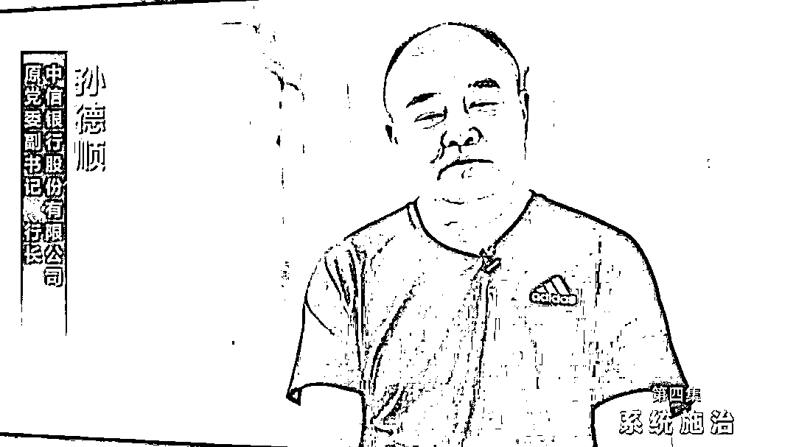
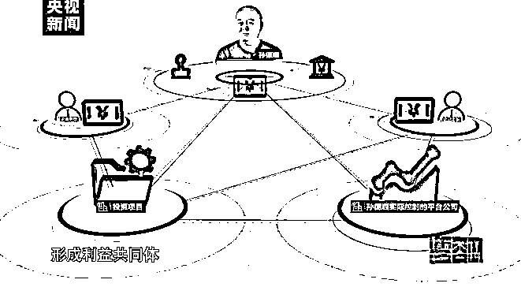
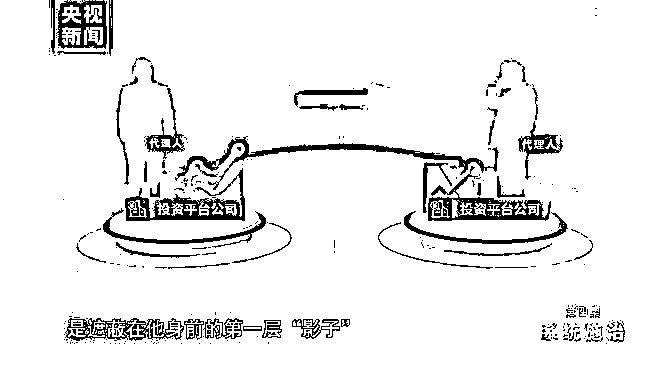
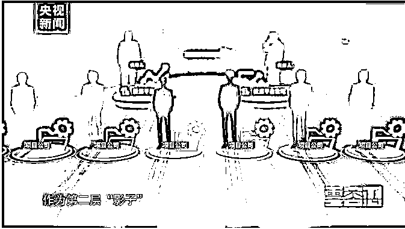
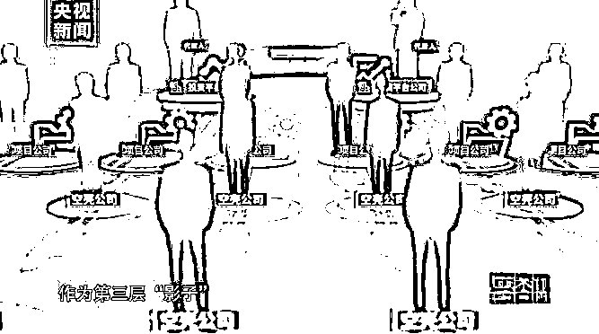

# 批贷 40 亿，银行行长控制的公司获利 1 个亿

> 原文：[`mp.weixin.qq.com/s?__biz=MzIyMDYwMTk0Mw==&mid=2247528135&idx=5&sn=3d301f18ddb06b050d4fa01e1c621df5&chksm=97cba5ffa0bc2ce9c774f2a160cef63e0542e095068c64785a29e49c6c749109a58466578aa6&scene=27#wechat_redirect`](http://mp.weixin.qq.com/s?__biz=MzIyMDYwMTk0Mw==&mid=2247528135&idx=5&sn=3d301f18ddb06b050d4fa01e1c621df5&chksm=97cba5ffa0bc2ce9c774f2a160cef63e0542e095068c64785a29e49c6c749109a58466578aa6&scene=27#wechat_redirect)

1 月 18 日，由中央纪委国家监委宣传部与中央广播电视总台联合摄制的五集电视专题片《零容忍》第四集《系统施治》播出，专题片聚焦金融领域反腐，详细披露了中信银行股份有限公司原党委副书记、行长孙德顺案。

[`mp.weixin.qq.com/mp/readtemplate?t=pages/video_player_tmpl&action=mpvideo&auto=0&vid=wxv_2230754322269683713`](https://mp.weixin.qq.com/mp/readtemplate?t=pages/video_player_tmpl&action=mpvideo&auto=0&vid=wxv_2230754322269683713)

孙德顺，中信银行股份有限公司原党委副书记、行长。2020 年 3 月，中央纪委国家监委通报，孙德顺是金融领域腐败问题特别严重、性质特别恶劣、数额特别巨大的典型，将其开除党籍，涉嫌犯罪问题移送检察机关依法审查起诉。

2020 年 5 月，孙德顺被提起公诉。检察机关起诉指控：被告人孙德顺利用担任中国工商银行北京市分行副行长，交通银行北京市分行行长，中信银行股份有限公司副行长、行长等职务上的便利，为他人谋取利益，非法收受他人财物，数额特别巨大，依法应当以受贿罪追究其刑事责任。

孙德顺在专题片中忏悔说：“从自己所触犯的法律一看，还是自己有贪心，自己也特别悔恨，再怎么悔恨也没有后悔药。”

**违反政治纪律，光追求自己所谓业绩**

中央纪委国家监委机关工作人员樊祥鹏介绍，孙德顺他严重违反了政治纪律，作为国有重要商业银行负责人，本应承担着政治使命和社会责任，但是他把中央的重大决策部署都置之脑后，光去追求自己所谓的业绩，以及兑现一些老板的利益。

近年来中央多次强调，金融要回归服务实体经济的本源，要加大对制造业的支持力度，防止信贷资金过度向房地产集中，孙德顺却背道而驰。

樊祥鹏介绍，孙德顺就关注什么挣钱快、见效快。他倾向于贷给房地产，主持行长办公会的时候就公开直截了当要求，全行一定要立刻把制造业贷款停下来，即便你有 100%的抵押，那也不行。

中信银行党委副书记刘成介绍，在这期间，中信银行贷款结构就发生了变化，一方面房地产贷款增长幅度达到 40%多，制造业贷款当时受到压降，压降幅度达到 30%多，所以受他影响还是非常明显的。

专题片介绍，中信银行向房地产业贷款占比过高的问题，带来的长期风险后来逐渐显现。2020 年 2 月，银保监会向中信银行开出 2200 万元的巨额行政处罚罚单，处罚事项 19 项中有 13 项涉房地产业务。

樊祥鹏说，这就体现了一个政绩观的问题，追求眼前的利益、局部利益，年报会非常好看，但是给后面会造成很大隐患。

**精心设计掩盖权钱交易**

除了追求政绩外，孙德顺之所以增加房地产贷款还有另一个隐秘的原因，就是谋取个人私利。调查发现一些房地产公司老板与他关系密切，并存在利益交换。例如一名房地产公司老板曾以投资为名，向孙德顺实际控制的公司输送 1000 万元，得到的回报是通过孙德顺获批贷款授信 40 多亿元。

樊祥鹏说，孙德顺有一个特点就是不收现金，他认为收现金太低端了，太简单粗暴了。他利益兑现的方式非常专业化，做了层层的掩盖，就是设了很多的防火墙，绕了很多圈，利用特有的金融手段和产品去掩盖。

孙德顺在银行业工作 40 多年，**是中国金融界唯一一名从银行网点最基层的柜面出纳员做起，一步步成长为国有银行总行行长的干部。他自认为业务能力高超，试图通过精心设计来掩盖权钱交易。**

**“因为自己是从基层起来的，业务能力比较强，所以总觉得自己的业务能力在那摆着呢，就造成了一种侥幸的心理。”**孙德顺如是说。

专题片介绍，调查发现，孙德顺是利用“影子公司”、借助金融手段来完成利益输送的典型，其专业化、复杂化程度相当罕见。他安排两名老部下作为代理人，开设了两家投资平台公司，两家公司前台的所谓法人，实际只是为孙德顺代言的“影子”。

一方面，孙德顺在中信银行利用公权力为企业老板批贷款；与此对应，这些老板有的以投资名义，将巨资注入他实际控制的平台公司，有的则送上优质投资项目或投资机会；平台公司用这些老板提供的资金投入那些老板提供的项目，以钱生钱，和老板们共同获利分红，形成利益共同体。

 孙德顺设计了结构极为复杂的重重掩体，两家平台公司是他的核心经营团队，是遮蔽在他身前的第一层“影子”；在平台公司之下又设立了十多家项目公司作为第二层“影子”，项目公司和行贿企业还不是直接交易，而是双方各自再成立空壳公司作为第三层“影子”，多层影子公司层层嵌套。交易主体本身已经魅影重重，资金往来又伪装成各种貌似合法的金融产品、股权投资协议，用“影子交易”为利益输送再蒙上一层迷雾。

这些障眼法给调查工作带来了极大难度，专案组研究后决定，不在影子的迷阵里打转，而是反过来从源头入手，梳理孙德顺在中信银行推动的贷款授信，找到其中明显异常的决策事项，再针对性地调查获得贷款的企业和孙德顺的关联。这一调查策略抓准了孙德顺腐败问题的核心，那就是利用信贷审批权谋私。

樊祥鹏举例，2014 年底的时候，有一家能源公司，向中信银行申请贷款，因为这家能源公司已经出现了债务危机，是一个高负债的企业，一般不会发放贷款的。但是**在孙德顺干预下，这笔 40 亿的贷款发放给企业，很快就形成了不良资产。**为了表示对孙德顺的感谢，这家公司的实际控制人，就和孙德顺控制的平台公司签署了一个增资协议，这样就完成了利益输送。

而**这家能源企业通过所谓的股权投资协议，让孙德顺控制的公司实际获利达 1 个亿。**类似这样的权钱交易还有多笔，企业向孙德顺输送利益的包装方式五花八门，但换取的东西都一样，那就是银行贷款。抓住了这个核心，重重魅影也就迅速消散，实际控制人清晰显影。

**派驻纪检监察组效果立竿见影**

专题片介绍，孙德顺案凸显出管住信贷审批权这一关键权力的重要性。银行贷款审批一般是由贷款客户递交申请材料，按照程序逐级上报审批，而孙德顺却经常直接与企业对接，再布置给下属去做，用程序倒置的方式违规操作。按照中信银行的制度设计，行长对信贷审批只有一票否决权，没有审批权；审批必须经信贷审批会议集体表决通过，主要领导必须末位发言。但事实上，孙德顺经常无视这些制度，直接干预信贷审批，银行内控机制在“一把手”的权力面前失去了作用。

专题片介绍，针对孙德顺案件暴露出的问题，中央纪委国家监委推动中信银行系统性地开展以案促改，首先从公司治理结构上进行纠正，强化董事会、监事会、高管层的职责，确定他们相互制约、相互监督的关系，同时推进授信体制、风险管理体制和审批制度改革，强化问责机制，完善公司治理体系，提高治理能力。

专题片介绍，一些金融单位之所以出现问题、滋生腐败，归根结底是党的意识不强、党的领导弱化；同时，纪检部门难以履职、监督严重缺失，这些在孙德顺案中也体现得十分明显。深化系统施治、推进标本兼治，最根本的在于加强党的领导和党的建设，确保党中央关于金融工作的决策部署落地见效。

针对监督缺位、监督不力问题对症施策，在新一轮派驻机构改革中，中央纪委国家监委向包括中信集团在内的 18 家中管金融机构直接派驻纪检监察组。这项改革效果立竿见影，仅 2019 年至 2021 年 12 月，派驻金融单位纪检监察组就对驻在单位党委管理干部立案审查调查 81 人。

**延伸阅读：**

**[骨癌女孩的救命钱，低保办主任贪了一多半](http://mp.weixin.qq.com/s?__biz=MzIyMDYwMTk0Mw==&mid=2247527918&idx=2&sn=008676de401e536096e059c7bff54e53&chksm=97cba6d6a0bc2fc0df8000135f4f0086cd59e37b997862cff97ea44d69252280f3ee0abc7514&scene=21#wechat_redirect)**

**[“你要钱干什么，埋你啊”](http://mp.weixin.qq.com/s?__biz=MzIyMDYwMTk0Mw==&mid=2247527994&idx=4&sn=45c1ab6f73709c3457df17cbdde233a5&chksm=97cba502a0bc2c1492e054b0e485562ea2523a074ce95d2fa5121061cde9f0e44382b23044b2&scene=21#wechat_redirect)**

来源：澎湃新闻,央视网

← 向右滑动与灰产圈互动交流 →

