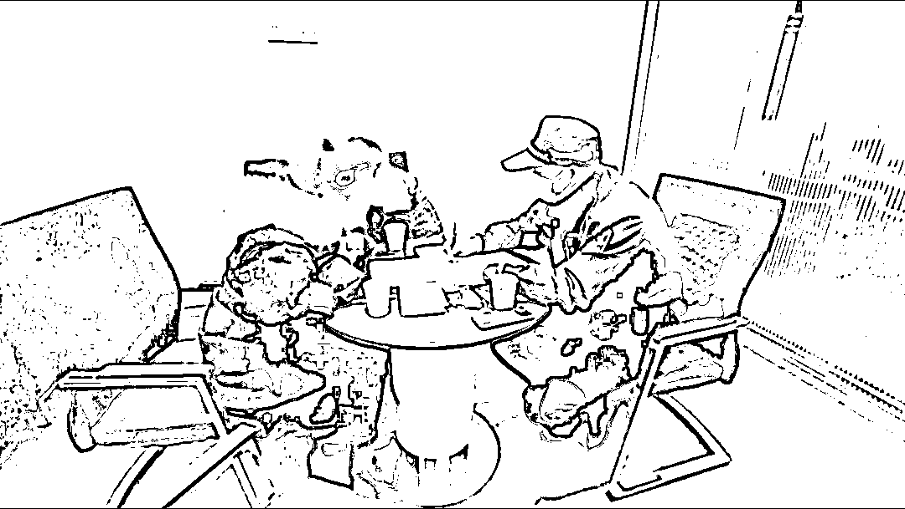
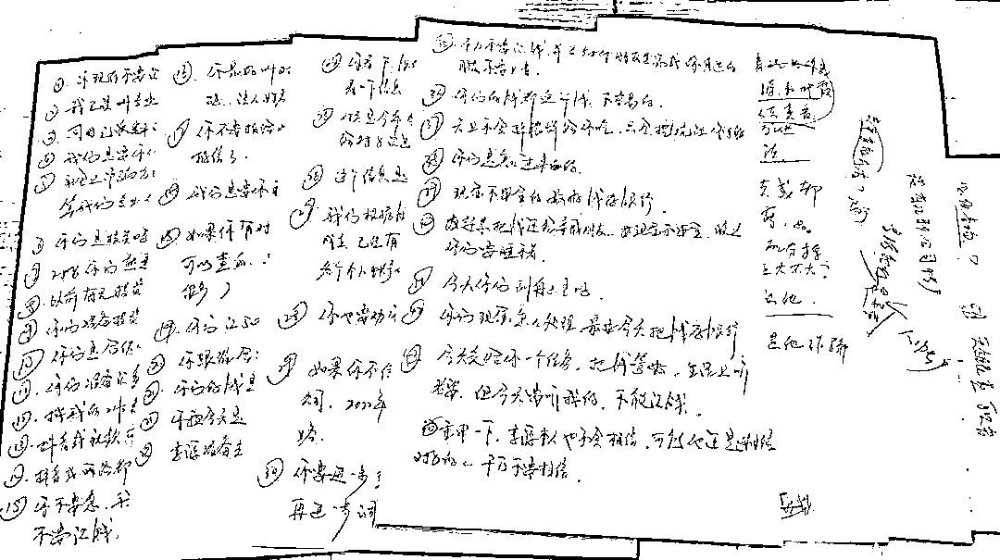
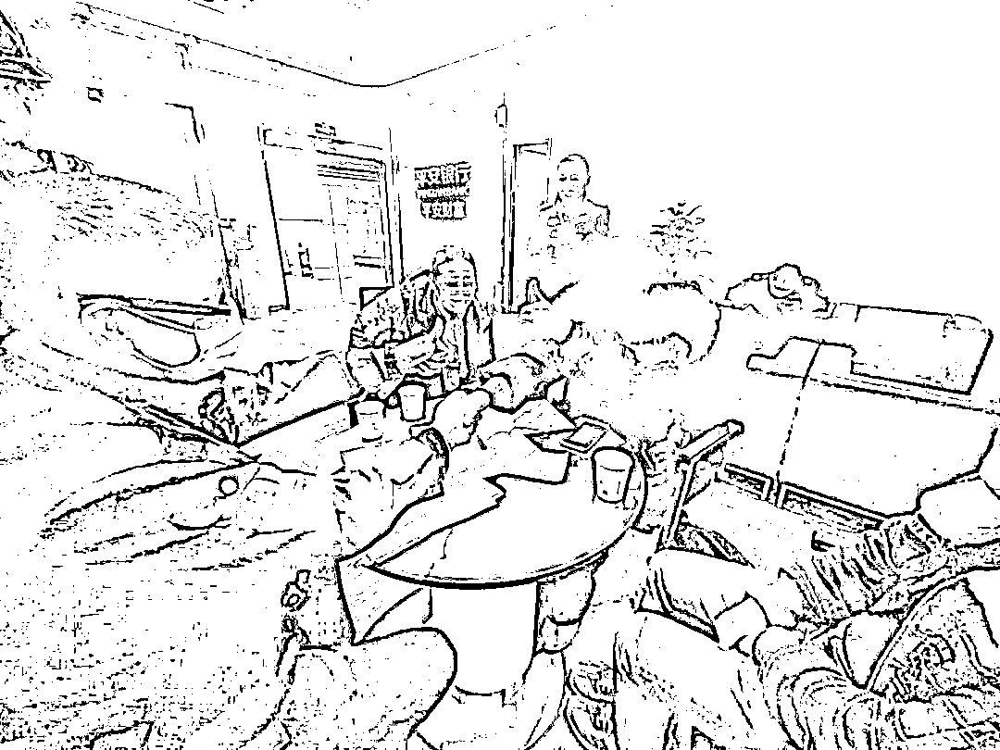
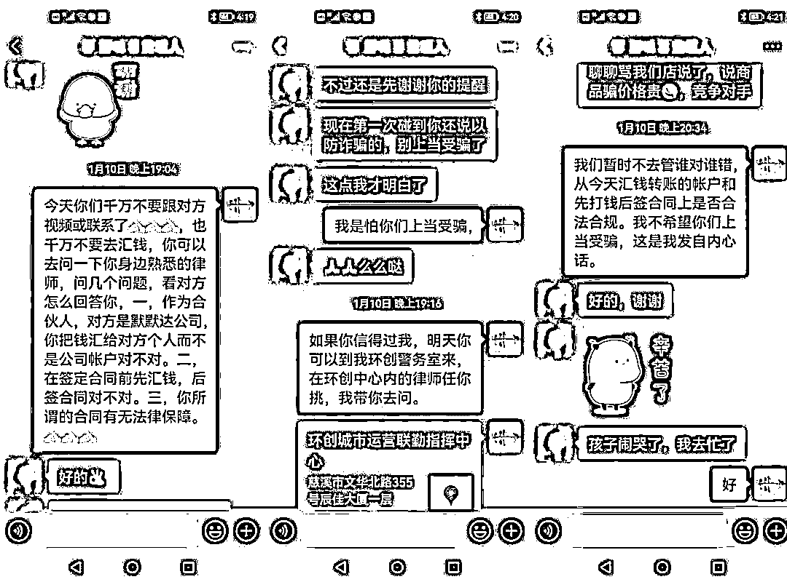
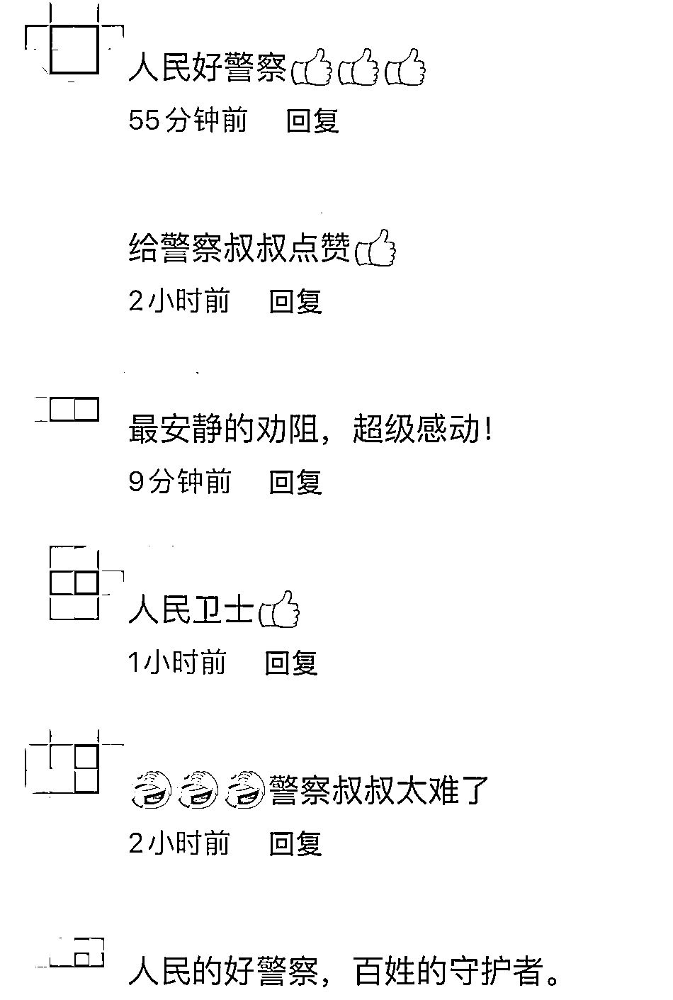

# 为保住 50 多万元，民警足足写了 12 页纸！

> 原文：[`mp.weixin.qq.com/s?__biz=MzIyMDYwMTk0Mw==&mid=2247528135&idx=7&sn=181d5415430fc0a866abeafb5d330834&chksm=97cba5ffa0bc2ce958d841dc8ccbd8802f995a4facd43c78f474830380afbd7ba52d7bc6987a&scene=27#wechat_redirect`](http://mp.weixin.qq.com/s?__biz=MzIyMDYwMTk0Mw==&mid=2247528135&idx=7&sn=181d5415430fc0a866abeafb5d330834&chksm=97cba5ffa0bc2ce958d841dc8ccbd8802f995a4facd43c78f474830380afbd7ba52d7bc6987a&scene=27#wechat_redirect)

一对听障残疾夫妻背着 50 余万元现金

要汇给不认识的人

银行工作人员多次劝阻

但他们仍执意汇款

如何保住这笔巨款？

**日前，浙江宁波一派出所民警严建华**

**上演了一场教科书式的“无声劝阻**”****

[`v.qq.com/iframe/preview.html?width=500&height=375&auto=0&vid=b33195gihd9`](https://v.qq.com/iframe/preview.html?width=500&height=375&auto=0&vid=b33195gihd9)

△宁波晚报

听障残疾夫妻

疑似遭遇诈骗民警紧急“笔谈”

1 月 10 日下午 

宁波慈溪白沙路派出所接到银行来电

称一对听障残疾夫妇背着 50 余万元现金

要给一位陌生人汇款

疑似遭遇诈骗

接警后，民警严建华迅速赶往现场

**此时 50 万余元已经交到柜台**

**为了防止夫妻俩自行离开**

**工作人员既没有办理汇款**

**也没有将钱交还**

见到民警前来

在跟“收款方”视频通话的夫妻俩

挂了电话

丈夫赵某不断地用肢体语言向民警比划

一旁的妻子也一脸焦急

**“有纸笔吗？”**

因为无法用语言进行交流

严建华立即开始与夫妻俩“笔谈”

**经过文字交流**

**民警得知，夫妻俩偶然在网上**

**认识了一位会手语的“朋友”**

**对方称有高额收益的投资理财项目**

两人非常心动

在“朋友”的指导下

拿着 50 万余元现金来银行汇款

由“朋友”代为进行投资

查看相关聊天记录和资料后

严建华告知赵某所谓的“投资”有很多疑点

但此时两人仍对“朋友”深信不疑

执意要汇款

手写 12 页纸劝阻还不放心

他又加了微信二次劝导

由于对方是听障残疾人

严建华看在眼里急在心里

一边通过纸笔“劝说”

一边联系了专业手语老师前来劝阻

“正规的投资不会进行个人转账”

“先汇款后签协议

这样的投资安全根本无法保障”

为了彻底打消夫妻俩汇款的念头

严建华足足写了 12 页纸

在民警、银行工作人员和手语老师等人

近 1 个多小时的耐心劝说下

两人才决定不再汇款

回家前

夫妻两人向民警竖起大拇指

无声表达了对民警真心帮助的谢意

在劝阻过程中，严建华发现

赵某妻子的汇款意愿相对强烈

便加了她的微信

当晚他又在微信上开始了二次劝阻

**“天上不会掉馅饼，只会挖个坑给你跳”**

**“有空可以来所里找我**

**我带你去找律师问问靠不靠谱”**

严建华跟赵某妻子交流了很久

再次确认两人已经

打消了汇款的念头才放心

目前，案件正在进一步办理中

网友：这是最安静的劝阻！

看了这个安静的“交谈”画面

网友纷纷为民警点赞

**“最安静的劝阻，超级感动！”**

**“人民卫士”******

警方提醒 

**投资理财时一定要认准正规渠道**

**所谓的“稳赚不赔”“高额回报”**

**很有可能是不法分子事先布下的圈套**

**切勿轻信“网友”误导，盲目跟风**

来源：央视新闻微信公众号综合宁波晚报，浙江公安，中国青年网

← 向右滑动与灰产圈互动交流 →

