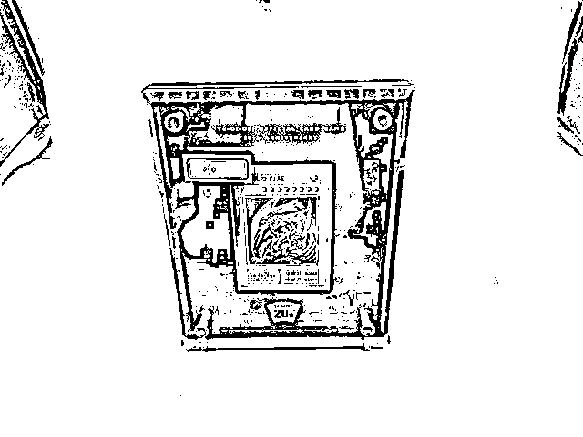

# 炒到 8700 万元的"青眼白龙"，背后主人公曝光

> 原文：[`mp.weixin.qq.com/s?__biz=MzIyMDYwMTk0Mw==&mid=2247528189&idx=2&sn=47a53a397988583499190ddb78d9ffea&chksm=97cba5c5a0bc2cd3f3b71ae63c309f5b6ee3faa8aaab5add30da5b4300d63563222ffc7f7590&scene=27#wechat_redirect`](http://mp.weixin.qq.com/s?__biz=MzIyMDYwMTk0Mw==&mid=2247528189&idx=2&sn=47a53a397988583499190ddb78d9ffea&chksm=97cba5c5a0bc2cd3f3b71ae63c309f5b6ee3faa8aaab5add30da5b4300d63563222ffc7f7590&scene=27#wechat_redirect)

因为一张被炒到 8700 万余元的游戏卡，安徽滁州“95 后”张雨杰贪污案，在 2021 年 6 月受到全网关注（此前报道:[史上最贵游戏卡？起拍价 80 元，半小时超 8500 万！](http://mp.weixin.qq.com/s?__biz=MzIyMDYwMTk0Mw==&mid=2247516260&idx=2&sn=e57b55447e6251acf7b6ef10f628bf81&chksm=97cb4b5ca0bcc24a6b17e6231951e183b771d21b8a01dcb112134f71289d539aef117352f81e&scene=21#wechat_redirect)）。

年纪轻轻的他，如何侵吞近 7000 万公款？花在了哪些地方，监督缘何失灵？

19 日晚，中央纪委国家监委宣传部与中央广播电视总台联合摄制的电视专题片《零容忍》第五集《永远在路上》播出，详细披露了张雨杰案。

他在接受采访时忏悔：“恨自己，为什么抵不住诱惑，也都是我的过错，挺对不起的。”

起拍价 80 元，使用年限不明，没有说明书，连真伪都无法确定……但就是这样一张游戏卡，在司法拍卖平台上仅用 32 分钟，便被哄抬至 8732 万余元，不得不紧急中止竞拍。

人们不禁好奇：它的原主人是谁？背后有着怎样的故事？

张雨杰，1995 年 3 月生，安徽省滁州市不动产登记中心原工作人员。2019 年辞职，次年 2 月被抓，同年 11 月因侵吞公款 6993.25 万元，被滁州中院判处无期徒刑。

公开报道显示，2014 年 6 月，张雨杰与滁州市劳务合作中心签订聘用及劳动合同，后被派遣到滁州市房地产交易监理处（后更名为滁州市不动产登记中心）工作，主要负责办理存量房资金托管业务。

2016 年至 2019 年 4 月期间，他虚构信用卡需要套现的理由，通过与购房人和房产中介公司人员协商，让购房人将本应缴纳到滁州市某银行账户的托管资金转账到其个人和其女友的银行账户，或者让购房人直接将现金交给其本人。

经审计查明，张雨杰通过这种方式侵吞 399 户买房人缴纳的托管资金 6288.75 万元。此外，他还实施了两次侵吞行为，分别达 260 万元、390 万元。

这些钱被张雨杰用于消费挥霍和买房，几乎挥霍一空，以至于房产被查封时，家中只有一些金银饰品、手表、游戏手柄等，大部分财物都无法挽回……

张雨杰现身《永远在路上》，讲述了自己腐化堕落的心路历程。 

对于上述全球限量款“青眼白龙”游戏卡，张雨杰承认，是花了 5 万多赃款买的。

专题片披露，他之所以产生侵吞公款的念头，就和玩网游有关。2016 年的一天，一名买房人带着几万元现金来办理资金托管，由于按规定只能刷卡付款，张雨杰就先为他办理了手续，将现金存到自己卡里，打算第二天帮他刷卡支付。谁知当晚打游戏时，由于充值买装备，控制不住把这几万元全花光了。

让张雨杰欲罢不能的，是充值后完全不一样的游戏体验。在网游世界里，只要肯花钱，就能成为攻无不克、战无不胜的强者。靠不断充值买顶级装备，他登上了一款网游某赛区的排行榜榜首。

赃款更大的一部分，他基本花在了自己跟女朋友消费上面。他先后结交了三位女友，为她们购买各种奢侈品牌的服饰、手表、首饰，到各地旅游、一起体验各种奢华享受。海南一家酒店最贵的豪华海底套房 10 万元一晚，张雨杰和一名女友在这里就连住了四晚……

**以下为张雨杰案解说词——**

【解说词】2021 年 6 月，一场司法拍卖引爆网络热议。当时，安徽省滁州市中级人民法院拍卖一桩贪污案件的涉案财物，其中有一张“青眼白龙”游戏卡。它是一款网络游戏的纪念品，没有任何实际功能，但因为全球限量发行 500 张，市场价约十多万元。没想到开拍才半小时，竞价就被抬到了 8700 万元。虽然这只是网友抱着凑热闹心态胡乱出价的结果，无人真的买单，导致流拍，但这张游戏卡和它曾经的主人张雨杰，却由此吸引了社会高度关注。

张雨杰（安徽省滁州市不动产登记中心原工作人员）：赃款买的。当时我买的时候也是花了 5 万多，小时候就关注这个东西，算是当时童心的一个念想，就买回来了。

【解说词】张雨杰是安徽省滁州市不动产登记中心的一名工作人员，2020 年 3 月被留置。他的具体工作是在政务服务中心大厅窗口接待市民，收取买房托管资金、填写托管协议、开具银行存款凭证和资金托管凭证。经调查，他在 2016 年到 2019 年 3 年多时间里，采取收款不入账、伪造收款事实等方式，陆续侵吞公款竟达 6900 多万元。

方扬清（滁州市纪委监委工作人员）：他感觉到，今天我买了一身网络游戏装备，很潇洒地在那上面打了一个通关，我的人生价值就实现了，没有把工作、没有把为人民服务作为自己的理想。又把他放在一个轻而易举可以得到钱财的岗位上，不出问题那才怪。

【解说词】和传统腐败案件相比，这一案件的涉案财物显得很特别，有许多游戏装备。而他之所以产生侵吞公款的念头，就和玩网游有关。2016 年的一天，一名买房人带着几万元现金来办理资金托管，由于按规定只能刷卡付款，张雨杰就先为他办理了手续，将现金存到自己卡里，打算第二天帮他刷卡支付。谁知当晚打游戏时，由于充值买装备，控制不住把这几万元全花光了。

张雨杰（安徽省滁州市不动产登记中心原工作人员）：充着充着充着，充到卡显示余额不足了。刚开始是属于最害怕的一个时间，那我就慢慢攒一下，我先还，当时是这样想的。结果一直就没人发现，这个时候就开始觉得，我再弄一点儿，应该也没事儿，后面就是真的跟雪崩一样，根本停不下来。

【解说词】让张雨杰欲罢不能的，是充值后完全不一样的游戏体验。在网游世界里，只要肯花钱，就能成为攻无不克、战无不胜的强者。

张雨杰（安徽省滁州市不动产登记中心原工作人员）：一直以来没觉得自己比别人强过，自己比别人有能力或者厉害过，这个时候一旦出现了这么一个情绪之后，就发现这感觉让人上瘾，那是现实中体验不到的一个虚荣心以及攀比心。

【解说词】张雨杰靠不断充值买顶级装备，登上了一款网游某赛区的排行榜榜首，他沉醉于在虚拟世界里用金钱买到的成就感，继而发展到在现实世界里也用金钱来满足各种欲望。

张雨杰（安徽省滁州市不动产登记中心原工作人员）：一个就是玩游戏，这是一部分，更大的一部分，基本花在了自己跟女朋友消费上面。开始消费之后，我发现是控制不住自己这个消费欲望。后面那个金额你都还不上了，这个时候破罐子破摔的心态就又出来了，就觉得反正没被发现，那就先这样吧。

【解说词】调查发现，张雨杰贪污的近 7000 万元到案发时几乎挥霍一空，花在游戏上的还是少数，大多数用在了各种高端消费上。他先后结交了三位女友，为她们购买各种奢侈品牌的服饰、手表、首饰，到各地旅游、一起体验各种奢华享受。海南一家酒店最贵的豪华海底套房 10 万元一晚，张雨杰和一名女友在这里就连住了四晚。他自然不会告诉女友，钱到底是怎么来的。

张雨杰（安徽省滁州市不动产登记中心原工作人员）：就说我是从事房地产方面工作的，也不算说岔了，因为确实在做房地产方面的工作。

黄安明（滁州市纪委监委工作人员）：很长一段时间，你看他白天在滁州上班，其实住在上海，每天晚上下班之后从滁州坐高铁到上海，在上海租了一套房子，租金 3 万 8 一个月，早上再坐最早的一班高铁到滁州来，到单位上班。上海的繁华，让他就不考虑单位的这些事情了，也不考虑贪污的事情了。

【解说词】只要没钱花了，张雨杰就再次向公款伸手，三年中总计贪污公款四百多次。他并非没有想过有一天会暴露，但却无法自控。

张雨杰（安徽省滁州市不动产登记中心原工作人员）：心里面一直都是不安的，但是花钱的时候，那个欲望把不安给压住了。经常梦见自己坐在警车上，前面几个人盯着你，一醒来，发现没什么事儿，就继续用消费麻痹自己。

【解说词】在近年查处的公职人员违纪违法案件中，财务人员是易发高发人群之一。他们虽然级别不高，但经手大额资金，如果自身又受到享乐主义、拜金主义等不良思想影响，就容易抵挡不住诱惑，引发违纪违法行为。这个时候，单位的管理责任就显得至关重要，如果监督制约到位，没有可乘之机，也能避免或减少问题的发生。但遗憾的是，在张雨杰案件中，单位的监督管理却层层失守，暴露出多方面的问题。

方扬清（滁州市纪委监委工作人员）：暴露出来的相关人员失职、渎职的问题，确实令人触目惊心。如果有人给他拉一把，或者说有人发现过，“哎，小张你今天填的这个小票是怎么回事儿？”哪怕给他提一个醒，但是很遗憾这些都没有出现。

【解说词】经调查，滁州市从市房产交易主管部门，到不动产登记中心、交易管理科，都失职失责。按照滁州市 2011 年出台的相关制度，资金托管窗口必须岗位分设，一人收件、一人审核、一人办理凭证，相互监督，但不动产登记中心却从未按制度执行，从主要领导到科长，甚至没有一个人知道有这项制度。

周立凯（时任滁州市不动产登记中心主任受到留党察看二年、撤职处分）：我不知道这个制度，后期查的时候查到过，但是这个东西从来在中心里面、在单位里面没有执行过。

【解说词】资金托管机构的职能，是为二手房买卖双方提供一个中间的第三方资金托管平台，保障交易安全；买房人将房款交到资金托管机构，进入资金池，经审核交易手续完备，再从资金池放款到卖房人账户。收款、审核、办理凭证全是张雨杰一个人一条龙操作，给了他可乘之机，他的贪污手法其实极为简单。

方扬清（滁州市纪委监委工作人员）：张雨杰整个贪污手段，就是虚开凭证，这个钱实际上没有打到规定的二手房的池子里面，是打到他的账户上去了。

【解说词】由于滁州市每年二手房交易量不小，资金池里常年有进有出，张雨杰从中侵吞一部分，缺口不那么容易显现。但其实，只要将进账和出账认真比对，并不难发现问题。

张雨杰（安徽省滁州市不动产登记中心原工作人员）：这个漏洞说白了很好堵，只要你真的想对的话，基本上不用半个小时就对出来了。

【解说词】然而，不论是科室会计，还是各级负有管理职责的人员，都全无风险意识，麻痹大意，连基本的对账都没有认真做过。此外，按照制度，放款之前，全套资料必须经房产交易管理科的副科长、科长、不动产登记中心分管副主任三级审核、三级签字，但实际也变成了只签字不审核。

赵元（时任滁州市不动产登记中心交易管理科副科长 被判处有期徒刑三年 缓刑五年）：我们没有核对进账这一块，也就是形式上看一看。还是缺乏工作的责任心，那个时候我们确实也没怎么太多想。

方扬清（滁州市纪委监委工作人员）：不动产登记中心的副主任甚至主动讲，我不审，而且要求交易管理科的科长，你也不要审了，他认为这种审核没有意义，自己就把规定给否定掉了。就因为制度不执行，给张雨杰留了这么大一个空子钻。

【解说词】案发后，滁州市监委在调查中发现，资金托管账户财务管理极其混乱，大量原始资金凭证、会计资料都已丢失，历史账目极不健全。一个管理大量资金的部门竟然是这种情况，令人震惊。早在 2016 年 8 月，国家住建部、发改委等七部委就联合发文，要求各地主管部门对二手房资金的监管情况、监管制度要进行检查评估，滁州市主管部门却只是下发文件要求各单位自查。

范恒军（滁州市住房和城乡建设局局长 受到党内严重警告处分）：没有到下属单位检查评估，账目不健全，或者岗位分设的制度执行不到位，都没有及时发现，没有及时督促整改。如果按照要求去做，这个问题应该就暴露出来了，也不会造成这么大的问题。

【解说词】也正是因为看到了单位管理的极度缺失，张雨杰才敢一再铤而走险。2019 年，他打算结婚，便以女友名义购买了一套二手别墅，没交一分钱房款，利用职务之便虚开了一套资金托管手续，购房款就从资金池里支付了。随后，他就从单位辞职了，幻想或许能就此逍遥法外。他没有想到，人算不如天算，竟然是因为新冠疫情的暴发，使得他的行为迅速暴露了出来。

黄安明（滁州市纪委监委工作人员）：2020 年 3 月份，疫情最严重的时候，交易全部停止了，本来那个资金池是一边进一边出，疫情来的时候只出不进了，不停地出到最后，银行的账户没有钱了。

【解说词】资金池空了，却还有近 7000 万元待支付的资金缺口，经调查，很快就锁定了张雨杰。2020 年 11 月，张雨杰被判处无期徒刑。

张雨杰（安徽省滁州市不动产登记中心原工作人员）：联想一下自己，我信任别人，那么别人辜负我的时候，那种受伤感是什么样的，所以这个时候，我是意识到给老百姓以及给政府的形象带来了什么。恨自己，为什么抵不住诱惑，也都是我的过错，挺对不起的。

【解说词】而需要深刻反思的，绝不仅仅是他个人。被挥霍的巨额资金大部分难以追回，给国家造成巨大损失，调查认定，各级共 19 名党员领导干部、公职人员负有不同程度责任，都被追责问责，其中交易管理科科长、副科长更是已构成玩忽职守罪，被判处有期徒刑。

方扬清（滁州市纪委监委工作人员）：组织上付出了惨痛的代价，这个损失是非常巨大的，教训非常惨痛。

[`v.qq.com/iframe/preview.html?width=500&height=375&auto=0&vid=n33195p178h`](https://v.qq.com/iframe/preview.html?width=500&height=375&auto=0&vid=n33195p178h)

来源：中央纪委国家监委网站，观察者网

← 向右滑动与灰产圈互动交流 →

