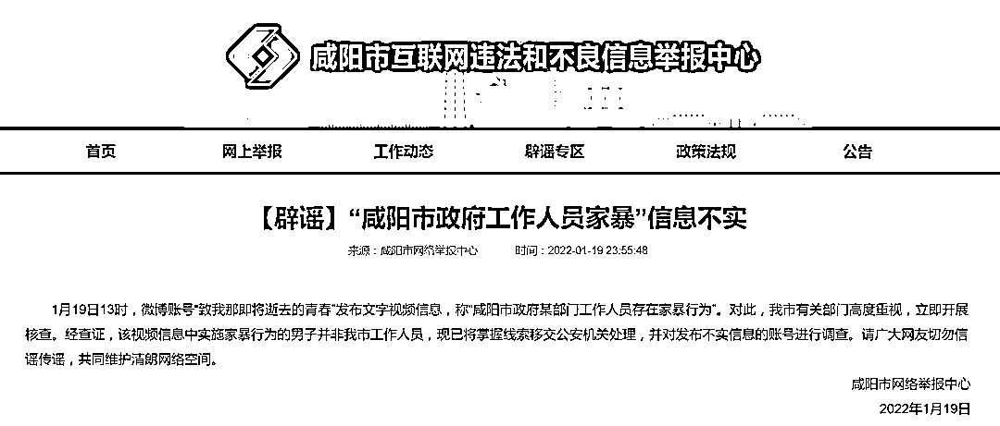
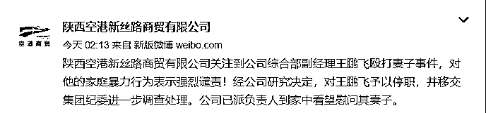
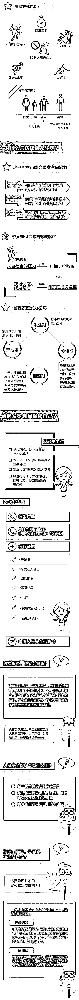

# “当着孩子的面家暴妻子”，最新通报！

> 原文：[`mp.weixin.qq.com/s?__biz=MzIyMDYwMTk0Mw==&mid=2247528189&idx=3&sn=b76a7eec258b33a9be9f77b1beae1b79&chksm=97cba5c5a0bc2cd3b4987965190c53fc37f561aeaf42dcf9971eb8e73c05406cc11b66e14b0b&scene=27#wechat_redirect`](http://mp.weixin.qq.com/s?__biz=MzIyMDYwMTk0Mw==&mid=2247528189&idx=3&sn=b76a7eec258b33a9be9f77b1beae1b79&chksm=97cba5c5a0bc2cd3b4987965190c53fc37f561aeaf42dcf9971eb8e73c05406cc11b66e14b0b&scene=27#wechat_redirect)

近日

一则男子家暴妻子的视频在网上引发热议

**↓↓↓**

[`v.qq.com/iframe/preview.html?width=500&height=375&auto=0&vid=t3319gw9oyw`](https://v.qq.com/iframe/preview.html?width=500&height=375&auto=0&vid=t3319gw9oyw)

视频显示 

男子当着一名幼童的面殴打女子

随后有一名红衣女子上前试图劝阻

但男子仍未收手

据网友称

该男子在咸阳市政府部门工作

1 月 19 日

咸阳市网络举报中心发布辟谣信息

**“咸阳市政府工作人员家暴”信息不实**

↓↓↓

▲ 来源：咸阳市网络举报中心。

1 月 19 日 13 时，微博账号“致我那即将逝去的青春”发布文字视频信息，称**“咸阳市政府某部门工作人员存在家暴行为”。** 

对此，我市有关部门高度重视，立即开展核查。**经查证，该视频信息中实施家暴行为的男子并非我市工作人员，现已将掌握线索移交公安机关处理，并对发布不实信息的账号进行调查。**

请广大网友切勿信谣传谣，共同维护清朗网络空间。

咸阳市网络举报中心
2022 年 1 月 19 日

# 1 月 20 日

# @陕西空港新丝路商贸有限公司 发布通报：

# **综合部副经理王某飞殴打妻子**

# **决定对其停职并移交纪委**

↓ ↓ ↓

### ▲ 来源：@陕西空港新丝路商贸有限公司

暴力披上“家”的外衣仍是暴力

对家暴勇敢说“不”！ 

↓↓↓

来源：长沙晚报、@陕西空港新丝路商贸有限公司、咸阳市网络举报中心、央视新闻

← 向右滑动与灰产圈互动交流 →

