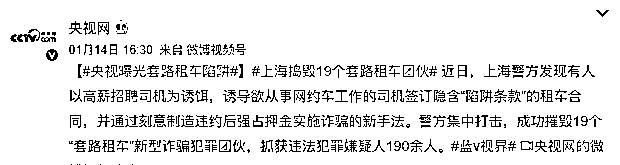
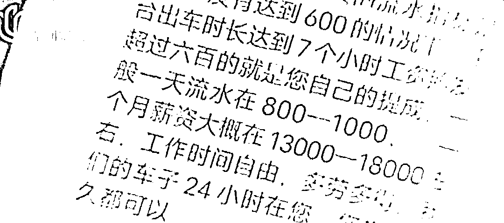
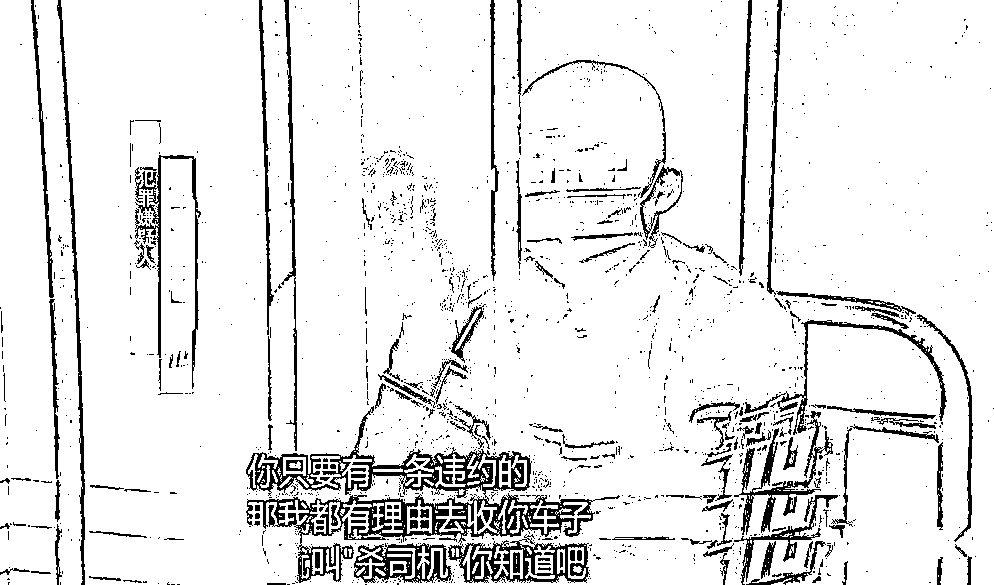
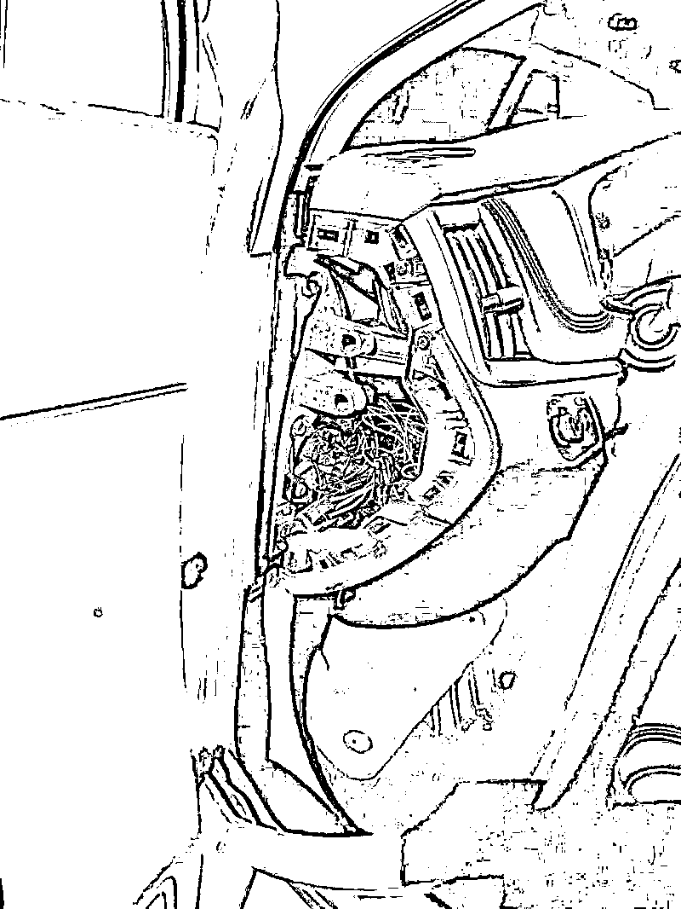
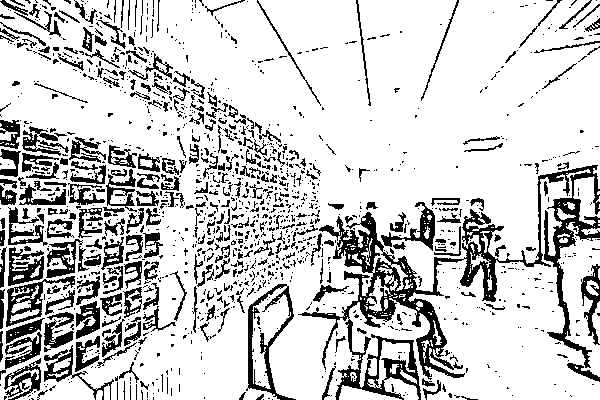
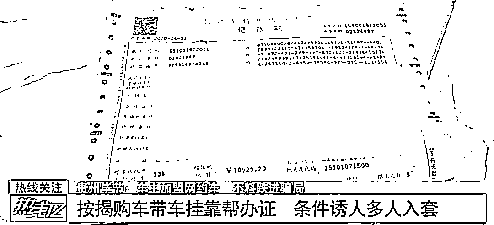
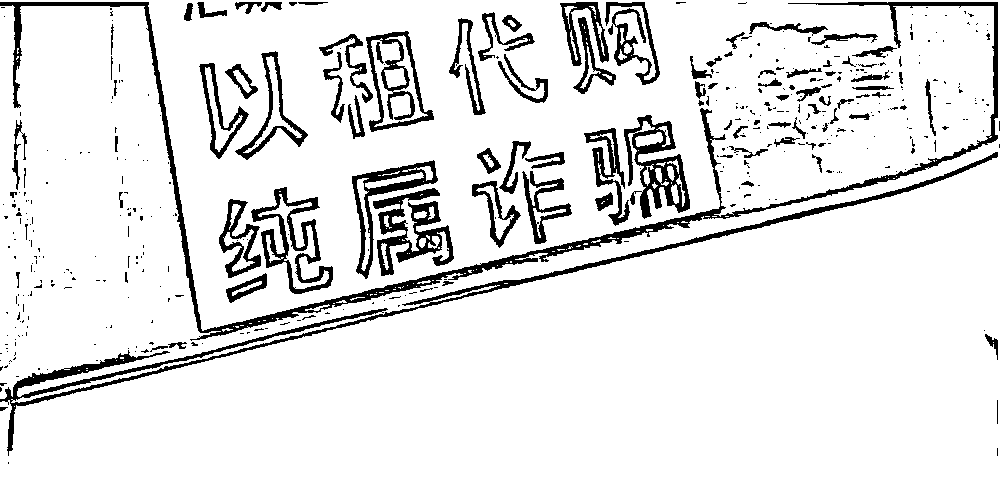
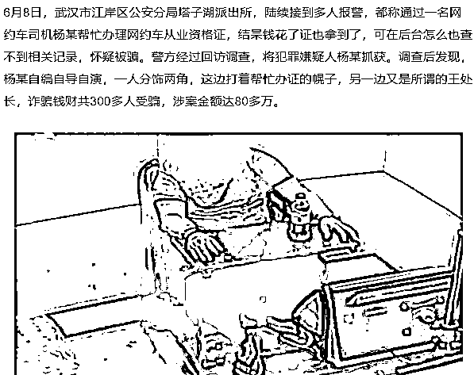

# 套路玩得飞起，新型“租车陷阱”疯狂敛财 1500 万

> 原文：[`mp.weixin.qq.com/s?__biz=MzIyMDYwMTk0Mw==&mid=2247528189&idx=4&sn=92136704a334748618aaa5bf944edafd&chksm=97cba5c5a0bc2cd31260ea9d705bf4434ce0796993cce3f78a5db99b0ce6362bd95537eded23&scene=27#wechat_redirect`](http://mp.weixin.qq.com/s?__biz=MzIyMDYwMTk0Mw==&mid=2247528189&idx=4&sn=92136704a334748618aaa5bf944edafd&chksm=97cba5c5a0bc2cd31260ea9d705bf4434ce0796993cce3f78a5db99b0ce6362bd95537eded23&scene=27#wechat_redirect)

网约车司机这行，是越来越邪门了。

近期，守哥看到这么一则新闻：

在上海，19 个犯罪团伙通过“套路租车”疯狂敛财 1500 余万元。

为了强制回收车辆，他们什么都做得出来：设置苛刻运营指标、刻意制造违约事故、故意提供故障车辆……

套路一环扣一环，只有你想不到，没有他们做不到。

**新型“套路租车”骗局**

**步步惊心**

虚假广告引流，签订“陷阱”合同

“每月底薪 8000+流水补贴 3000+提成，每天只需达到 600 元流水。”

诈骗分子通常通过在招聘网站、各类社交平台内发布高薪招聘的虚假广告，以吸引务工人员咨询面谈——这便是套路的开始。

*图源：东方 110* 

暂且不说薪资高得有点不正常，一天要达到 600 元流水是什么概念？

要知道，网约车市场早已饱和，出车接单，除了高峰期单量会多一些，平峰时段很久都等不来一单是十分正常的事。

一二线城市的老司机一天工作 12 小时，勉强才能达到 600 元的流水，如果运气差点，可能 300 元都不到。

**而这虚假的招聘广告就是专门针对新手司机的“大饼”。**

这些犯罪团伙抓着新手司机初出茅庐，不清楚市场行情，忽悠着一天工作 8 小时，流水能到 1000 元，不用担心达不到要求，如果有什么突发情况没达标的，“公司”也会帮忙补上。

市民小张就是被忽悠的其中一员，在“公司”业务员精心设置的面谈话术之下，没有完全了解合同内容的小张匆忙签约并缴纳 10000 元的押金。

小张签完合同工作两天才发现，工作 8 小时根本无法达到 600 元流水，工资也没有实时到账。

这时询问“公司”，却被倒打一耙，以他违反了合同中“一天内平台流水要超过 600 元”的条款为由，威胁如果不自行补上，就会强行收回车辆、不退押金。

犯罪团伙把这称为**“杀”司机****。**

通过业务员的口头承诺福利，忽悠新手司机签订难以达到要求的租赁合同，再借助不合理条款强行回收车辆、吞掉押金，再将车辆借给其他司机以此牟利。

*图源：东方 110*

勤奋的小张没有就此屈服，他把不达标的流水先自己补上，每天工作 15 个小时，靠着年轻力壮、精力旺盛，硬生生地将流水拉到了每天 600 元，小张天真地想着只要撑过合同规定的一个月，押金就能顺利拿回来。

**可事情远没想象的这么简单。**

几天之后，小张在司机群里陆续看到有人反映车开着开着突然无法行驶了，“公司”反馈要回收修理且不退租金和押金……

刻意制造违约，强行占取押金

小张发现，每天晚上停车回家休息时，总有人鬼鬼祟祟地靠近车，看到周围有人就又离开了。

在这之后，小张怕车子出了什么差错，索性就直接睡在了车里。

某一天小张出车后发现有一辆白色轿车始终尾随，在他找个地方刚停下时，剧烈的冲击突然从后面袭来——白色轿车撞了过来。

还没等小张反应过来，“公司”就立马就打电话过来，以维修为理由要对车子进行维修，并且因违反了合同内容，将不退还押金。

千防万防的小张怎么也想不到，**“公司”会派人主动开车撞自己，强行对车子进行回收。**

路上的**“巨坑”**不止于此。

除此之外，有的犯罪团伙在车辆租出去之前，就会事先在车内安装**远程断油断电的操控软件和定位系统**，通过断油断电让司机主动报修。

有的还会直接在晚上偷偷开走，谎称车辆故障需要维修。

更有甚者，利用司机验车时没有仔细检查的疏忽，事先制造划痕，在收车时要求司机以一个面 500 元的价格对其进行赔偿，并以此为由骗取押金。

**回收速度能有多快？**

犯罪嫌疑人透露：**平均七天回收一辆车子，最快一天就能进行回收。**

从高薪招聘为诱饵——签订“陷阱”合约——刻意制造违约——到快速回收，强行占取押金，一环紧扣一环，让人猝不及防。

这**“杀”司机**的套路，完全就不把司机当人。

针对这类新型诈骗手法，上海警方重拳出击。截至目前，陆续摧毁了 19 个“套路租车”诈骗团伙，抓获违法犯罪嫌疑人 190 余人，缴获涉案金额达 1500 万元。

这类骗局之所以能如此猖狂**，一方面是诈骗分子使用隐蔽性颇高的套路手法，另一方面是****新手司机被高薪招聘所诱惑，没有仔细辨别盲目轻信，最终往往只能吃着哑巴亏，自认倒霉。**

**套路无止境**

**勿贪便宜才是真**

除了套路租车，当网约车司机还可能遇到虚假招聘、加盟网约车、以租代购……这其中的浑水，远比你想象得深。

**加盟网约车**

按揭购车、带车挂靠。这类骗局以高分红的诱惑引诱你加盟，若是自带车子并且满足条件，只需缴交带车挂靠的保证；若是无车或车子不符合条件，诈骗分子则会建议你通过内部优惠价按揭购买他们的新车，一旦钱打过去，骗子就玩起了消失。

**以租代购**

应聘网约车司机时，业务员经常会忽悠办理以租代购，只要跑个三年，车就归个人所有了，既能赚钱，还能赚车，可真正开始工作时，才发现这根本就是个无底洞，三年是很难成功抵扣出一辆车的，而且三年之期未满，公司就先跑路了。

**代办从业资格证**

通常骗子会谎称自己有关系，可以走内部渠道，只要交纳数百元，就能顺利办理网约车从业资格证，无论是否满足从业资格证的条件。等买家上勾后，骗子就会利用修图软件进行证件伪造，即使被发现了，骗子也早以没了踪影。

**不贪便宜不上当，上当只因贪便宜。**

不论是套路拉满的租车诈骗，还是普通的诈骗跑路，不法分子自然恶行难恕。这其中，受害者被眼前的“大饼”蒙蔽双眼，失去了理性判断，是留给我们要警醒的地方。

1

**友情提醒：**

1、主动了解相关行业的从业要求以及市场情况，到**有资质的正规公司或平台应聘签约**，公司或平台的资质可通过相关行政主管部门的公开渠道进行查询。如果行业需要证书，请到官方网站进行报名考取。

2、提高防范意识，在签订租赁合同，交付租金、押金时，**仔细阅读、全面理解条款内容**，尤其是一些附带条件、涉及押金或违约金的条款，要格外留意，切实保护自身合法权益。

3、注意要当面领车，第一时间检查所驾车辆的车况、外观、行驶证记载事项等，并与相关人员核对车损位置，**事先拍照、录像保存**相关证据，驾车时遵守交通法规和运营规范。

4、如果认为自身利益遭到不法侵害，请第一时间记录**保存相关证据**，及时拨打 110 或报警求助。如果在 QQ/微信平台上遇到诈骗信息，及时前往腾讯卫士小程序举报。

任何时刻都要记住，**天下没有免费的午餐。**

那些所谓低付出，高收入的工作，撕开它们的面具你就会发现，它是一个“点金成石的老妖”，**把你的梦想“刷拉”一下翻转成一张套路的合同，让你陷入难以逃出的陷阱。**

← 向右滑动与灰产圈互动交流 →

