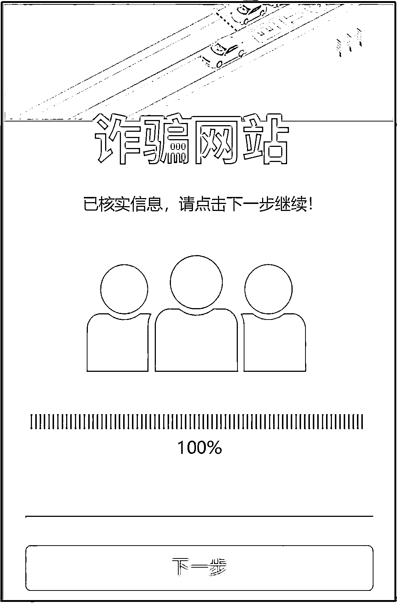

# @车主 留心回家路上的 ETC 诈骗！

> 原文：[`mp.weixin.qq.com/s?__biz=MzIyMDYwMTk0Mw==&mid=2247528189&idx=5&sn=76959acb5617ccaea50046ec3948ec65&chksm=97cba5c5a0bc2cd32c479bdb47bc0fc79f2f74ea452ffeb6bf3371b671ee99970287535d8ea8&scene=27#wechat_redirect`](http://mp.weixin.qq.com/s?__biz=MzIyMDYwMTk0Mw==&mid=2247528189&idx=5&sn=76959acb5617ccaea50046ec3948ec65&chksm=97cba5c5a0bc2cd32c479bdb47bc0fc79f2f74ea452ffeb6bf3371b671ee99970287535d8ea8&scene=27#wechat_redirect)

临近年关 

**这个专门针对车主的诈骗也升级了！**

骗子所冒充的对象

不再是之前的**“高速 ETC”**

而是改为**“交管 12123”**

使得骗术更加具有**“权威性”**

令受害人的**“服从性”**更强

****

看起来是“交管 12123” 

发来的善意提醒

实际却隐藏着陷阱

诈骗手法

受害人手机收到虚假短信提示自己的 ETC 异常，里面附带了一个“网站链接”，点击进入之后，填写个人信息，包括银行卡信息，最终导致被骗……

看到这里，你是不是觉得

**这么简单的骗术怎么能骗到人呢？**

不急，让我们从受害人角度出发 

再来看一遍

**“钓鱼”短信的关键内容有三个：**

**1.ETC 异常；**

**2.务必立即操作；**

**3.否则永久禁用。**

一般人在看到“永久禁用”这几个字眼后会产生焦虑情绪，特别是新骗局中还加入了“截止日期”，从而加剧了紧迫性。

如果你点击短信中的“钓鱼链接”，将会进入如下页面：

虽然这个页面乍一看挺“官方”，但假的毕竟是假的，经不起细推敲。

“钓鱼”网站页面虽标明“进度查询”“设备激活”“网点查询”等功能，还提供申请办卡、办卡进度、查询余额、查询账单等，但你注意了！这些都是**图片**、**图片**、**图片！**页面只有中间“ETC 认证”可以点！

**【请注意！！！】**

****

**骗子为什么不做得更逼真点，把戏做全套呢？**

其实，他们就是想通过故意露出破绽来**过滤掉一部分细心的“客户”**，这样他们就能找到那些更容易上当的人，从而提高诈骗成功的概率。

**当你点击进入下一页面时，便开始收集你的个人信息了……**

**【重点来了！！！】**

这里要求填写**银行卡密码**。银行卡密码（取款密码）是账户安全的最后防线之一，在没有确认是自己的**转账操作**、**对方账户**、**转账金额**这三个关键要素之前，**不可以在任何途径泄露**。

当你提交信息时，页面会提示你“正在认证”，下方还有个进度条。

假如刚刚填写的是真实的个人资料，那么当你在等待验证时，骗子已经在**登录受害人的网上银行，做转账操作的准备了。**

随后，页面会跳转成如下：

此时，骗子刚刚通过银行网站向受害人发送了**转账操作所需要的验证码**。

**【请注意！！！】**

看仔细了，你收到的验证码并不是所谓的“ETC 认证”，而是你的银行发来的**转账验证码**，而此时，“钓鱼”网站页面正好就是输入验证码，骗子就是这样进行诈骗的。

就这样，你账户里的第一笔钱被转走了。这就完了？当然不是，你接下来会看到的页面是：**验证码错误（超时），****请重新输入新的验证码！**这是骗子开启了另一笔、又一笔、还一笔新的转账……

**真正的交管 12123 短信服务信息**

**真实的短信号码****为****“12123+2 位省份数字代码+2 位地市顺序码”**

▲公安部交通安全综合服务管理平台官网

**警方提示**

短信链接可能含有木马病毒，会自动获取手机最高权限，从而盗刷微信、支付宝等第三方软件中绑定的银行卡内资金，请勿轻信。

若短信中含有链接，请认准官方信息，**千万不要随意点击**。也不要拨打短信中的陌生电话，以防受骗。 

来源：阻击诈骗

← 向右滑动与灰产圈互动交流 →

