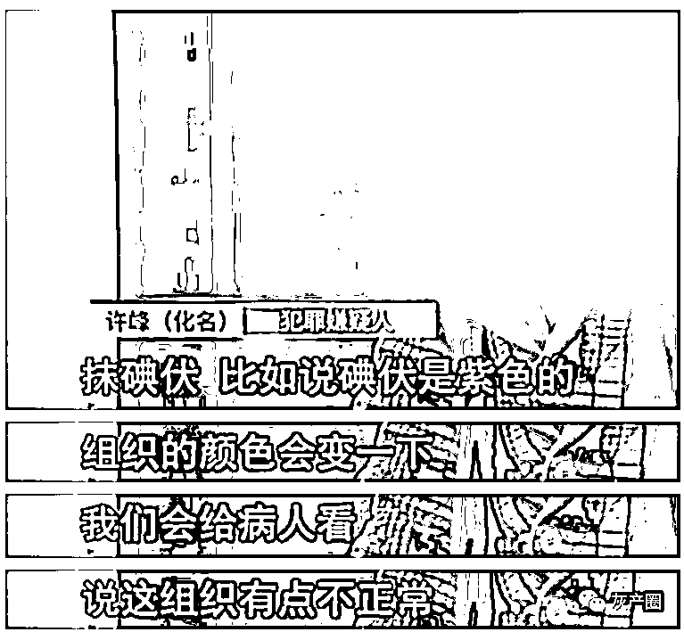

# 深扒男性身体的秘密：一刀下去，做回真男人？

> 原文：[`mp.weixin.qq.com/s?__biz=MzIyMDYwMTk0Mw==&mid=2247528264&idx=1&sn=bd5698b866a4c803ffafe3f7500ef19a&chksm=97cba470a0bc2d6675dc5c419b5994628792199a0b5b059d63a2f681289591a02035c5439f0f&scene=27#wechat_redirect`](http://mp.weixin.qq.com/s?__biz=MzIyMDYwMTk0Mw==&mid=2247528264&idx=1&sn=bd5698b866a4c803ffafe3f7500ef19a&chksm=97cba470a0bc2d6675dc5c419b5994628792199a0b5b059d63a2f681289591a02035c5439f0f&scene=27#wechat_redirect)

离谱操作天天有，惊呆大伙还看他↓↓

前不久，哈尔滨 22 岁男子小王因下体瘙痒，通过网络问诊后便前往当地某私立医院进一步检查。当天，医生诊断出小王包皮过长、阴虱、前列腺炎等病症，表示需要立即治疗。

谁知做完包皮手术后，医生突然告诉小王：需要通过“博尔肽生物透融”进行排毒，该疗法 1 小时收费 1.86 万元，如果不及时排毒可能会导致无法生育，而这**一套“排毒”手术下来，小王花了 7 万元**……

付款回家之后，小王看着自己隐隐作痛的私密部位，这才意识到自己可能遭遇了医疗诈骗。

这着实刷新了守哥的认知，原本小伙只是想割个包皮，撑死几千块的小手术，最后却花费了十几倍的高价。

怪不得关于男性割包皮这件事，一直以来都是骗子的“宝地福音”。线上线下随处可见的男科医院小广告，仿佛在告诉你：

没有割过的人生是不完整的。

只是这其中的套路实在太多，**一旦走进医院，想不花钱就离开几乎不可能**。

**揭秘男科医院的圈钱套路**

先给大家看一段法院审判结果：

> 2021 年 12 月 10 日，兴庆区人民法院依法通过远程视频庭审，对被告人林新荣诈骗、故意伤害、敲诈勒索恶势力犯罪集团一案一审公开宣判。判决被告人林新荣犯诈骗罪、敲诈勒索罪、故意伤害罪，决定执行有期徒刑 14 年 6 个月，并处罚金人民币 211.5 万元，剥夺政治权利 5 年；同时判令禁止被告人林新荣自刑罚执行完毕之日起 5 年内从事与医疗行业相关的职业。

可能很少有人知道林新荣这个名字，但他犯下的罪行却是难以饶恕。以林新荣为首的银川欧亚男健医院，开业不到四年，**以非法手段敛财上亿元，诈骗被害人 348 人共计 658.63 万元**。

也就是说，进了这个医院接受治疗的受害者，哪怕只是小病小痛，人均被骗近 2 万元。

那么，这个医院究竟使了什么手段，圈钱无数呢？

美女医托获客

首先，医托利用美女头像获客。

该医院的工作人员，人人都会配一个工作机，他们上传美女照片作为头像，以医院医生或者护士的名义，添加附近男士的社交账号聊天，并怂恿受害者到医院就诊。

这些人内部都有相关的话术，比如你只是一个普通的包皮过长，他们便会往很严重的生理疾病引导，**在你还没有进医院之前，就已经被洗脑：自己生了大病**。

事情进行到这里，医托们的任务就算完成了。

图源：今日说法

虚假病情、伪造检查

接下来，医疗部“粉墨登场”。

当受害者走进医院，不管咨询什么病症，医生都会推荐先做一个“有创检查”看看情况。

所谓的“有创检查”，就是把身体相应部位切开一条口子进行检查，但这个检查并不是真的检查。只是为了方便医生诱骗患者，做更大的手术，花更多的钱。

若受害者不愿意做该项检查，医生便会在私密部位抹碘伏，利用碘伏本身的颜色和皮肤产生反应。皮肤变色后，医生便借口说这是组织不正常。

图源：今日说法

除此之外，医院的检验科也能造假。

检验科往往会根据医生的要求和拟好的模板，制作结果为“异常”的检验单。只有出具假的检验报告，才能让受害者相信，自己真的患上了某种疾病，进而增加手术项目。

提刀加价、威胁患者

进展到这一步，无良医院成功让受害者觉得自己“身负重病”，一个没治好就会影响一生的幸福。

**而一旦受害者乖乖交钱躺上手术台，就会成为刀板上的鱼肉。**

“你的手术部位长满了囊肿，需要立刻切除。”

“刚刚给你的精子做了测验，活跃度低，属于不孕不育，需要辅助仪器治疗，100 块 1 分钟。”

“患者突然大出血，家属先去交钱。”

“转院可以，路上发生的一切后果，医院概不负责。”

图源：今日说法

当受害者进入手术室后，医生往往在现场通过夸大病症甚至制造虚假病情，诱导受害者再次缴费进行手术。

受害者看着自己还在出血的身体，除了乖乖照做，别无他法。

这也是医疗诈骗中最核心的暴利手段——**提刀加价**。

套路不断，全面开发病患

即使花高价顺利做完手术，等待受害者的依旧还是套路。

黑心医院为了让受害者能够前来复诊，护士会特意将伤口包扎松一点，导致伤口水肿，让病人再接着来医院换药、输液。

只要受害者来复查、复诊，医院就有办法让其继续消费。

图源：今日说法

这个黑心医院，**从检查到手术、从治疗到护理，各个环节互相串通配合，利用虚构病情、病症、诊疗效果等方式**，逼迫受害者接受新增的手术和治疗。

身体有没有治好还不知道，口袋里的钱包是真的芭比 Q 了。

**自助割包皮，男科智商税**

看到这里，有的兄弟也许会想：

男科医院套路这么多，一不小心就被骗个精光，那我自己在家操作呢？

毕竟现在网购条件便利，随便一搜索，各式各样的自助割包皮神器比比皆是。

**操作简单、无感无痛、安全不出血、天天能上班……**

好家伙，每一句都狠狠戳中了男性的痛点。

再看价格，几十几百还包邮，购买后又有专业医生指导操作，让不少兄弟直迷糊，以为割包皮像剪头发一样简单轻松。        

实际呢？

**因为自己在家操作割包皮，导致伤口感染的大有人在。**

前段时间，江苏常州二院阳湖院区泌尿外科救治了一位特殊的患者小陈。

原来小陈听信网上宣传，花几十块钱网购工具，准备在家自行割包皮。毕竟网购链接上不仅有文字讲述，也有视频讲解，看起来还挺靠谱的样子。

谁知结果和宣传上描红加粗的“无痛”完全不一样，小陈一刀下去，切口大量出血，剧痛难忍。眼见局面难以收拾，他慌得手忙脚乱来了医院。经过医生及时救治，才终于保住了“命根”。

唉，网络情缘一线牵都不靠谱，更何况是外科手术呢？

自己看着视频教程自助割包皮的结果，很可能是把握不好尺度：

切少了，还是太长；切多了，从包皮过长变成过短，直接影响夫妻的生活质量。

如今市面上的自助割包皮广告，几乎都与 X 福、男人的雄风、造福子孙后代等等扯上关系，并冠以简单操作，永无后患的概念。

**可说白了，就是浮夸且充满虚假好评的男科智商税。**

你以为男人毕其一生，终须一割。

实际上却是自我了断，失不再来。

**你以为割包皮** 

**其实是割“韭菜”**

是什么让这些人甘愿铤而走险，也要干这行当呢？

**答案当然是丰厚的利润。**

公立医院的收费标准，需要经物价局审批，但民营医院只需简单的报备和公示，便可以为自己的服务自主定价，一些男科医院便以此通过“治疗”大肆牟利。

据警方调查，不法分子林新荣带领的医院工作人员**平均月薪在 7 万元以上**。医院里一个连医师资格证都没有的假医生，最高一个月能拿 20 万元提成。

图源：今日说法

另一边，所谓的自助割包皮神器，由成本极低的环切器、小剪刀、消毒液组成。几十几百的定价看着不贵，但商家依然利润翻倍，赚得盆满钵满。

可利益之下，却不需要为此负责。普通人不具备无菌意识，无法在家中做到严格的无菌操作，术后很容易发生感染现象。一旦发生意外，商家便推脱是你操作不当，避免承担风险。

**你以为割的是包皮，其实是你这颗“韭菜”****。** 

守哥真心希望大家，能意识到这件事的严重性。比起面子，对自己的身体好一点才是最实在的。私密部位感到不适，切勿被专科医院的小广告诱惑，更不要以为自己动动手就能解决，第一时间前往正规的公立医院就诊，才是最靠谱的做法。

若是不幸遇到医疗诈骗，在保证自身安全的情况下应及时报警维权。

总而言之，男人不是壁虎，没有重生的尾巴。

**寻医问诊的同时，更要防范诈骗和套路。**

← 向右滑动与灰产圈互动交流 →

