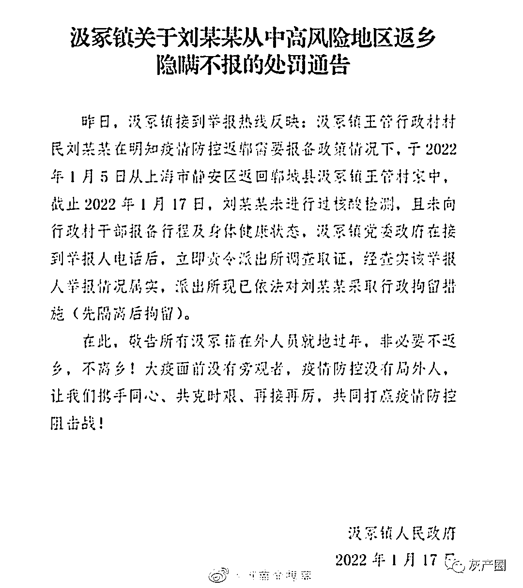
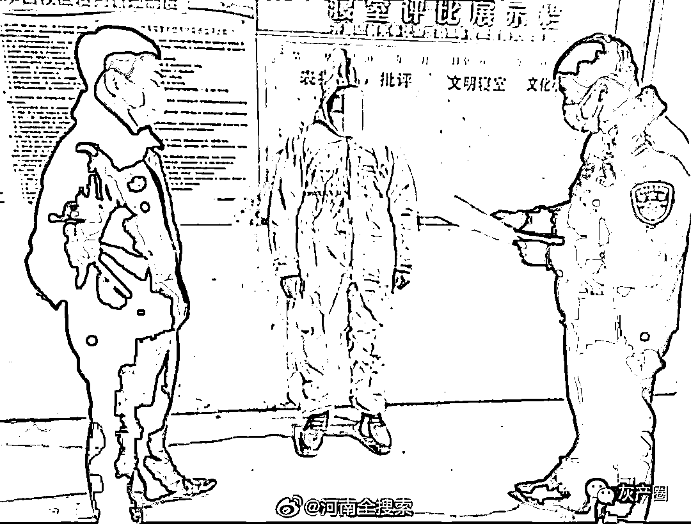
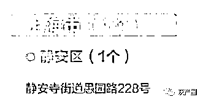
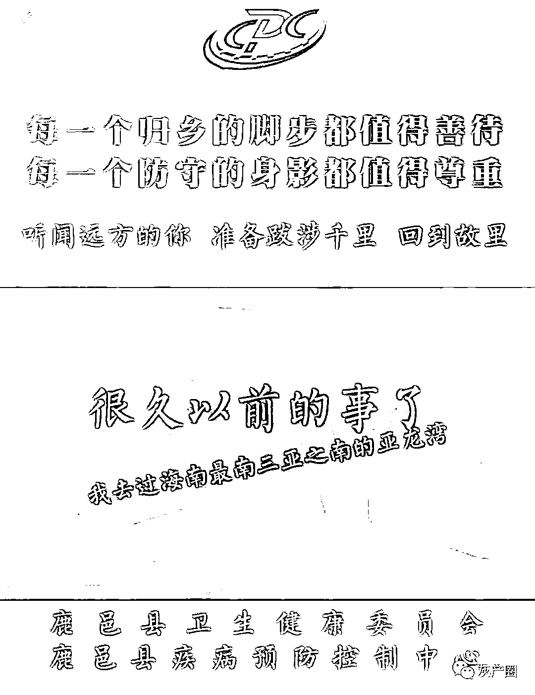
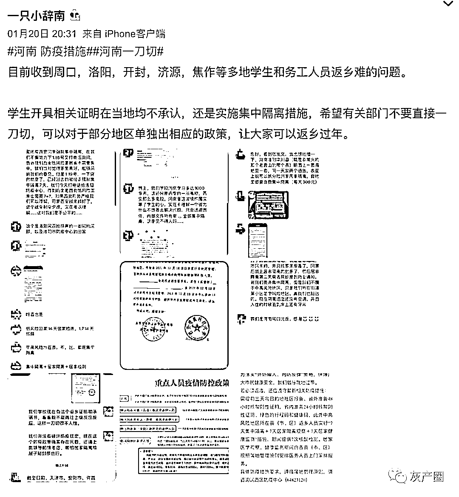
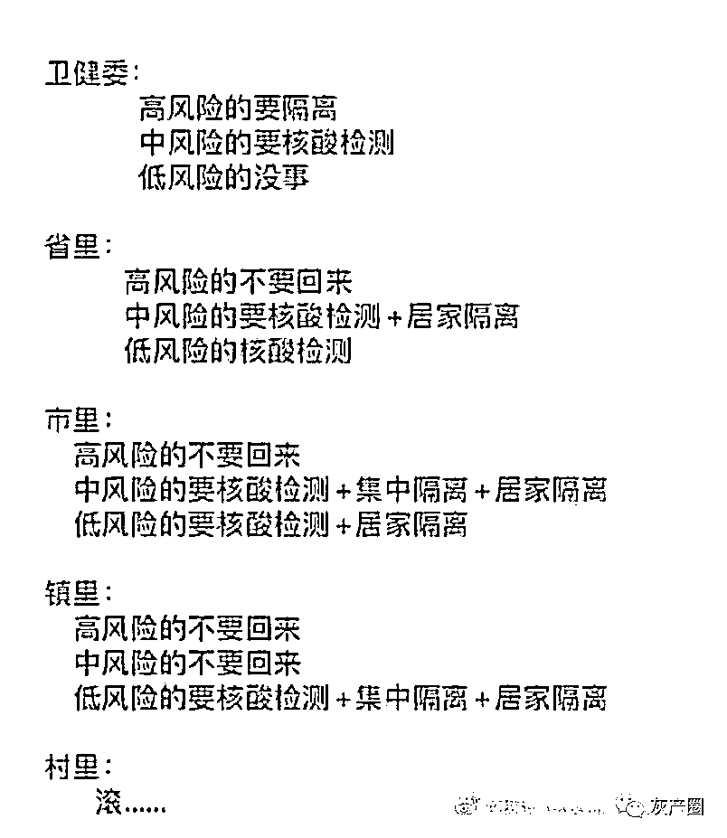
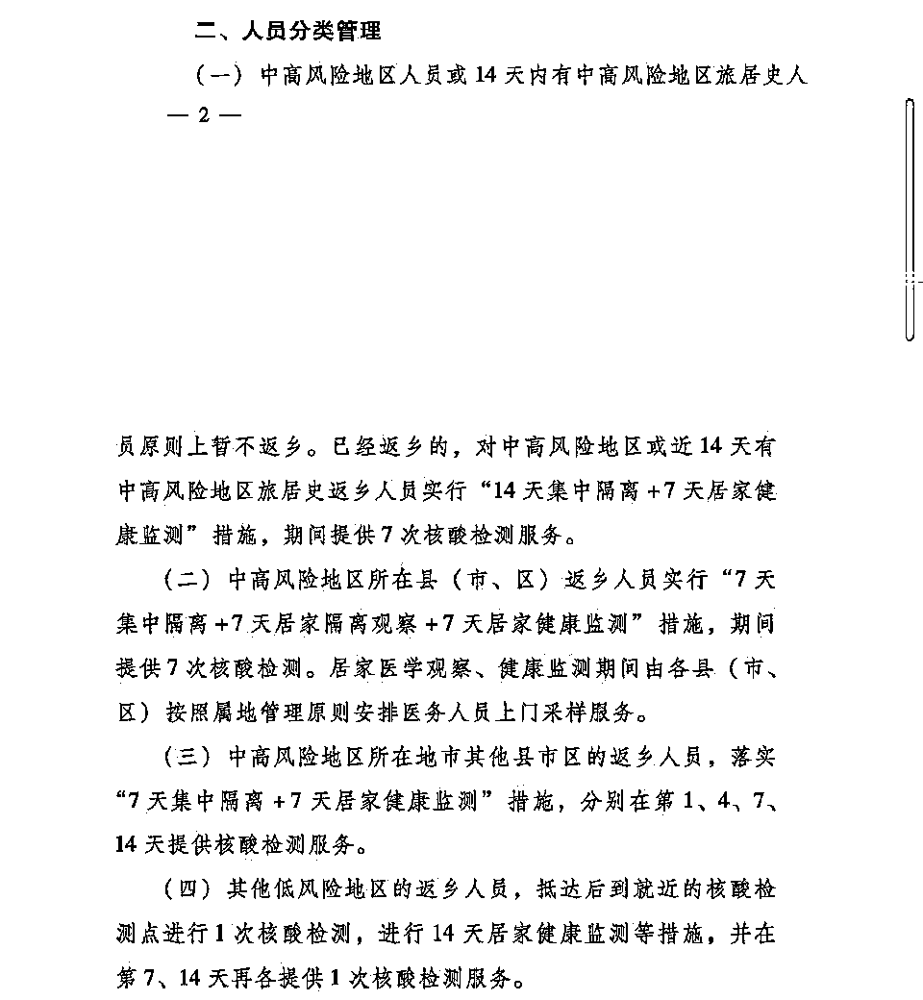

# 河南防疫太严了！县长“恶意返乡先隔离再拘留”言论惹争议，回家过年难！

> 原文：[`mp.weixin.qq.com/s?__biz=MzIyMDYwMTk0Mw==&mid=2247528264&idx=2&sn=6b0f3370dcbb6eec68c6c40d708e22bc&chksm=97cba470a0bc2d66b6c33117895d6b89a1971a4f1c2c267e3cbcb9a48ebd2812043553c892cb&scene=27#wechat_redirect`](http://mp.weixin.qq.com/s?__biz=MzIyMDYwMTk0Mw==&mid=2247528264&idx=2&sn=6b0f3370dcbb6eec68c6c40d708e22bc&chksm=97cba470a0bc2d66b6c33117895d6b89a1971a4f1c2c267e3cbcb9a48ebd2812043553c892cb&scene=27#wechat_redirect)

倡导就地过年和限制返乡过年，这其实都是疫情防控的需要。但这并不意味着这种限制可以层层加码，河南一地的防疫措施在微博上引起了大家的关注。 

20 日，一段关于河南省周口市郸城县县长董鸿的视频引发热议。视频显示，董鸿在会上说：“你只要返回，先隔离再拘留。” 

[`v.qq.com/iframe/preview.html?width=500&height=375&auto=0&vid=j3319vzdjrq`](https://v.qq.com/iframe/preview.html?width=500&height=375&auto=0&vid=j3319vzdjrq)

针对此事，董鸿回应网传视频经过剪辑，删掉了“不听劝阻，恶意返乡”等内容。他表示，在检查疫情防控工作时，听说有 6 人要从高风险地区回来，称“枪毙也要回来”。“我在前几天的会上说，凡是不遵守省市县疫情防控规定，不听劝阻，恶意返乡的，只要返回先隔离再拘留。说这个话的目的，是保证群众安全。”（人民资讯、上游新闻）

于此同时，当地的另一相关新闻也引起了热议 

周口郸城一男子从上海中高风险地区返乡隐瞒不报，被警方拘留。

而上海的中风险区只有那个奶茶店

周口郸城的董县长，轻描淡写吐出来的“恶意返乡”四个字，让人总觉得，这并非是故乡。紧随其后的“先隔离后拘留”六个字，更是刺痛了无数河南游子的心。

当地和附近地区很多学生和务工人员面临返乡难问题，多地存在对返乡人员开具的相关证明不承认问题，这反应相关部门沟通不到位，希望不要踢皮球。

国家卫健委：不允许各地对国家政策一刀切各地要根据实际情况做好疫情防控，要提供人性化、暖心的保障服务。

目前河南的防疫政策：

来源：微博那些事儿

← 向右滑动与灰产圈互动交流 →

