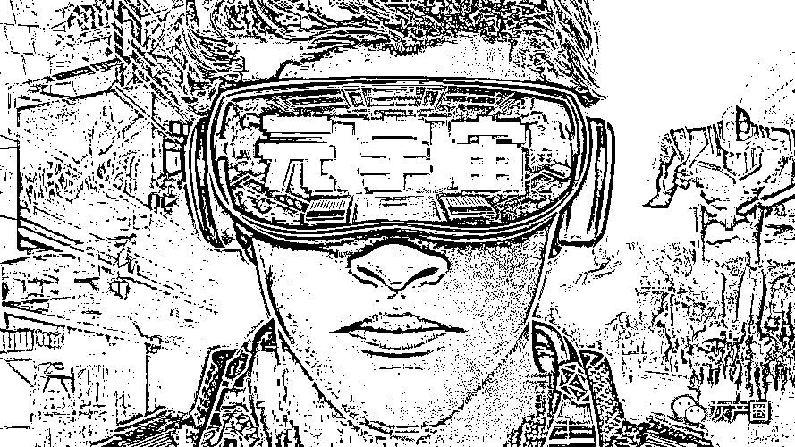

# “元宇宙是个筐，啥都能往里装”

> 原文：[`mp.weixin.qq.com/s?__biz=MzIyMDYwMTk0Mw==&mid=2247528264&idx=4&sn=2e7d4e1aa0b535b20077e82190aa919a&chksm=97cba470a0bc2d6616ff6c6a5ac2a1bd55bec0d13dc4be2b0a22ef59164a72efdbf00815e6df&scene=27#wechat_redirect`](http://mp.weixin.qq.com/s?__biz=MzIyMDYwMTk0Mw==&mid=2247528264&idx=4&sn=2e7d4e1aa0b535b20077e82190aa919a&chksm=97cba470a0bc2d6616ff6c6a5ac2a1bd55bec0d13dc4be2b0a22ef59164a72efdbf00815e6df&scene=27#wechat_redirect)

如果有人梳理时下热词，“元宇宙”绝对有一席之地。这个 1982 年诞生于科幻小说《雪崩》的概念，在 2021 年爆红，不仅引发了人们对未来虚拟世界的无限畅想，也在文娱游戏、科技产业、资本市场等领域掀起一波又一波高潮。

值得警惕的是，想象中的元宇宙还没来，各种打着元宇宙旗号的炒作、泡沫、骗局不请自来，“火”中取“利”催生出这一领域四大怪现象。 

1

****元宇宙是个筐，啥都能往里装****

**日前，某白酒企业要“构建属于酱香系列酒的醉美‘元宇宙’”引发热议。白酒跟元宇宙有啥关系？两个“八竿子打不着”的事物同框，让网友大呼魔幻。**

**新华每日电讯记者梳理发现，早在白酒之前，一批看似与元宇宙不相干的企业就已入局，例如知名连锁奶茶企业发行限量元宇宙 NFT 盲盒，家居橱柜企业成立元宇宙专项组，零售项目要构建元宇宙品牌和营销场景，城市景观设计论坛名为“元宇宙，园未来”，等等。**

**潮来时一哄而上，退潮后方知谁在裸泳。“商标申请等情况正是当前‘万物皆可元宇宙’的缩影，一些明显就是蹭概念的行为难以长久。”上海商标品牌协会副会长林海涵说，“就如同商标一样，光注册不使用没有任何意义。只有经过使用且为市场和消费者熟知才有价值。”**

**企查查数据显示，最近一年，我国企业申请“元宇宙”商标的数量超过 1 万件，涉及各行各业的公司 1500 多家。具体来看，科技文娱、企业服务类企业是申请主力，零售、汽车、教育、物联网、心理咨询企业紧随其后，除其中部分企业所处行业确实与元宇宙相关外，大多数企业“硬蹭”痕迹明显。**

**其中，申请元宇宙商标数量最多的是一家商贸公司，80%的商标都与元宇宙相关，涉及品类也五花八门，包括但不限于普拉达元宇宙、路易威登元宇宙、雷克萨斯元宇宙、肯德基元宇宙、饿了么元宇宙、十万个冷笑话元宇宙、海底捞元宇宙等。** 

**2**

******轻技术重想象，旧东西套新包装******

****“可能我们比较‘土’，别人都自称元宇宙了，我们还是虚拟现实。”一家顶级科技公司负责人道破元宇宙领域的新瓶装旧酒现象——技术没有革新，产品也没啥变化，只不过换个称呼。****

****记者注意到，有企业要打造“元宇宙的空间体验场景”，实际上就是文旅行业早已流行多年的 VR(虚拟现实)展馆、数字景区；有企业宣称布局元宇宙，主要动作只是开发虚拟偶像；还有企业提出了“企业元宇宙”解决方案，结果是开发生产可视化平台。****

****根据天眼查统计，有 30 余家公司直接用改名的方式套上新包装，经营范围依旧，公司名称却改成了“元宇宙科技”“元宇宙传媒”“元宇宙商贸”。****

****不仅如此，有地方为招商招出新意也主动给园区戴上“新帽子”。“企业还是那些企业，主要是跟 VR、游戏、人工智能等相关，原有的概念都旧了，换成元宇宙更有噱头。”一位政府部门工作人员说。****

****“与以往的科技概念相比，元宇宙明显更看重概念本身，而非诞生某种颠覆性新技术。”受访人士分析认为，一方面它需要虚拟现实、云计算、脑机接口、移动通信等大量基础技术升级迭代，需要用户体量和生态环境支撑，但另一方面不少参与主体并不看重技术，仅用想象和辞藻堆砌出五光十色的未来虚拟世界。****

****想象很容易，改名字很轻松，要实现却没有捷径。目前元宇宙整体发展处于初级阶段，主要原因就是其要用到的技术尚处于低级层次，唯有脚踏实地突破技术瓶颈，真正的元宇宙才有可能到来。****

****3****

********炒概念拉股价，沾边“元宇宙”就涨********

******有人说，“元宇宙”就像股市里的一团火，只要上市公司与之沾点关系，立马股价飙升。这些企业到底是目及长远的真布局，还是想赚快钱的资本游戏、概念炒作？不少业内人士也直呼“乱得很、看不清”。******

******做啥都要“沾一沾”，只为让股价“飞一飞”。例如，一家做艺术展陈的公司，从开始提“元宇宙”概念至今，短短几个月，企业股价翻了一番。近日，其更是凭借表态合作开发元宇宙虚拟建筑，股价连续 2 个交易日涨停。******

******记者注意到，一些上市公司收到了来自证券交易所的关注函，被要求说明“是否存在蹭‘元宇宙’热点概念的情形”，不少企业在回应中都用到了“尚在起步探索阶段”“尚未实现销售收入”等表述。值得关注的是，尽管证券交易所再三关注、企业也表态未来的“不确定性”，但股价依旧“坚挺”。******

******用概念博人眼球，恰恰是为了掩盖对自身的业绩恐慌。有的上市公司连发多份公告自曝经营风险，还有的连续五年净利润为负，只是因为他们搭上了元宇宙这趟车，就能股价上涨。这般不看公司业绩、只凭概念起飞的“操作”，让不少人直呼“离谱”。******

******受访专家表示，需要警惕打着“元宇宙”旗号的投资泡沫，金融投资若没有实体经济的支撑，很容易就成为空中楼阁，一旦泡沫戳破，只怕会一地鸡毛。****** 

******4******

**********卖课热炒币欢，上演花式“割韭菜”**********

 ******总时长约 2 小时的元宇宙课程卖出 360 余万元高价，出版几本元宇宙书籍就宣称能“把握元宇宙投资机会”“打开财富之门”，更有“空气币”“杀猪盘”等违法犯罪行为打着元宇宙旗号大搞黑灰产……记者调查发现，当人们还在思考元宇宙是什么时，一些骗子已经嗅到“商机”，开始想方设法挥舞镰刀“割韭菜”了。******

******“有个有趣的现象，当年打着区块链名义非法炒币的‘币圈’，纷纷把目光转向了‘元宇宙’。”上海市浦东改革与发展研究院金融航运研究室主任刘斌说。******

******据介绍，2021 年 9 月中国人民银行等多部门明确虚拟货币相关业务活动属于非法金融活动之后，“币圈”更新炒币套路，以元宇宙投资项目等名头组织路演、直播等营销活动，实则引诱受众购买游戏代币等多种形式的虚拟货币。******

******一个发稿中介向记者展示了付费推广的元宇宙虚拟货币项目，XX“是一个完全由社区拥有去中心化虚拟空间元宇宙+NFT 项目，区块链数字资产确权，通过双链审核币安+火币合约地址……”类似内容网上并不少见。******

******“虚拟货币有很多种类，每一种都有各自的风险，有的就是‘空气币’，没有任何信用基础，可以无限复制，等同于‘杀猪盘’。”华东政法大学金融监管与刑事治理研究中心主任毛玲玲解释说。******

******概念无褒贬，但鼓吹概念的人有动机。受访人士表示，手段千变万化，不变的是割韭菜的动机。一些投机者使出忽悠大法，鼓吹利用元宇宙能一夜暴富，其目的是利用人们的好奇心和对财富的渴望浑水摸鱼、“火”中取“利”。******

******来源：新京报，澎湃新闻******************

******← 向右滑动与灰产圈互动交流 →******

************