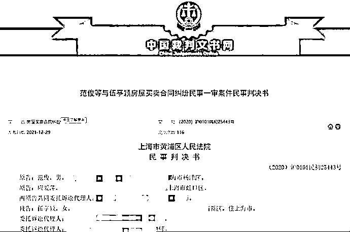

# 女子首付 745 万的房没了，还要赔近 500 万

> 原文：[`mp.weixin.qq.com/s?__biz=MzIyMDYwMTk0Mw==&mid=2247528264&idx=5&sn=c4464dc4d022851036f1ae4b5e64b3b7&chksm=97cba470a0bc2d663e8bf49e9af9aedb8632d5e718d9ca6777871a80ec029d89074b5c39fab7&scene=27#wechat_redirect`](http://mp.weixin.qq.com/s?__biz=MzIyMDYwMTk0Mw==&mid=2247528264&idx=5&sn=c4464dc4d022851036f1ae4b5e64b3b7&chksm=97cba470a0bc2d663e8bf49e9af9aedb8632d5e718d9ca6777871a80ec029d89074b5c39fab7&scene=27#wechat_redirect)

2020 年 5 月，在上海居住的伍亭颖计划花 1550 万元的总价，在黄浦区购买一套 180.09 平方米商业用房。没想到，在首付 745 万元之后，因银行贷款审批延误，无法按照合同规定时间付尾款的伍亭颖，被卖方告上法庭。

法院最终判决伍亭颖败诉，她不仅要退出房子，还要支付违约金、房屋整修费等总计 497.32 万元，被不少网友称为“最惨购房者”。

**很惨：**

**两次支付都逾期**

1 月 19 日，记者通过中国裁判文书网上的判决书，对本案的来龙去脉进行了梳理。

在判决书中可以看到，伍亭颖在 2020 年 5 月 17 日通过中介，和卖方范俊等达成房屋转让协议，伍亭颖先期支付了 100 万元定金和 400 万元购房款。

2020 年 5 月 30 日，伍亭颖和范俊等签订补充条款，约定房屋总价款为 1550 万元，卖方提前交房，伍亭颖需要在 2020 年 6 月 30 日之前完成首付 745 万元。

然而，伍亭颖未能按期补足首付余下的 245 万元，双方不得不在 7 月 2 日再次签订补充条款，这次约定了惩罚条款：从 2020 年 7 月 1 日起至付清之日止，以 245 万元为本金，按每日万分之 2.73 支付给利息损失。伍亭颖须在 2020 年 7 月 31 日前一次性支付上述费用。如未按期支付，则房屋买卖合同自动解除，伍亭颖应偿付违约金（合同总价的 20%），且赔偿范俊等原有的装修损失 180 万元。

这次协议后，伍亭颖在 7 月 13 日缴清了逾期付款的利息，并完成了 745 万的首付，剩余 745 万元尾款，将在 8 月 30 日过户前全部付清。

没想到，伍亭颖的购房尾款，因为银行审批延误再次逾期。

**实惨：**

**没了房子还要赔近 500 万**

2020 年 9 月 15 日，范俊等发出了律师函，告知伍亭颖收函 3 日内付清尾款，如仍然不付，他们有权解除合同，并要求赔偿违约金及装修损失等。9 月 30 日，由于伍亭颖仍未付款，范俊等要求伍亭颖搬离并归还房屋，并偿付房款总价 20%的违约金，房屋装修损失 180 万元等。

2020 年 10 月 29 日，伍亭颖在上海某银行申请的 745 万元贷款额度审批成功，要求继续履行合同，但此时卖方已经不愿出售，并将伍亭颖告上法庭。

2021 年 6 月 25 日，上海市黄浦区人民法院做出一审判决：伍亭颖的房屋转让协议被解除；必须在判决生效 10 日内搬离房屋，如逾期将按照 1000 元/天追加支付房屋占有使用费；伍亭颖要赔偿违约金 300 万元、房屋整修费 180 万元，承担案件受理费 4.6 万元。

一审之后伍亭颖和范俊等都进行了上诉，上海市第二中级人民法院在 2021 年 12 月 1 日驳回上诉、维持原判，伍亭颖将承担案件受理费 2.72 万元。

一审判决书截图

**律师：**

**判决解除合同不符合鼓励交易目的**

对于这起纠纷，重庆市律协刑民交叉专业委员会副主任、重庆海力律师事务所伍继军律师表示，本案的焦点在于：“卖方是否因买方的逾期付款行为享有合同单方解除权；买方因为银行办理贷款超期，是否足以导致买方合同根本性违约，从而导致双方合同解除。”

根据《民法典》第五百六十三条的法律规定，伍继军律师认为上海法院的判决合法但不合情：在无证据证明卖方存在实际损失的情况下，应实现合同法鼓励交易的制度目的，从而维护市场交易的稳定。从法律的公平角度，也可以不解除合同，让违约方承担违约责任，不建议卖方以此为由解除合同。“从我在重庆遇到的类似案件来看，基本都是要求继续履行合同。”伍律师说。

伍亭颖最终不仅失去了房屋，还要赔付违约金、房屋整修费等将近 500 万，被称为“最惨购房人”。伍继军律师坦言，这个结果对公众认知有一定冲击：“在卖方没有实际损失的情况下，直接判决解除合同，不符合鼓励交易的目的。希望大家在大宗商品交易过程中，尽量使每一个交易环节合法化，避免这种纠纷的发生。”

同时，伍继军律师还提到了一个细节：“从该案的两次审判过程来看，卖方律师对合同的签订、履行和争议都是全程参与，打下了很好的基础，是卖方胜诉的关键；相比而言，买方在答辩及举证时，未充分表达继续履行合同的必要性，这是值得反思的问题。”

来源：潇湘晨报，南风窗

← 向右滑动与灰产圈互动交流 →

