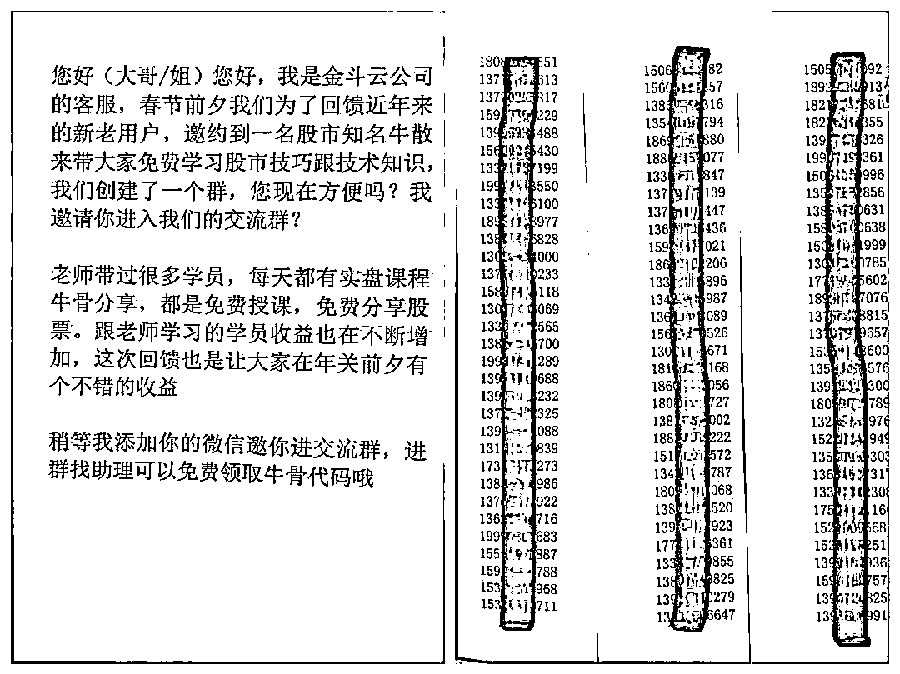

# 虚设“荐股群” “引流”搞诈骗 弋江警方再抓 22 人！

> 原文：[`mp.weixin.qq.com/s?__biz=MzIyMDYwMTk0Mw==&mid=2247528264&idx=6&sn=1e8d116adfeec3149595e13ec7e2edf0&chksm=97cba470a0bc2d668aca74015f5c8fafd535d57ffc9de8fea82f17439f4df76ebe3c1174d9b3&scene=27#wechat_redirect`](http://mp.weixin.qq.com/s?__biz=MzIyMDYwMTk0Mw==&mid=2247528264&idx=6&sn=1e8d116adfeec3149595e13ec7e2edf0&chksm=97cba470a0bc2d668aca74015f5c8fafd535d57ffc9de8fea82f17439f4df76ebe3c1174d9b3&scene=27#wechat_redirect)

## 

明知“吸粉引流”是帮

犯罪分子物色**被诈骗对象**

****某些人****

****为了一己私利****

****依然铤而走险****

****......****

********

****近日，弋江警方在市局相关业务部门的大力支持下，成功捣毁一个以孔某、汪某、徐某、李某等四人为首的“吸粉引流”团伙，抓获犯罪嫌疑人 22 名，扣押作案手机 30 余部、电脑一台以及话术本若干。****

********

******案件回顾******

****POLICE****

****************

 ****[`mp.weixin.qq.com/mp/readtemplate?t=pages/video_player_tmpl&action=mpvideo&auto=0&vid=wxv_2230838684352872453`](https://mp.weixin.qq.com/mp/readtemplate?t=pages/video_player_tmpl&action=mpvideo&auto=0&vid=wxv_2230838684352872453)**** 

****00:45****

****2021 年年底，马塘派出所社区民警在日常工作中发现辖区某写字楼 5 层疑似有人从事电信网络诈骗活动。分局高度重视，抽调精干警力组成专案组对该窝点进行清查，发现该写字楼内有 10 余名“话务员”在从事所谓的推荐股票业务。****

********

****经过 1 个多月的深入调查，公司负责人芜湖籍男子孔某浮出水面，其多次在镜湖区某商业广场“招兵买马”，带着公司“团队”20 余名成员打着”荐股“的幌子，实际从事为诈骗团伙进行”引流“的犯罪活动。****

********

****民警根据线索梳理出该团伙的组织架构以及活动规律。在掌握确切证据后，近日，专案组在市局相关业务部门支持下，对该团伙展开收网行动，现场抓获以孔某、徐某、汪某、李某等 4 人为首的 22 名犯罪嫌疑人，扣押作案手机 30 余部、电脑一台以及话术本若干。****

********

********

****经审查，嫌疑人孔某等人之前从事网络直播活动，因粉丝量有限觉得赚钱慢，遂通过网络上接触到境外诈骗集团后，自愿成为其“下线”，为诈骗集团提供“引流”服务。****

****为壮大队伍，孔某等人在网上以“用工为名”招募话务人员，根据诈骗团伙提供的受害人电话号码，要求话务人员冒充证券公司客服，以“加入微信群分享股票信息”为由，不断拉受害人进微信群，并把达到一定成员数量的微信群卖给境外诈骗分子从中牟利。****

****经查，直至被抓获前，该团伙已成功引流几千人，非法获利 10 余万元。****

********

****目前，孔某等人已被弋江警方刑事拘留，案件正进一步深挖扩线中。****

******“吸粉引流”**是诈骗手段翻新的一种方式****

****嫌疑人通过加微信****

****完成实施诈骗的“引流”任务后****

****再由境外诈骗集团****

****对受害人实施电信网络诈骗****

****其违法行为危害不浅****

******** 

******对于“吸粉引流”类诈骗******

******市民朋友需要在 3 个环节加强防范******

**********************1************好友添加环节，不要轻易添加来路不明的“好友”；**************2**************点击链接环节，需注意不要随意点击来路不明的网址，扫描来历不明的二维码等；**************3**************谨记不转账，不汇款，不充值，避免造成财产损失。**************警方提醒********

****广大市民要加强防范，**不要轻易添加陌生人的微信，不轻易点击陌生人发来的链接，更不要轻易转账**。同时，年轻人在找工作时也要多看多辨别，不要好逸恶劳，走入歧途。****

****来源：弋江反电诈中心，巴蜀反诈****

********

****← 向右滑动与灰产圈互动交流 →****

********