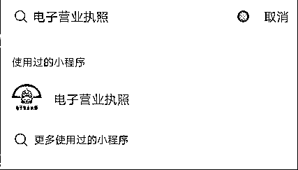
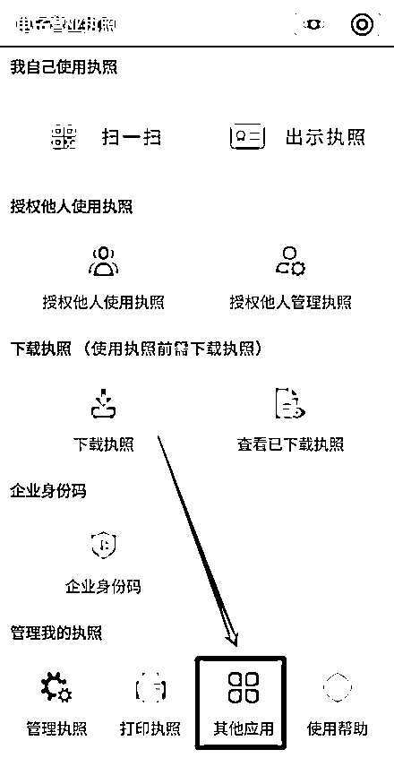
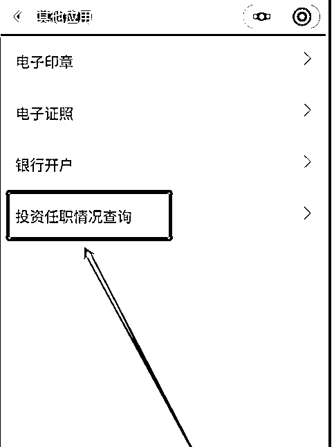
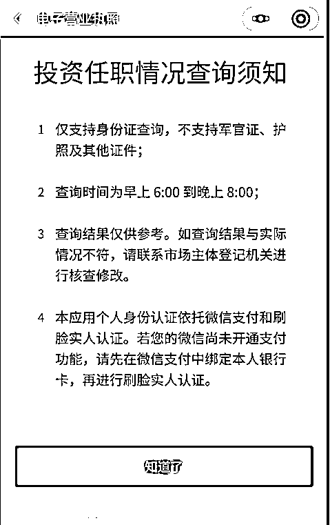
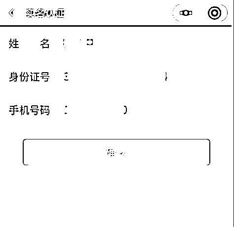
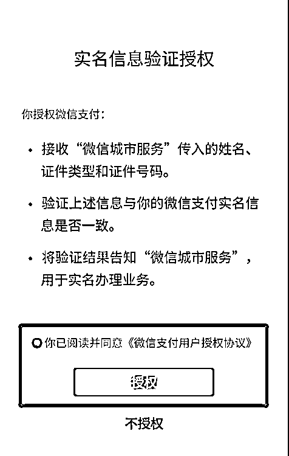
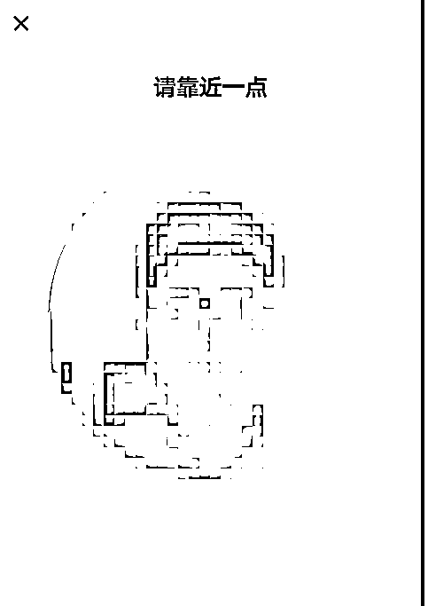
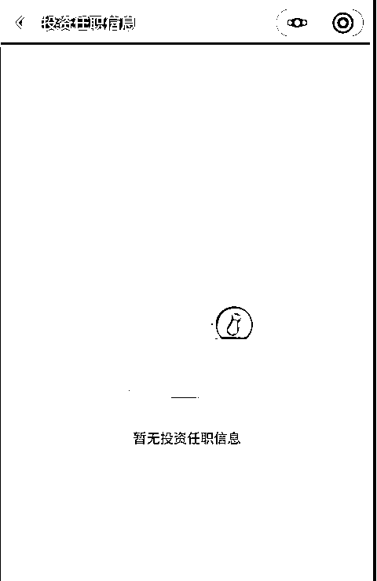

# 官方推出新功能！快查查自己有没有变成“法人”和“股东”！

> 原文：[`mp.weixin.qq.com/s?__biz=MzIyMDYwMTk0Mw==&mid=2247528264&idx=7&sn=a922899796b50f62fcb9dbf756795278&chksm=97cba470a0bc2d66b4ae6929942b4cede25218f663bd986085dfbe4972e7772bdd2ab4de7de1&scene=27#wechat_redirect`](http://mp.weixin.qq.com/s?__biz=MzIyMDYwMTk0Mw==&mid=2247528264&idx=7&sn=a922899796b50f62fcb9dbf756795278&chksm=97cba470a0bc2d66b4ae6929942b4cede25218f663bd986085dfbe4972e7772bdd2ab4de7de1&scene=27#wechat_redirect)

小伙伴们

你的身份证是否掉过？

你的身份证是否借给别人过？

你的身份证是否被人复印过？

你是否担心这些身份信息 

被人拿去办企业、办营业执照

你是否担心在填报个人事项时 

突然“被股东”“被法人”

摇身一变成为“背锅侠”

有些小伙伴们就要问了，“被法人”，“被股东”，是不是意味着我们就“当老板”了，我们就“有钱赚了”，我们就在家里“葛优躺”收钱了？当然不会有这样的美事，如果真的有“天上掉馅饼”的这样的好事，那倒应该“烧高香”了！

恰恰相反，如果我们“被法人”，“被股东”，那我们就要承担所在公司的法律责任，很有可能这个公司就是一个不正规或者已经负债累累的“空壳”。一旦东窗事发，作为法人的你就会被“限制消费”，连高铁都不能做。

**不法分子违背诚实信用原则，冒用他人身份信息取得公司登记，不仅干扰了正常的公司登记注册秩序，而且也侵害了广大人民群众的合法、正当权益、侵扰了大家的安宁生活。现在好了，如果想了解本人身份信息有没有在全国被用于办理营业执照，免除“被股东”“被法人”的担忧，已经有了便捷通道。**

国家市场监管总局在“电子营业执照”微信小程序上线“投资任职情况查询”新功能，居民可轻松获取本人在全国市场主体中作为股东（出资人）、担任法定代表人或高管人员三类登记信息。操作步骤如下：

**一、在微信中搜索“电子营业执照”小程序**

**二、在“其他应用”模块，选择“投资任职情况查询”。**

**第三步：点击投资任职情况查询**

**第四步：阅读投资任职情况查询须知后点击知道了。**

**第五步：输入个人姓名等信息，点击确认。**

**第六步：点击实名信息验证授权的授权按钮。**

**最后一步：刷脸授权。**

**这样完成流程后，电子营业执照小程序就能即时反馈授权人是否有投资任职信息了。**

快去查一查吧，假如你真的不幸中招，那可千万不要“置之不理”，更不能“听之任之”，说不定哪天就会“被承担责任”了。

另外再顺便说一句，个人名下登记电话卡数量也可以查了。工业和信息化部已经推出了全国移动电话卡“一证通查”便民服务，链接已经放在下方，有兴趣的小伙伴们可以去看看。

来源：太原市反诈中心，阻击诈骗

← 向右滑动与灰产圈互动交流 →

