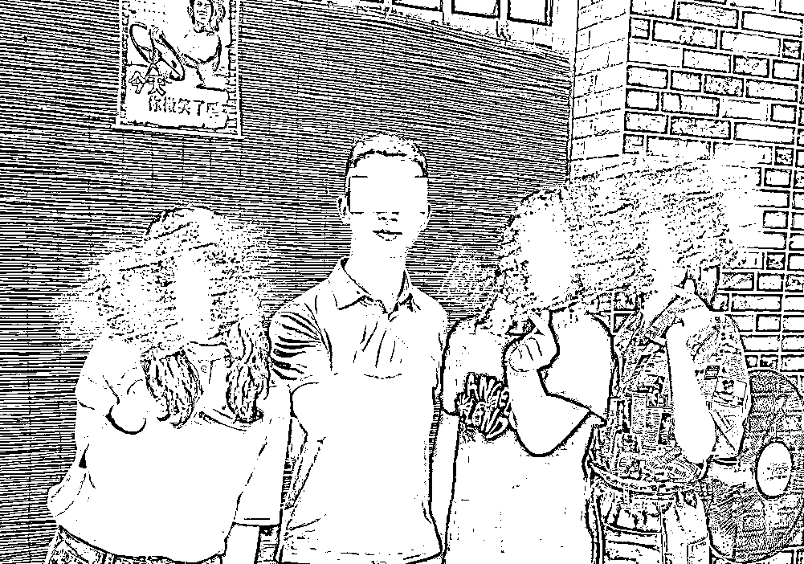
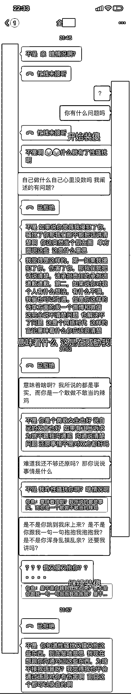
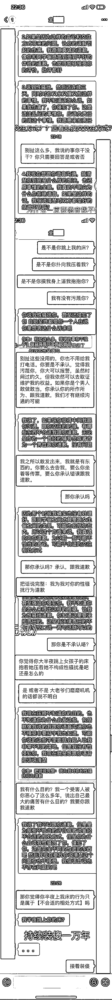
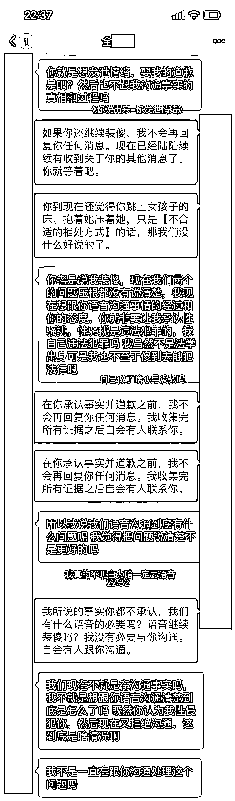

# 辅导员闯入我私密空间，跳到我床上，强行抚摸我身体：“你不想保研吗？你抱抱我”

> 原文：[`mp.weixin.qq.com/s?__biz=MzIyMDYwMTk0Mw==&mid=2247528331&idx=1&sn=857b3ea84509235d2ebd43a329aa1214&chksm=97cba4b3a0bc2da5aaaccb0dbba4a3b71d6910c7bde1fd5e858b4765aa9970a04f9425d61fad&scene=27#wechat_redirect`](http://mp.weixin.qq.com/s?__biz=MzIyMDYwMTk0Mw==&mid=2247528331&idx=1&sn=857b3ea84509235d2ebd43a329aa1214&chksm=97cba4b3a0bc2da5aaaccb0dbba4a3b71d6910c7bde1fd5e858b4765aa9970a04f9425d61fad&scene=27#wechat_redirect)

被朋友圈的姐妹鼓舞到，我也要将我的力量传递下去。

2018 年 6 月底，我在 3 天内持续遭受来自当时某师范大学外国语学院辅导员全某某的性骚扰。

那时我留学结束，刚刚归国，全某某以“容貌端正”“口才好”为由，邀请我与他同赴济南进行母校的招生宣讲。

抵达济南，第一顿晚饭他便劝我饮酒，但我未醉。此后，除正常宣讲活动以外，全某某常借口与我游玩景点之机、屡次触碰我的肩膀、手臂，手掌。

我感到不适，刻意拉开距离。

次晚就寝前，全某某闯入我的私密空间，跳到我的床上，强行抚摸我的身体，并扬言**“你不想保研吗”“都怪你洗澡的声音太大被我听到”“你抱抱我，你就抱抱我”。**

从未想到这类事情会发生在我身上，我在奋力与全某某对抗无果后，选择缓和策略以保证自身生命安全。只穿着一层单薄睡衣的我强忍恶心，拥抱全某某，安抚他的情绪，并暗示我有抑郁症，以防其轻举妄动，直至将其哄睡。

我待其睡熟，通过手机联系到我在济南的朋友，至酒店将我接走。如果你可以想象，凌晨三点的酒店房间中，穿着睡裙的女生在黑暗中死命咬着嘴不让自己出声音，一步一挪、浑身发抖地滚落地上，无声地爬着出门，只怕吵醒身边刚刚睡着的恶魔。

当夜，我在朋友的帮助下住进另一个酒店。次日，我仍需与全某某一同宣讲。期间，全某某多次向我发短信、当面道歉，均被我拒绝。届时大三的我仍有一年时间需要面对全某某，我以为我只要忍过一年就可以遗忘，但事实证明我至今无法遗忘，更无法原谅。

时日已久，许多短信、手机证据已消失不见，但恶心作呕历久弥新。全某某，你既身为老师，如此下作、龌龊至极！

有趣的是，我当时的男朋友与全某某相识，我曾与他提及此事。他看着如泣如诉的我，回避了我鼓起全部勇气的讲述。他说：**“何必抓着人家不放呢”“人都有难处”“他也没比你们大几岁”。** 
近日，一位女性好友在她的朋友圈分享出她被性侵的经历，并成功将侵犯者绳之以法。我知道我证据不足，我知道我不够及时；我知道我没有受到任何实质性伤害，是个幸运儿；我知道我防范意识有待提高，我知道我的一切不足。

但这一切，都不是任何人怪我的理由。

做错事的不是我，该自责懊恼的不是我，该为自己感到羞愧的不是我。该理直气壮的是全世界的每一个我，该自惭形秽的是全世界每一个全某某。

这些年来，我就像一颗随时爆破的气球。愤怒，羞愧，无处发泄。多亏朋友圈的姐妹，你让我看到勇气的力量。多亏济南深夜将我接走的姐妹，那是我与她初次面基，她带给我的安全感却与朝夕相伴的辅导员带来的天差地别。多亏女性的力量将我点燃，它将经久不息，直至我的生命尽头。

我将我的勇气放在这里了，姑娘们，你也要勇敢地爱自己哦。

与辅导员聊天记录 

最近陆续收到其他女生发来私信，都曾经被全某某以各种形式伤害过。目前已有多名女生与我联系，根据目前掌握线索，全某某在某师范大学外国语学院任职辅导员期间，**存在师生恋、脚踏多只船、采取隐瞒的手段同时与多名女生交往密切、性骚扰女学生，甚至不光这些行为**。目前已经证实，全某某已提请辞职。

自发声以来，有猜疑、有侮辱，更多的是支持。有人问我时隔这么多年突然讲这些有什么目的？我倒想问你，你问我这种问题有什么目的？你想多了，我说出来根本没挑时间，在那一刻我的勇气终于准备好了而已。我说出来，能让我从痛苦回忆中解脱，能让无数的女学生们从潜在的危险中解脱。你可以信，也可以不信，我不在乎。哪怕全世界只有一个女孩子信了我的话，见到全某某远远避开，因此规避了危险，我的发声就有意义。这就是我的目的，有问题吗？

 只是我没想到全某某真是个惯犯，我的发声引起了更多女孩子的共鸣和愤怒，她们主动找到了我。她们曾经和过去的我一样胆怯，被社会文化下种种凝视捆绑着，瞻前顾后、不敢发声。全某某正是抱着侥幸心理，以为没有女生站出来曝光他所做的事，但这一次，我们绝不姑息任何的欺骗和跨越道德底线的事！有些人，正是仰仗着女性极易被污名化的生存困境、仰仗着性别优势与教师光环为所欲为，享受被包围，幻想被所有人暗恋，认为自己的侵略性行为像对女孩的赏赐，不仅应当被宽恕，更应当被欣然接纳。这样的人混迹在华师，混迹在本就女多男少的外院，这难道不可笑吗，难道不该指出来吗？

女孩子们，你们勇于向我讲述自己痛苦的经历，汇聚我们共同的力量，如今我们已经变得足够强大。每一位鼓励我的网友们，不论男女，谢谢你们愿意与我一同敲打这个世界，我们正在联手将枷锁逐一击破。

此事就此告一段落。以后的日子会越来越好，勇敢大步向前。

来源：围脖那些事儿

← 向右滑动与灰产圈互动交流 →

