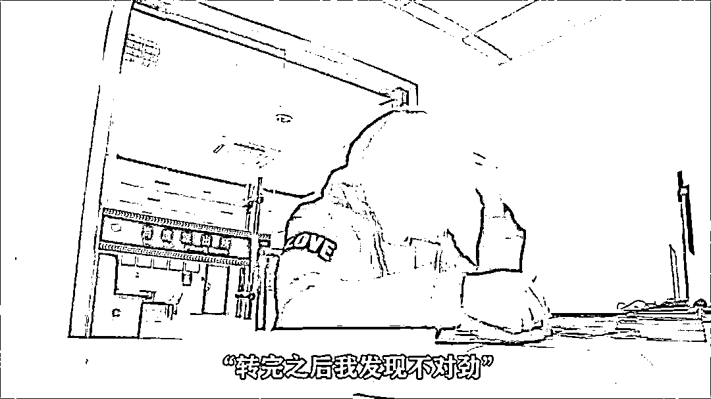
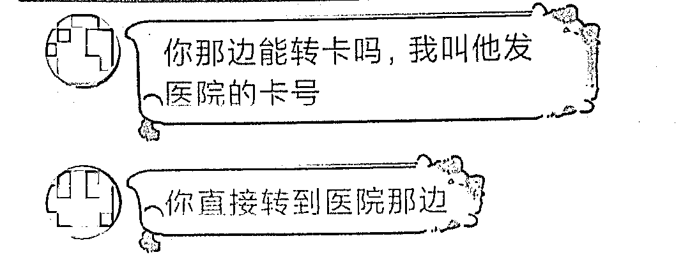
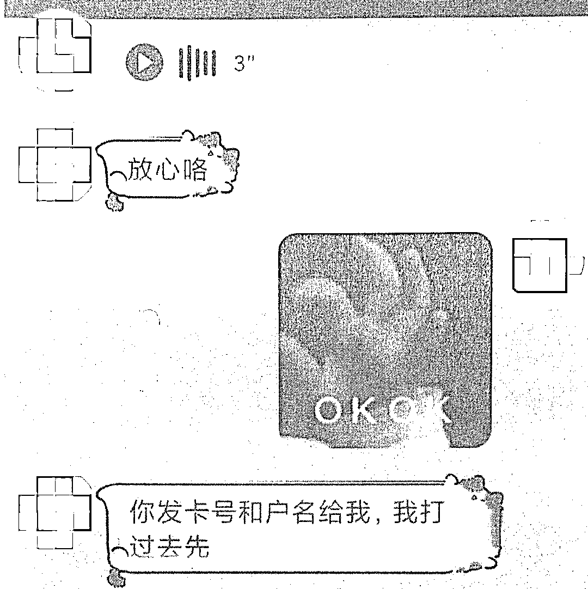
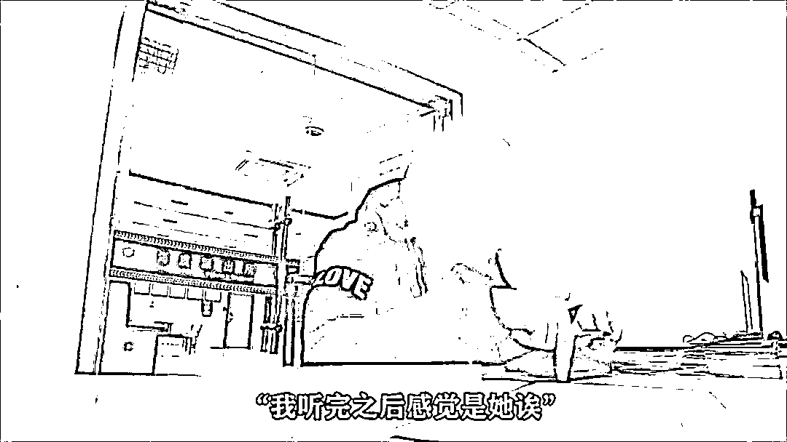
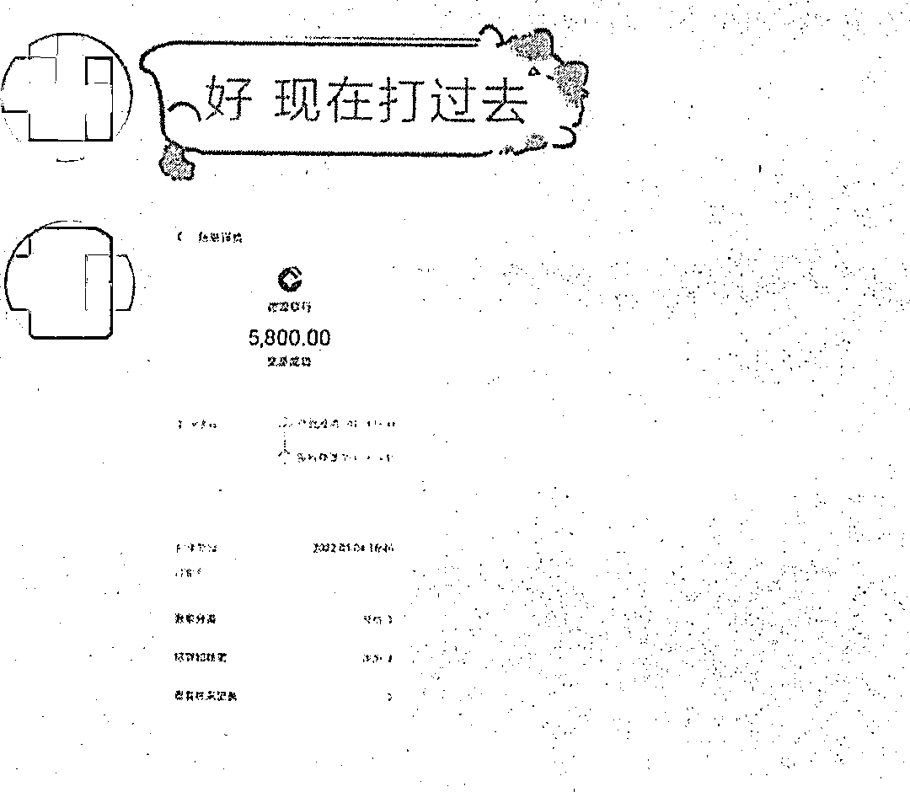
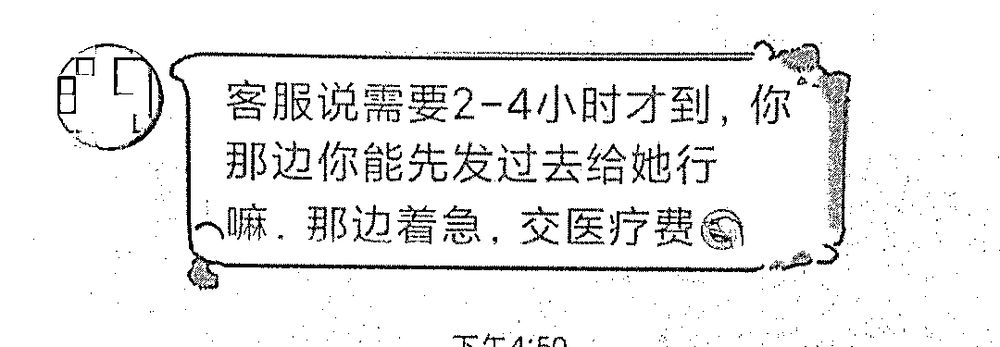
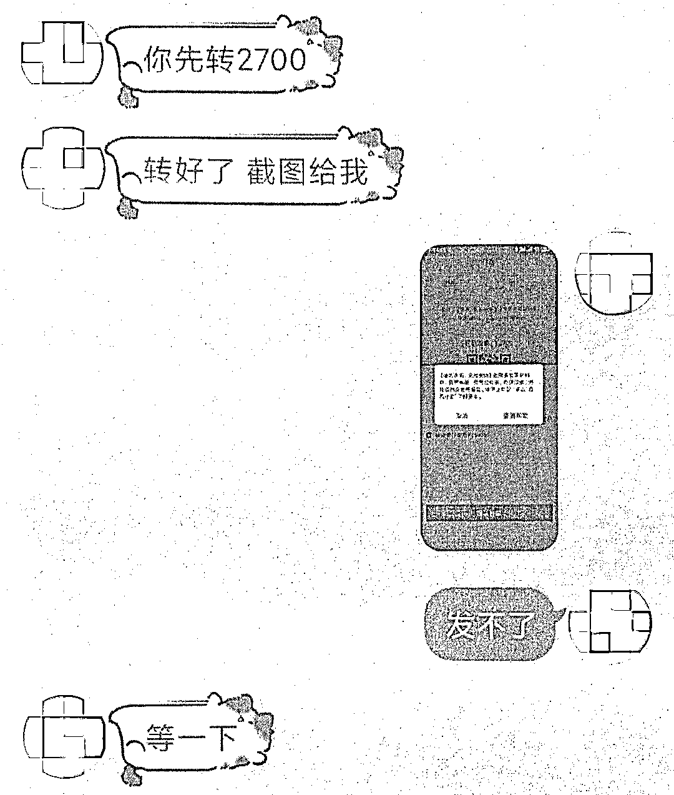
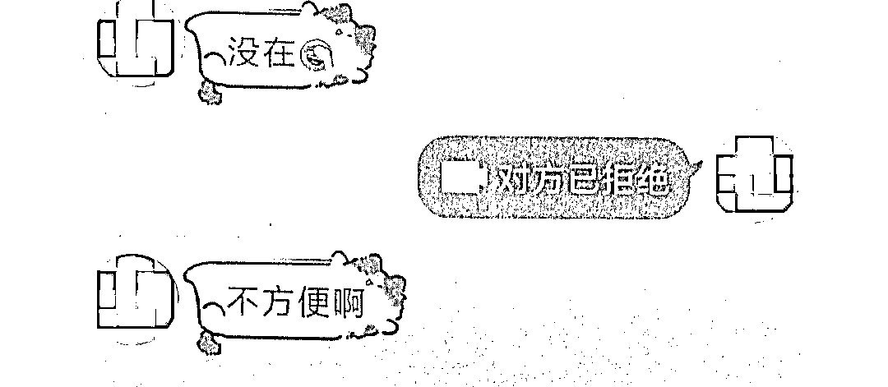
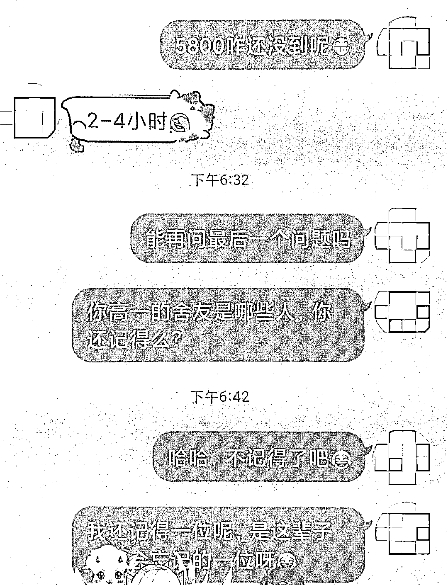

# 这次，连“本人语音”都不能信了

> 原文：[`mp.weixin.qq.com/s?__biz=MzIyMDYwMTk0Mw==&mid=2247528331&idx=4&sn=3276664f422988e6a3451ce286ae6db9&chksm=97cba4b3a0bc2da57ce7ed778bc063b85aca391b5b5a265da5bfe1d89ae5bacb0671394ec924&scene=27#wechat_redirect`](http://mp.weixin.qq.com/s?__biz=MzIyMDYwMTk0Mw==&mid=2247528331&idx=4&sn=3276664f422988e6a3451ce286ae6db9&chksm=97cba4b3a0bc2da57ce7ed778bc063b85aca391b5b5a265da5bfe1d89ae5bacb0671394ec924&scene=27#wechat_redirect)

久未联系的高中同学

在 QQ 上突然向你借钱

****

并且发来几秒的语音

听着声音**有点像本人**

这钱...

你借还是不借？

近日，我局海虞所接到张某（化名）报警称，有人冒充自己高中同学，以借钱为朋友看病为由被骗 2700 元。

当天下午

张某突然收到了同学周某（化名）发来的信息

称其好友受伤在医院急需用钱

但微信未绑定银行卡无法转账

先将钱转给张某

让张某再帮忙支付到医院账号上

随即对方发来一段语音

称“我是周某本人”

张某听后感觉挺像的

于是放下了警惕

之后

对方称已将 5800 元转到张某的银行卡上

并发来截图

**但需要 2-4 小时才能到帐**

张某也没多想

通过对方发来的银行卡号

先向其转账 2700 元

**期间系统多次提示谨防诈骗**

**张某均选择了无视**

由于钱不够

对方催促张某向其他朋友借钱继续转账

张某越发觉得不对劲

与对方视频被拒

问对方问题也再无得到回应

于是报警求助

[`v.qq.com/iframe/preview.html?width=500&height=375&auto=0&vid=wxv_2232516467139330054`](https://v.qq.com/iframe/preview.html?width=500&height=375&auto=0&vid=wxv_2232516467139330054)

目前，案件正在进一步侦办中。

**冒充同学**向受害人借钱

谎称先通过银行、支付宝等

向受害人汇款

并**伪造汇款凭证**

随后以资金到账延时

“朋友”急需用钱等为借口

骗受害人转账！

对于任何人从网上发来的借款请求 

一定要保持警惕

**务必通过电话或见面的方式核实身份**

切勿贸然汇款

来源：浙江公安、山东反诈骗中心、阻击诈骗

← 向右滑动与灰产圈互动交流 →

