# 很多腐败细节首次披露！全集来了！

> 原文：[`mp.weixin.qq.com/s?__biz=MzIyMDYwMTk0Mw==&mid=2247528331&idx=5&sn=fa75479e52d927d03a6b47191f1de368&chksm=97cba4b3a0bc2da5dd9292cff5b339f889bb6a9a6cb429e0e658983dca42d2d4689f5ebaa007&scene=27#wechat_redirect`](http://mp.weixin.qq.com/s?__biz=MzIyMDYwMTk0Mw==&mid=2247528331&idx=5&sn=fa75479e52d927d03a6b47191f1de368&chksm=97cba4b3a0bc2da5dd9292cff5b339f889bb6a9a6cb429e0e658983dca42d2d4689f5ebaa007&scene=27#wechat_redirect)

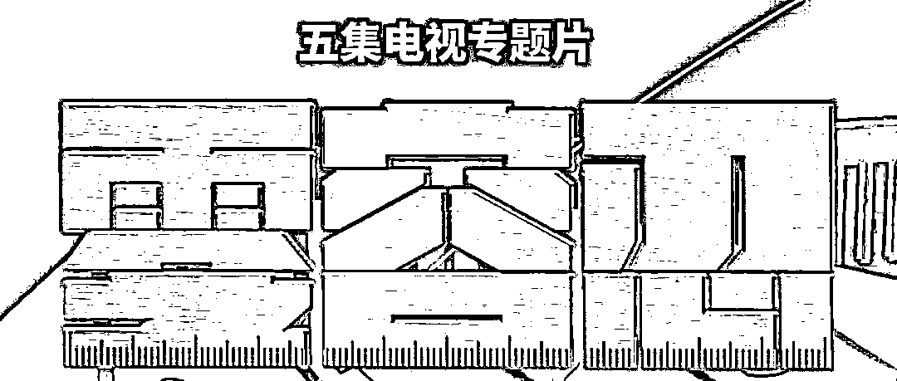

暗藏玄机的“小海鲜”

明目张胆的“私家园林”

自作聪明的“期权式腐败”

…… 

近期播出的电视专题片《零容忍》

引发广泛关注

一个个令人警醒的案例

一记记精准有力的铁拳

释放出强烈信号：

**正风反腐，必须“零容忍”！** 

一起来看全集 

↓↓↓ 

**第一集**

* * *

****《不负十四亿》**** 

[`v.qq.com/iframe/preview.html?width=500&height=375&auto=0&vid=x331899ccw3`](https://v.qq.com/iframe/preview.html?width=500&height=375&auto=0&vid=x331899ccw3)

**【孙力军团伙首次曝光！受贿暗号“小海鲜”】**

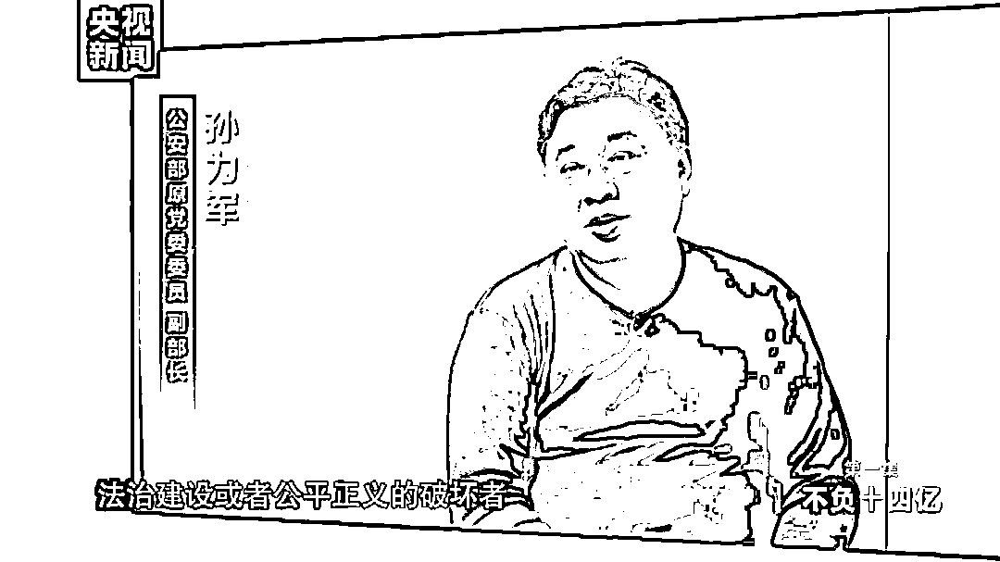

去年，曾任公安部副部长的孙力军被开除党籍和公职。紧随其后，政法领域多名省部级干部先后被查处，孙力军“小圈子”成员集体落马。

江苏省政法委原书记王立科每年四五次进京来看孙力军，每次都会送给孙力军 30 万美金，装在海鲜盒里，说给带一点“小海鲜”。案发时，“小海鲜”已累计折合人民币 9000 多万元。

而孙力军也没有让他失望。孙力军说，王立科去江苏当副省长、公安厅长，后来又当了江苏省委常委、政法委书记，这一路他都提供了帮助。

孙力军说：“我一直在反思，我为什么犯了这么多错、走了这么远？你是做公安的，是公平和正义的维护者，没想到自己成了一个法治建设或者公平正义的破坏者。”

**【为千万赃款，他帮人获 48 亿美元贷款】**

**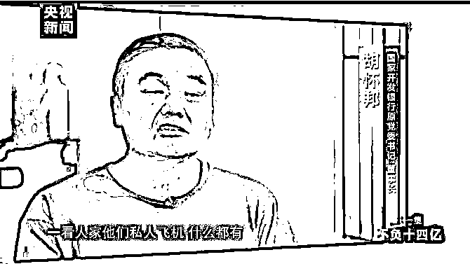**

**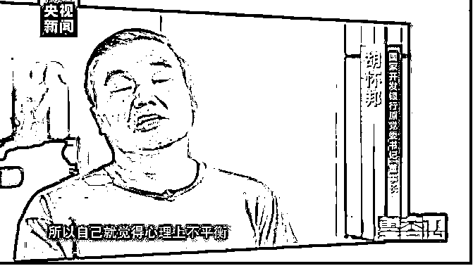**

**国开行原董事长胡怀邦，曾抢在改革方案印发之前，帮一家私营企业获得了 48 亿美元巨额贷款授信。事成后，千万元赃款进了他的口袋。**

**他说：“人家私人飞机什么都有，自己就觉得心理上不平衡，意志薄弱，就滑向深渊了。”**

****第二集****

* * *

********《打虎拍蝇》********

 ****[`v.qq.com/iframe/preview.html?width=500&height=375&auto=0&vid=l331866ql36`](https://v.qq.com/iframe/preview.html?width=500&height=375&auto=0&vid=l331866ql36)**** 

******【敛财超 4.5 亿元！他痛骂自己：“你要钱干什么，埋你啊！”】******

****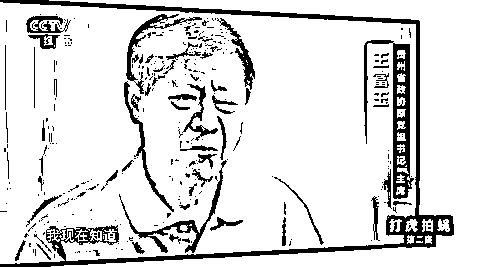****

****王富玉，曾先后在海南及贵州担任省委常委、省委副书记、省政协主席等职务。从上世纪 90 年代起，他开始收受大笔贿赂，退休后仍不停手，累计敛财超 4.5 亿元。****

****可笑的是，其别墅中却挂着：“得一官不荣，失一官不辱，勿说一官无用，地方全靠一官；吃百姓之饭，穿百姓之衣，莫道百姓可欺，自己也是百姓。”****

****他忏悔道：“我疯狂的贪欲登峰造极……我不知道要钱干什么，我吃喝不愁啊。要钱干什么？埋自己啊！”****

******【令人发指！低保办主任骗贫困户救命钱赌博】******

****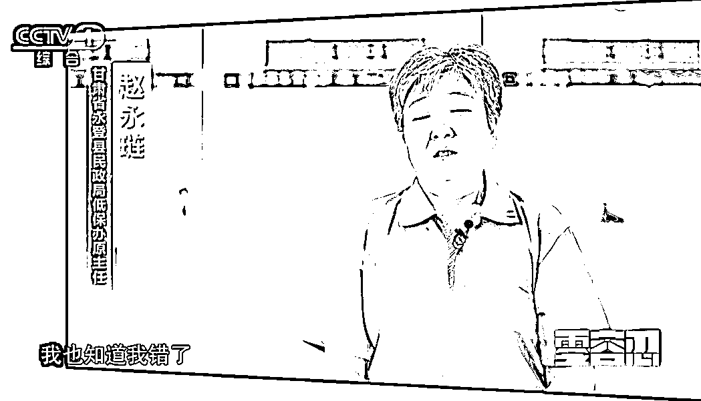****

********

********

********

****为居民申请大病救助款，7.3 万元中却有 4.5 万元落入自己口袋；为贫困户申请养殖扶贫资金，索要 4 万元后直接失联……甘肃省永登县民政局低保办原主任赵永琏，任职期间将敛财黑手伸向贫困户。****

****赵永琏骗贫困户的救命钱，然后扔在了麻将桌上，有时输了钱，她直接在牌桌上打电话向农户要钱。****

******第三集******

* * *

**********《惩前毖后》********** 

 ******[`v.qq.com/iframe/preview.html?width=500&height=375&auto=0&vid=b3318ravbpp`](https://v.qq.com/iframe/preview.html?width=500&height=375&auto=0&vid=b3318ravbpp)****** 

********【在京建 109 亩私家园林，自首前他过着自我毁灭式生活】********

******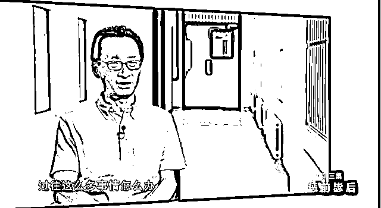******

******中国科协原党组成员陈刚，40 岁成为副市长。在房地产商重点“围猎”下，他逐渐“飘飘然”，敛财 1.2 亿余元。******

******为满足“设计梦”，他让商人出资为自己建占地面积 109 亩的私家园林，内有四合院、人造白沙滩等，极尽奢华。******

******自首前，整一年他都过着自我毁灭式的生活，极度惶恐空虚。他说，自己的私欲困在囚笼里，“到了这儿接受审查，我才解放了，睡得下、吃得下了。我很痛悔，我醒悟得晚了。”******

********【为给儿子铺好路，她把手伸向幼儿园】********

******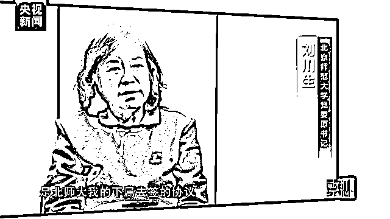******

******北京师范大学党委原书记刘川生，是党的十八大以来首名被留置的中管高校“一把手”。她违规让儿子使用北师大招牌，开幼儿园敛财。******

******退休前她又想趁还有权力，为儿子彻底铺好路，便私下签订所谓协议，要求下属将“北师大附属幼儿园”的品牌，一次性授权给儿子的公司。******

********第四集********

* * *

************《系统施治 》************

 ********[`v.qq.com/iframe/preview.html?width=500&height=375&auto=0&vid=u3319s95dz9`](https://v.qq.com/iframe/preview.html?width=500&height=375&auto=0&vid=u3319s95dz9)******** 

**********【聚焦内蒙古涉煤腐败案：老子前台批煤，儿女后头捞钱】**********

********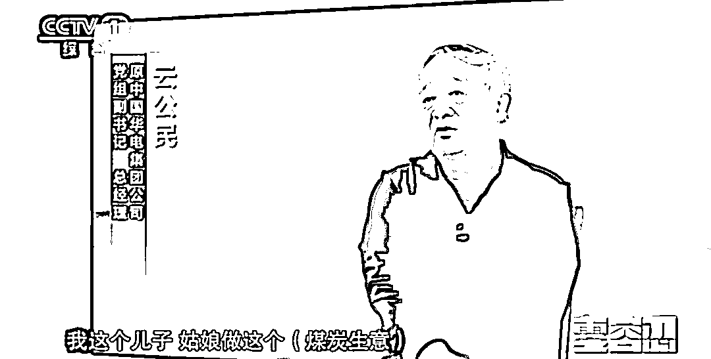********

********内蒙古自治区是世界上最大的露天煤矿之乡。2002 年至 2012 年，我国煤炭行业快速发展。当地有领导干部自己在前台批煤，儿女在后头捞钱；有的直接用权力获取煤田……2020 年 2 月，内蒙古自治区启动专项整治，截至 2021 年 10 月，共查处涉煤腐败案件 736 件 1023 人！********

********领导干部亲属子女涉足煤炭领域，是涉煤腐败案件中的突出现象之一。********

********原中国华电集团公司总经理云公民在前签字批煤，其儿子云凯晨在后开设无人员、无设备、无实际经营活动的所谓“公司”，合伙煤炭企业低买高卖坐收差价。********

********云凯晨还涉足房地产、道路工程建设等行业，靠父母权力“开绿灯”，一个修路项目就拿走超 1 亿元。********

**********【认为收现金太低端，他设三层影子公司受贿】********** 

********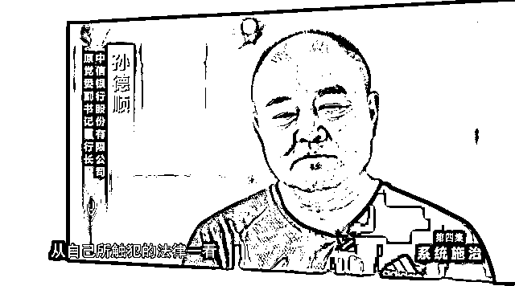********

********中信银行股份有限公司原党委副书记、行长孙德顺，自恃有过基层经验业务能力超强，认为受贿收现金太低端，精心设计掩盖受贿事实。********

********他设三层影子公司受贿，平台公司下设十多家项目公司，项目公司再借空壳公司与行贿企业交易，资金往来则伪装成各种貌似合法的金融产品、股权投资协议。********

**********第五集**********

* * *

************《永远在路上 》************

 ********[`v.qq.com/iframe/preview.html?width=500&height=375&auto=0&vid=m33196x4r37`](https://v.qq.com/iframe/preview.html?width=500&height=375&auto=0&vid=m33196x4r37)******** 

**********【哥哥从政 弟弟无心教书只想捞钱】**********

********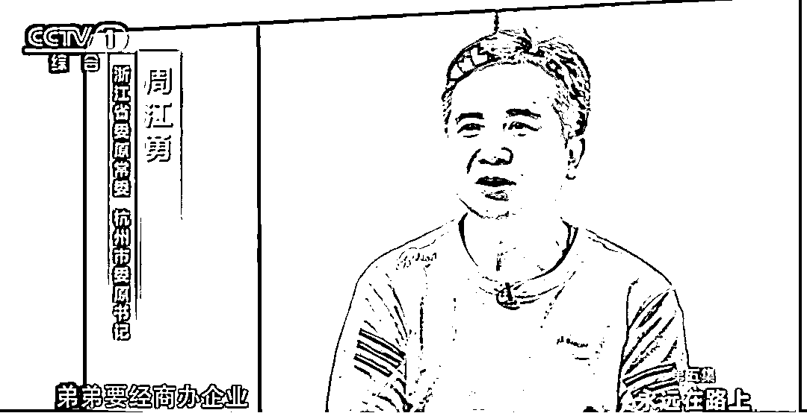********

********周江勇，曾在浙江多地担任一把手。其弟周建勇曾任大学教师，却无心教书，一心羡慕商界生活。********

********周江勇利用职权帮弟弟出资金、土地、设备，甚至干预司法，帮弟弟逃避环境污染案刑事处罚。商人们为攀附周江勇与周建勇合作，周建勇仗着哥哥是一把手借 9000 万元，却没想过还。********

**********【“95 后”公职人员侵吞公款 买顶级网游装备】**********

********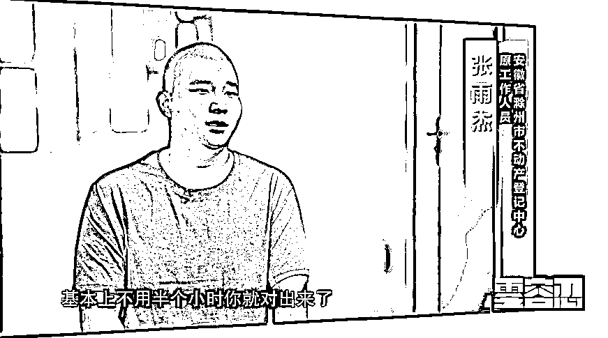********

********2021 年，一场司法拍卖中，竞价拍出 8700 万元游戏卡的原主人引发关注。这张卡的原主张雨杰，曾是安徽滁州市不动产登记中心工作人员，3 年贪污近 7000 万元。********

********他交代，曾有买房人带数万元现金办资金托管，张雨杰将现金存到自己卡里。当晚打游戏时，他控制不住将几万元全部用于购买装备。自此，“贪污就跟雪崩一样，停不下来。”********

********“95 后”张雨杰还为女友购买奢华服饰、首饰；到各地旅游，10 万元一晚的海底套房连住四晚；每晚到上海住豪宅，白天回安徽上班，房租一月 3.8 万元。调查发现，其贪污款到案发时几乎挥霍一空。********

****************

********有腐必反、有贪必肃********

********始终保持零容忍态度********

********是我们党一以贯之的鲜明态度********

**********我们必须保持反腐败政治定力**********

**********坚持严的主基调不动摇**********

**********永远吹正风反腐的冲锋号！**********

********来源：中央纪委国家监委网站、新华社、央视新闻、红网********

****************

********← 向右滑动与灰产圈互动交流 →********

****************