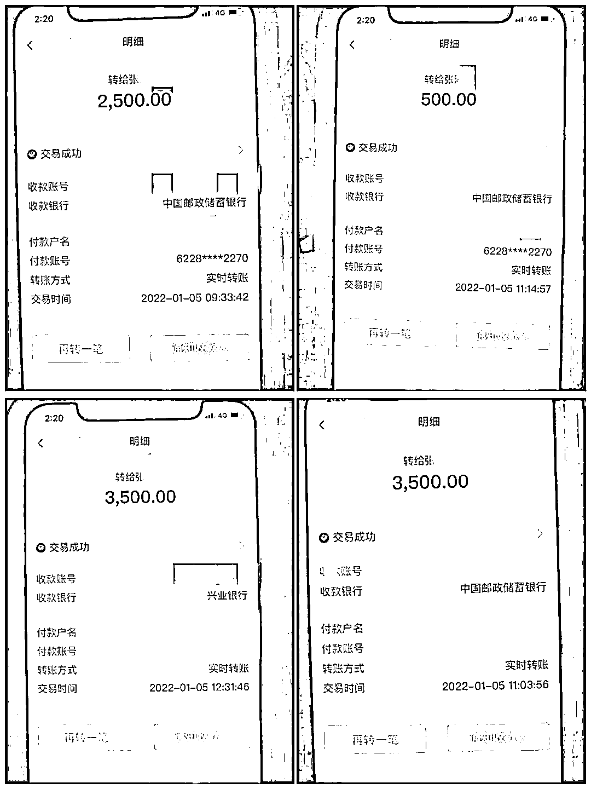

# “我管不住我老婆！”男子崩溃报警

> 原文：[`mp.weixin.qq.com/s?__biz=MzIyMDYwMTk0Mw==&mid=2247528331&idx=6&sn=49e2d752223dc61641ca5f176325534a&chksm=97cba4b3a0bc2da5ab546233bb451cd779bea0adafb92ae4afaa1070b5f1ad07c663b80ccdc2&scene=27#wechat_redirect`](http://mp.weixin.qq.com/s?__biz=MzIyMDYwMTk0Mw==&mid=2247528331&idx=6&sn=49e2d752223dc61641ca5f176325534a&chksm=97cba4b3a0bc2da5ab546233bb451cd779bea0adafb92ae4afaa1070b5f1ad07c663b80ccdc2&scene=27#wechat_redirect)

**“我媳妇不信我……”** 

**“怎么说都不听！”**

**“我已经管不住她，你们赶紧来帮忙！”**

近日，萧山北干派出所接到一男子报警，**称媳妇在网上投资被人骗了 10000 元，现在还要给对方转钱，**无论自己怎么劝都不听，只能求助警方来管管。

**固执己见**

接警后，北干派出所综合指挥室指派就近警力赶赴现场，并安排专人电话联系当事人进行线上劝阻。

“你们不要影响我赚钱。”电话打通了，这位女士却嫌民辅警多事，匆匆挂断电话，反复几次都是如此，最后索性不接。

队员陈奇超和陈琼华作为先期处置警力赶到现场，见到了一脸无奈的男主人以及正躺在床上操作手机的当事人王女士（化姓，27 岁，安徽人）。

**“你们听我老公干嘛，他什么都不懂。”**

“我没有被骗，我只是操作失误了。”

“只要再投 20000 元，就能连本带利一起赚回来。”

[`mp.weixin.qq.com/mp/readtemplate?t=pages/video_player_tmpl&action=mpvideo&auto=0&vid=wxv_2228279738844921859`](https://mp.weixin.qq.com/mp/readtemplate?t=pages/video_player_tmpl&action=mpvideo&auto=0&vid=wxv_2228279738844921859)

**民辅警上门进行劝阻**

身穿制服的队员站在面前，王女士不为所动，眼看着对方在手机上输金额准备打款，其丈夫在旁却犹犹豫豫不敢上前制止，无奈之下，队员们只能先“简单粗暴”替王女士暂时保管下手机并问清相关账户信息向所里汇报，迅速开启紧急止损程序。

**如梦初醒**

**“你不相信你老公可以，警察你总该相信吧！”**

“你 20000 元打过去他们又会提升额度。”

“我看你年纪也不大，这么简单的骗术都不知道吗？”

民警劳建昌的话犹如醍醐灌顶。

民辅警开展紧急止损

“那我之前的 10000 元是不是就这么没了？”原本态度强硬的王女士却突然崩溃，流下了眼泪。恳求民警赶紧帮忙把钱追回来。

原来，当看到民警那一刻，她心里其实已经慌了，可一向强势的她又无法面对现实。

经了解，前天王女士被网友拉进一个投资微信群，看到群友跟着一个老师投资都赚了钱，纷纷在里面发截图。王女士觉得上班累，这样投资来钱又快又轻松，于是抱着试一试的想法下载了群里推荐叫“STAR”的投资软件，在里面分 100 元、500 元、1000 元先后投了 3 笔，很快就收到 130 元、650 元、1300 元 3 笔回款。

王女士手机里面下载的“投资 APP”

尝到甜头后，王女士把这个“好消息”告诉了老公，其老公当时就劝她不要再投了，怕有猫腻，王女士哪里肯听，陆续又追加投资到 10000 元，此时客服提示她操作错误，这笔钱被锁住，但是可以继续投资 20000 元，届时收益和本金会一起打回来。

王女士多次转账

王女士还想尝试，其老公得知后苦劝未果，只能报警求助。

王女士和丈夫随后跟随民警来到派出所，接受了反诈宣传教育并下载了“国家反诈中心”APP，注册了金钟罩小程序。王女士十分后悔，称现在反诈宣传铺天盖地，自己上班的商城就看到不少，当时不以为意，没想到有一天真的会发生在自己身上。

**投资理财类诈骗常用手段**

1、通过网络、短信等途径发布各种投资理财项目信息。

2.以“高收益”“利润丰厚”吸引投资者，被害人先期投入少量资金后，骗子先让受害人获点小利骗取信任。

3.眼看小额提现“秒到账”，受害人已经被“麻醉”，此时骗子继续用话术忽悠受害人投入大量资金，等到受害人投入大量金额之后，“资金冻结，平台跑路”，受害人永远无法将余额提现到自己的银行卡内。

**警方提醒：**

1、对超高收益的投资要保持戒心，不要被暂时的高利润迷惑双眼，切勿相信只赚不赔的“买卖”，避免落入网络投资诈骗陷阱。

2、投资理财请选择正规途径，正规的 APP 均可通过官方应用商店下载，不要随意点击陌生人发送的链接、扫码下载投资理财类程序。

3、切勿随意提供自己的个人信息，保管好自己的银行卡密码和验证码。

4、如不幸被骗，立即收集证据，并拨打全国统一反诈热线 96110 止损。

来源 ： 萧山公安

← 向右滑动与灰产圈互动交流 →

