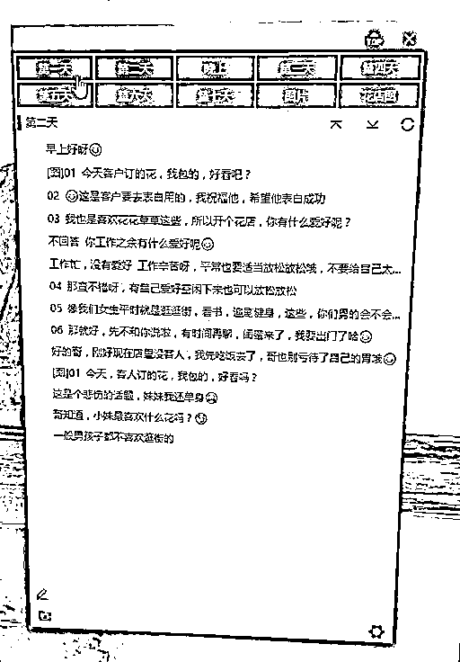
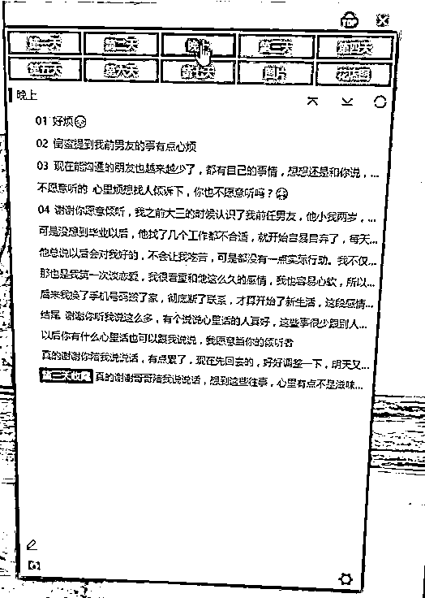
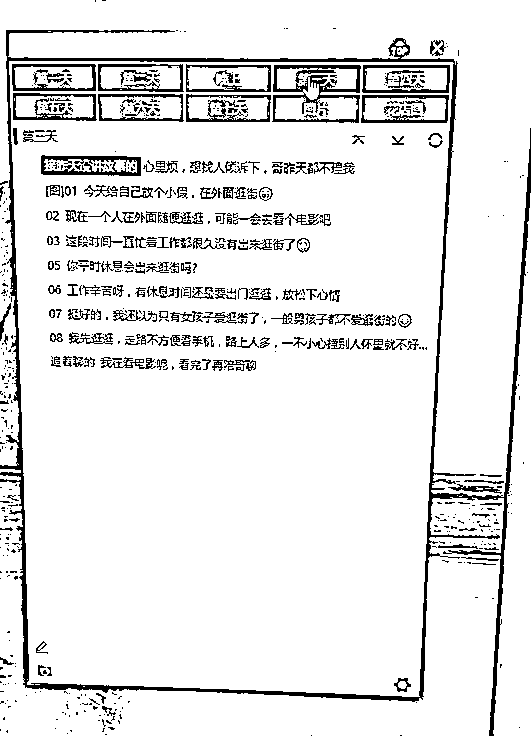
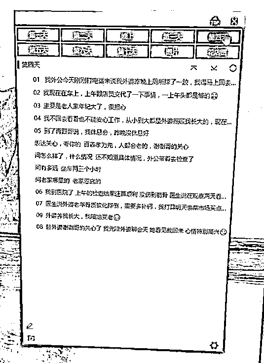
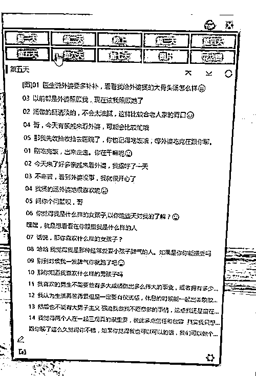
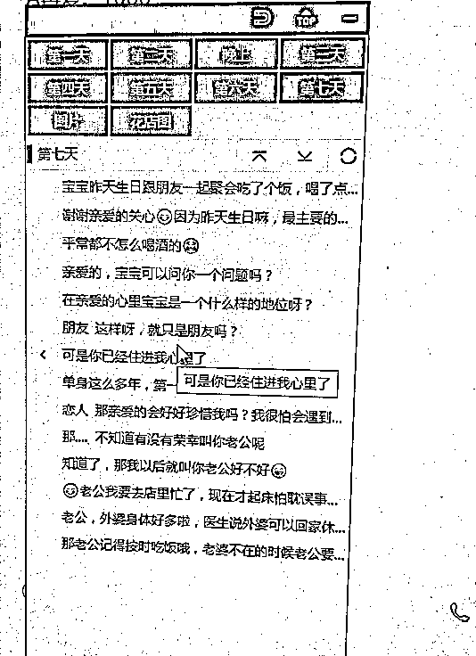
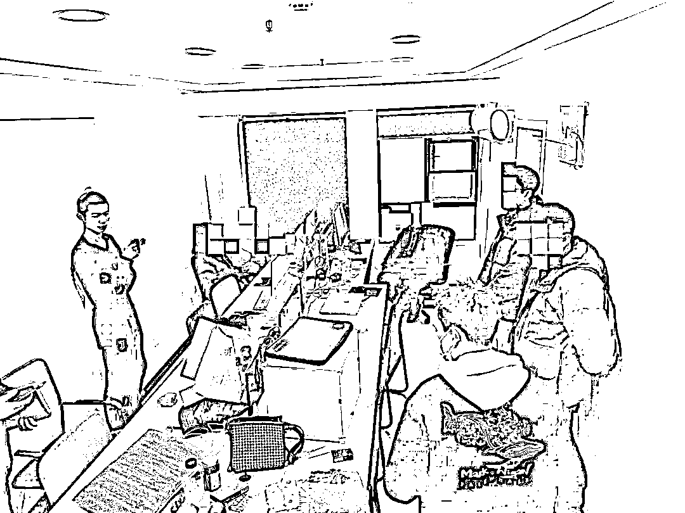

# 网络骗子的“剧本杀”有多厉害，第 6 天你就要给“美眉”买生日礼物

> 原文：[`mp.weixin.qq.com/s?__biz=MzIyMDYwMTk0Mw==&mid=2247528331&idx=7&sn=02c8703da887405c1758bfb9cfbb56f9&chksm=97cba4b3a0bc2da52ef4d9a6c68f3273775218b2a85da11d855f4574ade67711481895f3fce8&scene=27#wechat_redirect`](http://mp.weixin.qq.com/s?__biz=MzIyMDYwMTk0Mw==&mid=2247528331&idx=7&sn=02c8703da887405c1758bfb9cfbb56f9&chksm=97cba4b3a0bc2da52ef4d9a6c68f3273775218b2a85da11d855f4574ade67711481895f3fce8&scene=27#wechat_redirect)

网络骗子的“剧本杀”有多厉害

通过一连 6 天的“话术”聊天

中“术”者就会给“美眉”买生日礼物了

近日

武汉市公安局汉阳区分局

永丰街派出所

打掉一个冒充未婚女性

骗取钱财的 7 人诈骗团伙

日前，永丰街派出所民警在开展日常反诈扫楼宣传时，发现王家湾中央生活区某房间内有大量人员聚集，且他们每天的工作都是在房间内使用电脑与手机，十分可疑。永丰街派出所将情况报告汉阳区公安分局。

经会商研判，汉阳警方立即组织网警、永丰所成立专班开展案件调查。一举抓获犯罪嫌疑人刘某坤、周某、胡某、黄某霞、吴某、向某某、谭某萍等 7 人，现场查获涉案电脑 8 台、手机 14 部。

吴某落网后交代，2021 年 11 月，他在朋友圈看到一则招聘销售员的广告，前去应聘后成为“公司”的“业务员”，工作是按照诈骗“剧本”，将自己“包装”成单身女性，独自一人在武汉，经营一家花店，诈骗男性网友。

吴某称，根据“剧本”，与陌生男性互加好友后，开始聊天网恋。第一天互发姓名自我介绍，第二天聊各自的情感经历，第三天告诉对方比较心累，想去逛街放松一下，暗示对方自己的消费水准较高；第四天谎称自己外婆出事了，要回外婆恩施的家里；第五天煲汤给外婆喝，晚上做一顿非常丰富的晚餐一家人吃，并将图片发给对方；

第六天会告诉对方生日到了，希望和对方交换礼物。此时，“业务员”会先买一个廉价礼物送给对方，然后在网店里挑一个价格虚高的礼物链接发给对方，对方付款后钱就直接到该团伙账户里，以此牟利。如果对方还有潜力可挖，第 7 天他们就会开始新的一轮“话术”聊天。

经查，2021 年 10 月初至今，该团伙依托短视频平台引流，以未婚女性交友为幌子，按照事先准备的话术，编造过生日等理由引诱男性购买虚假礼物实施网络诈骗，共计获利 30 余万元。目前，7 名犯罪嫌疑人已被依法刑事拘留，案件正在进一步深挖办理中。

来源： 平安汉阳 ，利箭在行动

← 向右滑动与灰产圈互动交流 →

