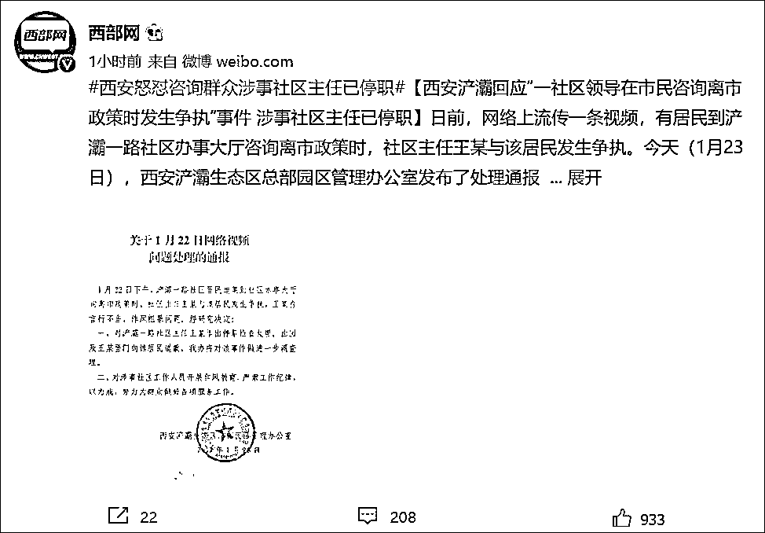
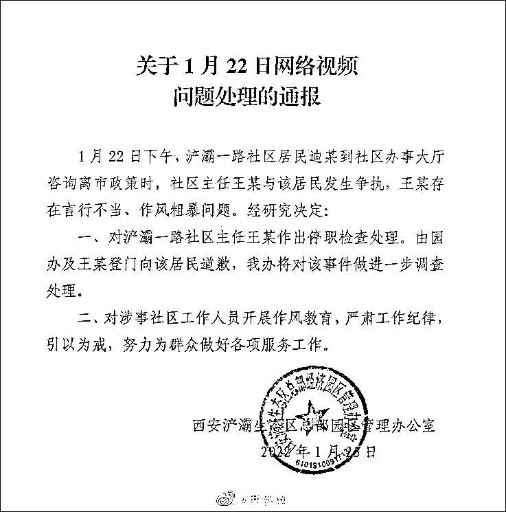

# “我不说，滚！”

> 原文：[`mp.weixin.qq.com/s?__biz=MzIyMDYwMTk0Mw==&mid=2247528437&idx=1&sn=ea3130f9ece6ef865b875daf65d3d62e&chksm=97cba4cda0bc2ddbaa2dfec2b7ef7d3bd8206b167bdb51ea9e761fb5e6bb20091c3321955fed&scene=27#wechat_redirect`](http://mp.weixin.qq.com/s?__biz=MzIyMDYwMTk0Mw==&mid=2247528437&idx=1&sn=ea3130f9ece6ef865b875daf65d3d62e&chksm=97cba4cda0bc2ddbaa2dfec2b7ef7d3bd8206b167bdb51ea9e761fb5e6bb20091c3321955fed&scene=27#wechat_redirect)

1 月 23 日，西部网（陕西新闻网）官方微博@西部网 发布消息称，日前，网络上流传一条视频，有居民到浐灞一路社区办事大厅咨询离市政策时，社区主任王某与该居民发生争执。今天（1 月 23 日），西安浐灞生态区总部园区管理办公室发布了处理通报，针对社区主任王某存在言行不当、作风粗暴问题，已作出停职检查处理。

**通报原文：**

1 月 22 日下午，浐灞一路社区居民迪某到社区办事大厅咨询离市政策时，社区主任王某与该居民发生争执，王某存在言行不当、作风粗暴问题，经研究决定：

1、对浐灞一路社区主任王某作出停职检查处理。由园办及王某登门向该居民道歉，西安浐灞生态区总部园区管理办公室将对该事件做进一步调查处理。

2、对涉事社区工作人员开展作风教育，严肃工作纪律，引以为戒，努力为群众做好各项服务工作。

据此前报道，1 月 22 日，网曝陕西西安浐灞一路社区领导怒怼咨询政策群众，市民咨询离市政策，疑似办公人员回应：“我不说，滚！”

[`v.qq.com/iframe/preview.html?width=500&height=375&auto=0&vid=f3319z4i8sn`](https://v.qq.com/iframe/preview.html?width=500&height=375&auto=0&vid=f3319z4i8sn)

视频来源：新京报我们视频  

来源：新京报，@西部网

← 向右滑动与灰产圈互动交流 →

