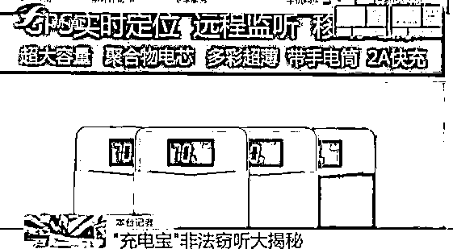
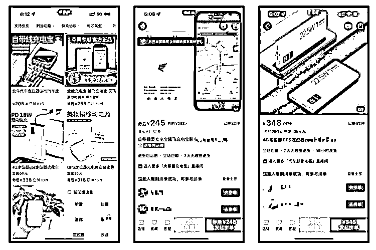
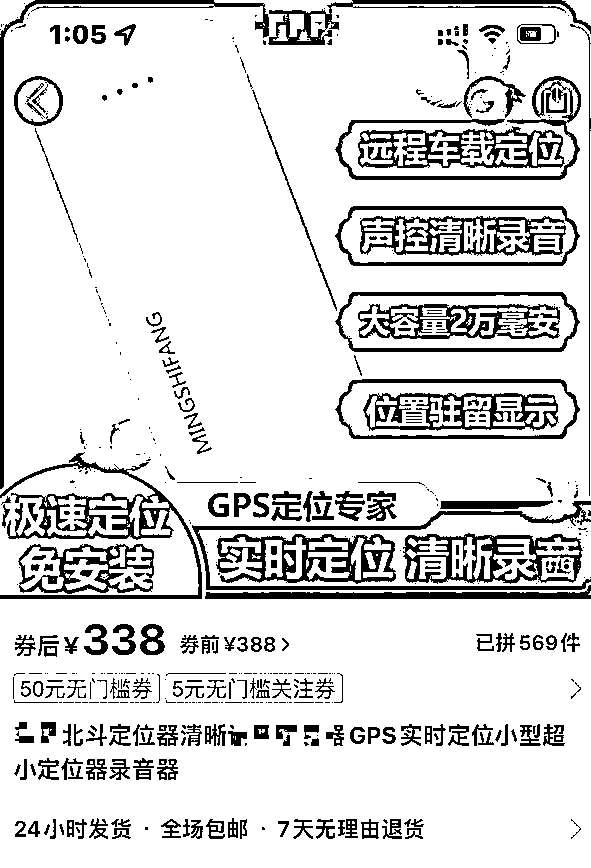
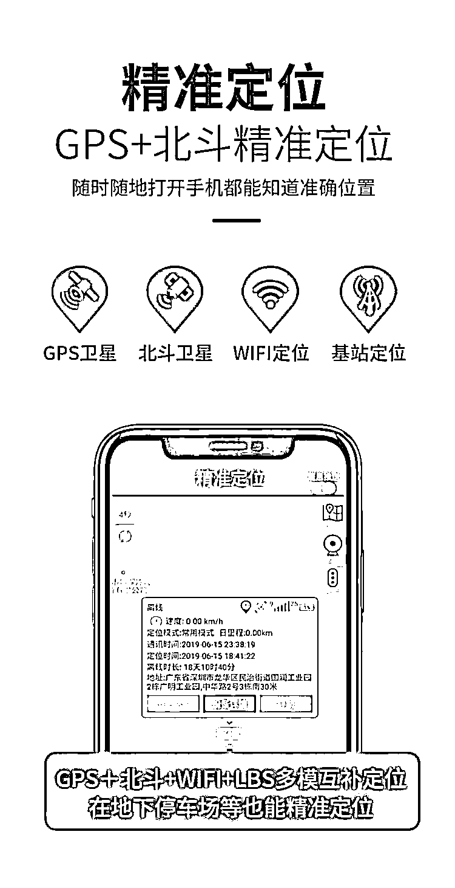
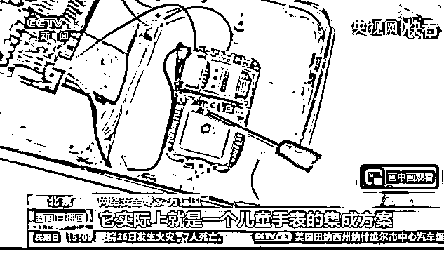
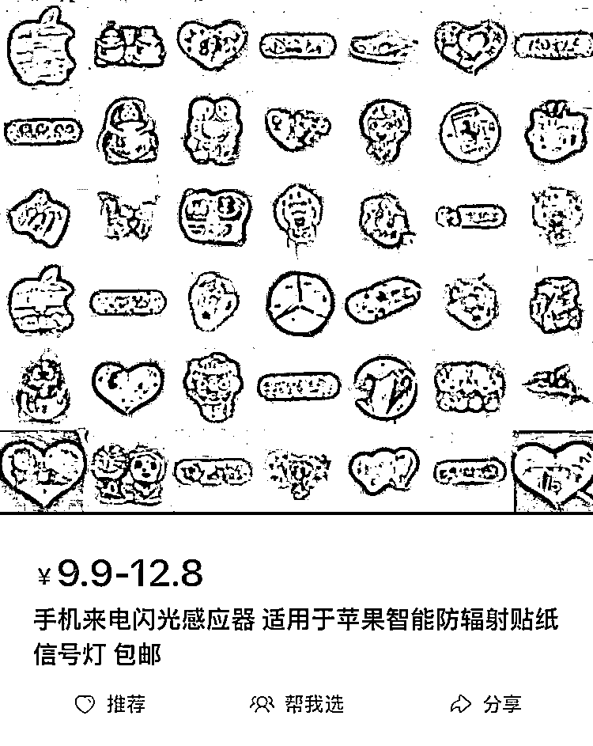

# 你那“来历不明”的充电宝，可能正在监听你的讲话

> 原文：[`mp.weixin.qq.com/s?__biz=MzIyMDYwMTk0Mw==&mid=2247528437&idx=5&sn=ffaea3bf0c50bef6f25a2f57bc1c9968&chksm=97cba4cda0bc2ddb9ba47ee600b46f8839146c54408d38f96a661c2d4f3f515d48641aee0a90&scene=27#wechat_redirect`](http://mp.weixin.qq.com/s?__biz=MzIyMDYwMTk0Mw==&mid=2247528437&idx=5&sn=ffaea3bf0c50bef6f25a2f57bc1c9968&chksm=97cba4cda0bc2ddb9ba47ee600b46f8839146c54408d38f96a661c2d4f3f515d48641aee0a90&scene=27#wechat_redirect)

随着手机功耗的越来越高，充电宝已经彻底融入了我们的生活中。而随着充电宝的普及，这类产品就和利益二字挂上了钩，除了现在随处可见的共享充电宝外，还有很多不怀好意的人将歪心思打到了充电宝上面。此前，福建新闻就接到过群众举报，称有一种伪装成充电宝的跟踪窃听器正在大肆销售。该节目发现，这些网店除了售卖带有定位、监听功能的充电宝，还能提供“定制服务”。这个所谓的定制服务就是由消费者提供设备，店家将其改装成“跟踪窃听器”。而前段时间在逛某个电商平台的时候，我居然看到一款和上述报道极为相似的产品，当仔细点击查看的时候，新款产品所提供的功能让我惊出一身冷汗！

## ******充电宝伪装，定位误差不超 10 米！******

****理论上，在此类产品刚出现的时候就应该严格限制这些设备的生产、售卖。********可事实上，国内的电商平台对于 GPS 跟踪设备的监管似乎并没有那么严格。********在随机浏览电商内容的时候，用户可以轻而易举的就搜索到定位跟踪器，这类设备在电商平台上种类繁多，数量巨大，并且该类产品大多都是伪装成类似充电宝的产品，光明正大的进行售卖。********某电商平台********随后我根据关键词进行查询，来试试这些电商平台对于此类产品的限制措施，但结果并不理想。********尽管这些电商平台都对关键词进行了屏蔽，但通过避开这些敏感字，仍旧能够较为容易的搜索到相应的设备，且销量也都不低。而有的电商平台甚至连敏感词屏蔽都没有设置，直接就可以搜索到相应的产品。********某平台内置定位器伪装成充电宝的产品********这些充电宝的价格普遍都在 200~300 元左右，而普通版本充电宝售价不过百元。从价格上我们不难看出，这产品肯定存在“猫腻”。********当我随便点开一个充电宝产品之后，才发现它们本来的面目。****************基本每一款产品都标有“远程精准定位”、“降噪录音”等功能，对于这类产品来说，这两种功能是比较基础的。********除此之外，还有一些产品甚至宣称支持 GPS+北斗+WIFI+LBS 多模互补定位，通过多种定位模块互补，其定位误差不超过 10 米。****************随后我“顺藤摸瓜”的找到了其中一家店的店主，询问定位设备可否自己安装；虽然卖家说不能，但是可以将设备邮寄，由他来安装，一些功能稍微简单的定位模块，待机时间甚至能达到整整一年。********卖家也表示此前有人将“共享充电宝”邮寄，由他为其内置定位模块。这件事的真假我们不得而知，但将公共设施变为开放式的定向跟踪设备，一定没安什么好心。****

## ******方式多样，但可以被找到******

****在充电宝上添加定位和监听功能，其实并不复杂，把一块搭载物联网 SIM 卡的定位芯片连接到充电宝自带的电池上就可以了。工作时由定位芯片接收卫星数据，然后通过物联网 SIM 卡把数据发送给信号塔，信号塔再传输给服务器，你的位置信息就被上传到了云端，而使用者直接从服务器中读取数据，就能准确获取你的位置信息。********这里值得注意的是其中的物联网 SIM 卡，物联网 SIM 卡和我们普通的手机 SIM 卡并不相同，主要的使用用途是在智能摄像头、电梯广告屏、按摩椅等需要数据传输设备，专供物流公司等企业用户使用。********这些用在专用设备上的物联网 SIM 卡被用在了“窃听跟踪器”上，大概率是被这些不法商家钻了空子，希望各大运营商平台可以早日正视这个问题。********定位模块一般都被伪装在一些带有电源的设备，问题最多的就是充电宝，因为其自带电源，是非常理想的跟踪设备，此外就是一些其他随行设备上，比如行车记录仪、插排、数据线等。********在早期，不少带有跟踪定位功能的充电宝简单粗暴的内置了一个儿童手表的集成方案，其中还有一个 SIM 卡槽，购买者可以将自己的手机卡插入其中。****************这类设备同样支持定位和录音功能，但从另一个角度来说也比较容易发现。****

## ******划重点******

****最简单的方法就是信号感应灯，也就是我们小时候的来电闪光贴纸或钥匙扣；在早期 2、3G 时代，国内虽然跟上了基础网络建设，但对于网速慢、信号差等技术问题都没办法解决，所以当时的监听方式采用的是直接拨给需要监听的设备，也就是打电话。只需要把监听设备的收音模块通过设置为自动接听后，就可以直接“听”到设备周围的声音了。****************被远程激活的“充电宝”，在来电话时会存在电磁波信号，电磁信号变成电压和电流，使得信号感应灯发光，所以只需要找来信号感应灯就能发现问题。********另一种方法就是将移动电源直接放在开启的有源音箱旁，若音响在静声噪音之外发出了异响，则说明移动电源内藏有向外发射电波的装置，从而揪出是否存在监听功能。********不过随着技术的发展，充电宝被设计的越来越紧凑，内部可供操作的空间也就越来越少，后续也就变成了单独联网的的模块，而监听功能也从“打电话”变成了网络监听：当声音超过一定分贝的时候，监听模块会自动开启录音功能，并上传网络。********如果你察觉到自己有被跟踪和窃听的可能，还是比较建议购买一个信号扫描仪，价格在 100 元左右，能够一定程度上检测出这类设备的存在。********当然，最最最需要注意的是，一定不要购买或者使用来路不明的充电宝，如果买充电宝的话一定要到官方认准的店铺去购买大品牌的充电宝。一定要有自我保护意识，才能更好的保护自己的安全。****

## ******写在最后：******

****将充电宝变为“定位宝”、“窃听宝”，黑心的商家们总能搞出新花样，在他们赚钱的同时，我们对这类产品越看是越冒冷汗，无论是制造还是销售，这样的行为已经构成违法。********首先充电宝本身的功能是为手机充电，而添加了定位、窃听功能之后，其功能性质就转变为专用间谍器材范畴，这种行为一定是违法的。根据林柏冬律师所述，如果用这种设备非法窃取公民信息，就可能构成非法窃取信息罪；用于窃取商业秘密，就可能构成侵犯他人商业秘密罪；用于合同诈骗等行为，就可能构成诈骗犯罪。********根据我国《刑法》第 283 条、284 条规定，非法生产、销售窃听、窃照等专用间谍器材的，处三年以下有期徒刑、拘役或者管制。同时非法使用窃听、窃照专用器材，造成严重后果的也将会被处以二年以下有期徒刑、拘役或者管制。********在 2015 年 1 月开始施行的《禁止非法生产销售使用窃听窃照专用器材和“伪基站”设备的规定》更是明确指出，禁止自然人、法人及其他组织非法生产、销售、使用窃听窃照专用器材和“伪基站”设备。非法窃听，侵犯公民隐私，性质恶劣。********这种类似“充电宝”的跟踪窃听设备，如今被大量上架到第三方电商平台，这使得犯罪难度大大减少，所以到底是哪个环节出现了问题？************

****← 向右滑动与灰产圈互动交流 →****

********