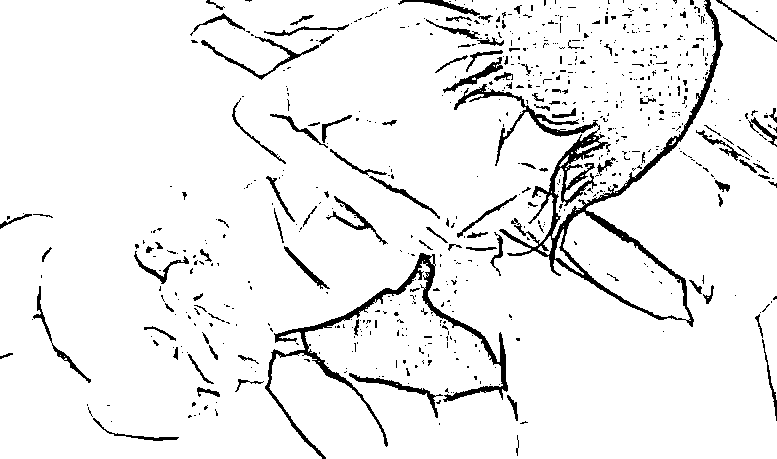
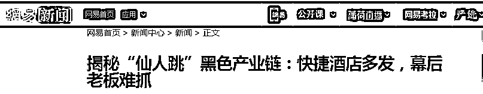
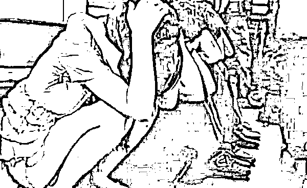

# “仙人跳”背后操作流程揭秘

> 原文：[`mp.weixin.qq.com/s?__biz=MzIyMDYwMTk0Mw==&mid=2247528437&idx=6&sn=ea851dab28046f4ce2e278e852f11458&chksm=97cba4cda0bc2ddbbc4108f2242c04d3b1ae8f7052f37ad15cd8e7e6b2bf9e55d6d83ad413ae&scene=27#wechat_redirect`](http://mp.weixin.qq.com/s?__biz=MzIyMDYwMTk0Mw==&mid=2247528437&idx=6&sn=ea851dab28046f4ce2e278e852f11458&chksm=97cba4cda0bc2ddbbc4108f2242c04d3b1ae8f7052f37ad15cd8e7e6b2bf9e55d6d83ad413ae&scene=27#wechat_redirect)

**“仙人跳”背后黑色产业链**

旧时以美女为诱饵，设置骗局诈骗钱财的一种圈套，被称之为“仙人跳”，如今多指以卖淫嫖娼为幌子，敲诈、偷抢嫖客谋取钱财。

记者注意到，此类案件近年逐渐增多，多发生在经济型快捷连锁酒店，“仙人跳”历来都是团伙犯罪，以前只是男女搭配，这些年已经形成了一个有人散发招嫖广告、有人抛头露面卖淫、幕后老板组局、（Jlls）打手司机保驾的黑色产业链。

由于网银和手机支付方式的普及，涉案金额也在不断攀升。

被害人怕受处理不敢报警是这类犯罪得手的关键。

该公众号已被封禁

**现象“仙人跳”多现快捷酒店**

记者查询到北京法院系统从 2013 年至 2016 年判决“仙人跳”案件 28 件，案件数量在逐年增多。

通过梳理这些案件记者发现，“仙人跳”的套路大致分为三类：最为多发的是通过散发招嫖卡片或发送招嫖信息，等待嫖客上钩，卖淫嫖娼之后以报警强奸等言语恐吓甚至暴力威胁的方式敲诈勒索或者抢劫嫖客钱财。这类犯罪基本上都发生在经济型快捷连锁酒店，被害人大多是来京出差人员，看到招嫖信息后主动联系找“小姐”，“自投罗网”。

第二类是通过站街招嫖，将嫖客约至出租房中，在卖淫嫖娼时趁事主不备，盗窃钱财。

还有较少案例是以招嫖名义直接骗取嫖客钱财。记者注意到，犯罪分子通常都是以事主身上的现金、手机等财物为目标。

这两年，随着网银和手机支付方式的普遍使用，仙人跳案件的犯罪数额也在不断增长，从几年前几百元的“收获”到现在动辄就是数千元甚至上万元、几万元不等。

**遭遇：男子落入陷阱被抢 29 万**

去年 1 月 18 日晚，陈先生在一家快捷连锁酒店住宿，他从房间地上捡到一张招嫖卡片，并按照卡片上的电话打电话联系上了一名男子，叫了一个“小姐”过来。

不一会儿，女子何某敲开了陈先生的房门进行卖淫。陈先生说，卖淫女竟向他索要 3000 元，不然就报警说陈先生强奸。陈先生犹豫之时，卖淫女打电话开着免提，里面传来一个男人凶狠的威胁，对方自称是警察，对陈先生罚款 3000 元，让陈先生和何某去取钱。陈先生无奈，一边和何某下楼到银行取钱，一边想脱身之计。到了银行，陈先生趁卖淫女掏他钱包和手机的机会，拔腿就跑。

怎料，这个局根本就不是卖淫女何某一个人单打独斗。（Jlls）在何某上楼卖淫时，负责保护望风的男子王某和司机赵某一直在楼下等信儿。何某将嫖客跑了的消息打电话告诉幕后老板，王某和赵某得到消息，拿着铁棍一路追打，最终将陈先生拉到车上。

陈先生说，他们从他身上搜出银行卡，三个人轮番抽他嘴巴，威胁他不说出银行卡密码就弄死他。陈先生被迫说出了密码。王某和何某去银行一查，里面竟有 29 万余元存款。接着，俩人按照老板的提示，先取了 2 万现金，又给老板转账 2 万。之后一行人又去了一家烟店，买了 25 万余元共 500 多条高档香烟，直到将陈先生的卡刷空，才找了个僻静地方把陈先生放了。回到酒店后，陈先生立即报警。王某、何某及司机赵某先后落网。

法院审理后认定三人均已构成抢劫罪，分别被判处十年六个月至七年不等有期徒刑，并分处罚金。

来京出差入住一家快捷酒店的张先生在酒店门缝里看到一些招嫖卡片，晚上便打电话叫了个“小姐”。完事后，他按照事先的约定，给了卖淫女 800 元嫖资。不过，卖淫女并没有要走的意思，说和张先生发生关系后肚子疼，让张先生再给他 5000 元作为小费。

张先生自称身上没钱了，卖淫女不慌不忙拨了一个电话，一边跟同伙说着什么，一边搜遍张先生全身，又找出 3000 元钱。卖淫女还嫌不够，张先生一口咬定没钱了。

不一会儿，三个男青年敲门进了屋。一听张先生说没钱，挑头的男子徐某只说了个“打”，另外两人对着张先生的头就是几拳。一挨揍，张先生害怕了，改口说自己还有银行卡，并说出了密码。打手拿着张先生的两张银行卡取出了 2 万余元，张先生才得以脱身。

几名嫌疑人落网之后，供出了这个团伙的分工和作案模式。提出抢劫主意的是主犯徐某，以前他就因为干这个被判过刑。作为团伙中的老大，徐某负责找人发招嫖卡片，并接听嫖客电话谈价格。谈好后就安排“小姐”上门卖淫。每次卖淫女和嫖客发生关系后，徐某都让卖淫女以肚子疼为由，让嫖客多给钱作为补偿。如果不给，徐某和打手就会来吓唬嫖客，直到对方给钱为止。（Jlls）得手后，几人便立即坐车，逃之夭夭。

**难题：幕后老板难抓**

小姐当“枪”落网，幕后老板难抓。

西城法院刑二庭一位法官刚刚审结了两起“仙人跳”案件，作案手法高度一致。相比于此前案例大多是团伙悉数落网的结果，这两起最近发生的案件都只有卖淫女一人获刑，背后的犯罪网络更加隐蔽。

法官表示，从目前的案件情况来看，当“枪”使的卖淫女获得了应有的惩罚，但幕后的组局者却很难被查获。犯罪手法的高度相似，不得不让人推测，他们背后是否有更大的犯罪网络。对这些幕后组局者的打击其实更加重要。

**提示：洁身自好远离犯罪**

遭抢嫖客被行拘，洁身自好远离犯罪。

在记者查询到的这些案件中，大部分都只认定了一起犯罪事实，而从被告人的供述来看，他们远不止一起作案。法官告诉记者，有的被告人自己曾承认以前就干过，而且得手了。但是被害人都没有报案，也没有其他证据，因此无法认定。

法官告诉记者，卖淫嫖娼原本就是违法行为，（Jlls）这些犯罪分子就是利用了嫖客怕受处理、碍面子不敢报警的心理，组局敲诈盗抢。只要劫取的钱财不多，或者后果不严重，嫖客大多都不愿报警。有的被害人在事发后因嫖娼被处以行政拘留的处理，随后更换了联系方式，不知去向。法官想向他们交付被敲诈的案款都找不到人了。

法官表示，这类犯罪都是以卖淫嫖娼为幌子，没有什么征兆可循，想远离“仙人跳”的陷阱，只有洁身自好，加强自律这一种方法。

**延伸阅读：**

[“仙人跳”背后有什么黑色产业链？](http://mp.weixin.qq.com/s?__biz=MzIyMDYwMTk0Mw==&mid=2247504387&idx=5&sn=a5c081ab74e27182fa57f90cd4cd029f&chksm=97cb193ba0bc902d1b60fc3a25bcbd04234eaf82d01df1933898be2ba1aa8cf1920bdd46a9f6&scene=21#wechat_redirect)

[遇到“仙人跳”该怎么处理](http://mp.weixin.qq.com/s?__biz=MzIyMDYwMTk0Mw==&mid=2247519926&idx=2&sn=8883e404448cb7d01f99deb4da052c3c&chksm=97cb458ea0bccc98dba498406e9112624f5e029c4aabbe5fc7295d955b9f43f519cf7ec9a2c3&scene=21#wechat_redirect)

[谭咏麟疑遭仙人跳已付封口费，博主已删除全部酒店照](http://mp.weixin.qq.com/s?__biz=MzIyMDYwMTk0Mw==&mid=2247525279&idx=1&sn=f5c10d20839dd124730ea57e4e60fa1d&chksm=97cba8a7a0bc21b1b8e16388bdf5636d559baa02326c81c12647a179280197743f643f91bbf2&scene=21#wechat_redirect)

来源：网易新闻、法律读报、景来律师

← 向右滑动与灰产圈互动交流 →

