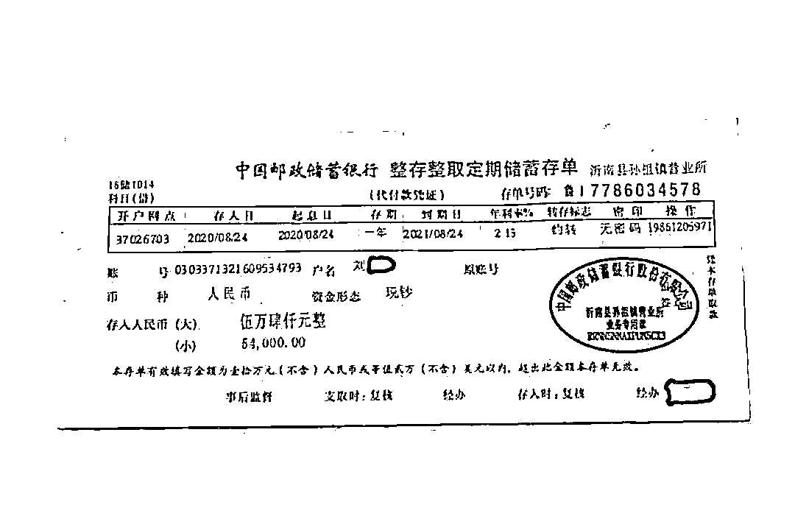

# 男子用 1 张假存单骗走爷爷 5.4 万，网友：真“孙子”

> 原文：[`mp.weixin.qq.com/s?__biz=MzIyMDYwMTk0Mw==&mid=2247528437&idx=7&sn=69c2f1ef9306bf00df833af39e0797e8&chksm=97cba4cda0bc2ddb17d792aa07631c123d9e5c0dc24054b0ffe812e608ebc636b42d639bf8a3&scene=27#wechat_redirect`](http://mp.weixin.qq.com/s?__biz=MzIyMDYwMTk0Mw==&mid=2247528437&idx=7&sn=69c2f1ef9306bf00df833af39e0797e8&chksm=97cba4cda0bc2ddb17d792aa07631c123d9e5c0dc24054b0ffe812e608ebc636b42d639bf8a3&scene=27#wechat_redirect)

[`v.qq.com/iframe/preview.html?width=500&height=375&auto=0&vid=y331924ftic`](https://v.qq.com/iframe/preview.html?width=500&height=375&auto=0&vid=y331924ftic)

近日，山东临沂一 90 岁老人到银行取钱时被发现存单系伪造，经民警调查后得知，老人此前有 5 张存单，在一次晾晒中发现丢失了 4 张存单，老人原想报警，但孙子刘某说会帮忙处理。

随后不久，孙子刘某便交还给老人一张假存单，老人虽疑惑为何自己丢失的四张存单变为一张，但由于是孙子帮忙处理，便没再多想，直到取钱时才知道被换了假存单。

经查证孙子刘某盗用了的身份证及 4 张存单，到银行取出存款 54000 元。又花 1200 元做假存单来糊弄爷爷，虽然老人事后念及亲情谅解了孙子，但刘某盗用他人身份证件、伪造金融票证的行为触犯法律，已被公安机关依法采取刑事强制措施。

1 月 23 日，此事在网上引发网友热议，有网友表示：“这是真‘孙子’”。

据平安临沂，近日，山东临沂市沂南县公安局孙祖派出所接到孙祖邮政储蓄所工作人员报警称，有人使用假存单到银行取钱。民警接警后赶至现场后发现，一名年近 90 岁的老汉正坐在银行柜台前，等着工作人员给办手续提钱。面对眼前的民警，他疑惑地表示：“我就正经地取个钱，咋还惊动警察了？”

据民警了解，该老人姓刘，这张存单是孙子刘某给“换”的。老人在 2014 年到 2015 年存了 5 次钱，共 5 张存单。2020 年夏天的一场特大暴雨，房屋里都灌进了水，老人便将存单等物品拿出来晾晒。

存单晾晒期间，老人发现少了 4 张总计 54000 元的存单，老人以为是遭了贼，一边在家翻找，一边联系家人报警。孙子刘某急忙找到老人，拍着胸脯说：“没事儿，你不用报警，存单少了，我去给你补一张就行了，这事交给我。” 果真，没几天，刘某就拿了一张“存单”，给了刘老汉。刘老汉心里面有点纳闷：“明明我 4 张存单，现在咋变成 1 张了？”但是孙子都说没事了，他也就没再深究。

近日，马上就是老人的 90 岁生日了。他拿着存单，打算到银行里取些钱，置办个新电视机，顺便赶集买点年货用品，却没想到钱没取成，还出了这档子事。

随后民警找到了老人的孙子刘某，刘某交代，自己一年多都没有活儿干了，手头上一毛钱都没有，突然想到爷爷那里还有好几张存单，就来了“灵感”。

先是盗用了老人的身份证及 4 张存单，到银行取出存款 54000 元，老人发现存单丢失后，刘某害怕事情败露，就在某手机软件上找了一个制作假证件的人，花费 1200 元，“定做”了一张中国邮政储蓄银行存单，“还”到了老人手里。

弄清楚了事情经过，老人很是气愤，但是念及亲情，仍然对刘某的行为表示了谅解。然而，刘某盗用他人身份证件、伪造金融票证的行为触犯法律，不容饶恕，已被公安机关依法采取刑事强制措施。

1 月 23 日，此事引发网友讨论，对此有网友无奈地表示：“这孙子当得好啊，专坑自己人”，也有网友不解道：“没想到还有至亲也骗的人”，还有网友气愤道：“我从小没见到过爷爷，想孝敬他都没机会，没想到居然还有人骗自己爷爷的钱”。

来源 ：晨视频、潇湘晨报综合平安临沂

← 向右滑动与灰产圈互动交流 →

