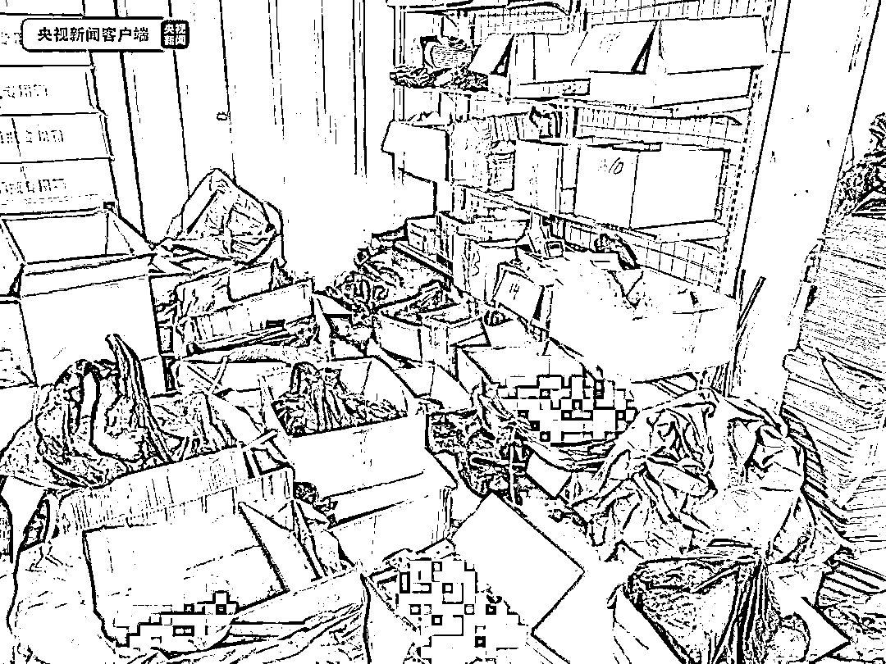
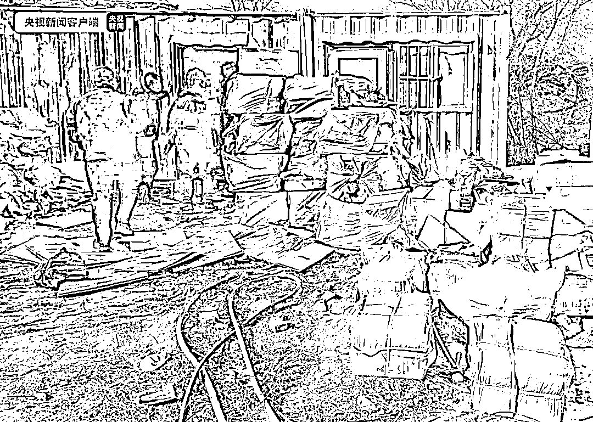

# 你买的“专特供”白酒或为低价酒勾兑！

> 原文：[`mp.weixin.qq.com/s?__biz=MzIyMDYwMTk0Mw==&mid=2247528437&idx=8&sn=9a6bf4671039fe64b4bb7cb883cf82f9&chksm=97cba4cda0bc2ddb8fdff986355f17ceb9297a7b731190d04a37760337df493a34f204660c68&scene=27#wechat_redirect`](http://mp.weixin.qq.com/s?__biz=MzIyMDYwMTk0Mw==&mid=2247528437&idx=8&sn=9a6bf4671039fe64b4bb7cb883cf82f9&chksm=97cba4cda0bc2ddb8fdff986355f17ceb9297a7b731190d04a37760337df493a34f204660c68&scene=27#wechat_redirect)

近日，北京市公安局环食药旅总队、丰台公安分局联动市场监管部门，全链条打掉了多个制售假冒品牌白酒的犯罪团伙，**捣毁制假售假黑窝点 8 处，刑事拘留 16 人，查获成品假冒品牌白酒 6800 余瓶、包装材料 30 余万件（套）、散装基酒 500 余公斤**，切实维护了群众餐桌安全。

[`mp.weixin.qq.com/mp/readtemplate?t=pages/video_player_tmpl&action=mpvideo&auto=0&vid=wxv_2236875216461463556`](https://mp.weixin.qq.com/mp/readtemplate?t=pages/video_player_tmpl&action=mpvideo&auto=0&vid=wxv_2236875216461463556)

△央视财经《第一时间》栏目视频

勿因小便宜吃大亏

北京警方工作中发现，有不法人员利用“两节”期间酒水热销的特点，非法制售假冒品牌白酒。对此，北京市公安局环食药旅总队、丰台公安分局及市场监管部门成立专班，联合打击，及时锁定了非法制售假酒及包材的涉案嫌疑人。

经连续摸排，工作专班全面查清了以竹某红、丁某刚等人为首的多个制售假冒品牌白酒犯罪团伙的组织架构和活动规律。

2021 年 12 月 31 日，工作专班开展集中收网，一举捣毁黑窝点 8 处，查扣成品白酒 6800 余瓶，散装基酒 500 余公斤，假冒品牌白酒包材 30 余万件（套），其中还包括了**一些印有多种虚构“专特供”字样的品牌白酒包材**，刑事拘留犯罪嫌疑 16 名。

据丰台公安分局环食药旅中队办案民警韩湃介绍，竹某红等人从外地大量购进包含印有“专特供”等字样的品牌假酒包材，然后销售给丁某刚等团伙，**丁某刚等人再从其他人处进购价格较低的品牌白酒，然后在窝点内进行勾兑、灌装、贴标，混充成高档品牌白酒及所谓的“专特供”白酒对外销售**，牟取不法利益。

据悉，早在 2013 年，国家多部门就曾联合发布严禁使用、制售冠以“特供”“专供”等标识的商品，并一直开展清理整治。**市面流通的虚构国家机关“专特供”酒绝大多数都是不法人员使用私自印制的包装材料，灌装以次充好的假酒**，消费者一定要保持理性，警惕所谓的“专特供”白酒，更不要对“专特供”盲目追捧，避免上当受骗。

目前，16 名犯罪嫌疑人因涉嫌假冒注册商标罪和销售非法制造的注册商标罪已被丰台公安分局依法刑事拘留，案件正在进一步侦办中。

团伙虽小 “五脏”俱全

打击“小案件”捣毁“全链条”

经警方审查发现，部分团伙间为亲属关系，上下线间单点联系，订单式生产，隐蔽性较强。

此外，这些团伙成员构成简单，多为夫妻或父子，人数较少，基本都是**“小团伙”**，但是制售假酒的环节从销售假酒包材、灌装假酒到封装分销可一样不少，链条比较完整，可以说是“五脏”俱全。部分链条还存在环节交织，互为上下线等情况。其中丁某刚团伙的下线高某雪，**一方面从丁某刚处购买标有“某某单位专用酒”等字样的“专特供”酒，另一方面又向丁某刚等人提供用于勾兑的基酒**。

警方提示 正规渠道购买最放心

据北京市公安局环食药旅总队食药支队副支队长王安介绍，按照公安部部署，北京警方联动市场监管、农业农村等部门，结合节前食品市场供需两旺的特点，紧盯食品市场销售、运输、仓储等重点环节，开展高频次执法检查、清理整治；在此基础上，持续加大对突出食品犯罪活动的专项打击。比如，在岁末年初，组织各属地公安分局开展针对制售假酒违法犯罪的专项打击，2022 年以来，相继破获制售假酒案件 19 起，刑事拘留 41 人，通过及时收网打击，避免了假酒流入市场。

春节将至，食品消费需求量增大，请广大市民朋友选择正规渠道购买，并留好发票和购物凭证。特别提醒，在购买品牌食品时，要注意价格和外包装标识，一旦发现质量问题请立即向市场监管部门举报，涉及违法犯罪线索请及时拨打 110 或 010-83061992 报案。

来源：央视新闻客户端、央视财经（ID：cctvyscj）

← 向右滑动与灰产圈互动交流 →

