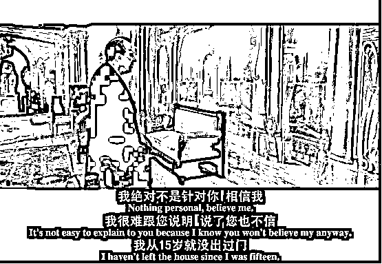

# 一个“仙人跳”的故事，揭露“杀猪盘”背后的心理操控术

> 原文：[`mp.weixin.qq.com/s?__biz=MzIyMDYwMTk0Mw==&mid=2247528492&idx=1&sn=323db6f1912396a62b5bec7bf40a468f&chksm=97cbbb14a0bc32021f0549e93f80d77b9bb64b3b399476b889b4ceac34a8e25d398bcfa5bce2&scene=27#wechat_redirect`](http://mp.weixin.qq.com/s?__biz=MzIyMDYwMTk0Mw==&mid=2247528492&idx=1&sn=323db6f1912396a62b5bec7bf40a468f&chksm=97cbbb14a0bc32021f0549e93f80d77b9bb64b3b399476b889b4ceac34a8e25d398bcfa5bce2&scene=27#wechat_redirect)

唐顿庄园里说“唯一比孤独更可怕的，是让人知道你孤独。”

周末，小编盲选观看了电影《最佳出价》，看完之后，「反诈之魂」熊熊燃烧。

这部电影就是一部很好的「反诈教科书电影」。

电影讲的是一位单身多年的高级鉴宝拍卖师惨遭“仙人跳”，被骗到一无所有从此一蹶不振的故事。

一切的恋爱剧情、人设都是围绕着如何让主角掉入陷阱而设计。

故事剧情并不新颖，让我感兴趣的则是其中的“情绪操控术”。

都知道，**一个完整的“杀猪盘”诈骗分为找猪、养猪、杀猪、洗钱四个步骤。**

亲密关系本质上是一种高度情绪化的体验，“养猪”是“杀猪盘”能否得手至关重要的一步，指利用高超的聊天技巧对受害人完成恋爱情绪操纵。

根据“全警反诈、全社会反诈”工作要求，今天，小编便借由这部电影与各位探讨骗子在“养猪”阶段是如何利用心理学技巧的。

电影不重要，重要的是解析杀猪盘里关键的点位，希望可以起到“打个响指，醒来”的作用，牢牢记住：

遇到这些套路，十有八九都是诈骗！

各位看官，搬好小板凳，开讲啦！

** 1 **

** 表 现 原 理 **

**原理和作用**

威廉詹姆斯的心理学表现原理认为：

**如果你微笑，你就会觉得幸福；如果你逃离，你会感到害怕。**

作用是通过用特定的行为来激起某种特定的情绪的目的，让骗子的人设在受害人心中初步建立。

**剧 情 展 示**

影片中，骗子团伙中负责“养猪”环节角色的人设为一个患有广场恐惧症、只能隔着门缝沟通的富家女。

她歇斯底里的哭喊和莫名其妙的神经质激发了受害人内心的好奇和保护欲。

这一步在受害人心中形成了“她不是一个普通的女人，她很特别”，从而产生了进一步的好奇心。

▲骗子设定【神经质】人设

 **“杀猪盘”实操应用**

骗子会从真诚自然的聊天中搜集信息，先判断“猎物”的特质并根据特质建立人设。

与许多报道不同的是，现在的人设并不是千篇一律的富二代、创始人形象了。

而是视情而定，如果受害人展现的是大龄迫嫁恋爱脑女青年，骗子便会表现出霸道的一面，提供情绪价值；如果你展现的拜金的一面，骗子则会树立有钱多金的人设。

充分调动受害人情绪与好奇心。

【以下对话来自卧底与骗子的真实聊天记录】

> ◍ 受害人（渴望恋爱）：你那边好吵啊。
> 
> ◍ 骗子：我在陪客户应酬，不是很喜欢这种事，忽然很想你，也没什么大事。你吃饭了吗？是不是还在加班？
> 
> ◍ 受害人此时开始自我暗示：这样的男生工作努力三观很正，虽然行业里有一些不好的风气，他也不愿意同流合污。

▲试探受害人成长背景

**2** 

** 自我暴露原理 **

**原理和作用**

指通过适当暴露自己的缺点，让对方产生亲近感。在人际关系中，自我暴露是迅速拉近人和人关系的方式之一。 

**剧 情 展 示**

影片中，骗子为了让“爱情”这个游戏变得更加刺激有趣，一会儿崩溃、一会儿消失、一会儿又向男主角敞开心扉诉说过往经历。

受害人被折腾得手忙脚乱，且又乐在其中，觉得和她关系变得非常亲近。 

▲骗子通过【自我暴露】拉近两人距离

 **“杀猪盘”实操应用**

立好人设之后，骗子其实并不会主动直接的提起副业、投资之类的话题。

通过表达自己的不满，故意暴露出自己的需求，让受害人觉得和他关系很亲密。

【以下对话来自卧底与骗子的真实聊天记录】

> ◍ 骗子：你在干嘛呢
> 
> ◍ 受害人：在外面应酬吃饭呢
> 
> ◍ 骗子：哦，然后呢，是要告诉我你约到男人了吗？（故意表现出不悦）
> 
> ◍ 受害人：不是，先吃了，晚点再聊
> 
> ◍ 骗子：吃吧，一个小时吃的完吗？是工作上的朋友吗？你不会在玩我吧。（继续表现出不悦，要受害人澄清）
> 
> ◍ 骗子甚至好几次主动提出了语音通话的请求：你方便语音吗？我感觉打字好累哈，想听听你的声音。

**3** 

** 定势和投射原理 **

**原理和作用**

定势是让受害人先入为主建立起对方不是骗子的印象，那么未来他所有的行为受害人都会自动倾向于用他不是骗子来解释。

投射则是通过赞美受害人的单纯和真诚，引导女生去相信真诚和单纯也是所看重和拥有的特质。

**作用是引导受害人相信真诚和单纯也是他所看重和拥有的特质。**

**剧 情 展 示**

影片中的骗子接近受害人的设定是请求整理、出卖满满一屋子的古董。这个设定有三个好处：

第一、请求很自然，我不懂古董，你是专家，我找你是很自然的；

第二、一屋子古董价值连城，我不差钱，所以自然不是冲你的钱来接近你的；

第三、我委托你拍卖古董，相当于把全部身价托付给你，我看重“信任”这个特质。

这就天然让受害人忽略了对方骗钱的可能性，引导受害人相信自己是个值得信任的人。 

▲骗子运用【定势】原理展示自身的高价值

▲骗子以“您是业界翘楚”将【高端】概念投射至自身

**“杀猪盘”实操应用**

骗子在骗局进行到第五天时故意谈到了自己的前女友，说自己受过情伤，被前女友欺骗，希望真诚单纯的受害人没有受过这类的伤害。 

【以下对话来自卧底与骗子的真实语音通话记录】

▲ 自我暴露曾被前女友欺骗

受害人此时内心会产生：**好心疼他啊，前女友真是个坏女人。并且对“副业”产生好奇。**

在这通语音后的几天内，骗子都没有再提到过“副业”。

第五天，受害人问骗子之前提到的副业是什么，想学学，而骗子竟然拒绝了。

以退为进增加了可信度和吸引力，同时也巧妙的把分享副业信息转换成亲密关系的证明。

▲ 以退为进拒绝受害人的投资请求

**4 **

** 煤气灯效应 **

**原理和作用**

“煤气灯效应”原理源自经典黑色悬疑片《煤气灯下》（Gaslight）。

**指的是对受害者施加的情感虐待和操控，被操控的人逐渐丧失自尊，产生自我怀疑，最终无法逃脱。**

讲述了丈夫为了谋取妻子的财产，千方百计把妻子逼疯的故事。 

▲ 电影《gaslight》剧照

**剧 情 展 示**

《最佳出价》中，骗子故意对受害人“染发”一事表现的非常介怀，让受害人怀疑自己的行为；

故意三番几次放受害人鸽子，让受害人怀疑自己的人格魅力；

又在之后疯狂道歉。

有节奏的控制、调动受害人的情绪，让受害人产生自我怀疑。

▲ 骗子让受害人自我怀疑

**“杀猪盘”实操应用**

所有的杀猪盘都有一个天生的 BUG，那就是对话那个人的真实长相。

杀猪盘的骗子非常拒绝视频通话，因为骗子的真实长相和社交 APP 的头像对不起来。

只要女生坚持视频通话，骗子就会曝光。

那么针对这个 BUG，他们运用了【煤气灯效应】，这个经典的心理操控技术。 

【以下对话来自卧底与骗子的真实语音通话记录】

▲ 利用【煤气灯效应】让女生不再提出视频通话

此时，内心不强的女生就非常有可能顺着他的引导，开始自我反思和自我怀疑。

在之后的交往过程中，女生会主动的提出不再视频通话，来向对方证明自己是有耐心的，而这一切，正中骗子下怀。

**防范提醒** 

当下，各行各业分工越来越趋向精细化，在从事反诈工作之前，小编一度存有“杀猪盘的受害人都是脑子不太清楚”的偏见。

而当小编真正开始研究电信网络诈骗案例、了解到设计精妙的话术与技巧之后，才知道这种认知对受害人而言是极不公平的。

**因为他/她面对的是一个庞大的产业链，包括人设打造、心理学原理、专业剧本杀和添柴战术等。**

每个人都有认知边界，我们真的不要高估自己的认知极限。

当遇到用心经营极富“演员的自我修养”围绕你量身打造骗局时，大部分普通人真的会懵。

因为我们普通人经历的大场面太少，遇到层出不穷的套路，直接就撞到了自己的认知盲区，慌不择路就会被骗。

就像中了邪一样，陷入了骗子设置的场景中，警察和银行工作人员拉都拉不住，非要给骗子打钱。

在找寻资料的过程中发现，诈**骗团伙甚至会从《鲁豫有约》、《咏乐汇》等优秀访谈类节目中总结有效的沟通技巧。**

而杀猪盘类诈骗从最早的酒托、送花篮诈骗，再到美国兵哥哥送金条、少妇重金求子，再到用婚恋交友网站、互联网聊天工具建立链接，骗术一直在更新迭代，但核心不变，就是利用人性的弱点。

我们每一个未曾说出口的欲望，每一个内心隐藏的伤痕，都是吸引他们狩猎的信号。

当我们在凝望杀猪盘时，杀猪盘也在凝望着我们。

我想，与其致力于分析受害人的画像特征，不如透彻揭露骗子们所使用的技巧与话术。

希望给大家以提醒，也可以给一线劝阻工作人员以反向话术支撑。

据宁波市公安局《2021 年度全市电信网络诈骗排行榜出炉》一文显示，2021 年，百万以上案件中，有 52.8%的诈骗时间超过了 1 个月。

如“杀猪盘”诈骗同时涉及婚恋交友、即时通讯等多个平台，融合刷单、“杀猪盘”等多种手法，实施连环诈骗。

倾家荡产之后，许多受害人仍不肯相信经历的“爱情”竟是一场骗局，仍要苦苦追问“他到底有没有爱过我”，令人唏嘘。 

针对杀猪盘类诈骗，警方提醒如下：

**第一，涉及到钱和感情，大家一定要清醒—这是社交里的底线和红线。**

一定要切记，任何涉及钱的事情，必须见面谈！任何理由都不能成为不见面的借口。

不要轻易把钱转出去。如今科技太发达了，不见面的感情你就【当】对方是用了变声器，或者通过 AI 换脸的视频录播。

**第二，请大家务必下载国家反诈中心 APP！**

APP 通过尽可能实时跟踪境外诈骗服务器来进行有效反诈，相当于是把国家最强的计算机防御数据库和算力，免费共享给了每一位老百姓，可以在第一时间阻止境外诈骗。

此外，光下载国家反诈中心 APP 而不开启自动防护功能，就像装了一个没有通电的空气净化器。

**第三，如遭遇诈骗，请立即拨打国家反诈专线电话 96110 或者 110 报警电话求助！**

**延伸阅读：**

**[“仙人跳”背后有什么黑色产业链？](http://mp.weixin.qq.com/s?__biz=MzIyMDYwMTk0Mw==&mid=2247504387&idx=5&sn=a5c081ab74e27182fa57f90cd4cd029f&chksm=97cb193ba0bc902d1b60fc3a25bcbd04234eaf82d01df1933898be2ba1aa8cf1920bdd46a9f6&scene=21#wechat_redirect)**

**[遇到“仙人跳”该怎么处理？](http://mp.weixin.qq.com/s?__biz=MzIyMDYwMTk0Mw==&mid=2247519926&idx=2&sn=8883e404448cb7d01f99deb4da052c3c&chksm=97cb458ea0bccc98dba498406e9112624f5e029c4aabbe5fc7295d955b9f43f519cf7ec9a2c3&scene=21#wechat_redirect)**

**[谭咏麟疑遭仙人跳已付封口费，博主已删除全部酒店照](http://mp.weixin.qq.com/s?__biz=MzIyMDYwMTk0Mw==&mid=2247525279&idx=1&sn=f5c10d20839dd124730ea57e4e60fa1d&chksm=97cba8a7a0bc21b1b8e16388bdf5636d559baa02326c81c12647a179280197743f643f91bbf2&scene=21#wechat_redirect)**

**[“仙人跳”背后操作流程揭秘](http://mp.weixin.qq.com/s?__biz=MzIyMDYwMTk0Mw==&mid=2247528437&idx=6&sn=ea851dab28046f4ce2e278e852f11458&chksm=97cba4cda0bc2ddbbc4108f2242c04d3b1ae8f7052f37ad15cd8e7e6b2bf9e55d6d83ad413ae&scene=21#wechat_redirect)**

来源：鄞州公安，黑白呸

← 向右滑动与灰产圈互动交流 →

