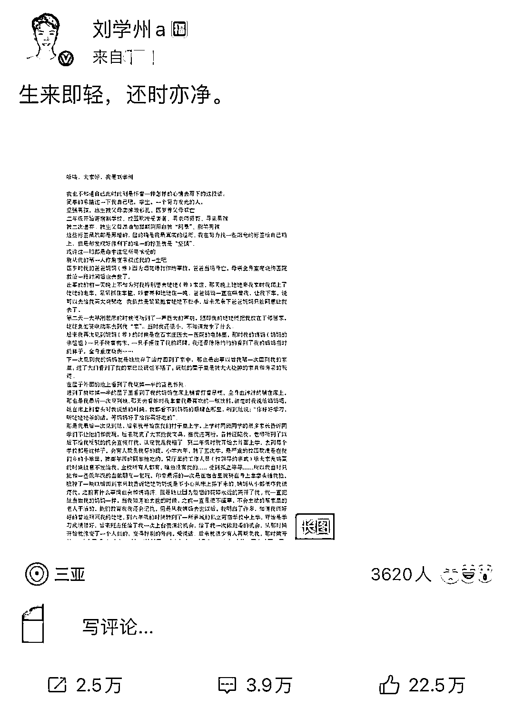
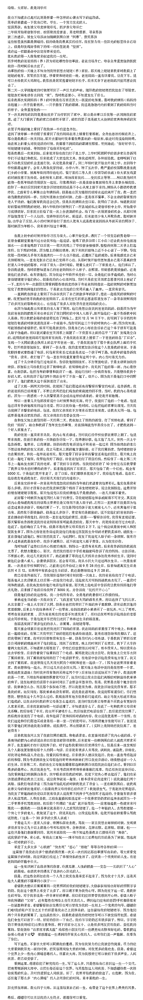

# 噩耗！今天凌晨，抢救无效死亡

> 原文：[`mp.weixin.qq.com/s?__biz=MzIyMDYwMTk0Mw==&mid=2247528492&idx=2&sn=9af550052c2e09a56ad3a99d88a05c01&chksm=97cbbb14a0bc320277c598fd3673046a352f9f6834fbd3fd3ee05220a194720464b0324450e1&scene=27#wechat_redirect`](http://mp.weixin.qq.com/s?__biz=MzIyMDYwMTk0Mw==&mid=2247528492&idx=2&sn=9af550052c2e09a56ad3a99d88a05c01&chksm=97cbbb14a0bc320277c598fd3673046a352f9f6834fbd3fd3ee05220a194720464b0324450e1&scene=27#wechat_redirect)

**“阳光照在海面，我也归于大海。从这里结束自己的一生，也带走了这个世界上最美的风景。”**

**今天（1 月 24 日）凌晨 0 点 02 分，河北寻亲男孩刘学州发微博长文，文中疑似有自杀倾向**，引起众多网友关注。该微博长文下，刘学州定位显示在三亚。

**凌晨 2 点多，刘学州的舅妈柴某对媒体说：“刘学州在三亚海边吃了药，被好心人发现后，正在医院紧急抢救。”**

之后，**柴某称，****凌晨 4 点**多**，刘学州经抢救无效死亡。**

另据澎湃新闻消息，记者从三亚市 110 指挥中心获悉，****此前寻亲成功后被生母微信拉黑的男孩刘学州自杀，于当日凌晨经抢救无效死亡，****具体情况仍在调查中。

**疑似因遭网暴轻生**

24 日凌晨，刘学州在微博发布疑似遗书的帖文称，自己出生时被父母卖掉做彩礼，4 岁养父母双亡，曾是校园欺凌的受害者。“寻亲男孩被二次遗弃”等标签是他最真实的经历。

**文中，刘学州称，他寻亲成功后，因在网上公开自己被生母拉黑的截图、被“一些颠倒黑白的人说要求买房子”等经历，遭到众多网友的网络暴力。****他想“归于大海，在这里结束自己的一生”。**

来源：@刘学州 a

**有媒体注意到，1 月 21 日，曾有网友在刘学州的微博评论区留言质疑刘学州，称刘学州是在利用寻亲给自己炒作、立人设，刘学州的行为是利用网友的善良博取同情心。**

对此，刘学州在微博评论留言称，“诽谤是违法的，保留证据了”。

**24 日凌晨，刘学州发布该文后，众多网友留言表示赶快报警。**

针对此事，24 日 2 时许，三亚市公安局一名接警人员告诉媒体，此前他们已经接到相关报警，已去处理，其他情况暂不清楚。同日，有多名网友在刘学州的微博下称已报警，希望他平安无事。

24 日 2 时许，有媒体多次致电刘学州，电话均被挂断，无回应。

**凌晨 2 点**多**，刘学州的舅妈柴某对媒体说：“刘学州在三亚海边吃了药，被好心人发现后，正在医院紧急抢救。”**

**之后，柴某称，****凌晨 4 点**多**，刘学州经抢救无效死亡。**

**曾称将起诉亲生父母**

此前，2021 年 12 月 6 日，刘学州在网上发布寻亲视频。视频中，他自称来自河北邢台，2004 年到 2006 年之间出生，由于父母是未婚时生下他，在他三个月大时，养父母从山西大同一家饭店将他买来。

2021 年 12 月 15 日，山西临汾警方通过 DNA 比对找到了刘学州的亲生父亲。

2021 年 12 月 27 日，刘学州在石家庄见到了生父丁某。

2022 年 1 月初，刘学州又前往内蒙古见到生母。

刘学州称，养父母因烟花爆炸去世之后，4 岁的他随姥姥姥爷一起生活，爷爷奶奶也会给予抚养费用。如今，他在河北一所专科学校读书，平时会兼职打工，虽然辛苦，但基本可以供自己的学习和生活所需。**17 岁的他网络寻亲成功后，自称因住房问题被生母拉黑。**

1 月 18 日，刘学州在微博上发声，“我找他们要一个属于我自己的家有错吗？”

**1 月 19 日，刘学州再次在微博上称，将起诉其亲生父母。**当晚，刘学州告诉媒体，他正在为起诉亲生父母做相应的法律程序上的准备。这段时间他住在自己租的房间里，下一步计划报警，希望司法机关对其亲生父母进行刑事追诉，“希望能以拐卖儿童罪和遗弃罪提起公诉”。

如果刘学州确实因遭受网络暴力轻生，真是令人心碎！

来源：杭州交通 918 央视网、澎湃新闻、上观新闻、长沙晚报

← 向右滑动与灰产圈互动交流 →

