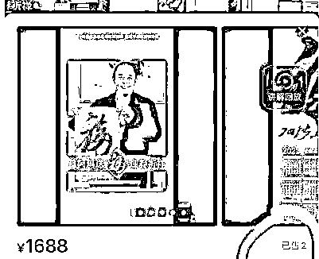
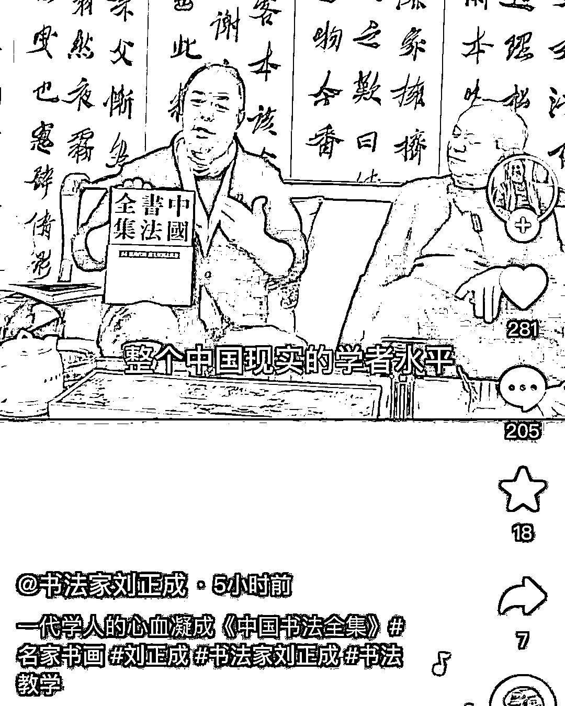
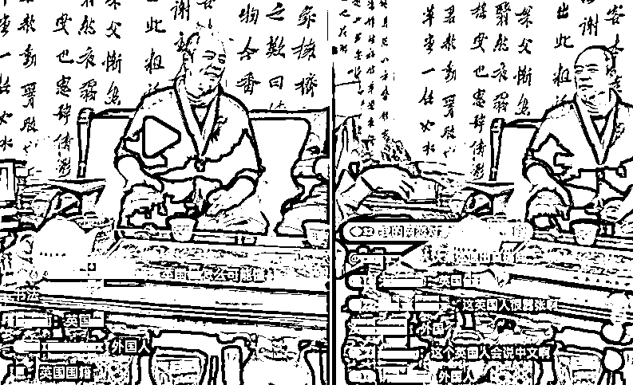
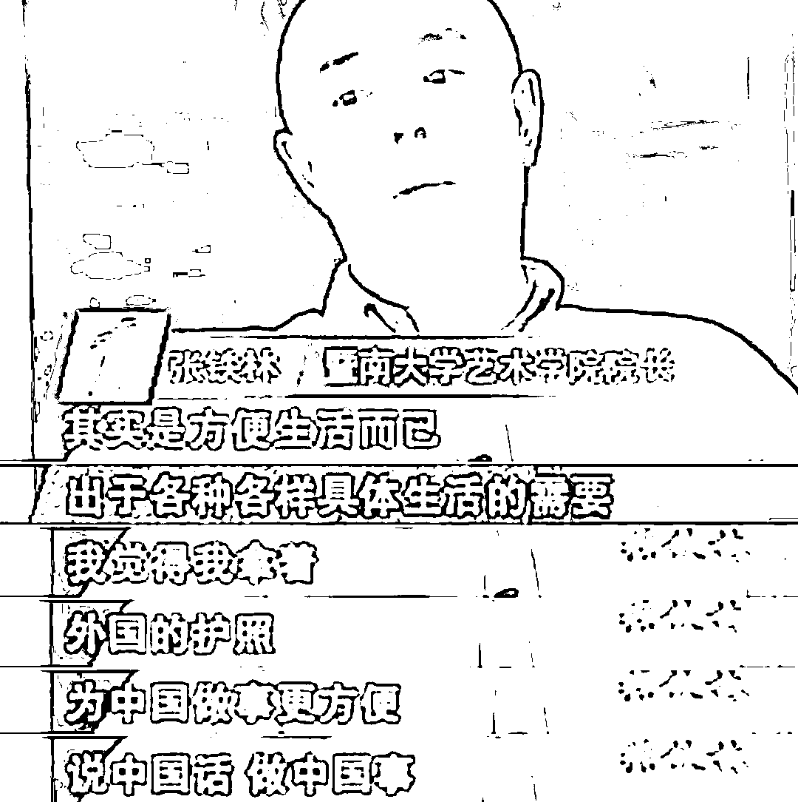
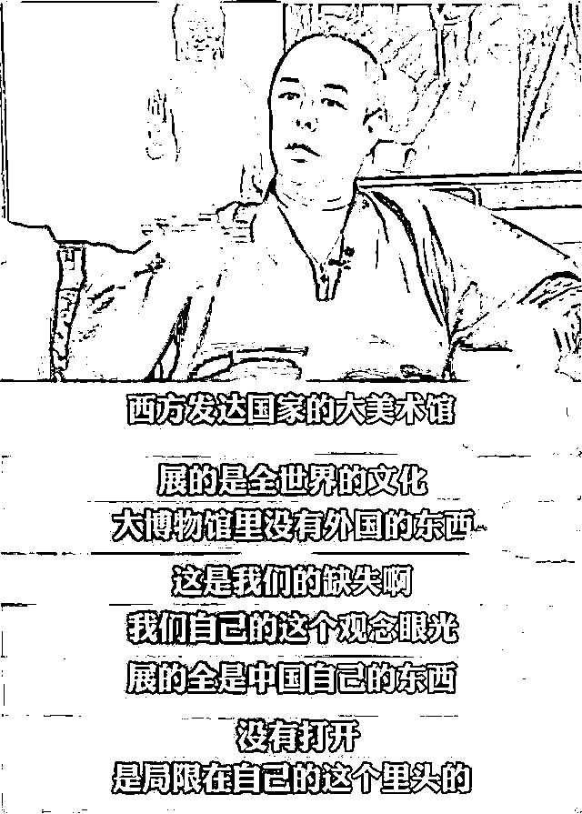
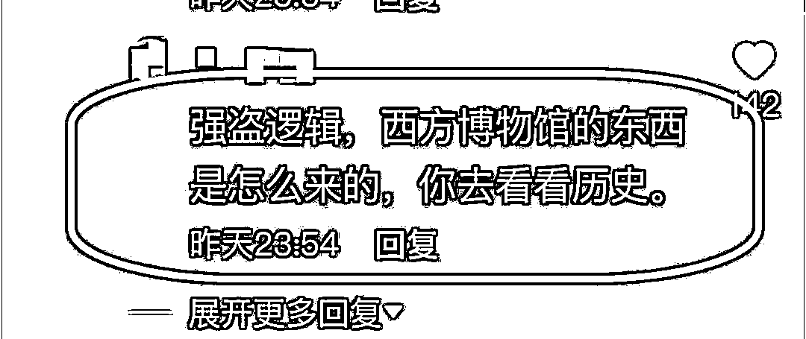

# 张铁林，翻车了！

> 原文：[`mp.weixin.qq.com/s?__biz=MzIyMDYwMTk0Mw==&mid=2247528492&idx=3&sn=4642e504fc28252dea339c674c12906a&chksm=97cbbb14a0bc3202b75bf93c14c7d2e9ffa330ca1c7743cdbac4ec015485e45338cf2003b4d0&scene=27#wechat_redirect`](http://mp.weixin.qq.com/s?__biz=MzIyMDYwMTk0Mw==&mid=2247528492&idx=3&sn=4642e504fc28252dea339c674c12906a&chksm=97cbbb14a0bc3202b75bf93c14c7d2e9ffa330ca1c7743cdbac4ec015485e45338cf2003b4d0&scene=27#wechat_redirect)

说到演员**张铁林**

大家的第一印象就是“皇阿玛”

作为“皇阿玛专业户”的他

其实还热衷于写书法

随着直播带货在娱乐圈不断兴起

张铁林也加入了这一行列

**在直播间里卖起了自己的书法作品**

不过，相较于部分明星的可观销量

**“皇阿玛”的直播却翻车了...**

[`v.qq.com/iframe/preview.html?width=500&height=375&auto=0&vid=g3319w7nf87`](https://v.qq.com/iframe/preview.html?width=500&height=375&auto=0&vid=g3319w7nf87)

借着春节将至的节点，近日，英国籍演员张铁林在自己的直播间拿出 30 张亲笔写的的“福字”书法作品叫卖，**每张定价 1688 元。**他还强调，**自己的书法作品平时都要 10 万元一幅****，这一波让利是****“皇阿玛送福”。**

“这次来直播间就当送给大家了，不要 9999，不要 8888，仅需 1688 一个成本价，一点钱也不赚，今天就是高兴，不是为了赚钱，就写 30 个福字……”

然而，**网友们似乎并不太买账**，怒批其“吃相难看”、“想钱想疯了”。直到直播结束，**后台显示这款“福”字也只售出了两幅。**

不过，这次直播的销售惨淡

并没有让张铁林泄气

1 月 21 日晚，张铁林又做客

书法家刘正成的直播间

几人畅谈中国书法

他还推荐粉丝购买书法相关的书籍

结果直播间**被大批网友用诸如“英国人”“英国人懂什么书法”的留言刷屏，评论区整个一个大翻车。**

直播过程中，张铁林等人没有理睬评论区，继续谈论与书法相关的内容，**不久后就离开了直播间，事后他也未就此事做出回应。**

近几年因一些个人私德问题

“老戏骨”张铁林身上争议不断

1997 年张铁林加入英国国籍，随后他多次在公开场合称此举是“为了中国”。2008 年，他在《名人讲堂》以“中国人的特征”为话题进行演讲，表示自己加入英籍是为争取更多机会，让世界了解中国，做更好的中国人。

后来接受专访时，他也被问到相关问题。时任暨南大学艺术学院院长的张铁林说，**无论是贷款、旅游，还是工作，那个年代拿着外国护照在各方面都很便利**。话锋一转，他又表示，“我觉得我拿着外国护照为中国做事更方便，说中国话，做中国事，弘扬中国的东西。”

不过这些言论都曾被网友诟病。

****

**2015 年，张铁林又**找了一位所谓的藏传佛教“法王”主持了“坐床”仪式，给自己弄了个“活佛”头衔**，结果遭到广大网友举报。**

**就在去年，张铁林还因一番就**

**“怎样才能体现中国文化的光辉”的高谈阔论**

**引起极大争议**

**↓↓↓** 

**当时他痛心疾首地表示，中国文化坐井观天，不拿别人的东西当东西，在中国的大美术馆里，没有外国的东西；而在西方的美术馆里，则陈列着世界各地的珍贵文物，**“中国的博物馆中并没有外国的东西，这是我们的缺失啊！我们的文化是局限在自己窝里头的，我们不拿自己的文化当做世界文化的一部分。”****

**当时这段话有不少网友反驳：**为什么西方国家的博物馆陈列着世界各地的珍贵文物？那是抢来的！****

********

****

****对此，你怎么看？****

**来源：观察者网、新闻晨报、长沙晚报**

****

**← 向右滑动与灰产圈互动交流 →**

****