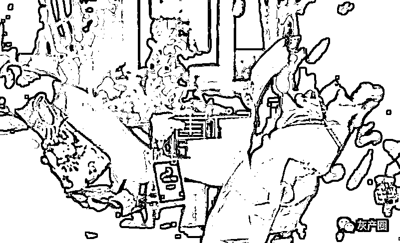

# 《缅甸魂惊梦破》

> 原文：[`mp.weixin.qq.com/s?__biz=MzIyMDYwMTk0Mw==&mid=2247528492&idx=5&sn=e8062f7a515f2f3c718a431550075b67&chksm=97cbbb14a0bc32029df9b5b217a6bc17984f476b745fb63011660012c827863ce93498eba5a6&scene=27#wechat_redirect`](http://mp.weixin.qq.com/s?__biz=MzIyMDYwMTk0Mw==&mid=2247528492&idx=5&sn=e8062f7a515f2f3c718a431550075b67&chksm=97cbbb14a0bc32029df9b5b217a6bc17984f476b745fb63011660012c827863ce93498eba5a6&scene=27#wechat_redirect)

**——根据“3·28”特大跨境电信网络诈骗案某被告人自述整理**

**时间：**2022 年 1 月 17 日晚 21:21

**地点：**3.28 案取保候审被告人管控点 

**采访人：**西法宣

**被采访人：**林（男）、香（女），系夫妻

* * *

**访 前 语**

庭审将要结束，从南方来的林和香总算松了一口气，公诉机关鉴于二人的犯罪事实，当庭建议可以适用缓刑……然而，他们夫妻在缅甸的所作所为，不仅仅是害人，也是害己不浅。

**西法宣：**你们去缅甸之前做什么工作？

林：我们都在厦门上班，碰到疫情嘛......

香：我老公他表达的没有我流畅，让我说。他每天开车送货，比较辛苦，我是在一家酒店当领班，相对好一些。我们两个人的工资加起来一月也有万把块，说起来还是不错的。2020 年春节，我们回老家过年，不想爆发了疫情，春节过后，就没法自由行动了，所以无法回到厦门，我们老家那儿也是因为疫情找不到工作，就在家里闲呆着。

**西法宣：**听说你们家在农村，也可以做农活的？

林：家里地少，父母身体还行，他们完全能够种稻子、种菜的，不需要更多的人手。

香：婆婆家就是他说的那样，现在包括我儿子五口人，父母都在，儿子快五岁了。娘家里，我母亲在老家带弟弟的孩子，弟弟这次也是被抓了，关在看守所里。开庭的时候，我俩从现场视频里能看到我弟弟，也能听到他的声音，我想他也能看到我俩，能听到我俩的声音。我们以这样的方式互相看、互相听，心里是一种别样的酸楚。

**西法宣：**原来你弟弟也是同案被告人，那你们是什么样的情况下，去缅甸加入诈骗集团的呢？

林：是她弟弟先过去的嘛，然后......也就是骗我们去的。

香：我弟弟是先过去的，可我不知道他从事的是什么行业，他说他在缅甸电子科技公司上班，我弟弟从小听话，他说的话，我从来都没怀疑过。他知道我们夫妻有欠债，结婚就欠了别人 5 万块，一直没有还上去，他就想叫我们过去也挣些钱回来。

**西法宣：**观看庭审直播，对你弟弟印象很深，也就是公诉人当庭呈辞：“可恨的是，你竟然把自己的亲姐姐、姐夫都拉进诈骗集团！”是吧？

林：公诉人是这么说，我也看到他被问的时候低下了头，我想他肯定是羞愧难当。

香：嗯，其实我们也不算是他被拉进去的，当时他知道我们没有工作，他也没有直接叫，而是通过推荐那个集团的总监微信给我，就是还没有抓住的那个张宇（化名）。是我们自己联系了张宇。当时我和张宇互加了微信后，张宇就问我们是不是没有工作可干？会电脑吗？他说那边要招人，主要工作就是负责教人玩游戏。

林：一开始张宇是这样说的，还说这个工作技术要求不高，只要会简单地操作电脑、能打字就可以，工作任务不重，只上白天班，不需要加班，保底工资 5000 元，包吃住，业绩好的话还会有一定比例的提成，加上提成，每月工资过万是很轻松的事，当时说的可好了。

香：还有最主要一点吸引了我们，张宇说只要做满半年，公司就会报销来回的机票。国外嘛，肯定是像电视上一样，自由、好玩，赚钱还容易，这就是我当时对国外的认知。说到我们去缅甸，我们是有护照的，我的护照在酒店工作时，因为喜欢旅游，早些年就办好的，但一直没有用过。当时我老公没有护照，在去缅甸之前，急急忙忙地陪他办了护照。我们想，去国外工作，又不是干什么丢人的事，就持护照正正当当地通过边检出去。可谁想，到边防口岸时，张宇说缅甸疫情比国内严重，从正规途径过去，会被隔离 14 天，这样你们会少挣半个月工资，你俩就会损失一万多块，所以只能走捷径。我们想着能多挣钱，就跟着他绕开边防巡警，偷偷摸摸从没有人烟的山林中出去了，其实就是偷渡。拿着护照偷渡，你说我们愚蠢不愚蠢！

林：张宇说有疫情影响，我还以为他们有自己车接送或者什么特殊通道过去，结果走的是异常凶险的山路，一路是杂草丛生、泥泞崎岖。如果是在国内的话，我们早就不干了，但是，到那种山上，如果没人带，自己根本找不方向，找不到路，一定会死在荒山上。

**西法宣：**你们到缅甸后，有你们想象的那么美好吗？

林：我们去的地方，张宇说是个大县城，结果和一个村子一样，路上全是烂泥巴，在国内根本见不到这样的村子，更别说是县城了。

香：后悔的肠子都青了。

**西法宣：**在那里工作，是张宇给你们描述的那样吗？

林：全是骗人的。我们被带到公司后，就一通所谓的培训，其实就教我们怎么通过微信、QQ、陌陌、探探等交友软件骗人刷单、投资、竞猜，然后公司用作弊的方式侵吞被骗人的钱财。

香：我记得特别清楚的，来接我的组长很凶，就是那个还没有抓住的“良子”，给我们搞培训，也没什么技术含量。只让我们坐在别人上班的工位旁边，我们也不知道他们在干嘛，都很忙，也没空理我们，我们就在旁边看，也不知该干什么。我以为他们在跟同事聊微信，我还纳闷怎么会和那么多人聊天。

林：我记起来了，培训了三天，有好多内容，像填鸭子一样。

香：培训时，负责管理我们的组长，给我们发了本培训手册，里面全是针对不同的聊天对象需要运用什么语言去哄骗，目的是让聊天对象信任我们，好让我们一步一步套牢她们。

林：记得有个代号叫“胖子”的组长，反复给我洗脑，说什么，不要自己觉得内疚，这些女的被骗，跟她们自己有很大的关系，就是爱贪便宜，她不跟你聊天，也会去跟其他人聊天，同样也会被骗。因为这些女的都是喜欢聊暧昧、喜欢寄托感情。

**西法宣：**发现入职公司是实施电信网络诈骗违法活动后，你们为什么还要留下？

林：我们来都来了，费了好大事才来，主要是看能不能真的挣上些钱。

香：我刚开始是抗拒的，虚假配合的那一种，想应付那个检查的组长。可是，我们干了几天后，还是想挣些钱后再回去。

**西法宣：**你俩骗成功了几单？

林：因为时间短，加好友是能加成功的，但得手的还没有。

香：我当时记性不好，刚生完孩子，让我同时跟三四个人聊天，根本记不得我说了什么，盯不住，把自己聊晕了。天天被人家骂，我被骂的次数最多。大多数时候就是尬聊，有时候上边的代理看着加上好的资源（可能会上当的人），就把我手机收走，自己去“养”。

**西法宣：**你们所物色被害人都有什么共同点？就是哪些人容易成诈骗的目标？

林：就是专挑女的下手，况且我们的身份是经过伪装了的，不是高富帅，就是成功人士。我们有时也觉得奇怪，有些人连视频都不看一下，或者只看一眼我们发的假照片、假话，就相信了，让干啥就干啥。

香：毕竟我也是女人，让我老公一直和别的女人聊，我也接受不了。另外，我明明一个女的，公司也让我伪装成一个男的。公司里有监督我们的组长、代理、总监，一直让我们入戏，要求完全把自己投入到角色里面。

香：“财神国际”诈骗集团一般让我们加 30~35 岁之间的女网友，特别是那种头像用真人照片的。如果她们朋友圈中文字、图片什么的，表现的比较伤感，我们就作为重点，因为这种人容易敞开心扉向别人倾诉，一般有赌博、打牌的习惯。当然也有例外，我就聊过一个，感情聊的很好，但人家生活习惯好，没有不良嗜好，始终不上当。代理发现后，就气急败坏地骂“*的，扑克都不会打！”

**西法宣：**你们伪装的“高富帅”等身份有什么特点吗？

林：有，都是成功的男人，有钱，有豪车，长得帅，我们找来的照片都用的是模特照片，或者从网上下载的。我们伪装身份一般都是自己创业，经历感情失败或者是有过创伤，或者，本来是成功人士，后来失败了，又靠网上这种理财软件，搞副业又发了财、翻了身，基本就是以这种身份包装，以这种经历虚构。我当时就是伪装成一个传媒公司的单身老板，失败后又创业成功的那种。

香：先让同情我，再让佩服我，然后她们就会相信我，更会愿意向我倾诉她心事。我们聊天的时候，公司组长大多是坐我边上，他就盯着，“哎，这个人好像跟你聊天挺频繁的，比较依赖你”，然后他觉得能骗上，就拿过去，接着往“肥”里“养了”。

**西法宣：**你们为什么把这种行骗过程叫“杀猪盘”？多侮辱人啊！

林：因为通过网上聊感情，然后被骗到钱，说明这些人笨啊，人们不是说，猪都是笨的嘛。

香：就是把这些容易上当的人叫猪，就是因为我们通常认为猪是比较愚蠢的动物，当然有时也叫鸡，反正没用什么好的词语，比如“发现猪了”“猪来了”“养猪”“猪跑了”“养肥猪”“猪肥了”“这个猪可以杀了”“猪杀了”等等。

**西法宣：**你们去缅甸干诈骗的事，家里人和周围亲戚朋友都知道吗？

香：我们一直瞒着他们，后来我们被公安抓了，我父母、我婆婆、公公一直都还怪我们怎么会去那样子的地方呢？太恐怖了。

**西法宣：**再了解个情况，你们偷渡，需不需要花钱？

林：怎么不要钱呢？！还特别多。偷渡是按照路段收费的，不是一次给多少钱的那种，而是一人先交 3000 块，蛇头负责领到山脚下；在带领爬山越岭的过程中，那又得另外收费，也是 2000 到 3000 块，这还不算完，到国界边上，还要交钱，蛇头才负责送你到边界这边来，只有他们知道哪里有路、哪里可以躲过边防检查。这个过程全是拿钱买的，不给钱，想回来是没门的。

**西法宣：**诈骗公司之所以能够行骗那么多的人，你们也是为虎作伥，这次教训，对你们深不深？

林：对的，我们应该在第一时间发现是干诈骗勾当后，就死活不参与了，但后来还是想趁机挣些钱回来，因为当时看他们骗钱特别容易也特别多，就鬼迷心窍了。

香：通过这事，我明白，哪儿有什么轻轻松松就能挣上大钱的事，干违法的事，可能会挣上钱，但终究会被发现，并且会付出惨痛代价。大家都通过这次审判看到了，这么多人都会被判刑，不但会影响自己人生，以后还影响子孙后代。

**访后语**

人生路，精采、多样、漫长，甚至坎坷、起落，走什么路，怎么走，走向何方，需要理智地去选择。路上的坑，有别人挖的，有自己挖的，躲与不躲，要脑子清、眼神明。是绕过去、跳过去，还掉下去、跳下去，其实都得看自己。

来源：博度内比都

← 向右滑动与灰产圈互动交流 →

