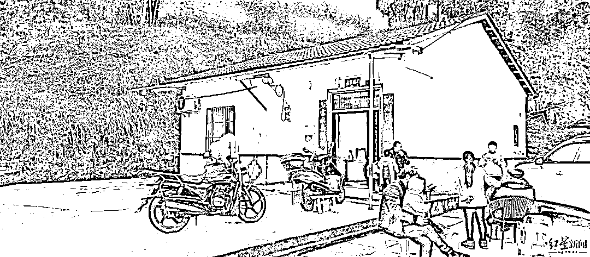
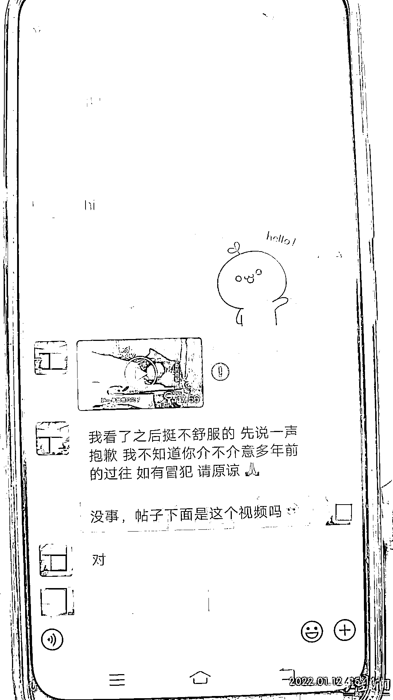
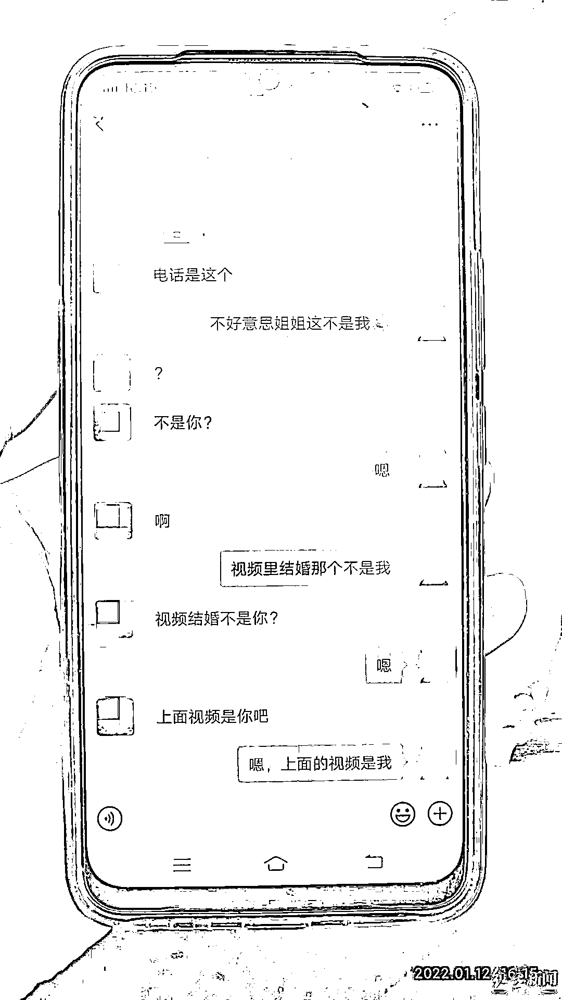

# 视频被疯传，女子恳求：别再转了！

> 原文：[`mp.weixin.qq.com/s?__biz=MzIyMDYwMTk0Mw==&mid=2247528492&idx=6&sn=ecfeeec55e9a3a227018f7ee03c2cc8e&chksm=97cbbb14a0bc3202171da4f70e73b54941ebdda4ffea453331edc5d2d4b60a8740c250569483&scene=27#wechat_redirect`](http://mp.weixin.qq.com/s?__biz=MzIyMDYwMTk0Mw==&mid=2247528492&idx=6&sn=ecfeeec55e9a3a227018f7ee03c2cc8e&chksm=97cbbb14a0bc3202171da4f70e73b54941ebdda4ffea453331edc5d2d4b60a8740c250569483&scene=27#wechat_redirect)

**四川女孩 12 年前的视频**

****被人“掐头去尾”制作****

****在网上多个平台转发****

****在网络流浪的裹挟下**** 

****女孩平静的生活被打破****

****……****

**2010 年，四川渠县琅琊镇 12 岁女孩玉玲，**因患怪病辍学，****身体长脓疮并溃烂。****

**与病魔搏斗的玉玲希望能见爸爸、妈妈最后一面。实际上，玉玲是父亲在福建打工时与一同居女子生育的，出生之后就被爸爸放在四川渠县老家由爷爷照看。之后，父亲再没有回过家，玉玲也再没见过母亲。**

**玉玲患病之后，热心邻居和村民给在外打工的玉玲父亲打电话。得到的却是亲生父亲无情的回答，**“死了拖出去就是了”。****

**玉玲的遭遇经报道引起社会广泛关注，**全国各地爱心人士募集了 21 万为她治病。****

********

****12 年之后：****

****早已出院病情好转****

****玉玲介绍，自己当年被爱心人士筹钱送往成都治疗后，病情逐渐好转。“现在病情好了 80%以上。”****

**现在玉玲已经 24 岁了，2017 年和丈夫结婚后生下 3 个子女。玉玲丈夫说，第三个小女儿属于“意外怀上”，现在已有 5 个月大了，很是可爱。**

****

**▲玉玲家新修的住房。张杨 摄**

****她的苦恼：****

****12 年前患病视频再次流传网络****

****澄清无果****

**玉玲平静的生活**

**从 2021 年 12 月 26 日起再被打破**

**一个叫“霜霜吃不胖”的网友向玉玲请求添加微信好友后，发来一段 7 分多钟的视频。玉玲确认，这段视频正是自己 12 年前生病时被四川卫视报道的视频《生命的救赎》。这也揭开了她 12 年前心中的一道伤疤，平静的生活被打破。**

****

**▲聊天内容截图**

**之后，这个网友再次向她发来一段视频，标题为“玉玲结婚了”。但经玉玲确认，视频中结婚的新娘并非她本人，随后立即进行了澄清。**

****

**▲聊天内容截图**

**当天，通过和这位网友聊天，玉玲才知道自己 12 年前生病被电视台报道的那段视频，经他人“剪辑加工”后，如今又在网上多个平台传播。**

 **[`v.qq.com/iframe/preview.html?width=500&height=375&auto=0&vid=c3318jdu6jf`](https://v.qq.com/iframe/preview.html?width=500&height=375&auto=0&vid=c3318jdu6jf)** 

**上面为原版视频**

**玉玲在多个视频号上搜索**

****有的****有的掐头去尾****

******只保留了自己悲惨的部分******

********有的只剪辑了其父不回家********

********为自己治病的部分……********

 ******[`v.qq.com/iframe/preview.html?width=500&height=375&auto=0&vid=d3318nj22w5`](https://v.qq.com/iframe/preview.html?width=500&height=375&auto=0&vid=d3318nj22w5)****** 

******上方为剪辑版视频****** 

********流量驱使：********

********当年视频被剪辑后在网上热传********

********有人看后要捐款，还有人问她的现状********

******如今，这段往事的视频再次被人翻出剪辑后在网上大肆传播，有人看了视频称要捐款，还晒出了自己转账的支付宝截图，但玉玲察看图片，**“确认是自己的支付宝，但没收到一分钱，自己这些年也没发起过捐款。”********

******通过搜索可以发现，2010 年玉玲被报道的节目视频，完整版 24 分钟还能下载。通过这个视频剪辑出的多个小视频，被加工处理后，如今在多个平台账号转发。******

********其中，****有平台账号********

********还将节目视频剪成 3 段上传后********

********改名《女孩全身溃烂生命垂危》********

********最高获得 10 万+的点赞********

******在短视频平台上搜索“四川十岁女孩身体溃烂”，******

******出现了多个视频。******

******同时，还有网友在贴吧提问“玉玲现在怎么样了”？******

******玉玲感到了问题的严重性******

******对方大肆传播自己 12 年前的视频******

******已深深触及她心中的底线！******

******为此，玉玲曾多次******

******在视频留言区向网友解释真相******

******却收效甚微******

******2022 年 1 月 17 日，不堪其扰的玉玲希望通过媒体将此事一并澄清，她表示，**自己现在已结婚，****并生育了 3 个子女，****父女关系很好，****生活正常而平静。********

********她不想被流量裹挟消费********

********影响自己的生活********

********其中，最重要的一个原因是，过去的视频里讲到 2010 年她生病时，父亲对她不管不问，不回家看她。事情被报道后，父亲也被很多人指责“不负责”。********

********“实际情况是，他当时在工地上干活没有拿到钱，需要结算拿到钱才能回来救我。”********

********玉玲表示，**自己当时小，不晓得什么情况，大家也没有给父亲一个机会说清楚到底是怎么回事。**从那以后，因为这个事情，父女之间一度发生过不愉快。但现在自己与父亲之间的关系已经缓和。现在，父亲打工挣的钱除了帮助自己，还照顾生病的爷爷，剩下的才是他自己的开销。********

**********对她来说**********

**********“父亲现在已经很优秀了！”**********

**********目前，自己家庭和睦**********

**********希望网络上不要再次传播多年前的视频**********

**********自己也不想再被网络流量消费！**********

********来源： 成都商报-红星新闻，潇湘晨报********

****************

********← 向右滑动与灰产圈互动交流 →********

****************