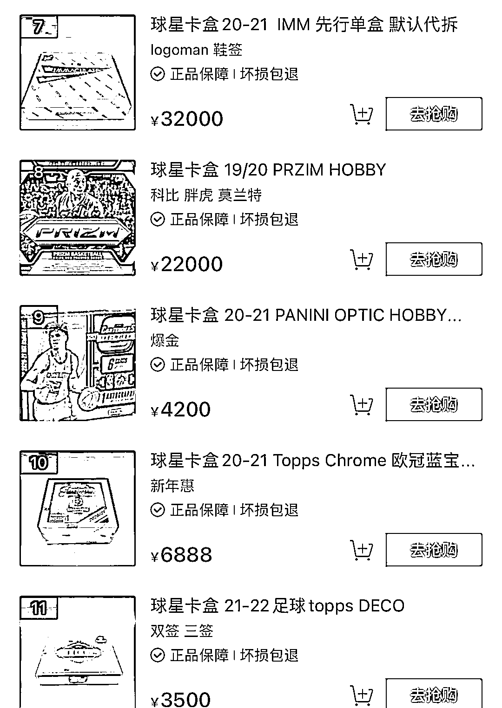
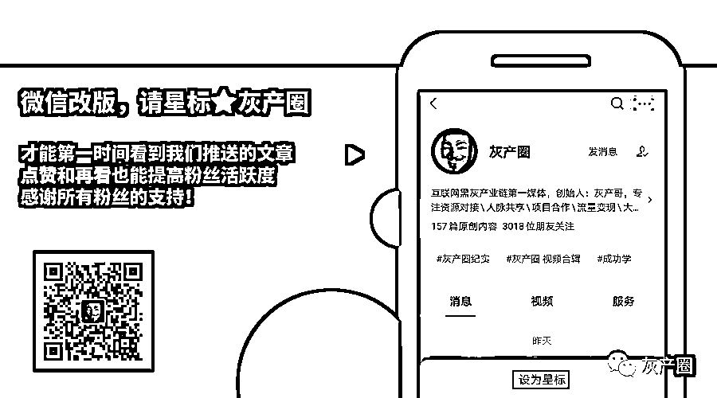

# 直播间里的球星卡，有人靠倒卖半年赚了 700 万

> 原文：[`mp.weixin.qq.com/s?__biz=MzIyMDYwMTk0Mw==&mid=2247528556&idx=2&sn=2102dd31b1d6688fb51189d76082ddea&chksm=97cbbb54a0bc32427e2b2c78ec989cf17234fb2c00d04543a32aec1291879140c19339bfea28&scene=27#wechat_redirect`](http://mp.weixin.qq.com/s?__biz=MzIyMDYwMTk0Mw==&mid=2247528556&idx=2&sn=2102dd31b1d6688fb51189d76082ddea&chksm=97cbbb54a0bc32427e2b2c78ec989cf17234fb2c00d04543a32aec1291879140c19339bfea28&scene=27#wechat_redirect)

“大狗在吗？1 到 6，选个数。”

“咱们祝大狗起飞！”

直播间里放着周杰伦的《晴天》，主播没有露脸，屏幕上摆着满满当当的球星卡。

离主播最近的位置，一个已经拆开的纸盒里放了几个还没拆开的卡包。

大狗选了 3 之后，主播拿出了第三个卡包。

用小刀小心地划开，倒出里面的卡片。 

开出了一张勒布朗詹姆斯的卡，主播说：**“恭喜老板，小回一口。”**

一边说着，一边把詹姆斯装进了一个透明包装袋里。

“感谢大狗老板的支持。”主播操着一口浓郁的东北口音。

卡包前面摆了一个手写的桌牌：签字未出。

意思就是球星亲笔签名的卡还没开出来，后面的人还有机会。

下一位，同样是重复上述的操作。

**“祝大****哥起飞！**” 

“心动的家人们小黄车哦，不要犹豫。”

每天晚上，在无数个球星卡直播间里，都在重复着这样的操作。

主播重复着“谢谢老板”，观众们排队在屏幕上刷着“下一个必出！”

**1** 

** 抽卡的生意 **

球星卡的历史要追溯到 1880 年。 

当时，作为一种新型小众收藏品，球星卡最早仅仅是作为烟草公司的附赠品出现，还起到了一种保护烟盒的作用。

但是久而久之，大家对这种卡片的收集很感兴趣，慢慢就演变成了一种商业模式。

在球员加入 NBA 后，NBA 当局便拥有他们的球卡肖像权。

制卡公司便向 NBA 来购买球员的肖像使用权，然后开始制版。

一般情况，球星卡分为这么几个类别。

**1、普卡**

普卡制作过程非常简单，同样也是数量最多的一种卡。

卡片背后通常会有标示卡号、球星的背号、身高、体重、生日、毕业学校、最近的近况或他一些小介绍。

**2、特卡**

特卡是相对于普卡而言的概念，其实就是一些超级巨星的卡。

**3、限量卡**

限量卡有准确的限量张数，比如 1/10 就代表限量十张中的第一张（1/10 和 10/10 的价格也有天壤之别）。

物以稀为贵，这样的卡片自然价格偏高。

**4、新秀卡**

新秀卡只在球员进入联盟首年发行，一般卡面上会带有 RC 的标志。

**在直播间中，新秀卡也是非常受欢迎的一个卡种。**

因为一个新秀球员，未来是有无限可能的，在他作为新秀的时候就将其收藏，**未来也有无限的增值空间**。

2020 年，一张极其罕见的 NBA 雄鹿队球星扬尼斯·阿德托昆博（字母哥）签名新秀卡，当天以创纪录的**181.2 万美元（折合人民币约 1230 万元）**价格售出。

**5、物料卡**

物料卡，顾名思义就是卡片上还有其他的物料。

比如一片球员球衣的布料。

其中最稀有的就是带有**NBA logoman**的这块。

勒布朗-詹姆斯的 "Logoman "卡片，它的售价曾达到了**10 万美元**左右。

球星卡其实还有不少细分，什么贴纸签名啊，签名墨迹的走向啊都会影响球星卡的价值，小呸今天就不展开讲了。

2020 年疫情爆发，直播行业的蓬勃发展让球星卡走进了很多人的生活中。

**越来越多****的人瞄上了这个赚钱的新风口。**

一般情况，整箱的球星卡货源来自于境内的代理公司从境外或香港地区进货。

最贵的球星卡系列一箱大概要花人民币近 30 万元。

一个直播间、几箱球星卡，你似乎就能走上财富自由之路了。

在拆卡直播间，最引人注意的就是“抬箱”的老板。

**抬箱，拆卡界的黑话之一，指的是一口气购买整箱卡片的顾客。**（就跟抽盲盒的“端盒”是一个意思）

一般来说，一整箱便宜点的也要三五千，贵一些的就上万了。

球星卡同样催生了评级的生意。 

球星卡评级公司根据所交卡的墨迹(明星签名留下的)、平衡性、边角的品相等综合方面的考察，最后得出评分。

一般满分是 10 分，0.5 为一个等级。最低收费标准是 20 美元/张。

评级之后，球星卡会被装进评级卡砖中，能够隔绝空气，起到很好的保护作用。 

评级的目的，就是为了**给这个卡牌加个杠杆，如果得到了高分，卡片的价值瞬间翻倍。**

↑2020 年初科比去世后，他的签名球星卡价格被“炒上了天”

** 2 **

** 有人被抓，有人被骗 **

2022 年 1 月 11 日下午 15:17 分。

一个正在进行拆卡的直播间，被突然出现的警方打破了平静。

全员被捕，直播中断。 

突如其来的骚乱让还在排队等待拆卡的网友们错愕不已。 

到底发生了什么？

球星卡，本质上也是一种“盲盒”。 

闲来无事，抽上几个，运气好了说不定就能抽到个稀有卡，搏一搏单车变摩托啊。 

而正是这样的“碰运气”，也是一种在“赌博”的边缘来回试探的危险行为。 

其实上面这张截图最后一位朋友已经点出了问题所在：**以后球星卡直播间不敢玩 pk 了。**

其实大家对于这种擦边球的玩法都是心照不宣的。 

不同于传统拆卡的玩法，直播间让拆卡有了一些“新玩法”。 

比如分组 pk。

高价下注，拆卡后 pk 卡包内带编卡（稀有卡）点数大小，赢得一方获得所有卡片以及现金。 

大家说这种玩法是什么？

有人打着赌博擦边球，还有人骗起了拆卡主播的钱。

江苏南京的小武，原本是一名网络主播，平时会在直播间内售卖球星卡。

一位朱老板总在小武这里开卡，出手也和阔绰，一来二去就和小武熟络起来。 

加了好友之后，朱老板告诉小武，自己有球星卡的渠道，货源充足，比小武的进货价便宜很多。 

小武相信朱老板是老玩家，便答应了他的合作请求。 

刚开始，他们还通过第三方平台交易，成箱成箱的球星卡也准时送到了小武手中。 

后来，建立了信任之后，小武干脆直接转账给朱老板。 

慢慢地，朱老板开始拖延发货了，更离谱的是，**有一次直接给小武寄了一箱新疆特产。**

过了三个月，小武报了警，民警经过调查后将朱某抓获。

据朱某交代，他最初只是在平台之间倒卖卡片，从中赚取差价。

时间长了以后，他发现差价的利润无法填上自己的贷款窟窿，于是动了歪心思。

警方初步统计，朱某利用这一手段共诈骗 15 人，涉案金额 700 多万元。

一个朱某就骗了 700 多万，足以窥见球星卡的市场之大了。 

** 3 **

** 该不该上这趟车？**

有人要说了，球星卡不就是个破纸壳子么，怎么就能卖得这么贵？ 

炒着“稀缺”的概念，它还真就卖出了天价。

球星卡的背后是资本，而资本永远都是逐利的。

卡商们打造了一套精密的卡牌等级和价值评级系统，为的就是维持它的稀缺度，就和炒鞋的逻辑一样一样的。

而不明所以的新玩家入场之后，等待他们的只有 ________。 

现在的电商平台也有很多球星卡出售。

商品图告诉你，肯定能拆出球员签名卡，价钱瞬间翻倍。

但其实并不是如此。

等你开不到好卡去找他的时候，对方会说：哎呀，一定是装卡大妈忘了塞稀有卡了。 

说一千道一万，球星卡和卡圈文化依然处在监管的空白地带。

以次充好、伪造诈骗、走私、无照经营、偷税漏税、洗钱……

很多擦边球行为都游离于法律之外。

诱惑越来越大，风险也越来越高。

大过年的，小呸就想提醒大家一句： 

**不要挑战贪欲，不要试探底线，水太深，你把持不住的。**

← 向右滑动与灰产圈互动交流 →

