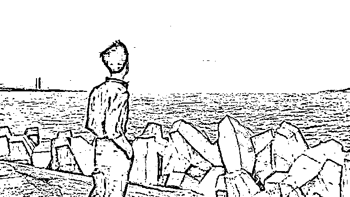
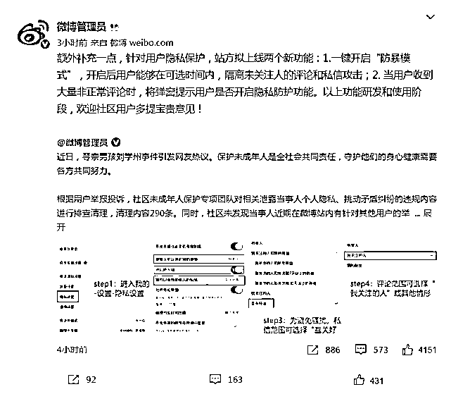
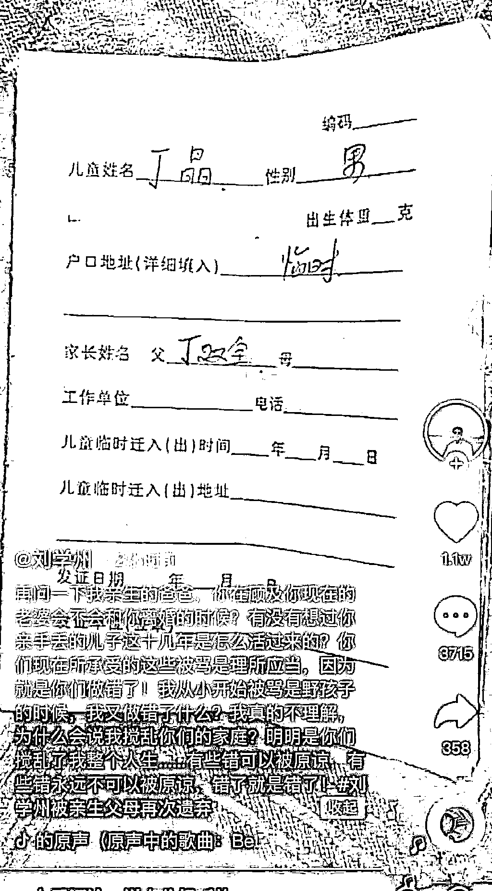
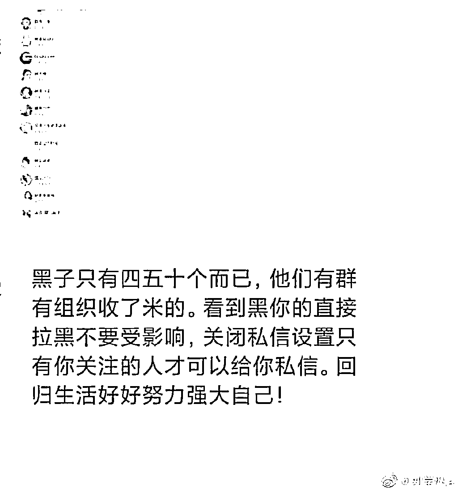
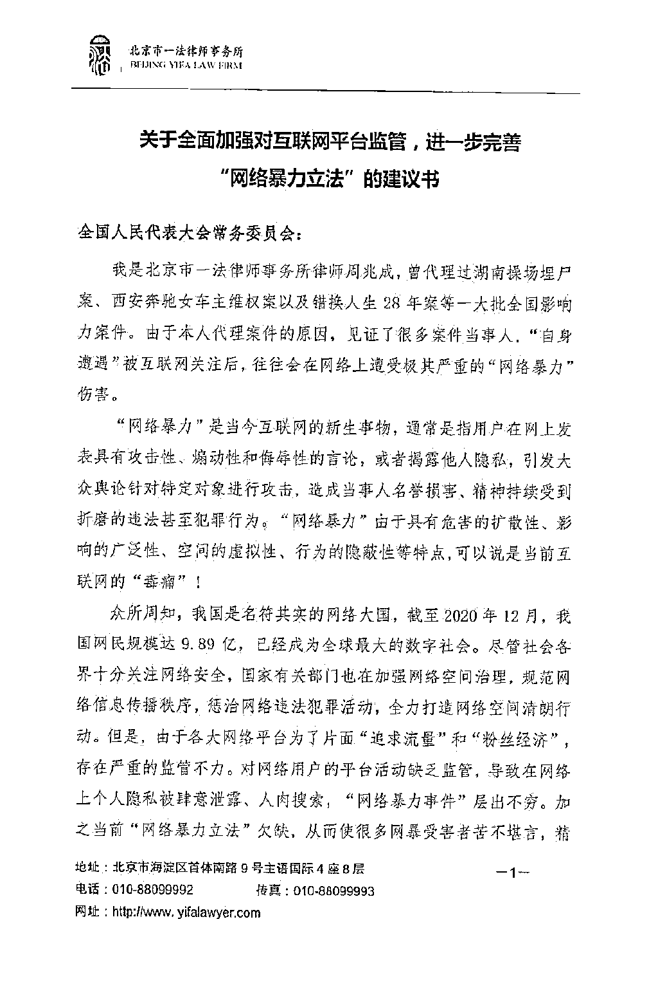

# 大同警方正调查刘学州被买卖一事！律师：亲生父母或涉遗弃罪

> 原文：[`mp.weixin.qq.com/s?__biz=MzIyMDYwMTk0Mw==&mid=2247528556&idx=4&sn=937a4cb27e474ddcb39cba15eb6ed34e&chksm=97cbbb54a0bc32428159f402dbb0ce4b6d26434ebade4de5c217170f2b1a2b522cff7c725e93&scene=27#wechat_redirect`](http://mp.weixin.qq.com/s?__biz=MzIyMDYwMTk0Mw==&mid=2247528556&idx=4&sn=937a4cb27e474ddcb39cba15eb6ed34e&chksm=97cbbb54a0bc32428159f402dbb0ce4b6d26434ebade4de5c217170f2b1a2b522cff7c725e93&scene=27#wechat_redirect)

1 月 24 日，

寻亲成功后被生母微信拉黑的男孩

刘学州在海南三亚自杀，

于当日凌晨经抢救无效死亡。

刘学州曾称，

自己幼时就被亲生父母

通过中间人卖给养父母。

24 日晚间，

记者从大同市公安局新荣分局获悉，

**该分局接警中心 24 日**

**接到多名网友关于刘学州**

**被买卖一事的报警，**

**目前相关部门正展开调查，**

**有调查结果会向社会发通报。**

# **微博回应刘学州事件**

1 月 24 日下午，就“寻亲男孩刘学州事件”微博社区管理官方微博发布消息称，根据用户举报投诉，社区未成年人保护专项团队对相关泄露当事人个人隐私、挑动矛盾纠纷的违规内容进行排查清理，**清理内容 290 条。**

同时，社区未发现当事人近期在微博站内有针对其他用户的举报投诉内容。

微博方面表示，对于刘学州的经历，我们深表遗憾与惋惜。**社区将继续密切关注事件动向，并在此呼吁广大网友客观理性参与话题讨论，尊重逝者、尊重事实。**

下一步，社区将持续优化举报投诉入口，加快响应处置速度，完善隐私保护功能，提升用户体验及满意度，一旦发现重要线索，第一时间联动公安部门及当地政府采取行动。

24 日 18 时许，微博社区管理官方微博补充称，针对用户隐私保护，站方拟上线两个新功能：1.一键开启“防暴模式”，开启后用户能够在可选时间内，隔离未关注人的评论和私信攻击；2.当用户收到大量非正常评论时，将弹窗提示用户是否开启隐私防护功能。

刘学州照片

刘学州已遗憾离世，

那么，当年卖掉他的生父母

是否涉嫌构成犯罪？

现在不接受他是否构成犯罪？

让他遭受网络暴力而选择自杀的人

是否构成犯罪？

▽

**律师称刘学州亲生父母涉遗弃罪明显**

**最高可判五年**

记者注意到，1 月 19 日，刘学州在微博上称，将起诉其亲生父母。

刘学州表示，他正在为起诉生父母做相应的法律程序上的准备，下一步计划报警，希望司法机关对其亲生父母进行刑事追诉，“希望能以拐卖儿童罪和遗弃罪提起公诉”。

河南中豫律师事务所孙兆义律师称，**刘学州亲生父母在客观层面涉嫌拐卖儿童罪的可能，如果该犯罪事实经过公安机关侦查属实，那么需要考虑该罪是否过追诉时效，拐卖儿童罪的追诉时效为十五年。**

同时，其亲生父母在刘学州养父母去世以后，作为刘学州的亲生父母，在法律上对于刘学州的抚养具有当然的监护职责，以目前来看，**其亲生父母的行为已然构成遗弃罪。**

孙兆义解释，**刘学州亲生父母的遗弃行为是持续的、连续的，并且目前已经造成刘学州死亡的严重后果，其亲生父母应当以遗弃罪被追究刑事责任。****法律规定遗弃罪将处五年以下有期徒刑、拘役或者管制。**

刘学州被亲生父亲遗弃

**知情人都可向法院提交证据**

**网暴者和平台都有责任**

1 月 21 日，曾有网友在刘学州的微博评论区留言质疑刘学州，称刘学州是在利用寻亲给自己炒作、立人设，刘学州的行为是利用网友的善良博取同情心。

对此，刘学州在微博评论留言称，**“诽谤是违法的，保留证据了”。**

北京百瑞(郑州)律师事务所律师石云昆律师认为，**包括网暴语言的截屏、网暴人员账户、录音视频等都可以作为被网暴的证据。**

石云昆介绍，凡是通过互联网被实施了侮辱、诽谤的行为，被害人可以向人民法院告诉，但提供证据确有困难的，人民法院可以要求公安机关提供协助。

“**任何知情人都有作证的义务，**因此他的同学朋友或者网友都可以向立案法院提交证据，”刘学州已经去世，**可以由刘学州近亲属搜集证据向法院提起诉讼，石云昆说。**

值得注意的是，石云昆表示，**如果可以确定某人或者某主体是网暴的发起者，或许可以认定为主犯，“但是具体惩罚需要有关部门具体考量。”**

石云昆强调，《刑法》第 246 条诽谤罪，是指故意捏造并散布虚构的事实，足以贬损他人人格，破坏他人名誉，情节严重的行为。相关嫌疑人将被处三年以下有期徒刑、拘役、管制或者剥夺政治权利。”

“刘学州的悲剧也因部分平台有意放纵炒作。” 石云昆说，针对一些骂战、诽谤，部分平台**根本没有尽到“通知删除”的义务。**明星、社会事件当事人、弱势群体等特定标签人群的八卦，因为关注度高，平台常常默许、纵容，甚至成为扩大伤害的帮凶。

刘学州被网暴 

**“网暴并非法不责众”**

**律师呼吁国家立法打击**

1 月 24 日上午，北京市一法律师事务所周兆成律师告诉记者，由于代理案件的原因，他见到很多事件当事人，自身遭遇被互联网关注后，往往会在网络上遭受极其严重的“网络暴力”伤害。

周兆成表示，“网络暴力”具有危害的扩散性、影响的广泛性、空间的虚拟性、行为的隐蔽性等特点，我国当前对“网络暴力立法”不完善，从而导致公安机关在打击“网暴”违法犯罪活动与人民法院惩治网暴犯罪“出现分歧”。

律师呼吁网暴立法

“网絡暴力’一旦构成针对公民个人的诽谤犯罪则不属于公安机关管辖，而提起刑事自诉被害人又面临取证困难的尴尬境地。从而在遭受“网络暴力”犯罪后，被害人往往会求助无门。如提起民事侵权诉讼，又存在网络平台承担连带责任过小，导致平台怠于履行企业主体责任。

因此周兆成呼吁出台“打击网络暴力”相关立法，建议加大对“网络暴力”责任主体的惩治力度，对情节严重的“网络暴力”行为入刑，严格落实网络实名制，加强对网络运营商的监督和处罚力度。

“网暴者太多了，是否会法不责众？”周兆成强调，根据《第十三届全国人民代表大会第三次会议关于最高人民检察院工作报告的决议》，**人民检察院也可以提起公益诉讼，以维护刘学州合法权益，引导社会的正确价值导向。**

来源：新民晚报综合澎湃新闻、微博管理员、大河报·豫视频、红网

← 向右滑动与灰产圈互动交流 →

