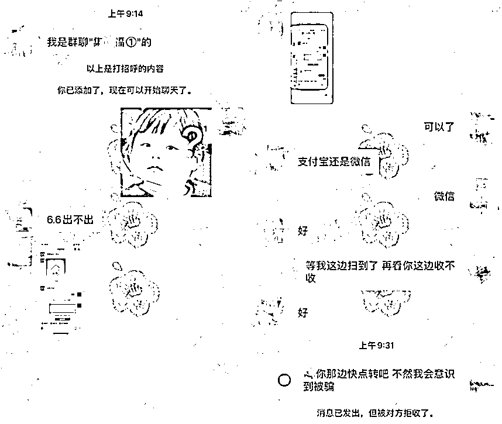

# 瓜分几个亿？参与新春集卡兑奖活动：请当心骗子！

> 原文：[`mp.weixin.qq.com/s?__biz=MzIyMDYwMTk0Mw==&mid=2247528556&idx=5&sn=bc31b16335de40040ed5cff62f5090ce&chksm=97cbbb54a0bc32424f8dc2e27717df67bcaea7ebaa5f6d421148d713fce907ff5df5f4464cc8&scene=27#wechat_redirect`](http://mp.weixin.qq.com/s?__biz=MzIyMDYwMTk0Mw==&mid=2247528556&idx=5&sn=bc31b16335de40040ed5cff62f5090ce&chksm=97cbbb54a0bc32424f8dc2e27717df67bcaea7ebaa5f6d421148d713fce907ff5df5f4464cc8&scene=27#wechat_redirect)

又快要过年啦！ 

大家（提前）新年好啊！

似乎成了每年的“节前传统”

最近一系列“瓜分几个亿”的

**新春集卡兑奖活动**

再一次在微信好友间热闹了起来

在一片“你集了几个福啊？”
“有多余的卡可以送给我吗？”的问候中

一哥也看到不少朋友吐槽

**“辛苦一星期，到手几毛几”**

▼

**●**“我已经被 1.98 支配了两年了，今年再这样我真不玩了” 

●“我才刚开始集赞，人家就已经搞完了”

●“一顿操作猛如虎，一看开奖一块五” 

●“我宣布退出这个百亿大项目，一块六毛八我自己有”

其实最后能分到多少钱不重要 

重要的是**集卡过程中可千万别被骗了**

每年这个时候都有不少骗子趁机浑水摸鱼

今天一哥就来带领大家复习一下

由新春集卡兑奖活动衍生的一些骗局

**集卡**

**骗局**

交易骗局：骗子称要出售多余的稀有卡片，受害人付款后立即被拉黑。

交换骗局：骗子以“换卡”为由添加好友，然后谎称交换福气卡需要提供手机验证码，实则套取重设密码时所需的验证码，随后登录修改密码，利用小额免密支付代为进行消费付款。

入群骗局：骗子分享假的“免费换卡群”二维码，将受害人拉入欺诈群中。

“熟人”骗局：骗子通过盗号或仿冒好友向用户发送伪装的“取福卡”链接，诱导受害人填写个人信息。

▼交易被骗案例

都看明白了吗？

一哥提醒大家，在集卡的同时

也要注意保护好钱包和个人信息

▼

● 要警惕陌生人以送卡为由添加好友，尤其是要小心那些头像虽然是熟人，但无法验证真伪的陌生好友申请；

● 不要轻易点击链接或扫描二维码，对于那些来路不明的信息最好第一时间删除；

● 不要相信任何“福气卡交易”，以防出现付款后却被对方“拉黑”的情况发生。

就像每年都要贴春联一样

大家似乎已经习惯了

年年参与这样的集卡活动

但作为经历了太多

**打卡、盖楼、砍价、组战队、**

**抽卡、集卡、集福、年度报告**

等营销活动套路的老互联网人

不少朋友也表示心太累 

一哥想说

与其期待通过频繁分享“上亿的项目“

打扰家人朋友，从而获得更多“分成”

还不如留出时间珍惜身边真实的团聚

或许对于大多数人来说

参与和分享集卡活动更多的

是为了增加过年的氛围

找回随着年龄增长逐渐失去的仪式感

**但是，****分享也要有度**

**若是过度的投入时间、精力、人情**

**无疑会消解掉真正的仪式感**

对于那些热衷于转发链接的用户 

一哥也劝你

无论何时何事，把握分寸很重要

为了数额不大的“分成”把自己的微信 

变成布满广告的地方

不仅影响其他用户的使用体验

无形中也伤害了和朋友之间的情谊

并不值当

▼

**微信不支持也不欢迎任何形式的诱导分享内容，希望各方可以更多地从用户和自身长期发展的角度出发，不再引导用户分享可能对他人造成骚扰的营销信息。**

**如果外部链接违反上述规定，根据用户投诉，核实证据后，我们将依据相关法律法规及《腾讯微信软件许可及服务协议》、《微信外部链接内容管理规范》、《微信开放平台运营规范》、《微信开放平台开发者服务协议》、《微信个人帐号使用规范》，视违规情节严重程度，对相关外链进行包括但不限于以下处理：**

**停止该链接内容在微信继续传播、停止对相关域名或 IP 地址进行的访问，短期或长期停止向相关开放平台帐号或应用提供分享接口相关服务；对于情节恶劣的情况，永久封禁帐号、域名、IP 地址或分享接口。**

而对于那些打着各类活动名义进行的欺诈行为

我们更会坚决打击，保护用户的安全使用

也希望饱受诱导分享之苦的每一位用户

都可以通过客户端或小程序

投诉含有诱导分享的违规内容链接

和我们一起，让年回归年味

也还给自己一片清静的网络生活空间

来源：微信 110

← 向右滑动与灰产圈互动交流 →

