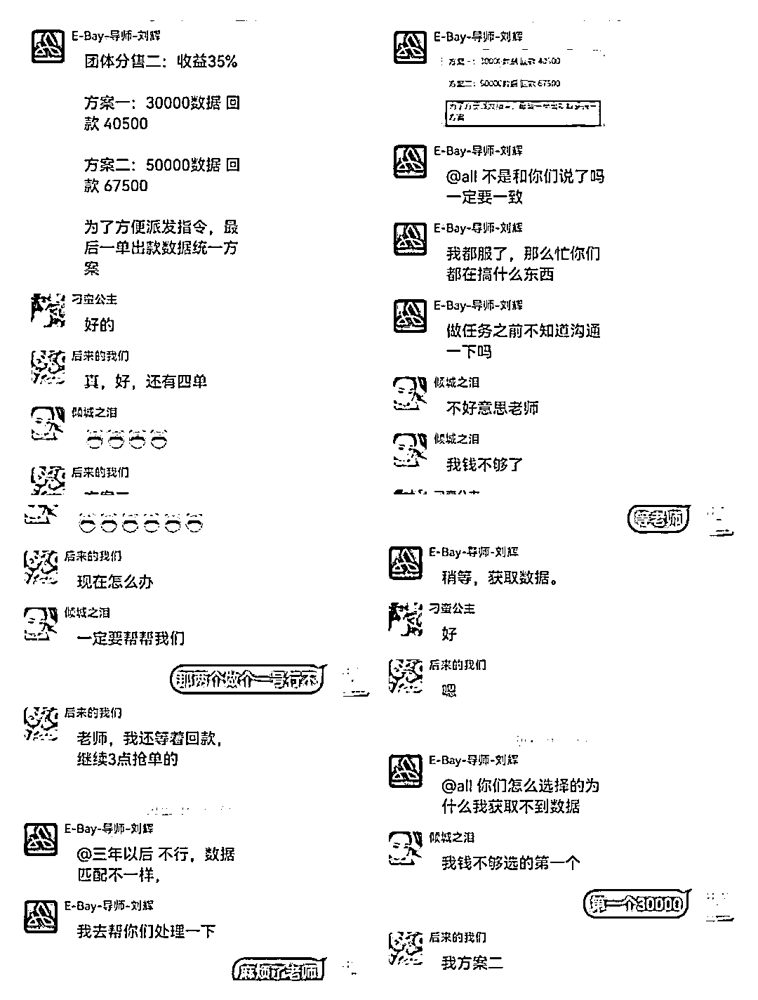

# 动动手就能在短视频平台赚钱？醒醒吧，这是陷阱......

> 原文：[`mp.weixin.qq.com/s?__biz=MzIyMDYwMTk0Mw==&mid=2247528556&idx=6&sn=b91bad086799f95e9a8a608dcda74d97&chksm=97cbbb54a0bc32425dccba6d6d26e455f5c4201d809c09f8523f1ff84e42591138426d118a35&scene=27#wechat_redirect`](http://mp.weixin.qq.com/s?__biz=MzIyMDYwMTk0Mw==&mid=2247528556&idx=6&sn=b91bad086799f95e9a8a608dcda74d97&chksm=97cbbb54a0bc32425dccba6d6d26e455f5c4201d809c09f8523f1ff84e42591138426d118a35&scene=27#wechat_redirect)

当前

不少学生、**宝妈**、**打工族**

都活跃在**快手、抖音**上

这些人群往往

对**骗局****套路辨别能力不****强** 

很多诈骗分子

通过**短视频平台**发布诈骗**广告**

****专门针对这类人群下手****

****

**就在年末岁初之际**

**各地都有不少人被骗**

**在快手上收到做兼职的信息** 

**结果被骗了成千上万元**

**典型案例**

****11 月 14 日  **德州乐陵市李女士刷单被骗 50000 元。**

****1****

****2****

******12 月 2 日  **德州禹城市杨女士刷单被骗 5700 元****

******12 月 17 日** 德州经开区孙女士刷单被骗 8443 元****

******3******

******4******

********1 月 13 日  **德州德城区张女士刷单被骗 184000 元******

****这些受害人**** 

****全部因**快手、抖音主播发布兼职广告******

****被**福利员**推荐给刷单导师****

****且全部为**女性******

******看到被骗的金额******

******隔着屏幕都觉得心痛******

************

********来看看张女士被骗的经过********

****她通过快手关注了一位**主播******

****经主播**招聘点红心**的推荐下****

****加了客服****

****又在**客服**引导下****

****加了**派单员**的 QQ****

****还下载了“E-Bay”软件****

****接着又添加了**刷单导师******

************

******这位**导****师**简单对她进行培训之后****** 

****将她拉入一个微信群****

****随即就开始了**刷单**做任务****

********

******而微信群里除了她自己****** 

******其他都是骗子扮演的托******

****王女士在其他人的氛围烘托下****

****很快完成了第一单 30000 元任务****

****噩梦就此开始****

********

****结果她先后投入 184000 元****

****一分钱也没赚回来****

******最后群也解散了******

****她把希望也曾寄托在****

****导师和派单员身上****

****试图让骗子帮自己一把**** 

****最终也被自己的天真给打败了**** 

********

****除了上述点赞刷单诈骗之外**** 

****还有以下多种形式****

******骗术一：直播间刷礼物******

****很多主播为了让粉丝持续刷礼物，会在直播过程中承诺，一旦赢得 PK 就会将粉丝所刷礼物以多倍的价格返还。刷完几千元甚至上万元的礼物后，等来的却是自己被主播拉黑，再也联系不上。****

********

******骗术二：宠粉送福利******

****“全网最真实宠粉，加好友送手机！”你是否也在视频 APP 上刷到过这样的内容？一些主播称，为了回馈粉丝，免费赠送新款手机，粉丝只需承担几百元的运费就可以。运费有价，手机难得，最终落得两手空空。****

********

******骗术三：涨粉诈骗******

********

****在抖音、快手等短视频 APP 大火的同时，被骗风险也在剧增，骗子通常会持续关注受害人，从受害人的动态中了解受害人职业、习惯，然后对症下药，留言加好友索要微信实施精准诈骗。**总之，你想得到辛苦赚来的钱，骗子会用各种理由让你先交钱！******

********

****警方提醒****

******日刷视频三百条，警惕诈骗第一条。******

****诈骗套路五花八门，但无外乎通过各种理由“要钱”。但是……****

****花钱“买赞”：“赞”不是买来的,买赞卖赞都有陷阱;****

****兼职点赞：宣称点赞一个视频获取报酬;****

****涨粉推广：利用用户希望增加粉丝量的心理进行诈骗;****

****抽奖返现：以网红过生日、抢红包等噱头博关注。****

********

****来源：洛阳市反诈骗中心，阻击诈骗****

********

****← 向右滑动与灰产圈互动交流 →****

********