# 开年第一炸！

> 原文：[`mp.weixin.qq.com/s?__biz=MzIyMDYwMTk0Mw==&mid=2247528613&idx=1&sn=99357c70ed16f9a5a9d8ca0072419d81&chksm=97cbbb9da0bc328ba013856bea34afa733c401fefaa6811eb9308b054906d02de412ebb28aef&scene=27#wechat_redirect`](http://mp.weixin.qq.com/s?__biz=MzIyMDYwMTk0Mw==&mid=2247528613&idx=1&sn=99357c70ed16f9a5a9d8ca0072419d81&chksm=97cbbb9da0bc328ba013856bea34afa733c401fefaa6811eb9308b054906d02de412ebb28aef&scene=27#wechat_redirect)

# 

**理财的雷，浓眉大眼的四大行都难以幸免。**

**接连吃爆亏，中国银行不得不防！**

金融圈开年第一炸，来的就是这么突然！

**一起客户理财巨亏官司，将中国银行送上了审判席，结果中行输了，而且输的很彻底。**

故事的主角是一位 70 后舒新华，其在中国银行河南濮阳支行，经该行理财经理推介、并亲自代其用手机购买了 5 支理财产品，共计 320 万。

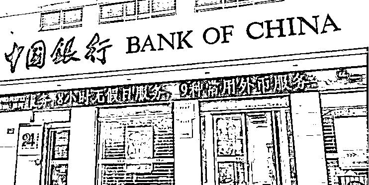

不料之后发生巨额亏损，而且在亏损 27 万时多次要求银行赎回，银行反倒建议其继续持有或补仓等待反弹，导致后续亏损持续扩大，最终亏损 56.88 万，同其此前购买的“保本型低风险理财产品”严重不符，交涉无果下，舒某将中行该分行告上法庭。

**双方在法庭上对峙的焦点，就是舒新华坚称不知道买的是基金理财产品，不了解风险水平，银行也没有告知这类产品的风险和收益特征。**

**尽管中行拿出了一系列证据，均没有被法院采纳，最终一审、二审均判中行败诉，并全额承担舒新华的投资损失及相应利息。**

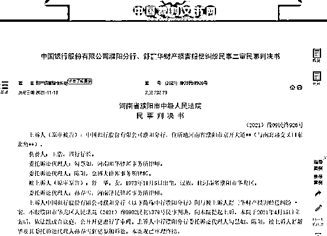 

堂堂四大行，也只得自己咽下这记苦果。

**中国银行在理财产品上栽跟头，也不是头一回了。**

****上一次，2020 年最大巨雷的主角也是中国银行，那就是震惊中外的“中行原油宝”事件，硬生生让中行损失近 100 个亿。****

**2020 年 4 月 21 日凌晨，一起发生在美国芝加哥交易所的 WTI 原油期货 5 月份合约，悄然创下了一项世界期货交易史上的新记录：3 分钟内瀑布式暴跌 300%，油价史无前例的出现了-37.63 美元的收盘价，多空结算价更是低至-266.12 美元。**

**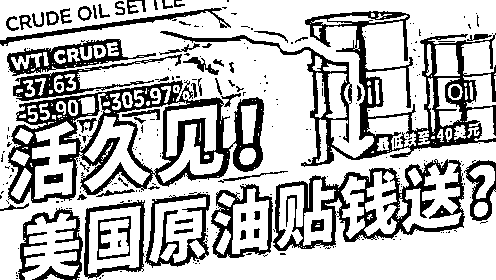** 

**这意味着：**这桶油你免费拉走，我还倒贴你 37 美元！****

****当然在期货市场这只是戏言，当时油价便宜到一大桶石油，都敌不过矿泉水，确是实实在在发生的。****

****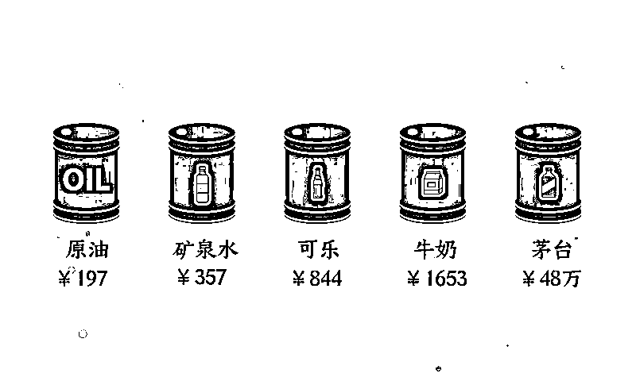****

******但对 6 万多中国银行“原油宝”投资人而言，这个笑话才是真实的噩梦，因为这个产品挂钩的正是这一期货合约，数以万计的投资人，在深夜熟睡的梦中，收到了中行发来的补仓和强制平仓短信。******

****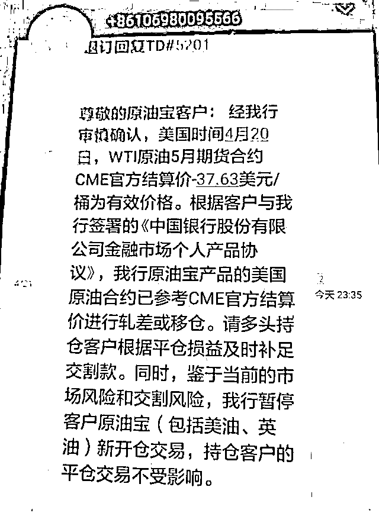****

******最惊悚的是，这 6 万多人不仅亏光了所有本金，还倒欠中行 2 倍保证金。比如有人投入本金 79 万，被强制平仓后亏损 222 万，还倒欠银行 140 万。******

****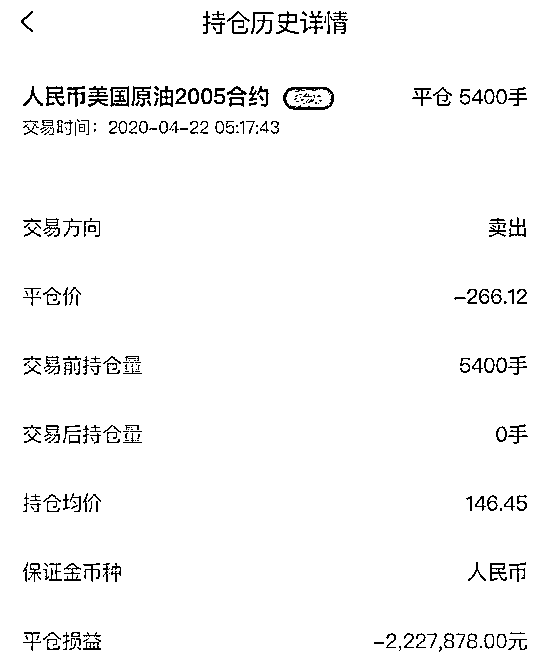**** 

******媒体统计指出，6 万多中行客户共损失保证金 42 亿，还倒欠中行保证金超 58 亿，其中多数人当天就收到了来自中国银行的缴款通知，有些甚至被强行划扣了在中行账户中的存款。******

****中行信誓旦旦的表示：如果不交钱，就等着上央行征信！**** 

****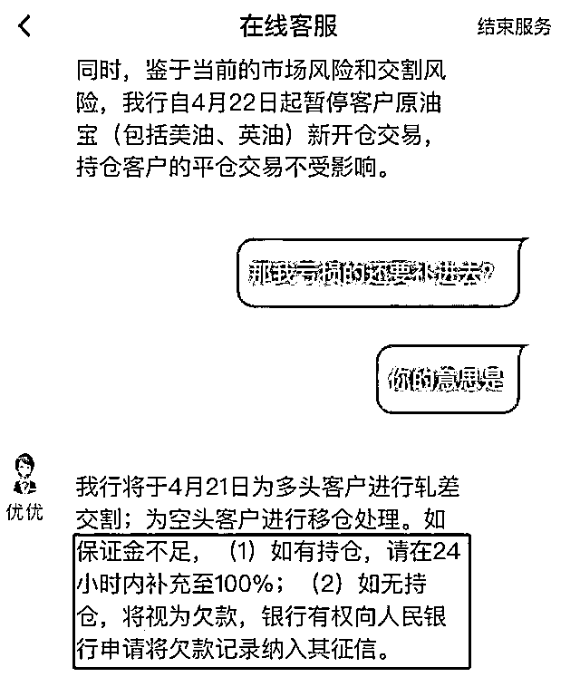****

******6 万多中行投资人彻底炸锅了！纷纷联合起来集体维权，这些原本四大行眼中的 VIP 客户，一个个本就能量巨大，事情迅速被捅大后，中行也怕了。******

****但中行更憋屈，100 个亿已经穿仓没了，损失自己也担着了，如果投资人不补钱，最后都得自己买单。****

******最终，法院也站在了投资人一边，判决中行承担全部穿仓损失，并补偿客户 20%的本金损失。******

****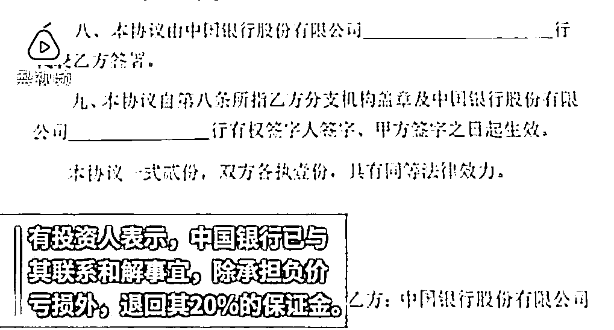**** 

****中国银行，也唯有含泪咽下这一几十年不遇的超大号苦果。****

********

******后续调查表明，中行很大可能遭到了暗算，但根源还在自己，怨不得别人心狠手辣。******

****同河南中行理财亏损败诉案类似，中行在起初向 VIP 客户推荐“原油宝”这款高风险理财产品时，同样没能将真实的风险告知客户，或是有意误导了客户。****

****投资人以为自己就是在跟中行玩“模拟盘”，同纸黄金差不多，实则背后是中行的操盘手将美国交易的期货合约价格换算过来，但期货本身的高杠杆风险属性并没有因此改变，导致他们和中行一同被坑惨。****

******** 

****为什么说这起案件可能是一场阴谋？****

****两大关键线索均表明，背后肯定有幕后操纵者，才能共同完成了对中行的绞杀！****

******其一，就在这一悲剧发生前 6 天，美国芝加哥交易所突然临时修改了一项交易规则：允许负油价交易！******

****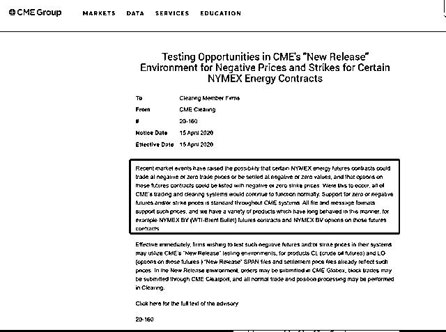****

****这也被公认是中行犯下的最大错误，他们没有发现这一细微变化，或是压根没重视，毕竟负油价突破了常识，以前更是从未有过，只要当天的期货价格为正，哪怕只有 0.1 美元，就不会被强制平仓，也就不会发生后续的百亿穿仓。****

******其二，中行自身的风险意识太差，才给了对手痛宰的机会。******

****中行晚上 10 点就关闭了交易，而地球另一边的美国，才刚刚开始交易，这个规则此前从未改变，当天中行也没派人盯盘，数万投资人只能眼睁睁看着血汗钱被搜刮一空。****

****中行对接该期货产品的部门不可能不知道，这个合约第二天就是交割日，价格波动必然很大，加之这一期货品种的结算规则，是按收盘前 3 分钟的加权平均价算出来的，操纵起来并不困难。****

********以稳健著称的银行，通常都会提前将对应合约进行移仓，而不会冒险把仓位留到最后赌一把，同样有类似产品的工行、建行等银行，都早早完成了移仓操作，踩雷的只有中行自己。********

****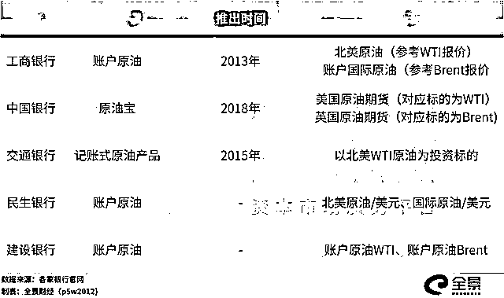****

****被幕后黑手巧妙的利用规则完成收割，中行就算不服，有意起诉芝加哥交易所，也没有任何胜算。****

******难怪交易所总裁也公开放话：这是市场的正常运行，乐意配合调查。******

****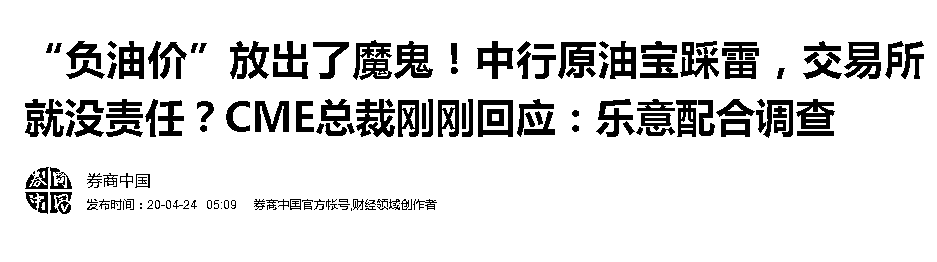****

******更巧合的是，中行是在最低价，极有可能是历史最低价被收割的，此后不到两周，国际原油期货就开启了一轮超 200%的强力反弹。******

****但这一切都跟中行没有一毛钱关系，中行为此还收到了银保监会 5050 万的罚款，客户流失和声誉损失，更是难以估量，换做任何一家中小银行，能不能缓过来都是问题。****

********

******这一次，中行似乎并没有好好吸取一年前缴纳百亿学费的昂贵教训。******

******在客户理财的同一个坑里，又栽了跟头。******

****即便损失不过九牛一毛，但贵为国民最信赖的四大行，是银行界名副其实的标杆，理应承担与其自身相匹配的责任。****

****岂不闻千里之堤毁于蚁穴，老百姓对银行的认知和信任，都是在无形当中被一点点消磨掉的，近年来银行爆出的多起理财雷，更是加剧了这一趋势：蚂蚁能在短短几年时间，就做到基金销售仅次于招行，非货币基金规模更是国内第一家破万亿的机构，这样的荣耀不属于标榜“安全排头兵”的四大行，不禁令人深思。****

******2020 年 10 月，就连“宇宙行”工行都在理财产品上爆雷，代销的 40 亿理财产品全线违约，投资人好歹不用自己承担损失，却还是让不少人对银行的“专业”和“安全”抱有疑虑。******

****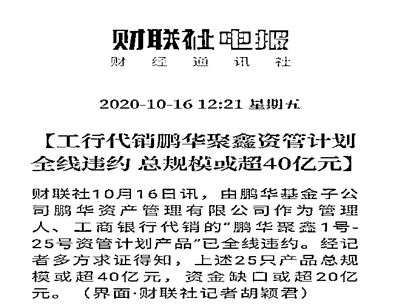****

****水能载舟亦能覆舟，千万别小看群众的合力。****

****国内曾排名 35 位，资产规模超过 5000 亿的包商银行，说倒就倒了。****

****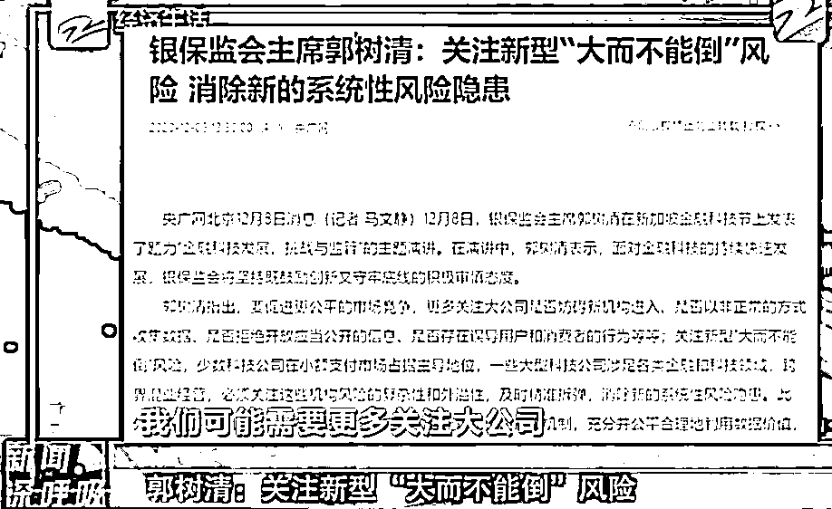****

******新的时代已经开启，银保监会主席郭树清更是明确表态：没有什么大到不能倒！******

******四大行同样大意不得，别忘了，上次为这种错觉买单的巨头，就是阿里和蚂蚁。******

****作者：张生 来源：鸣金网（ID：mingjin-wang）****

********

****← 向右滑动与灰产圈互动交流 →****

********