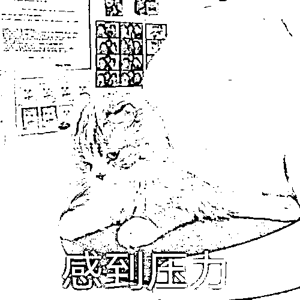
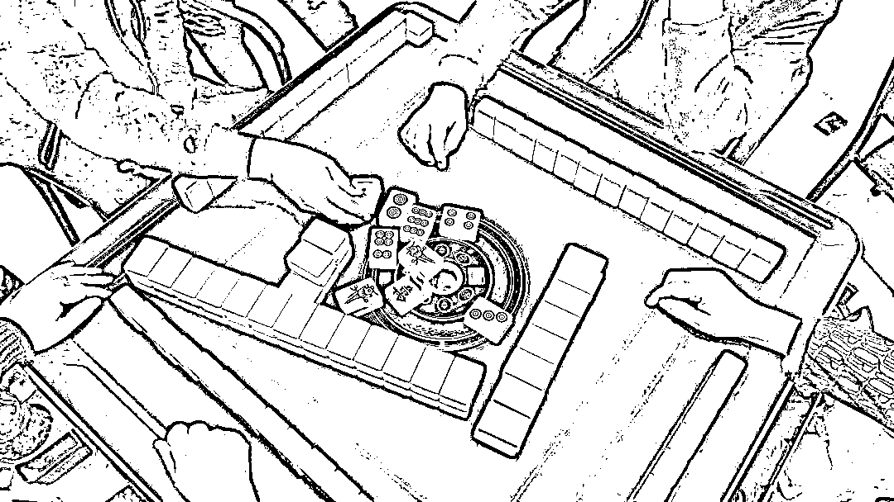

# 打麻将带点小彩头，属于赌博吗？赌博成本有多高？

> 原文：[`mp.weixin.qq.com/s?__biz=MzIyMDYwMTk0Mw==&mid=2247528613&idx=2&sn=46b0bebf33d596caaa5a6229b4d62955&chksm=97cbbb9da0bc328b55e60ce1e6fb077f3f701e630b441b0a24b36633b3673a27651d6c837d83&scene=27#wechat_redirect`](http://mp.weixin.qq.com/s?__biz=MzIyMDYwMTk0Mw==&mid=2247528613&idx=2&sn=46b0bebf33d596caaa5a6229b4d62955&chksm=97cbbb9da0bc328b55e60ce1e6fb077f3f701e630b441b0a24b36633b3673a27651d6c837d83&scene=27#wechat_redirect)

春节长假即将来临

走亲访友，朋友聚会在所难免

三五亲友聚在了一起

免不了会打打麻将

以消磨时间

类似这样的亲友之间打麻将

如果带点小彩头，有点小输赢

到底属不属于赌博呢？

很多人表示“很忐忑”

“春节期间，亲友聚会时不以营利为目的进行的打麻将消遣娱乐活动，公安机关不会认定为赌博的！”面对记者的询问，贵州省贵阳市云岩公安分局八鸽岩派出所民警梅莺如此说。

究竟什么样的行为属于赌博行为呢？梅莺表示，**治安管理处罚法第七十条规定，以营利为目的，为赌博提供条件的，或者参与赌博赌资较大的，处五日以下拘留或者五百元以下罚款；情节严重的，处十日以上十五日以下拘留，并处五百元以上三千元以下罚款。**

而我国刑法第三百零三条所指的**【赌博罪】是以营利为目的，聚众赌博或者以赌博为业的，处三年以下有期徒刑、拘役或者管制，并处罚金。**

**赌博成本有多高？**

一、轻者到看守所（拘留所）过年（1-15 天）+3000 元以下罚款；重者判刑（3 年以下有期徒刑、拘役或者管制+罚金，情节严重的 3 年以上 10 年以下有期徒刑+罚金）；

二、违法犯罪记录伴随终生，个人考公务员、参军、入党、出国、留学、移民都受限制，律师等相关行业禁入；

三、除了上述治安处罚和刑事处罚外，公职人员参赌被处罚后还面临着党政纪处分，甚至开除公职、开除党籍；

四、形成前科劣迹记录在案，以后有违法犯罪行为从重处罚；

五、不光是自己，子女参军、入党、出国、留学同样受限制，参军入党招政审难通过。

临近春节

打麻将成了不少人的娱乐方式

不过，对于党员领导干部来说

不但违规打麻将会被处分

在现场滞留观看也是不行的

**以案示警**

威宁自治县司法局、农村公路管理局、中水小学、旭光小学等单位人员在公共场所违规打麻将。2018 年 11 月 29 日 17 时左右，威宁自治县司法局工作员马凤银、农村公路管理局工作员马旭、中水小学教师马敏花、海边街道旭光小学教师马丽、马彭丽等人在威宁县城某餐馆打麻将，被现场查获。

2018 年 12 月 28 日，马凤银受到警告处分；2019 年 1 月 7 日，马旭受到警告处分；2019 年 1 月 8 日，马敏花、马丽、马彭丽三人分别受到诫勉谈话。威宁自治县特色农业产业服务中心副主任张惠，**虽未参与打麻将，但对公共场所违规打麻将的行为未进行劝阻，并滞留观看，2019 年 1 月 10 日，张惠被提醒约谈。**

那么

我们身边常见的赌博违法行为有哪些

又将面临什么样的处罚呢？

 **赌博最新处罚规定（部分地区）** 

▼▼▼

**治安处罚标准**

**治安管理处罚法第 70 条：**以营利为目的，为赌博提供条件的，或者参与赌博赌资较大的，处 5 日以下拘留或者 500 元以下罚款；情节严重的，处 10 日以上 15 日以下拘留，并处 500 元以上 3000 元以下罚款。

**什么是“赌资较大”？**

**上海市：**《上海市公安局治安管理处罚裁量标准》规定，个人赌资在人民币 200 元以上的，就属赌资较大，可予以治安处罚。

**北京市：**《北京市实施治安管理处罚法细化标准（试行）》规定，个人赌资 300 元至 500 元，处 500 元以下罚款；500 元至 1500 元，处五日以下拘留；1500 元以上，处十日以上十五日以下拘留。

**四川省：**《四川省公安机关行政处罚自由裁量权裁量标准》规定，现场收缴赌资价值合计在人民币 1000 元以上 4000 元以下的，属赌资较大。

**江苏省：**起罚点是个人赌资或人均赌资达到 200 元。赌资 200 元以上不满 1000 元的，处 500 元以下罚款。个人赌资或者人均赌资 1000 元以上不满 3000 元的，处 5 日以下拘留。

**河北省：**《河北省公安机关治安管理处罚裁量标准》规定，赌资较大是指个人赌资在 200 元以上；1000 元以上为情节严重。

**山东省：**《山东省公安机关实施治安管理处罚法细化标准》规定，“参与赌博赌资较大”是指人均参赌金额在 200 元以上或者当场赌资在 600 元以上；为赌博提供条件，非法获利 500 元以上的，人均参赌金额 500 元以上或者当场赌资 2000 元以上的，等等，属于情节严重。

**吉林省：**根据《关于办理赌博违法案件裁量标准的指导意见》，把“赌资较大”定位于：个人平均赌资数额在 500 元以上不满 2000 元的，或者现场收缴赌资总数额在 2000 元以上不满 8000 元的。

**青海省：**《青海省禁止赌博条例》规定，人均赌资 500 元以上不足 2000 元的，或者每注赌资 20 元以上不足 50 元的，处五日以下拘留，或者处 500 元以下罚款；人均赌资 2000 元以上或者每注赌资 50 元以上的，处十日以上十五日以下拘留，并处 500 元以上 3000 元以下罚款。

**贵州省：**依据《贵州省公安行政处罚裁量权指导标准（一）》第一章第四节第 71 项规定：

**1、一般情节的违法行为情形**

（1）单注金额十元以上不足五十元的，或全场输赢额五百元以上不足二千元的。

（2）参与“地下六合彩”“赌球”“飞镖”“电玩”等方式的赌博，单注金额十元以下或全场输赢额五百元以下的。

**处罚标准：**处五日以下拘留或者五百元以下罚款。

**2、情节严重的违法行为情形**

（1）单注金额五十元以上一百元以下，或全场输赢额二千元以上五千元以下的；

（2）在工作场所、公共场所或者公共交通工具上赌博的；

（3）国家工作人员参与赌博的；

（4）参与“地下六合彩”“赌球”“飞镖”“电玩”等方式的赌博，单注金额十元以上不足五十元或全场输赢额五百元以上不足二千元的；

（5）多次参与赌博的；

（6）聚众赌博的。

**处罚标准：**处十日以上十二日以下拘留，并处五百元以上二千元以下罚款。

**3、情节特别严重的违法行为情形**

（1）单注金额一百元以上或全场输赢金额五千元以上的；

（2）教唆、诱骗、胁迫或吸引未成年人参与赌博的；

（3）参与“地下六合彩”“赌球”“飞镖”“电玩”等方式的赌博坐庄，或者单注金额五十元以上或全场输赢额二千元以上的；

（4）因赌博引发其他刑事、行政案件，造成严重后果的。

**处罚标准：**处十二日以上十五日以下拘留，并处二千元以上三千元以下罚款。

**武汉市：**人均赌资 1000 元以上不满 3000 元的，处 500 元以下罚款；人均赌资 3000 元以上不满 5000 元的，处 5 日以下拘留；人均赌资 5000 元以上的，处 10 日以上 15 日以下拘留，并处 500 元以上 3000 元以下罚款。

**深圳市：**个人赌资在 500 元以上的算赌资较大。

来源：中国普法，拒绝跨境赌博

← 向右滑动与灰产圈互动交流 →

