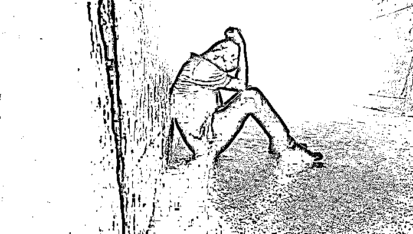

# 刘学州养父母家亲属赶到三亚处理后事，尚未考虑追责事宜

> 原文：[`mp.weixin.qq.com/s?__biz=MzIyMDYwMTk0Mw==&mid=2247528613&idx=3&sn=825f5af8103f915bb64b16dc4502ab53&chksm=97cbbb9da0bc328b8db16ac820835cef93036f477b555ceb9b36949d2626826f8c764676fe57&scene=27#wechat_redirect`](http://mp.weixin.qq.com/s?__biz=MzIyMDYwMTk0Mw==&mid=2247528613&idx=3&sn=825f5af8103f915bb64b16dc4502ab53&chksm=97cbbb9da0bc328b8db16ac820835cef93036f477b555ceb9b36949d2626826f8c764676fe57&scene=27#wechat_redirect)

图片来源：视觉中国

“阳光照在海面，我也归于大海。从这里结束自己的一生，也带走了这个世界上最美的风景。”2022 年 1 月 24 日凌晨，于社交媒体发布近 7000 字遗言《生来即轻，还时亦净》后，15 岁的河北寻亲男孩刘学州在海南三亚服药自杀，后经抢救无效去世。

在刘学州的长篇遗言中，他自述了出生便被父母卖掉做彩礼，四岁养父母双亡，上学遭遇校园侵凌和男老师猥亵，寻亲却被二次遗弃，以及因亲生父母颠倒黑白被网暴等坎坷经历。

据媒体报道，刘学州生前就读于石家庄某中专幼师专业，2021 年 12 月 6 日，受孙海洋寻子故事影响，他开始在网上寻找亲生父母，并于二十多天后成功认亲。但认亲之后不久，双方因抚养问题关系紧张，并引发关于其向亲生父母索要房子的争议。1 月 17 日，刘学州称已被生母拉黑微信，此后他曾表示要起诉亲生父母。

三亚警方证实刘学州已去世后，1 月 25 日下午，刘学州的舅舅孙先生告诉界面新闻，他和刘学州的姑姑、叔叔等养父母家的亲戚已于当日凌晨抵达三亚，专门去处理后事，准备先把刘学州带回河北。孙先生表示，在刘学州出事当晚，自己曾多次联系其亲生父母，“但一直联系不上”。

界面新闻从大同市公安局新荣分局 110 接警中心获悉，自刘学州自杀以来，该中心已接到多起关于其被买卖一事的报警，目前相关部门正展开调查，后续调查结果会向社会公布。

在刘学州的遗言中，他希望人贩子、亲生父母和对自己实施网络暴力的人得到应有的惩罚，这也引发社会关于“谁该为刘学州的死亡负责”的讨论。

“亲生父母在刘学州出生后，将其出卖给他人的行为，已经涉嫌刑法规定的拐卖儿童罪和遗弃罪。”北京市一法律师事务所周兆成律师向界面新闻分析，寻亲后亲生母亲将其拉黑，属于再次遗弃，最终导致年仅 15 岁的刘学州选择自杀，“这两项罪名属于公诉案件，相信相关公安和检察机关会审查认定亲生父母是否涉嫌犯罪，并决定是否立案。”

界面新闻注意到，依据刑法规定，拐卖儿童罪的法定最高刑期是 10 年有期徒刑，可有 15 年的追诉期，而遗弃罪最高刑期为 5 年有期徒刑，追诉时效为 10 年，刘学州亲生父母如果涉嫌遗弃罪，是否已超过追诉时效？

北京市京师律师事务所宋竟一律师表示，目前恐怕难以追究亲生父母的刑事责任，因为本案已超过追诉时效，也就是对犯罪人进行刑事追诉的有效期限，超过了此期限，司法机关就不能再行追诉；此外，也要考虑由于时间久远导致的证据收集问题。

周兆成则认为，本案中，刘学州被亲生父母出卖后即属于被遗弃状态，也从未被合法收养，其一直处于被父母遗弃的状态；刘学州找到亲生父母时未满 16 周岁，其父母对其有抚养义务，却对其继续遗弃，且造成其死亡的严重后果，实则并未超过追诉期限。

北京市炜衡（南京）律师事务所律师封顶表示，关于刘学州自杀事件中亲生父母的法律责任，一是要看遗弃行为，二是要看其有无言语等形式的精神刺激。他表示，刘学州亲生父母涉嫌遗弃罪即便成立，亦并非当然对刘学州自杀负有刑事责任，因为自杀与遗弃之间并无因果关系；刘学州亲生父母如有对其进行精神刺激，则当如同其它网民一样承担民事责任。

刘学州生前曾遭受网络暴力，应当如何对网络侵权者追责？

“网暴实施者涉嫌侮辱诽谤罪。”周兆成表示，根据我国刑法规定，“以暴力或者其他方法公然侮辱他人或者捏造事实诽谤他人，情节严重的，处三年以下有期徒刑、拘役、管制或者剥夺政治权利。”由于本案已经造成刘学州自杀身亡后果，应当认定造成了严重后果。对于没有达到刑事责任的网络侵权者，根据我国民法典的规定，也可以对其提起民事诉讼，要求侵权者承担赔礼道歉、赔偿损失等侵权责任。

封顶对界面新闻分析称，网络虚拟世界发生的侵权甚至犯罪取证较现实世界远为复杂、困难，但除此之外，与其它手段进行的违法、犯罪比较，绝大多数的“网络暴力”在法律上并无特别的评价。

周兆成指出，虽然刘学州已经死亡，无法自己向司法机关提出告诉，但其亲属可以向法院提起诉讼。《第十三届全国人民代表大会第三次会议关于最高人民检察院工作报告的决议》中提出，“积极、稳妥办理安全生产、公共卫生、生物安全、妇女儿童及残疾人权益保护、网络侵害、扶贫、文物和文化遗产保护等领域公益损害案件”，在此情况下，人民检察院也可以提起公益诉讼，以维护被害人的合法权益，引导社会的正确价值导向。

不过，1 月 25 日，刘学州的舅舅孙先生告诉界面新闻，家属这边暂时还没考虑对其亲生父母和网络暴力者进行追责，“先让孩子落叶归根”。

界面新闻多次联系刘学州亲生父亲丁先生，截至发稿，未获回应。

**延伸阅读：**

[大同警方正调查刘学州被买卖一事！律师：亲生父母或涉遗弃罪](http://mp.weixin.qq.com/s?__biz=MzIyMDYwMTk0Mw==&mid=2247528556&idx=4&sn=937a4cb27e474ddcb39cba15eb6ed34e&chksm=97cbbb54a0bc32428159f402dbb0ce4b6d26434ebade4de5c217170f2b1a2b522cff7c725e93&scene=21#wechat_redirect)

[刘学州自杀去世，新京报报道致其被网暴，是否应该为此事负责？](http://mp.weixin.qq.com/s?__biz=MzIyMDYwMTk0Mw==&mid=2247528556&idx=1&sn=7366696bd051e25f6107d396975c5f44&chksm=97cbbb54a0bc3242e38554fc7f15041061da8c9bdece0a9cfebb2028a88ffdf5f998a61ff11f&scene=21#wechat_redirect)

来源：界面新闻

← 向右滑动与灰产圈互动交流 →

