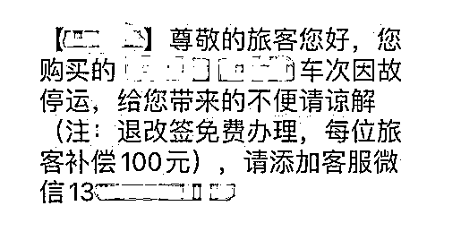
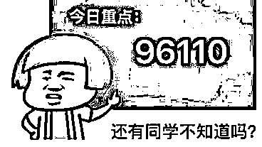

# 春运买票必看！虚假网站、假装熟人、木马软件......

> 原文：[`mp.weixin.qq.com/s?__biz=MzIyMDYwMTk0Mw==&mid=2247528613&idx=4&sn=847dd515bfc1c5374f50d16a0c1b7b89&chksm=97cbbb9da0bc328b26d200fd0c81728d040e57fbc0631afad153730e8f4eaf14c3f5f56be339&scene=27#wechat_redirect`](http://mp.weixin.qq.com/s?__biz=MzIyMDYwMTk0Mw==&mid=2247528613&idx=4&sn=847dd515bfc1c5374f50d16a0c1b7b89&chksm=97cbbb9da0bc328b26d200fd0c81728d040e57fbc0631afad153730e8f4eaf14c3f5f56be339&scene=27#wechat_redirect)

春运已经开始，打工人在准备回家过年的同时，也要注意钱袋子的安全。相信已经有不少人体验了春运的抢票环节，就在大家准备热热闹闹过大年时，有一些人也开始闹腾起来——那就是骗子，**对于购票的诈骗手段大家可要记住了，仔细分辨！**

**虚假网站**

节约作为传统美德，相信许多人恨不得把一块钱掰两半花，于是“优惠”“打折”等字眼成功吸引了受害人的目光，在你忙不迭下载软件准备购票时，便踏入了骗子的陷阱。软件并非正规软件，它会诱导受害者填入银行卡号、银行卡密码等信息，从而窃取钱财。

**应对方式** 

**不要点击陌生链接，钓鱼虚假网站通常通过手机短信发送链接给受害者，在登录相关网站时，一定要仔细核实。**

**假装熟人**

多年未见的同学突然找上你，一阵寒暄后，才“犹犹豫豫”地用各种理由拜托你帮忙购买机票，还将预付记录和“航空公司工作人员”的联系方式给你。

**应对方式**

**遇到类似情况，一定要通过其他方式核实好友身份，通过正规网站进行购票，不要直接进行转账。**

**通知中奖**

“航空公司”告诉你，你中了奖，可以享受对折购票以及酒店优惠，但是要求你支付“办卡费”。

**应对方式**

****天上不会掉馅饼，切勿贪图小便宜，提高安全防范意识。****

****木马软件****

**春节回家的票一票难抢，抢票软件便成了大家都爱的香饽饽。有些看似非常好用的“免费”“秒杀”软件，实际上暗藏木马，一旦安装，个人信息将被窃取。** 

****

****应对方式****

****从正规途径下载官方软件，不私下转账。**** 

****无良黄牛****

**抢不到票？到黄牛手里买！付了钱款后，拿到了票。一张张看起来真实的票，实际上是通过电子合成。这些票在官方网站根本找不到信息。**

****

****应对方式****

****应从正规渠道购买车票，切勿盲目相信黄牛。****

 ****冒充客服**** 

**原本购买好了回家的票，安安心心等待放假，不料铁路部门“客服人员”打来电话，称因为疫情影响等原因，需要改签或者退票，发送诈骗链接，套取受害人银行卡、银行卡密码等个人信息，盗刷账户。**

****

****应对方式****

****收到改签、退票信息，应登录官方网站进行查询，确认无误再进行操作。****

 ****虚假核酸检测**** 

**三小时内必须做完核酸检测，否则将承担法律责任？制造焦虑和恐惧的短信通常会伴随着一个不明链接，目的便是为了恐吓受害人，让受害人点击链接填写自己的个人信息，从而实现盗刷。**

****

****应对方式****

******不要点击陌生链接。******

******加急核酸检测******

****对于出差急用核酸报告的人来说，“加急”无疑成了救命稻草。只要转账 500 元，半小时内便可以拿到核酸检测报告，在钱款进入了对方的腰包后，受害者便有了巨大的收获——一个红色感叹号。****

********

******应对方式******

******个人付费核酸检测一定要在经卫健部门认证、具备资质的医院或机构进行，不要相信所谓的“加急”。******

******不存在的特效药******

****在做完核酸检测后，大家都安安静静等结果出来。可是一通电话打乱了这场安宁，对方自称是“疾控中心某主任”，称受害者的核酸检测报告有异常，可能已经感染新冠肺炎。而后话锋一转，称自己拥有新冠特效药，只需要三个疗程便可以恢复健康。特效药是假，骗你的钱才是真。****

********

******应对方式******

******目前自称有渠道拿到新冠肺炎特效药的都是诈骗。******

********

******反诈民警提醒******

****新春佳节即将到来****

****在准备辞旧迎新的时候****

****也一定要提高警惕，加强防范****

****不给骗子留机会****

****遇到状况一定要多加核实****

****如果遇到诈骗请及时拨打**110******

****来源：综合宁波公安，昆明市反电信诈骗中心****

********

****← 向右滑动与灰产圈互动交流 →****

********