# 男子冒充 985 学生会主席？全国学联回应来了！

> 原文：[`mp.weixin.qq.com/s?__biz=MzIyMDYwMTk0Mw==&mid=2247528613&idx=6&sn=cdeb30785a7d71e8bcdeca0d320dac08&chksm=97cbbb9da0bc328b2520b03131667f0086dbb64e6ebd0f1e2d67a9061fe8c7c61cfd29e73b71&scene=27#wechat_redirect`](http://mp.weixin.qq.com/s?__biz=MzIyMDYwMTk0Mw==&mid=2247528613&idx=6&sn=cdeb30785a7d71e8bcdeca0d320dac08&chksm=97cbbb9da0bc328b2520b03131667f0086dbb64e6ebd0f1e2d67a9061fe8c7c61cfd29e73b71&scene=27#wechat_redirect)

近日，

某短视频平台上“男生自称学生会主席，

联合理发店炒作”的视频，

引发关注。

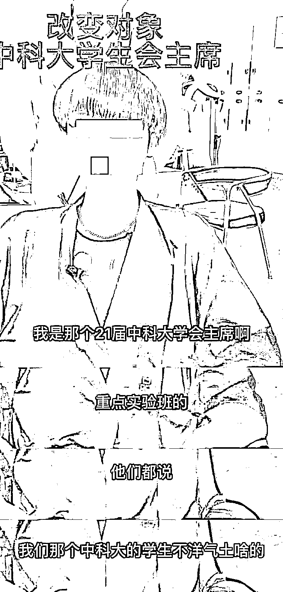

@中华全国学联 为此发声：

**此行为系“无底线营销”，**

**坚决抵制！**

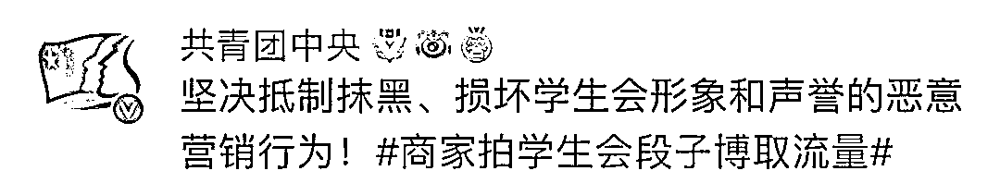

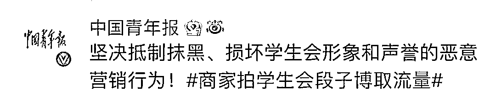

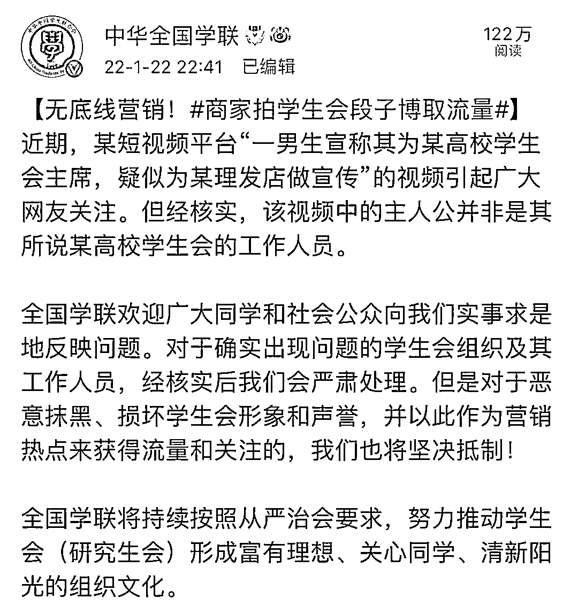

经核实，

视频中的主人公

与该高校学生会没有任何关系。

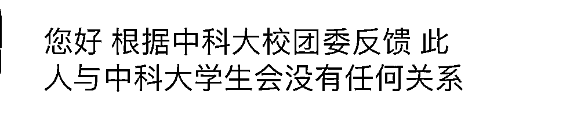

截图显示，

一男生宣称其为某高校学生会主席，

疑为理发店做宣传。

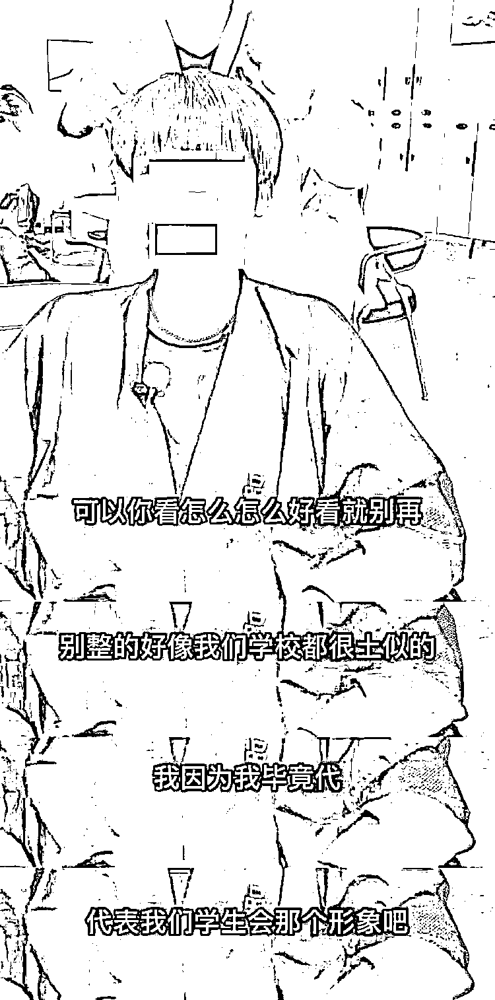

记者注意到，

发布该视频的账号为安徽合肥某理发店，

类似的视频并非首次出现。

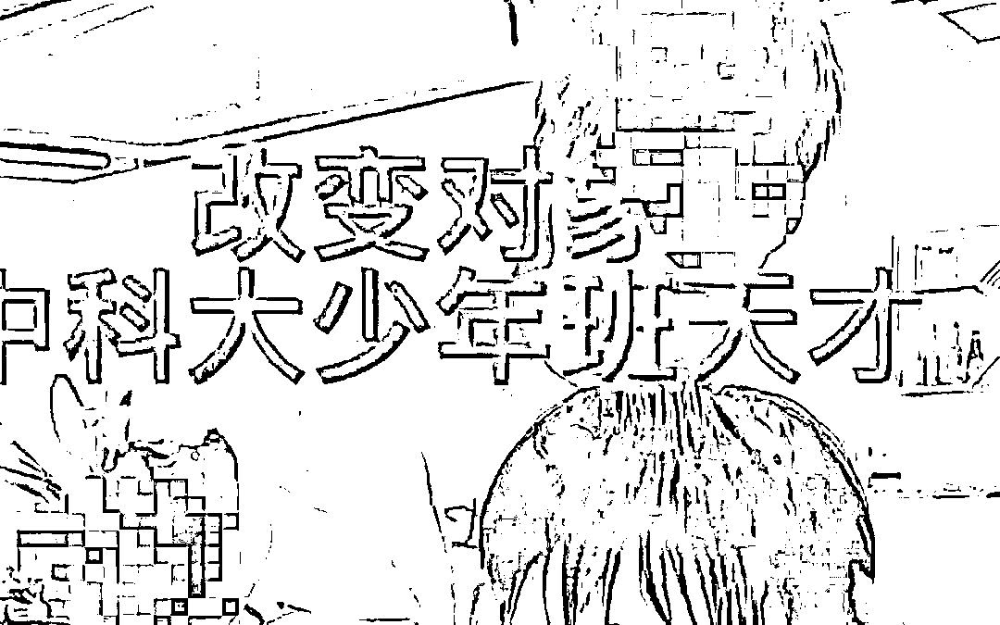

事件曝光后，

理发师向学校进行道歉，

但借“人设改造”进行营销的行为却没有停止。

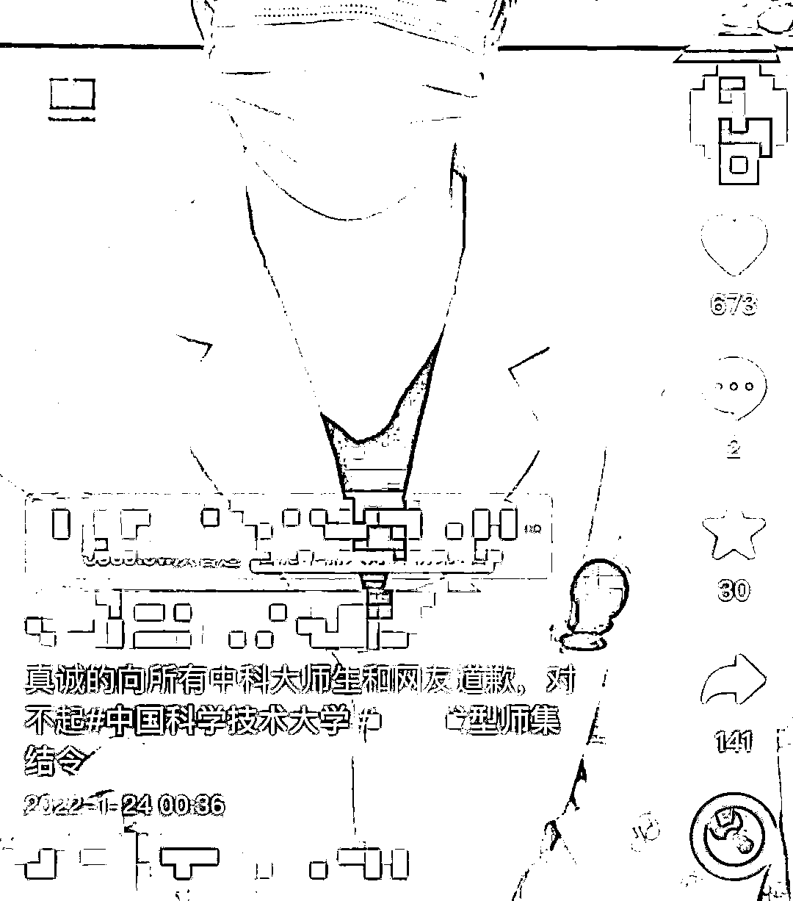

全国学联表示，

**对于确实出现问题的学生会组织及其工作人员，**

**经核实后我们会严肃处理。**

**但是对于恶意抹黑、**

**损坏学生会形象和声誉，**

**并以此作为营销热点来获得流量和关注的，**

**我们也将坚决抵制！**

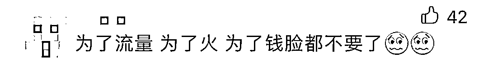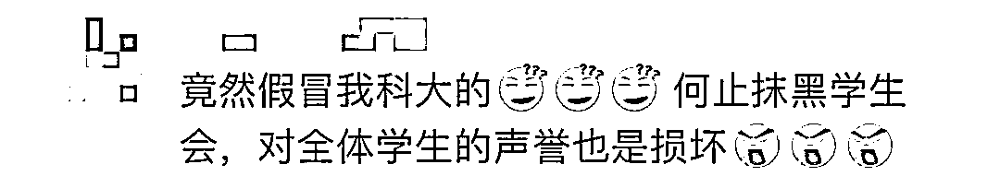

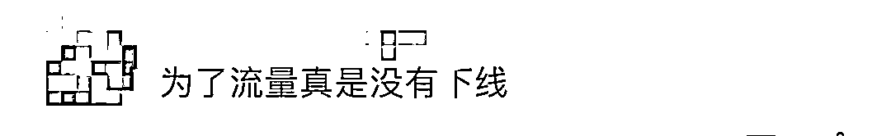来源：中国青年报

← 向右滑动与灰产圈互动交流 →

