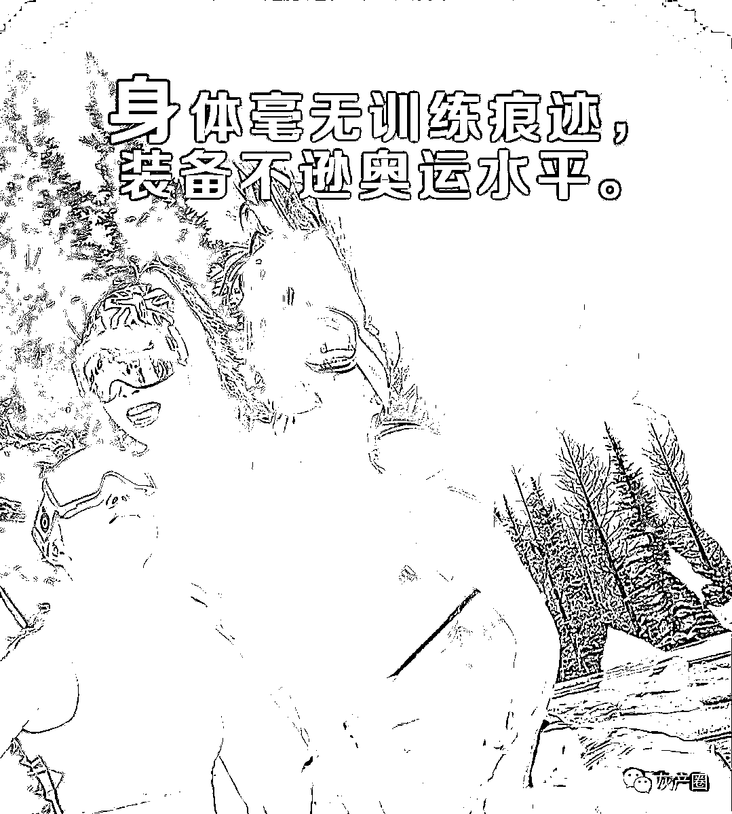
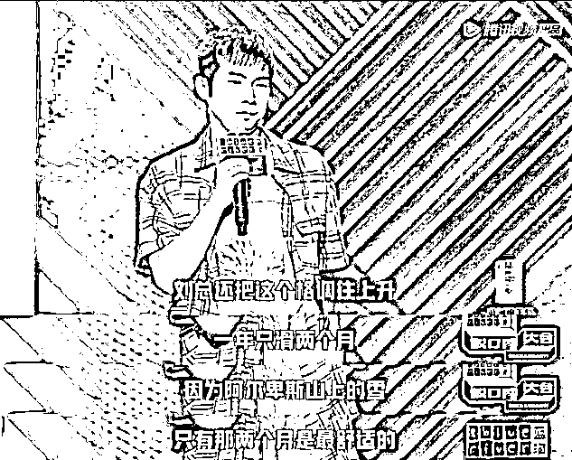
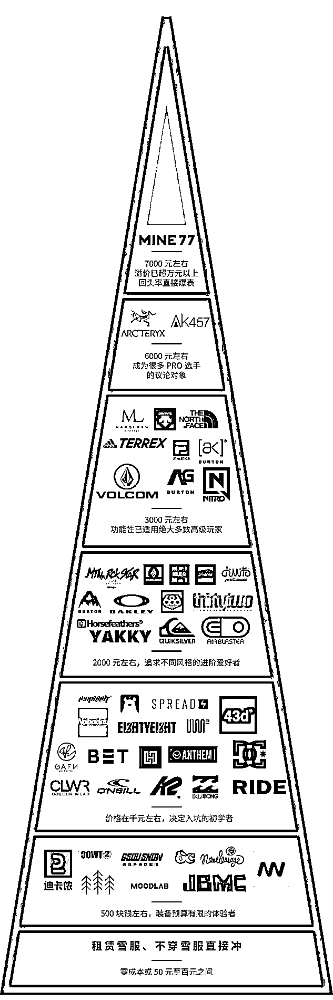
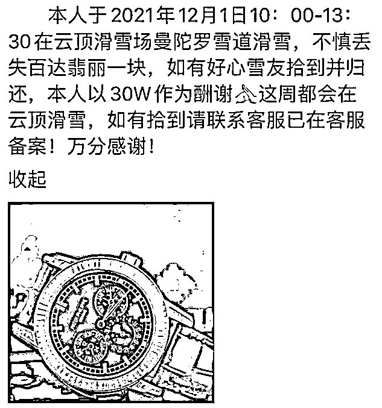
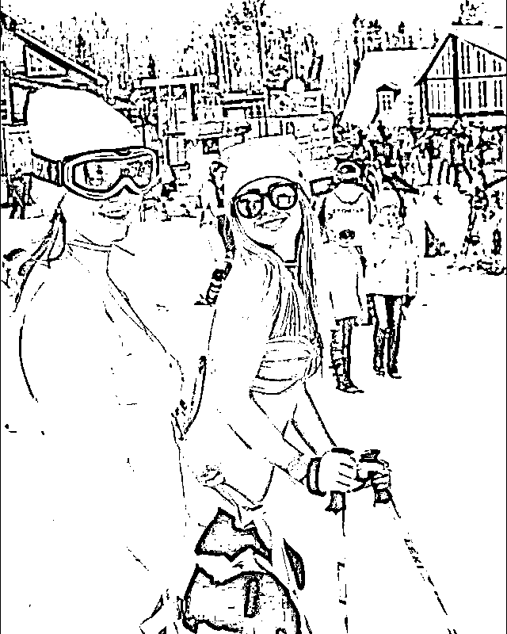

# 滑雪媛出没，雪圈已成名利场

> 原文：[`mp.weixin.qq.com/s?__biz=MzIyMDYwMTk0Mw==&mid=2247528661&idx=1&sn=b58ed73825a7b6f46ae90294e3e768af&chksm=97cbbbeda0bc32fb01cc917a26cad17b5caf98b472228b29d74760878cda7b7d544953832018&scene=27#wechat_redirect`](http://mp.weixin.qq.com/s?__biz=MzIyMDYwMTk0Mw==&mid=2247528661&idx=1&sn=b58ed73825a7b6f46ae90294e3e768af&chksm=97cbbbeda0bc32fb01cc917a26cad17b5caf98b472228b29d74760878cda7b7d544953832018&scene=27#wechat_redirect)

**作者/潘辰  ****编辑/丽雅  ****排版/忠瑞**

**也许你还不知道，滑雪场正在取代五星级酒店，成为各路名媛最新的冬季秀场。** 

**随着冬奥会的临近，滑雪从一项小众运动，正成为大众运动。**

**但是，有一部分人，去滑雪场却不是为了滑雪、不是为了运动，而是为了给自己贴标签、立人设。他们，把原本用来运动的滑雪场，变成了争奇斗艳的名利场；他们，让一项原本健康快乐的运动，逐渐变了味。**

**要知道，高速滑雪运动，是可以让人体天然产生内啡肽的。不需要刻意看比基尼滑雪媛，也能体验滑雪本身的乐趣。**

****

****滑雪，消费门槛有多高？**** 

**对于“普通玩家”和“专业玩家”而言，滑雪可能是两种运动。**

**对于“普通玩家”而言，滑雪所需的消费，可能只有二三百元一张门票，所谓的装备，“门票里不都包含了吗？”**

**对于“专业玩家”来说，滑雪，则是一项花费颇高的运动。**

**“水平不行，装备来凑！”首先，如果想要滑雪，先要置办一套滑雪的装备。而这些滑雪装备，种类实在是有点多，价格实在是有点贵。**

**在这项运动中，头盔、护脸、护臀、护膝、手套、袜子等，都算是滑雪装备中的小零件，价格相对便宜。而真正核心的器材：护目镜、雪服、雪板、固定器、雪鞋、板包这些东西，每一件的价格至少要三四位数。将这些装备全部置办齐全后，即使消费不了上万元，也要破费大几千的银两了。**

**如果你对这些雪具不打算长期持有，而是选择在滑雪场租用这些装备，那么花费的金额会大大减少，但总体价格依旧令人咋舌。如果把上述装备都租齐了，即便是最普通、最便宜的，租用一次的话也要花费一千元左右。**

**最主要的是，只要进入雪圈，雪服和雪板，是每个雪季至少必换一套的。**

****这些滑雪装备的置办，已经够让人肝疼的了，而玩的环节，也同样并不便宜。****

**私家车，经常成为滑雪运动中被忽略的一项成本。但是，它甚至也可以算是滑雪运动的又一道门槛。由于滑雪场的位置，大多位于郊外，因此，对于需要携带雪具前往的人来说，开车是最方便的。**

**假如你没有私家车，而又嫌打车太贵的话。那么，你可能需要全身挂满滑雪装备，先骑小黄车到地铁站，从地铁站出来后，再坐上通往郊外的公交车，最后从公交车站步行几公里，找到滑雪场的大门。**

**与此同时，滑雪场的门票、请教练的费用，乃至吃饭、住宿等，也都是一笔不小的开支。如果不是经济实力雄厚，或对其过度喜爱，这种金钱支出可能会让很多人望而却步。**

****这样看来，滑雪，确实不算是一个经济实惠的游乐项目；滑雪，确实是一项属于中产阶级的游戏。****

****

****都能滑雪了，还要受鄙视？**** 

**但是，在这项全员中产的运动内部，鄙视链依然存在。**

**第一道鄙视链，出现在滑雪运动的地点选择上。由于滑雪场地的资源稀缺，因此，在滑雪场地的选择上，就天然有着鄙视链。**

**一般来说，在瑞士滑雪的，看不上在北海道滑的；在北海道滑的，看不上在北美滑的；在北美滑的，看不上在东北滑的；在东北滑的，看不上在崇礼滑的；而在崇礼滑的，就只能看不上在密云、房山滑的了。**

****杨蒙恩曾经在脱口秀大会上吐槽一个客户，说他每年只去阿尔卑斯山滑两个月的雪，因为只有那两个月，雪是最舒适的。****

****

**滑雪地点的鄙视链，已经够明显的了。而在滑雪运动的装备上面，这项运动更是攀比严重。**

**如果你初次进入滑雪场，穿着一身从某宝、某多多上买来的杂牌装备，那么遭到鄙视几乎是妥妥的。但是，哪怕你穿上诸如迪卡侬、南恩、Gsou Snow、Icepardal、Nobaday 这些正规品牌的滑雪服，那么可能也会被一些装备党所鄙视。**

****在如今的滑雪场里，基础款品牌的装备已经显得太 LOW 了。这项运动中的很多人，都开始在各种滑雪装备上面，投入巨额资金、展开“军备竞赛”。****

**在滑雪装备的置办上面，有些人确实耗资巨大、花费不菲。对于他们来说，北面、萨洛蒙、菲尼克斯等品牌，已经显得太大众；哈迪、迪桑特、金鸡这些，似乎也有些不够；始祖鸟、博格纳不够好看；而伯顿旗下的基础品牌，也着实没什么意思。**

**对于这些装备党来说，似乎只有伯顿旗下的 AK457、MINE77 等高端品牌，才称得上是真正的滑雪用品，才值得被自己所拥有。**

****

****这些热衷攀比装备的人，完美契合了“差生文具多”的特点。身体毫无训练痕迹，装备不逊奥运水平。****

**但是，随着滑雪圈的攀比越来越严重，仅靠高端装备叠加的 buff 已经不够了。有的狠人，甚至开始给自己加上了新的外挂。**

**2021 年 12 月，位于张家口市的云顶滑雪场，登出了一则悬赏启事：一名游客悬赏 30 万元，寻找在雪场丢失的一块百达翡丽手表。而在某二手交易平台上，这款手表的价格为 2000 万元。**

****

**这条消息中，悬赏金额已经够令人吃惊的了，没想到失物的价值，更令人瞠目结舌。难怪网友在惊诧之余，纷纷质疑这起事件的真实性，认为这是一项事先策划好的炫富加炒作。**

****

****滑雪场变身摄影棚？**** 

**单纯地在滑雪场里炫富攀比，显然还不够高调、不够精彩。有的人，干脆直接把滑雪场变成了摄影棚、变成了 T 台，将滑雪运动变成了选美大赛、变成了巴黎时装周。**

**她们穿着奢侈品牌的滑雪服，戴着全套的高端装备，化着精致的妆容，驱车来到雪场后，却不怎么滑雪，而是在滑雪场里放飞自我、尽情地拍照。**

****她们在滑雪场里坚持“滑雪五分钟，拍照一小时，修图一整天”的原则，摆出各种天马行空的姿势，将雪场当成了背景板，让自己的美在冰天雪地里肆意地绽放。****

**如果只是单纯地在滑雪场拍照，这种行为其实也无可厚非。但是，有的人去滑雪场，甚至都不是为了拍照，而是为了脱衣服。**

**如今，一些具有社交牛逼症的女网红们，来到滑雪场拍照时，会脱掉厚厚的滑雪服，露出里面的比基尼，在镜头前展示自己的身材。**

****

****她们，在滑雪场上尽情地展露自己的身姿；她们，在冰天雪地里尽情地享受刺骨的寒冷。她们，在滑雪场里发现了新的流量密码；她们，被人们赋予了一个新的名字——滑雪媛。****

**这些滑雪媛的存在，不仅辣到了别人的眼睛，也扰乱了滑雪场的秩序。**

**今年年初，山西长治的一个滑雪场内，某个女团的成员们，穿着统一的短裙黑丝，或者比基尼，在雪道上排成一排跳舞。但是，就在歌舞升平中，位于画面 C 位的一位女团成员，却被一位滑雪者突然撞倒。**

**事后，滑雪场官方却作出回应，声称这件事情是故意为之。不少网友在表示质疑之后，也为那个被滑雪者撞倒的女团小姐姐感到心疼。**

**这些滑雪媛们，在雪道上无所顾忌地拍摄照片，虽然美丽了自己，但是却扰乱了雪场的秩序，给那些真正喜欢滑雪运动的人，带来了困扰。**

**要知道，众多的滑雪场，为了吸引眼球，几乎都会做一些营销活动。美女与注意力、流量原本天然相通。但滑雪媛，似乎更多的是秀身材，难道她们真的不冷吗？她们不怕冻感冒？**

****

**← 向右滑动与灰产圈互动交流 →**

****