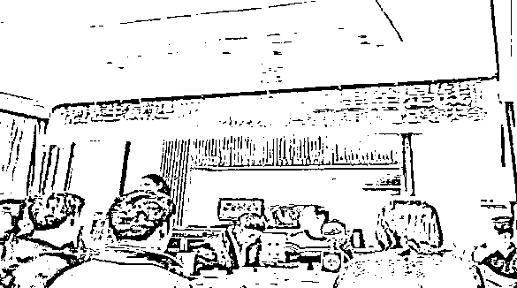
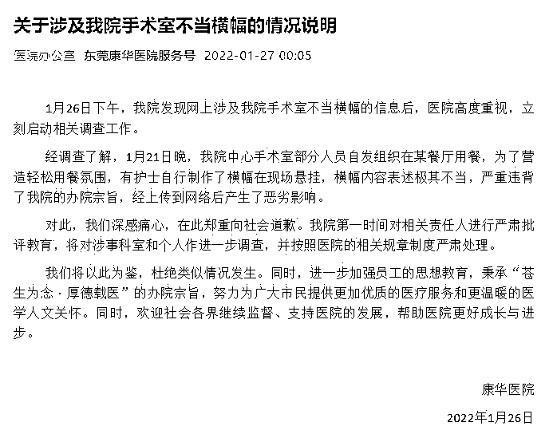

# 挂“手术室里全是钱”的医院，什么来头

> 原文：[`mp.weixin.qq.com/s?__biz=MzIyMDYwMTk0Mw==&mid=2247528661&idx=3&sn=ded4bcc78a5adbe9b21de3da23ef7c0c&chksm=97cbbbeda0bc32fb746076f68cd3aa00768543725b10a55dab08a6cb78fb0c83a6b9c8f9eafb&scene=27#wechat_redirect`](http://mp.weixin.qq.com/s?__biz=MzIyMDYwMTk0Mw==&mid=2247528661&idx=3&sn=ded4bcc78a5adbe9b21de3da23ef7c0c&chksm=97cbbbeda0bc32fb746076f68cd3aa00768543725b10a55dab08a6cb78fb0c83a6b9c8f9eafb&scene=27#wechat_redirect)

因网传“手术室里全是钱”的年终总结大会图片，东莞康华医院被网友热议。1 月 27 日，该医院发布说明，称该条幅是院内护士自行制作，用在该院手术室部分人员自发组织的聚餐中。对此该院郑重向社会道歉，并第一时间对相关责任人进行严肃批评教育。

**“手术室里全是钱”条幅引争议，**

**东莞康华医院道歉** 

1 月 26 日，一张悬挂条幅内容为“虎虎生威迎新年，手术室里全是钱！”的年终总结大会图片在社交平台上广为流传，引发网络争议，有网友谴责该医院毫无医德。知情人士称，该年会为东莞康华医院手术室举行的 2022 年终总结大会。

 1 月 27 日凌晨，微信公众号“东莞康华医院服务号”发布《关于涉及我院手术室不当横幅的情况说明》。说明称，经调查了解，1 月 21 日晚，该院中心手术室部分人员自发组织在某餐厅用餐，为了营造轻松用餐氛围，有护士自行制作了横幅在现场悬挂，横幅内容表述极其不当，严重违背了办院宗旨，经上传到网络后产生了恶劣影响。

 该医院在上述声明中强调，在此郑重向社会道歉。医院第一时间对相关责任人进行严肃批评教育，将对涉事科室和个人作进一步调查，并按照医院的相关规章制度严肃处理。该医院称将杜绝类似情况发生，并进一步加强员工的思想教育。

**东莞康华为民营三甲医院，**

**背后是港股上市公司 **

公开资料显示，东莞康华医院是由东莞康华集团投资 26 亿元建成的，于 2002 年 9 月奠基，2006 年 11 月正式开诊，是一所生态式的大型民营三甲医院，2018 年 6 月通过三甲复审。

 医院规划床位 2006 张，规划设立 63 间（复合）手术室、已开放 18 间（中心手术室 15 间+导管室 3 间），开放重症监护病床超 100 张。医院内设有 1500 余个停车位及公交车站，并设有贵宾门诊和贵宾住院部“华心楼”。

 北京青年报记者查询企查查 App 显示，该医院关联企业为东莞康华医院有限公司，该公司成立于 2005 年，法定代表人为陈旺枝，注册资本 3.5 亿元。该公司是广东康华医疗股份有限公司全资子公司，而康华医疗则是港股上市公司。

 康华医疗 2021 年中报显示，2021 年上半年，集团实现综合收入 8.71 亿元，同比增长 14.52%；实现归母净利润 3088 万元，同比增长 129.04%。其业绩增长主要由于医院服务部门的收入增加，以及自有医院运营的患者整体就诊次数增加。

 事实上，东莞康华医院是康华医疗的主要收入来源，该院在去年上半年总收入为 6.72 亿元，同比增长 9.7%。去年上半年，康华医院门诊人次为 512,460 次，较去年同期增加 18.9%；住院人次为 24,191 次，较去年同期增加 16%。

1 月 27 日，康华医疗早盘股价下跌 2.77%，收报 2.46 港元。

 **曾因医疗事故被警告，**

**近 3 成所涉诉讼是为追讨医疗费用**

北京青年报记者查询企查查信息发现，东莞康华医院有限公司曾因“未按照规定书写病历案”被东莞市卫生健康局警告并罚款 1 万元。而来自信用中国的信息显示，东莞康华医院曾发生一起医疗事故，医方承担主要责任。原东莞市卫生和计划生育局因此在 2018 年对该院进行警告。

 此外，该公司涉及司法案件 88 件，案由多为医疗服务合同纠纷、医疗损害责任纠纷等。其中，在 24 件医疗服务合同纠纷案中，该公司均为原告，诉讼原因是向被告讨要所欠的医疗费用。这大部分案件该公司的诉求均获得或部分获得法院的支持。

 而在 18 件医疗损害责任纠纷案件中，有患者在东莞康华医院进行“颅骨修补术（假体植入）”术后准备复查颅脑 CT 时癫痫发作，经过数次治疗后最终仍旧未能挽回生命。司法鉴定称，该院在诊疗环节存在一定过错。最终鉴定意见认为，医方的过错行为与患者的死亡存在间接因果关系，系次要因素。患者自身严重开放性颅脑损伤及术后并发症在死亡后果中的原因力大小属于主要因素。

 此外，东莞康华医院还曾经因产妇下腹痛入院却未能及时安排手术，导致胎死腹中而被产妇告上法庭。

 根据裁判文书，司法鉴定称，该患者入院待产时病情复杂，诊治风险较大，属于高危产妇，而且患者有瘢痕子宫病史，具备剖宫产手术指征，医方应在患者入院待产时告知其病情的严重性和拟建议实施的分娩方式并取得患方书面同意，但病历资料显示医方直至 14 时 40 分在发现胎儿宫内死亡后才取得患方签署知情同意书，说明医方在患者入院时未及时告知患方孕妇的病情，故认为医方未善尽告知义务，存在过失。

 法院审理认为，东莞康华医院未对患者下腹痛进行鉴别诊断、未持续胎心监测的过失行为与患者胎儿死亡存在因果关系，是导致胎儿死亡的另一因素，要承担原告 50%的赔偿责任。

来源：北京青年报客户端，澎湃新闻

← 向右滑动与灰产圈互动交流 →

