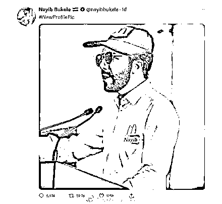
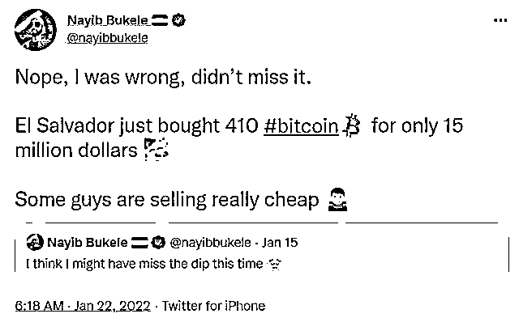
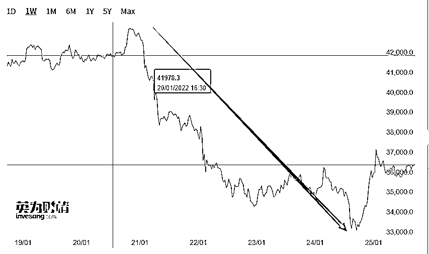
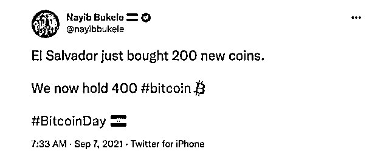
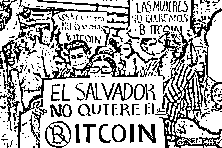
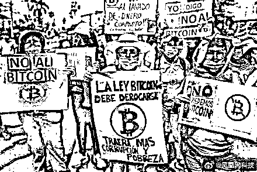
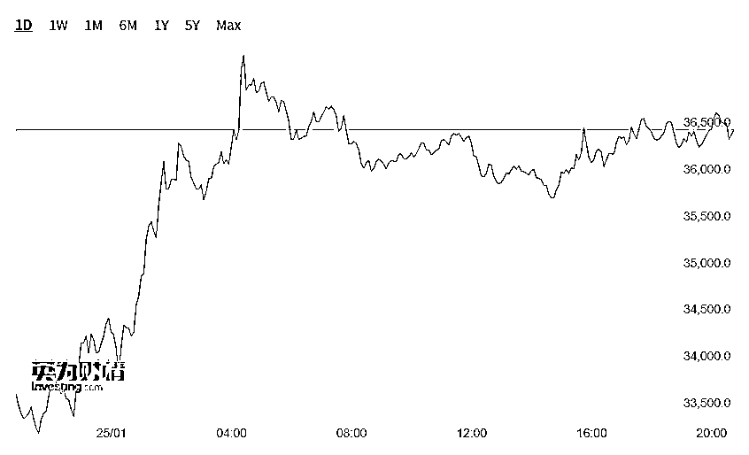
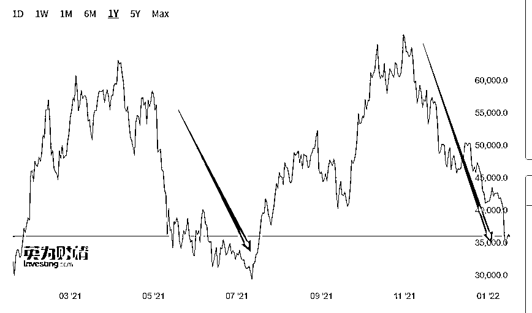

# 为国炒币巨亏！总统竟称：要去麦当劳打工

> 原文：[`mp.weixin.qq.com/s?__biz=MzIyMDYwMTk0Mw==&mid=2247528661&idx=4&sn=03c6ce08b0d7553cbc038ca455d330ec&chksm=97cbbbeda0bc32fbf7c5474089e3932d69f68ee281e2c83a9ef639ac26fe69f5d973bc135e3a&scene=27#wechat_redirect`](http://mp.weixin.qq.com/s?__biz=MzIyMDYwMTk0Mw==&mid=2247528661&idx=4&sn=03c6ce08b0d7553cbc038ca455d330ec&chksm=97cbbbeda0bc32fbf7c5474089e3932d69f68ee281e2c83a9ef639ac26fe69f5d973bc135e3a&scene=27#wechat_redirect)

开年以来，不仅中国股民跌哭了，国外的炒币一族也要哭了……

1 月 24 日，萨尔瓦多总统纳伊布·布克利（Nayib Bukele）在推特上发布了一张自己穿着麦当劳制服的照片。

这是在开玩笑地呼应一个流传已久的笑话，即比特币暴跌后赔掉血本的投资者不得不到这家快餐连锁店打工，挣最低工资。这个笑话跟中文币圈的“黄袍加身”差不多，意思是币跌了大家就穿上黄色制服去送外卖。

这条推特迅速在网上疯传，获得了超过 10 万次点赞。狗狗币联合创始人比利-马库斯甚至在布克利的推文下留言称“欢迎来到麦当劳大家庭。”

**发生了什么？** 

据了解，此前布克利在上周五（1 月 21 日）发推称，萨尔瓦多在比特币大跌之际又花费 1500 万美元买入了 410 枚，并感叹“有些人真是卖得太便宜了”。

然而，在过去几天比特币的暴跌中，比特币的价格从 21 日的相对高位 4.3 万美元，一度跌至 24 日的 3.3 万美元。

这意味着，萨尔瓦多投资比特币已损失了 2000 万美元，购买的所有比特币都出现了严重亏损。

值得注意的是，萨尔瓦多用来买比特币的钱不是总统自己的钱，而是国库的钱。作为一个只有 600 来万人口，人均 GDP 不到 4000 美元且经济严重依赖外界输血的小国家，一下子损失 2000 万美元，有人开玩笑说，此举会让萨尔瓦多从“第三世界”国家沦为世界上第一个“第四世界”国家。

**打算花 2 个亿买比特币**

据新华社报道，2021 年 9 月 7 日，比特币正式成为了萨尔瓦多的法定货币，这是虚拟货币首次在一个国家获得法定货币的地位。 

据参考消息报道，萨尔瓦多议会授权政府以 2 亿多美元来实施比特币项目，投资比特币已成为布克利政府的主要经济押注之一。

报道指出，除了总统之外，该国没有任何官方消息来源提供有关使用国家资金进行比特币交易的信息。 

事实上，萨尔瓦多议会批准的 2 亿多美元资金中，有 1.5 亿美元的比特币信托基金由萨尔瓦多国家开发银行管理。

事实上，萨尔瓦多议会于 2021 年 6 月 9 日通过一项法案，批准将比特币作为本国法定货币。

萨尔瓦多总统纳伊布·布克利当日也在社交媒体宣布，该国政府已经购买了 400 枚比特币。以该推文发布时的比特币价格计算，萨尔多瓦购买的虚拟货币总额约为 2090 万美元。

此后，布克利经常在推特上分享该国刚刚“抄底”的策略。

根据 布克利的推文，截至目前，萨尔瓦多共持有 1801 枚比特币，前后花费近 8000 万美元。具体购买详情如下：

2022 年 1 月 21 日- 410 枚 BTC（购买时价值 1500 万美元）

2021 年 12 月 21 日- 21 枚 BTC

2021 年 12 月 4 日- 150 枚 BTC（以均价 48670 美元购买）

2021 年 11 月 26 日- 100 枚 BTC

2021 年 10 月 27 日- 420 枚 BTC

2021 年 9 月 19 日- 150 枚 BTC（总数达到 700 枚）

2021 年 9 月 7 日- 150 枚 BTC（总数达到 550 枚）

2021 年 9 月 6 日- 200 枚 BTC（二次购买）

2021 年 9 月 6 日- 200 枚 BTC（首次购买）

布克利解释称，持有更多的比特币，是为了解决比特币的金融稳定性的问题。

但是萨尔瓦多的民众可不这么看。据凤凰网报道，萨尔瓦多人走上街头抗议该国将于 2021 年 9 月 7 日接受比特币作为法定货币。在抗议活动中，人们举起了写有“No al lavado de dinero corrupto”标语的牌子。这句话的意思是“不洗腐败的钱”。

**比特币价格已腰斩** 

25 日，比特币结束连续五个交易日的下跌，上涨超 9%。稍早时段，比特币在 25 日凌晨一度跌至 32900 美元左右，创下近六个月以来最低。

根据 Coinlass 的数据，过去 24 小时内约有 4.65 亿美元的加密货币资产被清算，其中比特币占到 1.67 亿美元。

相信这并不是比特币最惨烈的一次。去年，我国央行出手整治虚拟货币行业，将虚拟货币的交易等行为认为为非法金融活动。比特币的价格在短短数日之内腰斩。

随着矿机、矿场出走海外，比特币休整之后，一度在 11 月时再度达到 68928.9 美元的历史高位。不过在美国缩表预期之下，比特币再次进入下跌通道。截至目前，比特币的价格已经腰斩。

值得注意的是，当地时间 1 月 20 日，俄罗斯央行表示，将提议禁止加密货币交易和挖矿，意在取缔本国国内所有与加密货币相关的业务。又一世界大国出手取缔比特币，让比特币从 21 日起连续暴跌数日，跌幅高达 30%。

作为一个国家的总统居然拿国库的钱，投资这样高风险的产品，实在太儿戏了。

24 日，诺贝尔奖获得者 Nouriel Roubini 批评萨尔瓦多总统 Nayib Bukele，声称后者应该被弹劾，因为他的比特币赌博使该国 "破产"。

本月早些时候，穆迪下调了萨尔瓦多的主权信用评级，原因是担心该国大胆的比特币赌注会阻碍其从国际货币基金组织（IMF）获得急需的 13 亿美元贷款。

来源:中国基金报，巴蜀反诈

← 向右滑动与灰产圈互动交流 →

