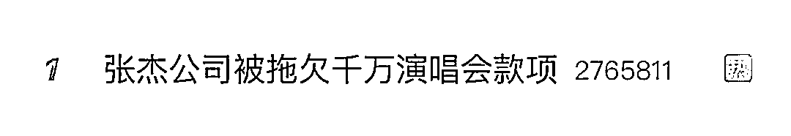
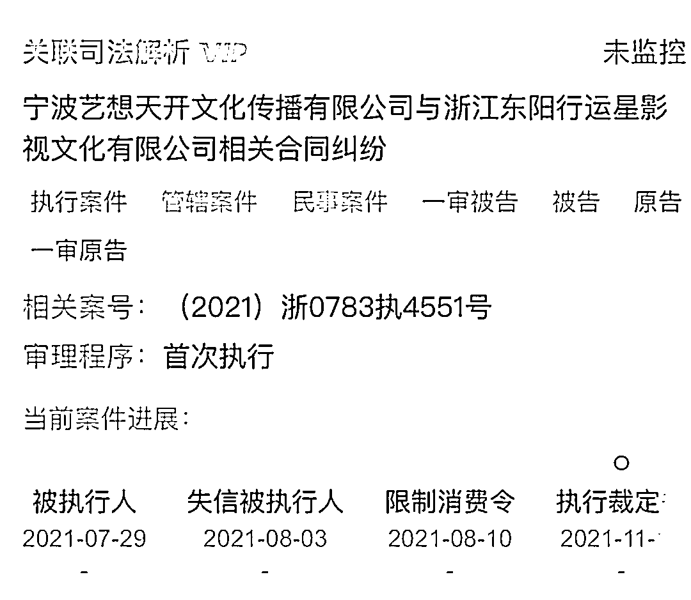
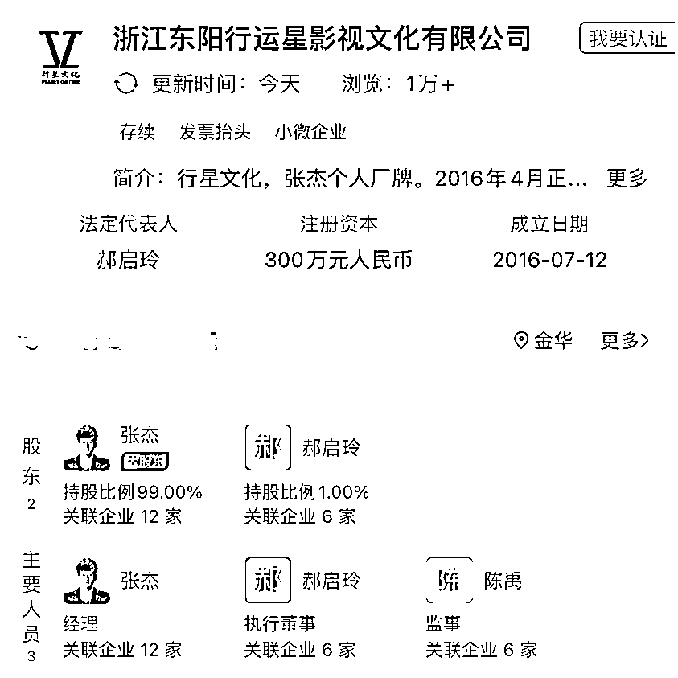
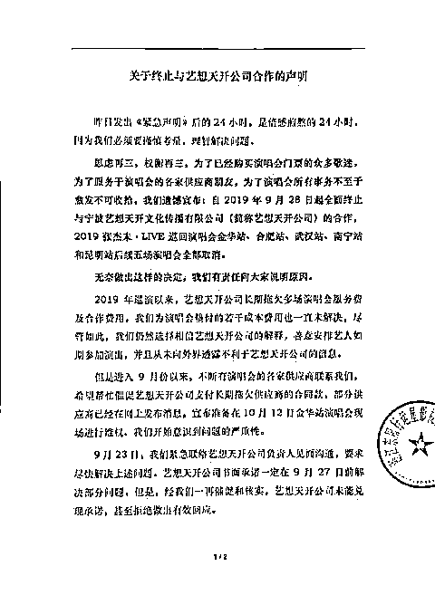
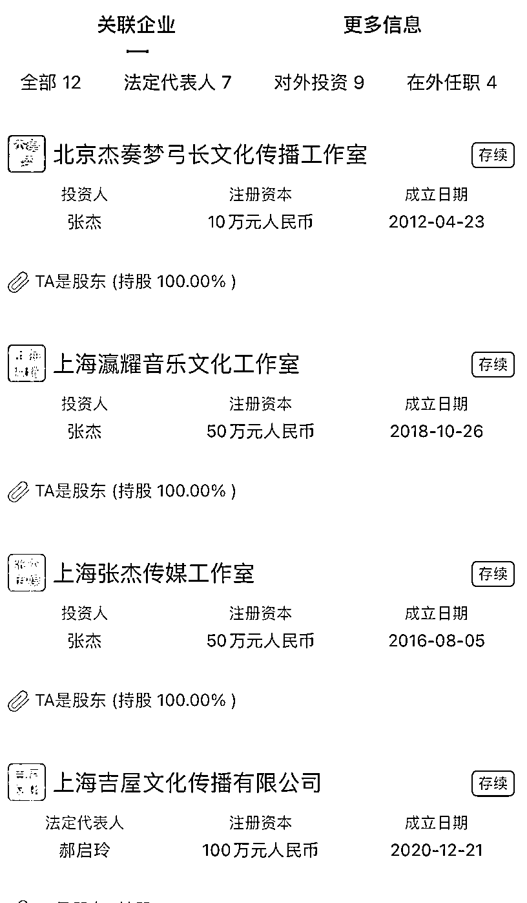

# 知名歌手被拖欠一千多万元！

> 原文：[`mp.weixin.qq.com/s?__biz=MzIyMDYwMTk0Mw==&mid=2247528661&idx=5&sn=7353d512c21197762c4904f3da07a38b&chksm=97cbbbeda0bc32fb24f525930a255dd2c6a46f7ce5042b60cd42a31b3e6cda5d5d251dc6b563&scene=27#wechat_redirect`](http://mp.weixin.qq.com/s?__biz=MzIyMDYwMTk0Mw==&mid=2247528661&idx=5&sn=7353d512c21197762c4904f3da07a38b&chksm=97cbbbeda0bc32fb24f525930a255dd2c6a46f7ce5042b60cd42a31b3e6cda5d5d251dc6b563&scene=27#wechat_redirect)

1 月 25 日，

**#张杰公司被拖欠千万演唱会款项#**

冲上热搜榜的第一名。

这场纠纷始于 2019 年，

目前拖欠方已被纳入

失信被执行人名单并限制消费。

*图：张杰个人微博*

**张杰公司被拖欠千万演唱会款项**

近日，张杰关联公司

浙江东阳行运星影视文化有限公司

新增的执行裁定书显示，

因涉张杰演唱会合同相关纠纷，

该公司申请对

宁波艺想天开文化传播有限公司进行执行，

执行标的 1000 万及相应利息。

而因艺想天开公司暂无可供执行的财产，法院裁定终结本次执行程序。目前，**艺想天开公司已被纳入失信被执行人名单并限制消费**。

据企查查，浙江东阳行运星影视文化有限公司成立于 2016 年 7 月，注册资本 300 万元人民币。其中，张杰持股 99%，郝启玲持股 1%。

**张杰方曾紧急终止与艺想天开合作**

张杰方和艺想天开公司的纠纷始于 2019 年。

当年 9 月 27 日，张杰工作室突然发布紧急声明，称要暂停南宁站演唱会的售票。

张杰做出的这个决定，一度让大家十分不解，甚至个别粉丝有些不满。直至 9 月 28 日上午，张杰工作室再次发布声明，宣布终止与艺想天开的合作。同时宣布取消 2019 张杰未·live 巡回演唱会的合肥、宁波、金华、武汉和昆明五个城市的演唱会。

而透过杰哥工作室发布的声明中，公众也大致了解了双方的矛盾，声明中称：

2019 年巡演以来，艺想天开公司长期拖欠多场演唱会服务费及合作费用，**我们为演唱会垫付的若干成本费用也一直未解决**，尽管如此，我们仍然选择相倍艺想天开公司的解释，善意安排艺人如期参加演出，并且从未向外界透露不利于艺想天开公司的信息。

但是进入 9 月份以来，不断有演喁会的各家供应商联系我们，**希望帮忙催促艺想天开公司支付长期拖欠供应商的合同款**，部分供应商已经在网上发布消息，宣布准备在 10 月 12 日金华站演唱会现场进行维权。我们开始意识到问题的严重性。这之后在积放沟通交流交涉中,艺想天开无法兑现承诺，甚至拒绝做出有效回应。

**张杰旗下关联 12 家公司**

出道十几年来，张杰没有多栖发展，而是选择做好一件事，那就是唱歌。2019 年， 张杰被聘问上海大学的音乐老师。这是其唯一公开的“副业”。

另据企查查，张杰目前关联了 12 家文化传媒类公司，其中有 6 家公司已注销。

**张杰演唱会赚钱吗?**

众所周知，在国内，一场演唱会的票价从几千元到几百块不等，价格高昂。 

演唱会行业虽看起来风光，做起来却并不容易。无论是技术制作及创意服务业务还是演唱会筹办业务，流程所需的时长都不短。其中，技术制作及创意服务长则需半年，短则一个星期；而演唱会筹办的流程则更长，从项目开始到事后项目管理结束需要长达 15 个月的时间，在这个过程中也就很容易产生各参与方拖欠款项的问题。

至于相关利益方的分成，据悉，演唱会的利益分配大致有两种做法：一种是主办方给歌手固定的唱酬，另一种是把票房按比例分成，或者两种兼有。

参与制作和主办数以千计演唱会的特艺文化创始人蔡健辉曾在采访中表示，一场演唱会挣不挣钱，主要还是看歌星的号召力强不强、票好不好卖。门票的分成大部分都是歌星拿走，占 30%，工程制作方拿 20%，灯光音响拿 20%，剩下的才是主办方的收入， 所以门票如果卖不到八成以上，这场演唱会的投资方就一定亏。

具体到张杰的演唱会，其曾被当众问到一场演唱会能赚多少，彼时他的回答是**这些事情你应该采访主办方，并不是我收钱的，票钱都是主办方定的**。

但据公开数据，张杰已经举办了 58 场个人演唱会，尤其是张杰未·LIVE 巡回演唱会，曾创鸟巢演唱会票房纪录。

来源：21 世纪经济报道、每日经济新闻、新浪微博

← 向右滑动与灰产圈互动交流 →

